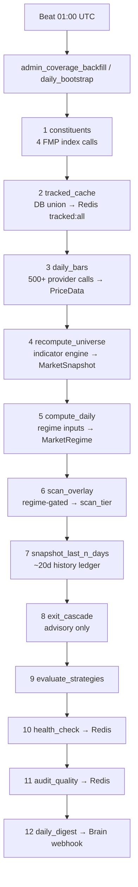
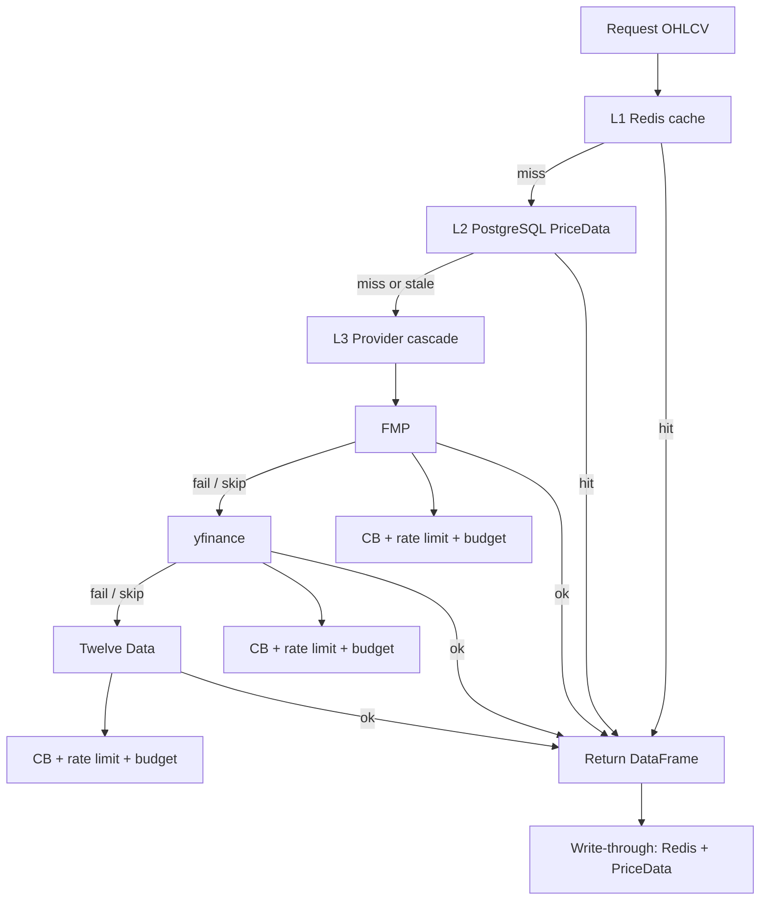
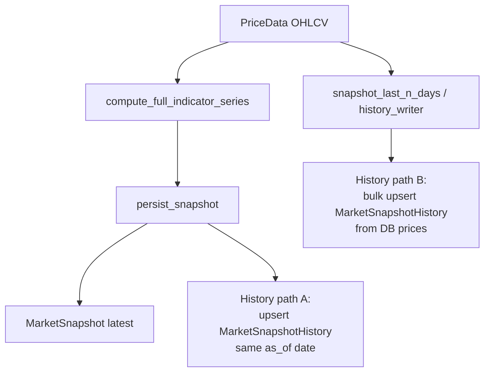
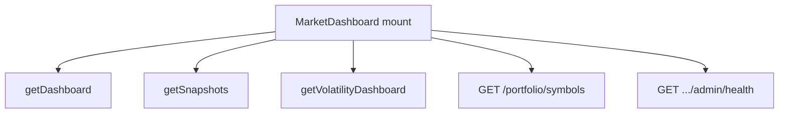

# Market data flows

This page is a visual companion to [ARCHITECTURE.md](ARCHITECTURE.md) (system layout, job catalog) and [MARKET_DATA.md](MARKET_DATA.md) (tiers, env, operations). It focuses on **end-to-end data movement**, timing, rough volumes, and how failures are handled.

---

## 1. Nightly pipeline flow

**Timing:** Celery Beat fires **`admin_coverage_backfill`** at **01:00 UTC** (`0 1 * * *`). The orchestrator is `backend.tasks.market.coverage.daily_bootstrap`, locked with a single-flight key so only one run proceeds at a time.

**Budget:** Task soft limit **3500s (~58m)** and hard limit **3600s** (`_DEFAULT_SOFT` / `_DEFAULT_HARD` in `coverage.py`); `job_catalog` default `timeout_s` is **3600** for this template.

**Volumes (order of magnitude):** Step 1 hits **four** index constituent sources (FMP) → `IndexConstituent`. Step 3 walks the tracked universe with **hundreds of provider calls** (policy-dependent) → `PriceData`. Step 4 recomputes indicators for the full tracked set → `MarketSnapshot`. Step 7 defaults to **20** SPY-calendar trading days of ledger rows (`history_days` in catalog kwargs).

**Failure handling:** Steps 1–9 and 11–12 wrap most work in **try/except**: failures are **logged**, recorded in the rollup as `status: error`, and the chain **continues** (partial night). **SoftTimeLimitExceeded** aborts the whole task. Step 10 (`health_check`) runs without the same non-fatal wrapper—treat as critical for coverage telemetry.

---

## 2. Provider call chain (historical OHLCV)

**Levels:** **`get_historical_data`** in `market_data_service.py` implements **L1 Redis** (JSON series cache + hit counters), **L2 PostgreSQL `PriceData`** (fresh-enough bars short-circuit to cache), **L3 provider loop** in policy order (typically **FMP → yfinance → Twelve Data** for `historical_data`).

**Per L3 attempt:** **`_is_provider_available`** (circuit breaker), **Redis hash budget** check on `provider:calls:{YYYY-MM-DD}`, then **`provider_rate_limiter.acquire(...)`** before HTTP. Successful fetches **write through** to Redis cache and **best-effort** `persist_price_bars` → `PriceData`.

**Failures:** Provider exceptions increment CB failure counts and **try the next provider**. Empty or over-budget providers are **skipped** with warnings.

---

## 3. Snapshot lifecycle

**Computation:** All indicator fields flow through **`compute_full_indicator_series()`** in `indicator_engine.py` (single path from `PriceData` / OHLCV).

**`MarketSnapshot`:** Latest technical row per symbol is written via **`persist_snapshot`** (and related recompute paths) as the **mutable head**.

**`MarketSnapshotHistory` (ledger):** Two complementary write paths:

1. **Inline with persist:** `persist_snapshot` **upserts** a history row for the snapshot’s **`as_of`** trading date (idempotent by symbol + type + date).
2. **Batch backfill:** **`snapshot_last_n_days`** (nightly step 7) rebuilds ledger rows from **local** `PriceData` over the window (bulk upsert / per-symbol tasks), independent of a single persist call.

**Failure handling:** Persist and history upserts log and roll back per transaction boundaries; batch steps aggregate errors per symbol/batch.

---

## 4. Dashboard data load (Market Dashboard)

**Timing:** On **`MarketDashboard`** mount, **five** independent React Query hooks each issue **parallel** HTTP calls (no single `Promise.all`, but simultaneous on first paint).

**Client methods / routes (actual code):**

| Shorthand | Implementation |
|-----------|----------------|
| `getDashboard` | `marketDataApi.getDashboard()` → market dashboard aggregate API |
| `getSnapshots` | `marketDataApi.getSnapshots(limit)` → large snapshot table payload |
| `getVolatility` | `marketDataApi.getVolatilityDashboard()` (volatility hook) |
| `getPortfolioSymbols` | `GET /portfolio/symbols` via `usePortfolioSymbols` |
| `getAdminHealth` | `GET /market-data/admin/health` via `useAdminHealth` |

**Volumes:** Snapshots default to **5000** rows (`SNAPSHOT_LIMIT` in `useMarketSnapshots`). Dashboard aggregate is bounded server-side; admin health is a composite JSON blob.

**Failure handling:** Each query has its **own** error/loading state; dashboard body can still render partially if one query fails.

---

## Known single points of failure

| Risk | Impact | Notes |
|------|--------|--------|
| **Redis as gateway for budget check** | L1 miss; L3 budget tally reads Redis | Counters in `provider:calls:{date}`. **Fixed:** **fail-open-with-warning** when the budget check cannot read Redis—provider calls proceed with a warning instead of treating the provider as over-budget. (See `get_historical_data` in `backend/services/market/market_data_service.py`.) |
| **SPY benchmark** | RS Mansfield and stage classification need a reliable benchmark series | Thin or missing SPY history triggers fallback fetches; prolonged benchmark gaps degrade relative-strength and stage quality. |
| **Single 12-step nightly chain** | One long soft-time window (~58m) for the whole pipeline | Any slow step (bars, full recompute, history backfill) consumes the shared budget; partial nights surface as rollup `partial` status. |

For remediation tasks and health dimensions, see [MARKET_DATA_RUNBOOK.md](MARKET_DATA_RUNBOOK.md) and the Admin Health dimensions in [ARCHITECTURE.md](ARCHITECTURE.md).
