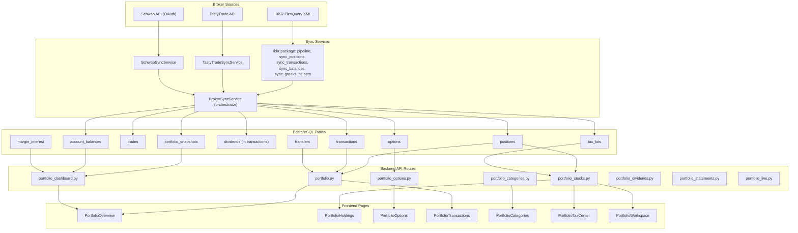
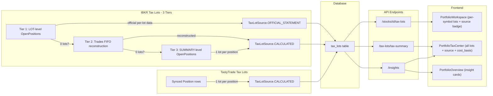
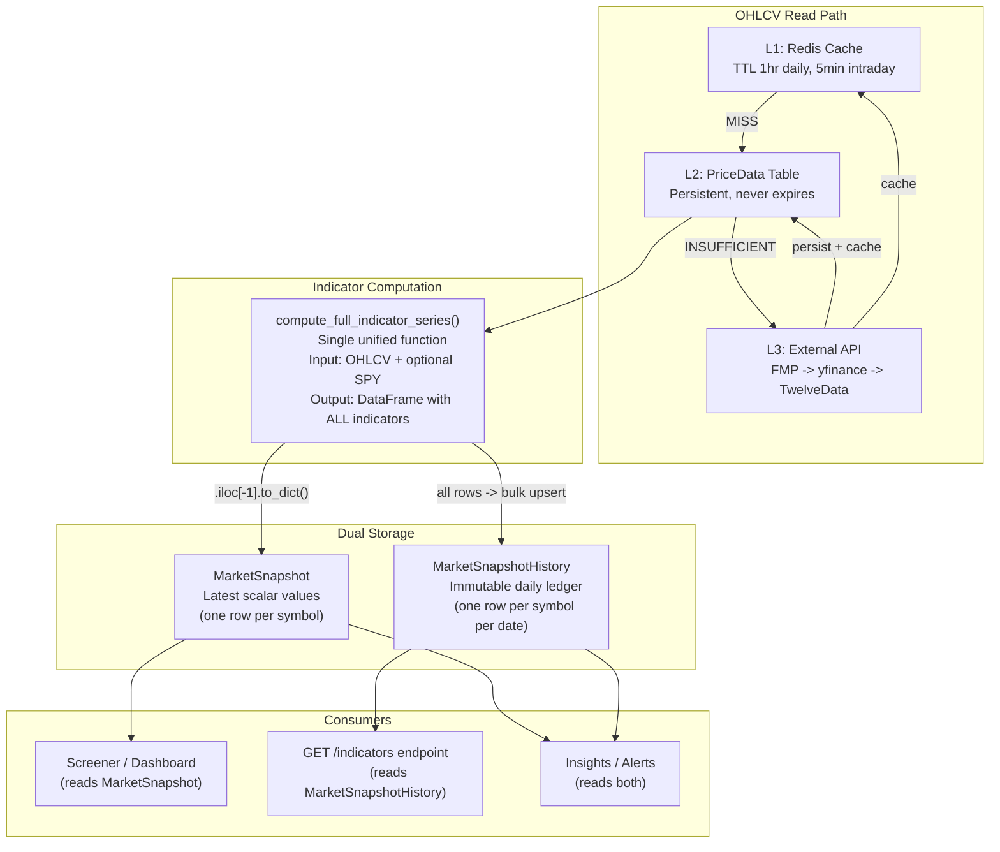
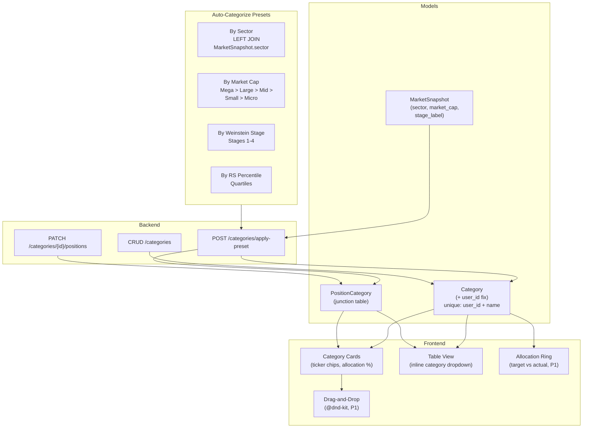

# Portfolio Pillar

Architecture, data flow, and file inventory for the Portfolio section of AxiomFolio. Broker setup (IBKR, TastyTrade, Schwab): [CONNECTIONS.md](CONNECTIONS.md).

---

## Table of contents

- [Data Sync Flow](#data-sync-flow)
- [Key files](#key-files)
- [Routes](#routes)
- [Frontend pages](#frontend-pages)

*(Additional sections follow in-file.)*

---

## Data Sync Flow

Broker data enters the system through sync services, gets persisted to PostgreSQL, served by FastAPI routes, and consumed by React pages.



## Tax Lot Data Flow (Three-Tier Priority)

Tax lots are synced from brokers using a three-tier priority chain for IBKR, then served to the Tax Center and Workspace pages. Each tier is tried in order; the first to produce data wins.



**Tier 1 (LOT-level)** parses `_parse_tax_lots_from_lot_rows()` from the `<OpenPositions>` section where `levelOfDetail="LOT"`. This is official IBKR per-lot data including individual `costBasisPrice`, `openDateTime`, `holdingPeriodDateTime`, `originatingOrderID`. Marked as `OFFICIAL_STATEMENT`.

**Tier 2 (Trades FIFO)** reconstructs lots from the `<Trades>` XML section using FIFO ordering. Marked as `CALCULATED`.

**Tier 3 (SUMMARY fallback)** creates one lot per position from `<OpenPositions>` SUMMARY rows. Least granular. Marked as `CALCULATED`.

## Market Data: "Fetch Once, Ready Forever"

Portfolio symbols get enriched with market data through a three-layer caching strategy. The principle: fetch from API once, persist to DB, serve from DB/cache forever.



### Indicator Series Endpoint

`GET /market-data/prices/{symbol}/indicators` reads pre-computed indicator values from `MarketSnapshotHistory`. No on-the-fly computation.

**Query params**: `?indicators=ema_8,ema_21,rsi&period=5y`

**Response format** (columnar JSON):
```json
{
  "symbol": "AAPL",
  "rows": 1260,
  "backfill_requested": false,
  "series": {
    "dates": ["2021-02-23", "2021-02-24", "..."],
    "ema_8": [130.5, 131.2, "..."],
    "ema_21": [128.9, 129.3, "..."],
    "rsi": [62.1, 58.7, "..."]
  }
}
```

### Two-Track Frontend Migration

| Track | Data Shape | Source | Examples |
|-------|-----------|--------|----------|
| Track 1: Scalar per date | One float per date | MarketSnapshotHistory columns | EMA, SMA, RSI, MACD, Bollinger, ATR, stage, TD Sequential |
| Track 2: Structured overlays | Variable-length objects | Frontend from raw OHLCV | Gap zones, trendline geometry, S/R level lists |

## Frontend Component Architecture

```mermaid
flowchart TD
    subgraph portfolioRoutes ["/portfolio/* Routes"]
        R1["/portfolio -> PortfolioOverview"]
        R2["/portfolio/holdings -> PortfolioHoldings"]
        R3["/portfolio/options -> PortfolioOptions"]
        R4["/portfolio/transactions -> PortfolioTransactions"]
        R5["/portfolio/categories -> PortfolioCategories"]
        R6["/portfolio/tax -> PortfolioTaxCenter"]
        R7["/portfolio/workspace -> PortfolioWorkspace"]
    end

    subgraph settingsRoutes ["/settings/* Routes"]
        S1["/settings/profile -> SettingsProfile"]
        S2["/settings/preferences -> SettingsPreferences"]
        S3["/settings/connections -> SettingsConnections"]
        S4["/settings/notifications -> SettingsNotifications"]
    end

    subgraph hooks ["Shared Hooks"]
        H1["usePortfolio.ts"]
        H2["useAccountFilter.ts"]
        H3["useIndicatorSeries.ts (new)"]
    end

    subgraph shared ["Shared Components"]
        C1["SortableTable"]
        C2["StatCard"]
        C3["PnlText"]
        C4["AccountFilterWrapper"]
        C5["AccountSelector"]
        C6["GatewayStatusBadge"]
    end

    subgraph charts ["Chart Components"]
        CH1["TradingViewChart (embedded, no external link)"]
        CH2["SymbolChartWithMarkers (custom overlays)"]
        CH3["ChartSlidePanel (in-app TV panel)"]
    end

    subgraph utils ["Utilities"]
        U1["portfolio.ts (account building, aggregation)"]
        U2["format.ts (currency, dates)"]
        U3["optionStrategies.ts (detection + types)"]
        U4["indicators/ (Track 2: gaps, trendlines, S/R)"]
    end

    R1 --> H1
    R2 --> H1
    R3 --> H1
    R7 --> H1
    R7 --> H3
    R7 --> CH1
    R7 --> CH2
    S3 --> C6

    R1 --> C2
    R2 --> C1
    R3 --> C1
    R4 --> C1
    R6 --> C1
```



## Categories Data Flow



## Routes

| Route | Page | Description |
|-------|------|-------------|
| `/portfolio` | PortfolioOverview | KPIs, allocation donut, performance chart, stage distribution, top movers, insight cards, Account Health (cash/margin/leverage), Margin Interest |
| `/portfolio/holdings` | PortfolioHoldings | Enriched SortableTable (stage, RS%, sector, 5D%, 20D%, RSI, ATR, industry, cost basis -- hidden cols), filter presets (High RS, Oversold, Concentrated), heatmap toggle |
| `/portfolio/options` | PortfolioOptions | Summary KPIs, positions grouped by underlying with IV, realized P&L, commission; P/L tab with SortableTable; strategy detection |
| `/portfolio/transactions` | PortfolioTransactions | Unified activity feed with account/broker column, date+time display, pagination, transfers included |
| `/portfolio/categories` | PortfolioCategories | Category cards with ticker chips, table view with inline editing, auto-categorize presets, drag-and-drop (P1) |
| `/portfolio/tax` | PortfolioTaxCenter | Tax lot summary, harvest candidates, approaching-LT, full lot table with cost basis, source badge (Official/Estimated) |
| `/portfolio/workspace` | PortfolioWorkspace | Per-symbol deep dive: symbol summary bar, chart (toggle TV/Intelligence), tax lots, dividends, context strip with MarketSnapshot fundamentals |
| `/settings/connections` | SettingsConnections | Unified hub: brokerages, IB Gateway, TradingView preferences, future data providers (see CONNECTIONS.md) |

## Sync Lifecycle

1. **Add account** (Settings > Connections): POST `/accounts/add` -> Celery `sync_account_task` enqueued; response includes `sync_task_id`.
2. **Sync populates**: `positions`, `tax_lots`, `trades`, `transactions`, `dividends`, `options`, `account_balances`, `margin_interest`, `transfers`, `portfolio_snapshots`.
3. **Tax lot strategy**: IBKR uses three-tier priority (LOT rows > Trades FIFO > SUMMARY fallback). TastyTrade generates one lot per position from average cost.
4. **Transaction mapping**: Cash transactions now map all ~40 FlexQuery fields to the Transaction model (trade_id, order_id, conid, commissions breakdown, tax info, corporate action flags, etc.).
5. **Trade enrichment**: Trades now store `order_id`, `settlement_date`, `realized_pnl`, `is_opening`, `notes` in typed columns (previously only in JSON blob).
6. **Activity feed**: Unified UNION ALL across trades, transactions, dividends, and transfers (deposits/withdrawals/ACATS). Frontend category filter matches backend categories exactly.
7. **Frontend trigger**: POST `/accounts/sync-all` returns `{ status: "queued", task_ids }`; auto-triggered on login when accounts are `NEVER_SYNCED`.
8. **Stale sync recovery**: `recover_stale_syncs` Celery task runs every 5 minutes, resetting accounts stuck in `RUNNING` state beyond a configurable threshold. `sync_account_task` also resets status to `ERROR` on unhandled exceptions.
9. **Credential errors**: Sync services detect encryption/token failures and surface clear "Credentials invalid — please re-add this account" messages in the UI.

## Live Data (IB Gateway)

When IB Gateway is connected, live endpoints provide real-time data with automatic DB fallback when offline:

- `GET /portfolio/live/summary` — DailyPnL, UnrealizedPnL, NetLiquidation, BuyingPower, MaintMarginReq, AvailableFunds
- `GET /portfolio/live/positions` — Positions with real-time market values

Response includes `is_live: true|false` flag so the frontend can indicate data freshness.

## Margin & P&L Monitoring

- `GET /portfolio/dashboard/margin-health` — Cushion, leverage, buying power, maintenance margin, with `margin_warning` / `margin_critical` flags
- `GET /portfolio/dashboard/pnl-summary` — Aggregated unrealized/realized P&L, total dividends, total fees, total return

## Market Data Bridge

- `GET /portfolio/stocks?include_market_data=true` LEFT JOINs latest `MarketSnapshot` per symbol.
- Positions enriched with `stage_label`, `rs_mansfield_pct`, `perf_1d`/`perf_5d`/`perf_20d`, `rsi`, `atr_14`, `market_cap`, `market_cap_label`.
- Sector fallback: when `Position.sector` is NULL, `MarketSnapshot.sector` is used.
- Portfolio symbols are part of the tracked universe; no separate sync.

## File Inventory

### Frontend

| Layer | File | Lines | Notes |
|-------|------|------:|-------|
| **Pages** | `pages/portfolio/PortfolioOverview.tsx` | 390 | |
| | `pages/portfolio/PortfolioHoldings.tsx` | 308 | |
| | `pages/portfolio/PortfolioTaxCenter.tsx` | 303 | |
| | `pages/portfolio/PortfolioTransactions.tsx` | 294 | |
| | `pages/portfolio/PortfolioCategories.tsx` | 281 | |
| | `pages/portfolio/PortfolioOptions.tsx` | 1263 | Decomposing into 7 components |
| | `pages/PortfolioWorkspace.tsx` | 476 | |
| | `pages/SettingsConnections.tsx` | ~850 | Renamed from SettingsBrokerages |
| **Hooks** | `hooks/usePortfolio.ts` | 410 | |
| | `hooks/useAccountFilter.ts` | 205 | |
| | `hooks/useIndicatorSeries.ts` | new | Backend indicator series hook |
| **Components** | `components/SortableTable.tsx` | 772 | |
| | `components/ui/AccountSelector.tsx` | 316 | |
| | `components/ui/AccountFilterWrapper.tsx` | 87 | |
| | `components/shared/StatCard.tsx` | 83 | |
| | `components/shared/PnlText.tsx` | 52 | |
| | `components/charts/TradingViewChart.tsx` | ~200 | No external link |
| | `components/charts/SymbolChartWithMarkers.tsx` | ~400 | Custom overlays |
| | `components/market/SymbolChartUI.tsx` | ~300 | ChartSlidePanel |
| | `components/charts/BubbleChart.tsx` | ~200 | Finviz-style configurable scatter/bubble chart |
| **Options (new)** | `components/options/PositionsTab.tsx` | new | Card/table toggle |
| | `components/options/OptionChainTab.tsx` | new | Chain viewer |
| | `components/options/PnlTab.tsx` | new | SortableTable P/L |
| | `components/options/StrategyCard.tsx` | new | Strategy display |
| | `components/options/PositionRow.tsx` | new | DTE bar, Greeks |
| **Utils** | `utils/portfolio.ts` | 146 | |
| | `utils/format.ts` | 102 | |
| | `utils/optionStrategies.ts` | new | Strategy detection + types |
| | `utils/indicators/gaps.ts` | ~80 | Track 2: stays on frontend |
| | `utils/indicators/trendLines.ts` | ~200 | Track 2: stays on frontend |
| | `utils/indicators/emaStage.ts` | ~90 | Track 1: migrating to backend |
| | `utils/indicators/tdSequential.ts` | ~60 | Track 1: migrating to backend |
| **Types** | `types/portfolio.ts` | 261 | |

### Backend API Routes

| File | Lines | Key Endpoints |
|------|------:|---------------|
| `portfolio.py` | 505 | `/sync-all`, `/insights`, `/analytics` |
| `portfolio_stocks.py` | 274 | `/stocks`, `/stocks/{id}/tax-lots`, `/tax-lots/tax-summary` |
| `portfolio_options.py` | 266 | `/options/accounts`, `/options/positions`, `/gateway-status`, `/gateway-connect` |
| `portfolio_dashboard.py` | ~400 | `/dashboard`, `/performance/history`, `/balances`, `/margin-interest`, `/margin-health`, `/pnl-summary` |
| `portfolio_categories.py` | 228 | `/categories` CRUD, `/categories/{id}/positions`, `/categories/apply-preset` |
| `portfolio_live.py` | ~200 | `/live/summary`, `/live/positions` (Gateway w/ DB fallback) |
| `portfolio_statements.py` | 138 | `/statements` |
| `portfolio_dividends.py` | 72 | `/dividends` |
| `market_data.py` | ~400 | `/prices/{symbol}/history`, `/prices/{symbol}/indicators` |
| `account_management.py` | ~300 | `/accounts/add`, `/accounts/sync-all`, `/accounts/flexquery-diagnostic` |

### Backend Services

| File | Lines | Purpose |
|------|------:|---------|
| `ibkr/pipeline.py` | ~300 | IBKR sync orchestrator (`IBKRSyncService`), calls sub-modules in sequence |
| `ibkr/sync_positions.py` | ~400 | Instruments, tax lots, positions (LOT/SUMMARY/Trades tiers), options, snapshots |
| `ibkr/sync_transactions.py` | ~200 | Trades and cash transactions (dividends, interest, fees) |
| `ibkr/sync_balances.py` | ~200 | Account balances, margin interest, transfers |
| `ibkr/sync_greeks.py` | ~100 | Live option Greeks from IB Gateway |
| `ibkr/helpers.py` | ~100 | Shared utilities: `serialize_for_json`, `coerce_date`, `safe_float`, `delete_account_data` |
| `ibkr_sync_service.py` | ~20 | Backward-compat shim re-exporting from `ibkr/` package |
| `tastytrade_sync_service.py` | ~500 | TastyTrade sync: positions, tax lots, trades, transactions, dividends |
| `schwab_sync_service.py` | ~200 | Schwab sync (positions, transactions, options, balances with token refresh) |
| `tax_lot_service.py` | 678 | Tax lot queries, enrichment, analytics |
| `portfolio_analytics_service.py` | 359 | Portfolio-level analytics and aggregation |
| `account_config_service.py` | 350 | Broker account configuration |
| `broker_sync_service.py` | 283 | Orchestrator dispatching to broker-specific services |
| `activity_aggregator.py` | 262 | Cross-broker activity feed |
| `market_data_service.py` | ~2400 | OHLCV fetch (L1/L2/L3), snapshot builder, DB-first reads |
| `indicator_engine.py` | ~700 | `compute_full_indicator_series()` -- unified indicator computation |
| `ibkr_client.py` | ~200 | IB Gateway connection singleton (exponential backoff) |
| `schwab_client.py` | ~200 | Schwab Trader API client (OAuth, token refresh with DB persist, account hash resolution) |

### Market Data Models

| Model | Table | Purpose |
|-------|-------|---------|
| `PriceData` | `price_data` | OHLCV bars (daily/intraday). Write-through from API fetches. |
| `MarketSnapshot` | `market_snapshot` | Latest scalar indicator values per symbol. One row per symbol. |
| `MarketSnapshotHistory` | `market_snapshot_history` | Immutable daily ledger. One row per (symbol, date). IS the indicator series. |
| `Category` | `categories` | User-defined categories with `user_id`, allocation targets. |
| `PositionCategory` | `position_categories` | Junction table linking positions to categories. |

### Celery Tasks

| Task | Schedule | Purpose |
|------|----------|---------|
| `sync_account_task` | On-demand | Sync a single broker account; resets to ERROR on failure |
| `sync_all_ibkr_accounts` | Daily 01:00 UTC | IBKR FlexQuery sync for all enabled accounts |
| `recover_stale_syncs` | Every 5 min | Reset accounts stuck in RUNNING beyond threshold |
| `backfill_daily_coverage` | Daily 01:00 UTC | OHLCV + indicators + snapshot history for tracked universe |
| `refresh_stale_fundamentals` | Weekly Sun 04:00 UTC | Re-fetch fundamentals for snapshots older than 7 days |
| `admin_indicators_recompute_universe` | On-demand | Full indicator recompute (manual trigger from operator actions) |
