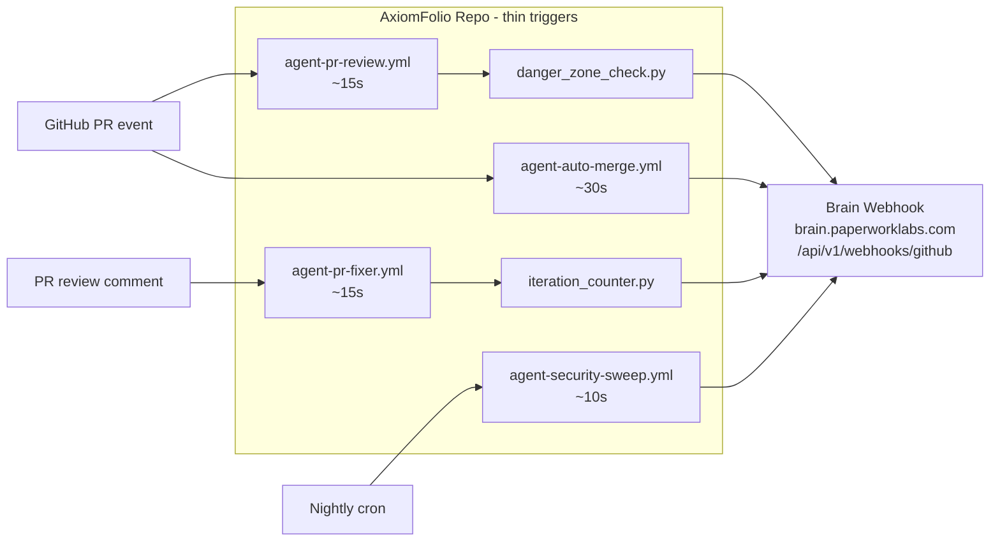

# Agent-Driven PR Automation — AxiomFolio Side

## Companion Plan

This plan covers the **AxiomFolio repo side only** (thin GHA triggers, agent prompts, GitHub App install). The Brain orchestrator side lives in `[/Users/axiomfolio/.cursor/plans/agent-pr-automation-brain.plan.md]` and must ship in parallel. Both together = the full Path 2 loop.

## Strategic Context

This work is **Phase 1 of "Brain as Dev OS"** — fills `draft_pr` / `merge_pr` / `update_doc` rows in Brain v10 D17 (Tool execution guardrails) that were specced but never built. See companion Brain plan's "v2-v4 Roadmap" section for the broader arc (Decision Logger expansion, Daily Briefing, Sprint Sync, Engineering Persona dispatch, Doc Drift Detection, Incident Response). Each subsequent phase adds 1-2 days because Brain primitives are reused.

The repo move (Phase 0 — see `[/Users/axiomfolio/.cursor/plans/repo-move-axiomfolio-to-paperwork-labs.plan.md]`) is the strategic prerequisite that aligns AxiomFolio to its actual position per `[/Users/axiomfolio/development/paperwork/docs/BRAIN_ARCHITECTURE.md]` line 7: "axiomfolio is a skill/capability within Brain".

## Goals (re-confirmed)

1. **Hands-off PR throughput.** PR opens → Brain reviews → Brain fixes → Brain merges. No human touch.
2. **Holistic fixes only.** Brain's prompts forbid band-aids; Reviewer's verdict format requires explicit root-cause + scope-of-related-files analysis. Enforced in `[.github/agents/reviewer.md]` + `[.github/agents/fixer.md]`.
3. **Proactive security.** Nightly Brain-dispatched Security agent runs the 7 existing skills under `[.claude/skills/skills/security/]`, opens its own PRs for findings.
4. **GHA minute discipline.** Each trigger workflow ≤30s. Heavy reasoning lives in Brain → Cursor (your Ultra plan covers compute). Estimated ~1 GHA-minute per PR for the agent layer.
5. **Slack-native UX.** Brain posts to Slack via existing `[infra/hetzner/workflows/brain-slack-adapter.json]` n8n workflow on Paperwork side. Approve/reject buttons in-thread.

## Non-Goals

- AxiomFolio does NOT spawn Cursor agents directly. All dispatch through Brain.
- AxiomFolio does NOT hold iteration state. Brain's memory layer (`apis/brain/app/services/memory.py`) tracks PR iteration counts.
- Not modifying `[backend/services/agent/brain.py]` — that's portfolio-ops AgentBrain, wrong layer.

## Architecture (this repo's slice)



Brain takes over from there: dispatches Cursor agent, polls, posts review back via GitHub App, posts to Slack via n8n. See companion Brain plan for that side.

## Files

### New (this repo)

| File | Purpose | Size estimate |
|---|---|---|
| `[.github/workflows/agent-pr-review.yml]` | On `pull_request` opened/synchronize/reopened: run danger-zone check, sign payload, POST to Brain webhook. Skip on draft, dependabot, docs-only. | ~80 lines |
| `[.github/workflows/agent-pr-fixer.yml]` | On `issue_comment` or `pull_request_review` containing `/agent-fix` or `request_changes` from `paperwork-agent[bot]`: increment iteration counter, POST to Brain. | ~70 lines |
| `[.github/workflows/agent-auto-merge.yml]` | On `issue_comment` matching `/agent-approve <sha>` from `paperwork-agent[bot]` OR `pull_request_review` approved by repo owner: poll CI green, squash-merge, delete branch. Replaces narrow `agent/*`-only path in current `[.github/workflows/agent-merge-after-ci.yml]`. | ~120 lines |
| `[.github/workflows/agent-security-sweep.yml]` | Nightly cron 03:00 UTC + `workflow_dispatch`: POST to Brain to spawn Security agent. | ~40 lines |
| `[.github/workflows/_lib/get_app_token.yml]` | Reusable composite action: exchange `AGENT_APP_ID` + `AGENT_APP_PRIVATE_KEY` for installation token via `actions/create-github-app-token@v1`. | ~25 lines |
| `[.github/scripts/sign_payload.py]` | HMAC-SHA256 signs payload with `BRAIN_WEBHOOK_SECRET`, sets `X-Webhook-Signature` header. Mirrors AxiomFolio's outbound webhook signing pattern. | ~40 lines |
| `[.github/scripts/danger_zone_check.py]` | Reads `[.cursor/rules/protected-regions.mdc]` patterns, lists changed files via `gh pr diff --name-only`. Returns flag in payload (Brain decides, doesn't gate). | ~80 lines |
| `[.github/scripts/iteration_counter.py]` | Reads PR commit history, counts commits by `paperwork-agent[bot]`. Adds `iteration_count` to payload. Hard cap of 3 enforced by Brain. | ~50 lines |
| `[.github/agents/reviewer.md]` | Reviewer prompt template with holistic-fix doctrine + danger-zone awareness + structured verdict format. Brain reads via its GitHub tool. | ~150 lines |
| `[.github/agents/fixer.md]` | Fixer prompt: invokes `~/.cursor/skills-cursor/babysit/SKILL.md`, "no band-aids", "find related code paths" instructions. | ~120 lines |
| `[.github/agents/security.md]` | Security prompt: loops the 7 skills under `[.claude/skills/skills/security/]`, opens `agent/security-<slug>` branches + PRs. | ~100 lines |
| `[.cursor/rules/agent-pr-automation.mdc]` | Always-applied rule documenting the workflow for human + Opus reference in future sessions. | ~80 lines |
| `[docs/AGENT_AUTOMATION.md]` | Operator runbook: how to disable/enable per-PR, read agent comments, bump iteration cap, kill switches, debugging. | ~200 lines |

### Modified

| File | Change |
|---|---|
| `[.github/workflows/agent-merge-after-ci.yml]` | Consolidate into new `agent-auto-merge.yml` (keep one workflow, broaden scope from `agent/*` to all branches with safety gates). |
| `[.github/workflows/request-copilot-review.yml]` | DELETE. Copilot is rate-limiting; Brain-orchestrated reviewer replaces it. |
| `[docs/PR_AUTOMATION.md]` | Add Path 2 architecture section; mark request-copilot-review as removed; add Brain webhook flow diagram. |
| `[docs/KNOWLEDGE.md]` | Add `D###: agent-driven PR review via Paperwork Brain (Path 2). Brain orchestrates, GHA thin triggers, Cursor BG agents do work, Slack via existing n8n. Cost cap $10/day, hard iteration cap 3, danger-zone bypass. Companion plan in paperwork repo.` |

### Secrets to add (paperwork-labs org level after move)

- `AGENT_APP_ID` — GitHub App ID (e.g. `1234567`)
- `AGENT_APP_PRIVATE_KEY` — RSA private key, multi-line PEM
- `BRAIN_WEBHOOK_URL` — `https://brain.paperworklabs.com/api/v1/webhooks/github`
- `BRAIN_WEBHOOK_SECRET` — shared HMAC secret (generated on Brain side, mirrored here)

(Existing `GITHUB_TOKEN` reused only for `gh` CLI helpers in scripts; agent comments use App token.)

## GitHub App: `paperwork-agent`

One-time setup (Phase 1, you do this):

1. paperwork-labs org → Settings → Developer settings → GitHub Apps → New
2. Name: `paperwork-agent`
3. Homepage: `https://brain.paperworklabs.com`
4. Webhook: disabled (Brain doesn't subscribe; we POST from GHA)
5. Permissions:
   - Repository: `pull_requests: Read & write`, `contents: Read & write`, `issues: Read & write`, `checks: Read`, `metadata: Read`
   - Account: none
6. Where can install: only this account (paperwork-labs)
7. Generate private key → save as `AGENT_APP_PRIVATE_KEY`
8. Note App ID → save as `AGENT_APP_ID`
9. Install on `paperwork-labs/axiomfolio` (and later `paperwork-labs/paperwork`, etc.)

All four workflows then use `actions/create-github-app-token@v1` to mint short-lived install tokens — no PAT stored.

## Holistic-Fix Doctrine (lives in agent prompts)

Every prompt template (`reviewer.md`, `fixer.md`, `security.md`) opens with:

> **You do not write band-aids.** Identify root causes, not symptoms. If symptom is in file A but cause is in file B, fix file B and update file A's tests. If a fix would touch a DANGER ZONE file (see `[.cursor/rules/protected-regions.mdc]`), STOP and post a comment requesting human approval — do not push the fix. If the same shape of issue affects N other files, list them in your review/comment so the scope is visible, even if you only fix the file in this PR.

Reviewer verdict format must include:

```
### Root cause analysis
- Symptom: ...
- Underlying cause: ...
- Files affected by this same root cause: [list]
- Scope of this PR's fix vs follow-up needed: [in-scope / new issue]
```

Brain enforces: if Fixer's commit is judged a band-aid by next Reviewer pass, that pass posts `request-changes` again with `band-aid detected`. Counts toward iteration cap.

## Safety Gates (Brain enforces; AxiomFolio adds info to payload)

`[.github/scripts/danger_zone_check.py]` adds `danger_zone: true|false` and `danger_files: [...]` to the payload. Brain's policy:

- DANGER ZONE files (per `[.cursor/rules/protected-regions.mdc]`) → label `human-review-required`, post review but **no auto-merge**, no fixer dispatch
- Any `backend/alembic/versions/*.py` → same
- PR title contains `[breaking]`, `[security]`, `[migration]` → same
- PR body or commit msg contains `BREAKING CHANGE:` → same
- PR diff > 1000 lines → same
- Label `do-not-auto-merge` or `human-review-required` present → same
- Label `agent-pause` present → no dispatch at all

## Cost Discipline

Most enforcement lives in Brain (it controls Cursor spend). AxiomFolio side enforces:

- Skip on draft PRs (workflow filter)
- Skip on dependabot PRs (workflow filter — existing `[.github/workflows/dependabot-automerge.yml]` handles)
- Skip on docs-only diffs (regex match `^docs/`, `*.md` only) → no Brain POST
- Skip on `chore/typo-*` branches → no Brain POST

Projection: ~1 GHA-minute per PR for agent layer (3 workflows × ~20s avg). Existing `[.github/workflows/ci.yml]` (~25 min/PR) unchanged.

## Repo Move Pre-Flight (Phase 0 detail)

Before moving sankalp404/axiomfolio → paperwork-labs/axiomfolio:

1. **Inventory webhooks** — `gh api repos/sankalp404/axiomfolio/hooks` → list all (Render, Cloudflare, anything custom). Note URLs.
2. **Inventory secrets** — `gh secret list --repo sankalp404/axiomfolio` → 28+ secrets to recreate at org level (or per-repo).
3. **Inventory branch protections** — `gh api repos/sankalp404/axiomfolio/branches/main/protection`. Re-apply post-move.
4. **Inventory deploy keys** — `gh api repos/sankalp404/axiomfolio/keys`.
5. **Verify Render** — Render auto-follows GitHub repo redirects, but worth a manual deploy after move to confirm.
6. **Update Brain's `GITHUB_REPO` env** in Render dashboard from `sankalp404/axiomfolio` to `paperwork-labs/axiomfolio` AFTER move (atomic — single redeploy).
7. **Document old URLs** in `[docs/KNOWLEDGE.md]` D### so future reviewers know the redirect history.

GitHub redirect handles: PR links, issue links, commit SHAs, raw file URLs, clone URLs (forever, GitHub honors these). Direct API calls using old `owner/repo` will redirect with 301 — most clients handle this automatically.

## Rollout Phases

| Phase | What | Who acts | Estimate |
|---|---|---|---|
| 0 | Repo move + secrets/protections re-applied at paperwork-labs/axiomfolio | You + me (you click in GH UI, I provide checklist + verification commands) | 30-60 min |
| 1 | GitHub App + secrets in GHA | You (App creation requires browser); I provide manifest JSON to paste | 20 min |
| 2 | Land trigger workflows + scripts (one PR) | Me (this repo) | 1 day |
| 3 | Land agent prompts (same PR or follow-up) | Me (this repo) | 0.5 day |
| 4 | Wait on Brain side to deploy webhook intake + dispatcher | Brain plan owner | parallel ~3-4 days |
| 5 | End-to-end test on 1 throwaway PR | You + me | 1 hour |
| 6 | Cleanup: delete request-copilot-review.yml, update docs | Me (one PR) | 0.5 day |

Total AxiomFolio-side: ~2 days work. Total elapsed: ~5-7 days (gated on Brain side).

## Acceptance Criteria

- [ ] Repo lives at `paperwork-labs/axiomfolio` with all secrets, protections, deploy hooks intact
- [ ] `paperwork-agent` GitHub App installed; comments come from `paperwork-agent[bot]`
- [ ] PR opened with no danger-zone files → review comment within 5 min via Brain
- [ ] PR with review comments triggers Fixer commit within 5 min via Brain
- [ ] PR touching `[backend/services/execution/risk_gate.py]` is labeled `human-review-required`; no Fixer dispatched
- [ ] After 3 fixer iterations without approval, PR labeled `human-review-needed`, no further dispatch
- [ ] Approved PR auto-merges within 2 min of CI green
- [ ] Slack thread posted in your existing channel for every PR open + review verdict (via n8n)
- [ ] Kill switch: label `agent-pause` halts dispatch within one trigger cycle
- [ ] `[docs/AGENT_AUTOMATION.md]` runbook covers all the above
- [ ] D### entry in `[docs/KNOWLEDGE.md]` references both this plan + companion Brain plan

## Decisions Confirmed

1. **Path 2** — Brain orchestrates; GHA = thin trigger. Cursor BG agents do work via Brain dispatcher (lives in paperwork repo per companion plan).
2. **Repo moves to paperwork-labs/axiomfolio** as Phase 0 — clean slate for App install + Brain GITHUB_REPO config.
3. **Single GitHub App `paperwork-agent`** — installable across all paperwork-labs repos in future.
4. **Cost cap** — $10/day hard kill, $5/day soft alert (enforced Brain-side; AxiomFolio reduces dispatch volume via skip filters).
5. **Default model** — `composer-2-fast` on your Ultra plan; escalate to `gpt-5.4-medium` only for: (a) Fixer iter ≥2, (b) DANGER ZONE reviews, (c) Security findings becoming PRs. (Decided Brain-side.)

## Migration Path: None Needed

Path 2 is the destination. No "v1 → v2" rewrite later — the dispatcher script is in Brain from day 1.

---

**Companion plan to read next**: `[/Users/axiomfolio/.cursor/plans/agent-pr-automation-brain.plan.md]` — covers Brain webhook intake, Cursor dispatcher, GitHub PR write tools, iteration state in memory layer, n8n Slack adapter wiring.
