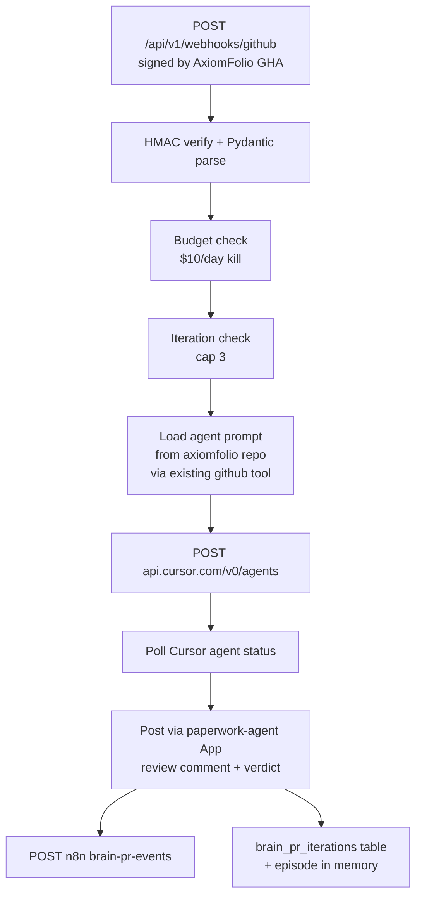

# Agent-Driven PR Automation — Paperwork Brain Side

## Companion Plan

This plan covers **paperwork repo Brain side only**. The AxiomFolio thin-trigger side lives at `[/Users/axiomfolio/.cursor/plans/agent-pr-automation_79e8354f.plan.md]` and ships in parallel.

## Why Brain Owns This (strategic context)

PR automation isn't a new feature — it's filling in capabilities **already specced in `[/Users/axiomfolio/development/paperwork/docs/BRAIN_ARCHITECTURE.md]` D17 (Tool execution guardrails)** that were never implemented:

| Tool | D17 Tier | Status today |
|---|---|---|
| `read_file`, `search_code`, `list_prs` | Tier 0 (auto) | ✅ Built — `apis/brain/app/tools/github.py` |
| `recall_memory`, `get_entities` | Tier 0 (auto) | ✅ Built — `services/memory.py` |
| `update_doc` (docs/ only) | Tier 2 (draft+approve) | ❌ This plan |
| `draft_pr` | Tier 2 (draft+approve) | ❌ This plan |
| `merge_pr` | Tier 3 (must approve) | ❌ This plan |

And from BRAIN_ARCHITECTURE line 7: *"Brain IS the long-term platform. FileFree, LaunchFree, **axiomfolio are skills/capabilities within it**. Products are the hands, Brain is the mind."* This work realigns AxiomFolio to that meta-product positioning.

Brain already has 70% of dev-OS primitives (verified in current `paperwork/main` HEAD `c892ece`):

- ✅ Production webhook intake pattern (`/api/v1/webhooks/axiomfolio` is HMAC-verified, typed, episode-stored)
- ✅ GitHub READ tools scoped via `GITHUB_REPO` env (`apis/brain/app/tools/github.py`)
- ✅ MCP server with auth at `/mcp` (23 tools)
- ✅ Memory layer for episodes / context (`apis/brain/app/services/memory.py`)
- ✅ Deployed on Render at `brain.paperworklabs.com`
- ✅ n8n adapter for Slack (`infra/hetzner/workflows/brain-slack-adapter.json`)
- ✅ Settings config plumbed for cross-product secrets (`apis/brain/app/config.py` already has `AXIOMFOLIO_*`, `GITHUB_TOKEN`, `LANGFUSE_*`)
- ✅ 16 personas including `engineering.mdc`, `qa.mdc`, `agent-ops.mdc` already built and persona-cached (D13)

What's missing: GitHub PR webhook intake, Cursor agent dispatcher, GitHub PR WRITE tools, iteration state. ~3-4 days of focused work.

## Architecture (Brain's slice)



## Files

### New (paperwork repo)

| File | Purpose | Size estimate |
|---|---|---|
| `[apis/brain/app/services/cursor_dispatcher.py]` | POST to `api.cursor.com/v0/agents`. Polls `/v0/agents/{id}` for completion. Tracks spend via daily counter. Idempotency via PR sha + agent type. | ~200 lines |
| `[apis/brain/app/services/pr_orchestrator.py]` | Main control loop. Decides which agent to dispatch (reviewer/fixer/security/merge) based on event type. Enforces iteration cap, budget, danger-zone gates. | ~250 lines |
| `[apis/brain/app/services/pr_state.py]` | CRUD on `brain_pr_iterations` table. Tracks iteration count, last verdict, last fixer sha, danger flags, total spend per PR. | ~150 lines |
| `[apis/brain/app/services/github_app.py]` | Mints installation tokens for `paperwork-agent` App via JWT. Caches token until expiry (1h). | ~80 lines |
| `[apis/brain/app/models/pr_iteration.py]` | SQLAlchemy model for `brain_pr_iterations` (composite key on repo + pr_number). | ~50 lines |
| `[apis/brain/alembic/versions/XXXX_add_pr_iterations.py]` | Alembic migration creating the table. | ~40 lines |
| `[apis/brain/tests/services/test_cursor_dispatcher.py]` | Unit + integration tests using `responses` lib for Cursor API. | ~150 lines |
| `[apis/brain/tests/services/test_pr_orchestrator.py]` | Test the control loop end-to-end with mocked Cursor + GitHub. | ~200 lines |
| `[apis/brain/tests/routers/test_webhooks_github.py]` | Webhook intake tests (signature, payload parsing, episode storage). | ~120 lines |
| `[infra/hetzner/workflows/brain-pr-events.json]` | New n8n workflow: receives Brain → posts Slack thread with `[approve][changes][details]` interactive buttons. Routes button clicks back to Brain via MCP. | ~250 lines (n8n JSON) |

### Modified (paperwork repo)

| File | Change |
|---|---|
| `[apis/brain/app/routers/webhooks.py]` | Add `/github` route with HMAC verification (mirror existing `/axiomfolio` pattern), Pydantic schemas for `pr.review.requested`, `pr.fix.requested`, `pr.merge.requested`, `pr.security.sweep`. Wire to `pr_orchestrator`. |
| `[apis/brain/app/tools/github.py]` | Add WRITE methods: `post_pr_review_comment`, `request_pr_changes`, `approve_pr_via_comment`, `post_pr_summary`, `create_pr_branch`, `commit_to_branch`, `open_pr`. All use `github_app.py` installation token. |
| `[apis/brain/app/config.py]` | Add `CURSOR_API_KEY: SecretStr`, `AGENT_APP_ID: int`, `AGENT_APP_PRIVATE_KEY: SecretStr`, `GITHUB_WEBHOOK_SECRET: SecretStr`, `AGENT_DAILY_USD_CAP: float = 10.0`, `AGENT_PER_PR_USD_CAP: float = 2.0`. |
| `[apis/brain/app/main.py]` | No changes — webhook router already registered, new route inherits prefix. |
| `[render.yaml]` | Add `CURSOR_API_KEY`, `AGENT_APP_ID`, `AGENT_APP_PRIVATE_KEY`, `GITHUB_WEBHOOK_SECRET` to `brain-api` envVars (all `sync: false` — set in Render dashboard). |
| `[docs/AXIOMFOLIO_INTEGRATION.md]` | Add Path 2 PR automation section. Document new event types and Slack flow. |
| `[docs/BRAIN_ARCHITECTURE.md]` | Add "PR Automation Orchestration" section after existing Tool Dispatcher description. |
| `[docs/KNOWLEDGE.md]` | Add `D###: PR automation orchestration in Brain (Path 2). Companion plan in axiomfolio repo.` |

### Secrets to add (Render dashboard, brain-api service)

- `CURSOR_API_KEY` — Bearer token from cursor.com → settings → API keys (your Ultra plan)
- `AGENT_APP_ID` — paperwork-agent GitHub App ID
- `AGENT_APP_PRIVATE_KEY` — RSA PEM
- `GITHUB_WEBHOOK_SECRET` — shared HMAC secret (mirrors AxiomFolio's `BRAIN_WEBHOOK_SECRET`)

## Inbound Webhook Schema

Mirrors the existing `/axiomfolio` pattern. New router:

```python
# apis/brain/app/routers/webhooks.py (additions)

class GitHubPREventData(BaseModel):
    repo: str  # e.g. "paperwork-labs/axiomfolio"
    pr_number: int
    pr_title: str
    pr_body: str | None
    pr_author: str
    head_sha: str
    base_branch: str
    head_branch: str
    is_draft: bool
    danger_zone: bool
    danger_files: list[str]
    iteration_count: int  # 0 for first review, increments for fixer
    diff_url: str
    labels: list[str]

class GitHubWebhookPayload(BaseModel):
    event: Literal[
        "pr.review.requested",
        "pr.fix.requested",
        "pr.merge.requested",
        "pr.security.sweep",
    ]
    data: GitHubPREventData | dict[str, Any]
    timestamp: str
    signature_verified: bool = False  # set by verify dependency

@router.post("/github")
async def github_webhook(
    body: GitHubWebhookPayload,
    db: AsyncSession = Depends(get_db),
    _auth: None = Depends(_verify_github_webhook),
) -> dict[str, Literal[True]]:
    await pr_orchestrator.handle_event(db, body)
    return {"success": True}
```

`_verify_github_webhook` mirrors `_verify_axiomfolio_webhook` but reads `GITHUB_WEBHOOK_SECRET`.

## Cursor Dispatcher Spec

```python
# apis/brain/app/services/cursor_dispatcher.py (signatures)

async def dispatch_agent(
    *,
    agent_type: Literal["reviewer", "fixer", "security"],
    pr_context: GitHubPREventData,
    iteration: int,
    db: AsyncSession,
) -> str:
    """Returns Cursor agent_id. Idempotent on (repo, pr_number, head_sha, agent_type, iteration)."""

async def poll_agent(agent_id: str, *, max_wait_s: int = 600) -> AgentResult:
    """Poll until completion or timeout. Returns parsed verdict."""

async def get_today_spend_usd() -> float:
    """Sum from Cursor /v0/usage endpoint for current calendar day UTC."""

class AgentResult(BaseModel):
    agent_id: str
    verdict: Literal["approve", "request_changes", "danger_zone_escalate", "error"]
    review_body: str  # markdown
    inline_comments: list[InlineComment]
    root_cause_analysis: str  # required by holistic-fix doctrine
    files_with_same_root_cause: list[str]
    estimated_cost_usd: float
```

Model selection:

```python
def select_model(agent_type: str, iteration: int, danger_zone: bool) -> str:
    if danger_zone:
        return "gpt-5.4-medium"  # heavy reasoning for sensitive paths
    if agent_type == "fixer" and iteration >= 2:
        return "gpt-5.4-medium"  # composer didn't converge, escalate
    if agent_type == "security" and iteration > 0:  # filing a finding as PR
        return "gpt-5.4-medium"
    return "composer-2-fast"  # default — Ultra-included
```

## GitHub App Token Minting

```python
# apis/brain/app/services/github_app.py (signature)

class InstallationTokenCache:
    """JWT → installation token, cached until 5 min before expiry."""
    async def get_token(self, repo: str) -> str: ...

# Usage in tools/github.py write methods:
async def post_pr_review_comment(repo: str, pr_number: int, body: str) -> None:
    token = await installation_token_cache.get_token(repo)
    async with httpx.AsyncClient(headers={"Authorization": f"token {token}"}) as c:
        await c.post(f"https://api.github.com/repos/{repo}/issues/{pr_number}/comments", json={"body": body})
```

The existing `tools/github.py` `read_github_file` continues to use the legacy `GITHUB_TOKEN` PAT (read-only, no risk). All NEW write methods use the App installation token.

## Iteration State Schema

```sql
-- apis/brain/alembic/versions/XXXX_add_pr_iterations.py

CREATE TABLE brain_pr_iterations (
    id SERIAL PRIMARY KEY,
    repo TEXT NOT NULL,
    pr_number INTEGER NOT NULL,
    iteration_count INTEGER NOT NULL DEFAULT 0,
    last_reviewer_verdict TEXT,  -- approve / request_changes / danger_zone_escalate
    last_fixer_sha TEXT,
    danger_zone_flagged BOOLEAN NOT NULL DEFAULT FALSE,
    total_spend_usd NUMERIC(10, 4) NOT NULL DEFAULT 0,
    state TEXT NOT NULL DEFAULT 'open',  -- open / human_review_needed / merged / closed
    created_at TIMESTAMPTZ NOT NULL DEFAULT NOW(),
    updated_at TIMESTAMPTZ NOT NULL DEFAULT NOW(),
    UNIQUE (repo, pr_number)
);

CREATE INDEX ix_brain_pr_iterations_state ON brain_pr_iterations(state);
CREATE INDEX ix_brain_pr_iterations_repo ON brain_pr_iterations(repo);
```

## Slack Wiring

New n8n workflow `[infra/hetzner/workflows/brain-pr-events.json]` (or extend existing `brain-slack-adapter.json`):

**Inbound:** Brain POSTs to n8n webhook with `{event_type, repo, pr_number, pr_title, verdict, review_summary, agent_iteration}`.

**Outbound:** n8n posts Slack message to `#axiomfolio-prs` channel:

```
:robot_face: PR #483: feat: wave-f1 tradier live (paperwork-labs/axiomfolio)
Reviewer (iter 1): REQUEST CHANGES
> Root cause: missing responses dependency in requirements.txt
> Files affected by same root cause: backend/tests/execution/test_etrade_executor.py
> Fixer dispatched

[Approve anyway] [View PR] [Pause agent]
```

Button clicks route back to Brain via existing slack→brain MCP path. `Approve anyway` = post `/agent-approve <sha>` comment as `paperwork-agent[bot]` → AxiomFolio GHA picks up and merges.

## Acceptance Criteria

- [ ] `POST /api/v1/webhooks/github` returns 200 with valid HMAC, 401 with invalid
- [ ] Cursor dispatcher returns agent_id; polling correctly returns AgentResult
- [ ] Daily spend hard-stops at `AGENT_DAILY_USD_CAP`
- [ ] Iteration cap of 3 enforced via `brain_pr_iterations` table
- [ ] Danger-zone PRs get review-only treatment (no fixer dispatch, no auto-merge)
- [ ] `paperwork-agent[bot]` posts review comments visible in PR
- [ ] Slack thread posted within 30s of PR open
- [ ] All new routes have integration tests (`responses` for Cursor, `httpx_mock` for GitHub)
- [ ] `make test` passes in `apis/brain/`
- [ ] Render deploy succeeds with new env vars
- [ ] D### entry in `docs/KNOWLEDGE.md` references companion AxiomFolio plan

## Cost Discipline (Brain enforces)

- Daily kill switch: `AGENT_DAILY_USD_CAP=10` polled before every dispatch
- Per-PR cap: `AGENT_PER_PR_USD_CAP=2`; label `agent-budget-low` lowers to $0.50
- Iteration cap: 3 fixer iterations max → label PR `human-review-needed`, halt
- Idempotency: dispatcher refuses duplicate `(repo, pr_number, sha, agent_type, iteration)` within 1h
- Skip dispatch if PR has label `agent-pause` or repo variable `AGENT_AUTOMATION_DISABLED=true`

## Phasing

| Phase | Work | Estimate |
|---|---|---|
| 1 | Webhook intake route + tests | 0.5 day |
| 2 | Cursor dispatcher + tests | 1 day |
| 3 | GitHub App + write tools | 1 day |
| 4 | Iteration state model + migration | 0.5 day |
| 5 | Orchestrator loop wiring + tests | 1 day |
| 6 | Slack n8n adapter | 0.5 day |
| 7 | End-to-end smoke (one PR through whole loop) | 0.5 day |

Total: ~5 days. Land in 1 PR per phase, ~7 PRs total in paperwork repo.

## Cross-Repo Coordination

- Brain plan ships before AxiomFolio plan can be enabled (AxiomFolio triggers POST to Brain webhook URL — needs target online)
- AxiomFolio plan can land its files behind a feature flag (`AGENT_AUTOMATION_ENABLED=false` repo variable) without breaking
- Once Brain is deployed and tested with a curl POST: flip `AGENT_AUTOMATION_ENABLED=true` on AxiomFolio
- Single GitHub App `paperwork-agent` installed on both repos so Brain can post back to either

## v2-v4 Roadmap: Brain as Dev OS

PR automation is Phase 1. Each subsequent phase adds 1-2 days because primitives are reused — same memory layer, same persona system, same Slack adapter, same Cursor dispatcher, same GitHub App. Roadmap implements the rest of D17 + capabilities specced in `[/Users/axiomfolio/development/paperwork/AGENTS.md]` line 53 (Decision Logger, Daily Briefing).

| Phase | Capability | Builds On | New Code | Estimate |
|---|---|---|---|---|
| **v1** | PR Review + Fix + Merge (this plan) | new dispatcher + GitHub write tools | ~5 files | 5 days |
| **v2** | Decision Logger expansion — Brain reads merged PR + Slack thread + commits → drafts `D###` entry → posts as draft on docs PR → human approves → commits | v1 dispatcher + `update_doc` tool | ~2 files | 1.5 days |
| **v3** | Daily Dev Briefing — every morning, compiles 24h shipped PRs + in-flight + blocked + security findings + sprint progress vs. `docs/TASKS.md`. Posts via existing Slack adapter | v1 GitHub read tools + memory recall | ~1 file | 1 day |
| **v4** | Cross-repo Sprint Sync — `axiomfolio/docs/TASKS.md` ↔ Brain memory ↔ `paperwork/docs/TASKS.md`. Mark task done in one → Brain updates related entries | memory entity graph (D5) | ~2 files | 2 days |
| **v5** | Engineering Persona Dispatch — each PR routed to right persona (`engineering.mdc` for backend, `qa.mdc` for tests, `ux.mdc` for frontend) instead of single reviewer prompt | persona system already cached (D13) | ~1 prompt file | 0.5 day |
| **v6** | Doc Drift Detection — Brain notices code changed but `KNOWLEDGE.md` / `ARCHITECTURE.md` unchanged → drafts the doc PR | v2 + memory diff | ~1 file | 1.5 days |
| **v7** | Incident Response — production health drops (Brain reads `axiomfolio /admin/health` already) → spawns triage agent → posts diagnosis to Slack → drafts fix PR | v1 dispatcher + existing axiomfolio tools | ~1 file | 2 days |

Total dev-OS surface: ~13.5 days work spread over 2-3 months. v1 is the wedge that proves the loop; subsequent phases are additive without rearchitecture.

This roadmap turns Brain into the **Engineering Brain** variant of D27's pricing tiers — internal dogfood that validates the Team/Business tier offering without separate development cost.

---

**Companion plan to read first**: `[/Users/axiomfolio/.cursor/plans/agent-pr-automation_79e8354f.plan.md]` — covers AxiomFolio thin-trigger side, GHA workflows, agent prompt templates, repo move runbook.
