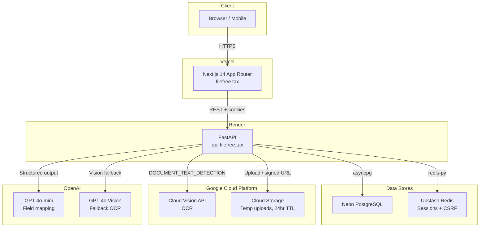
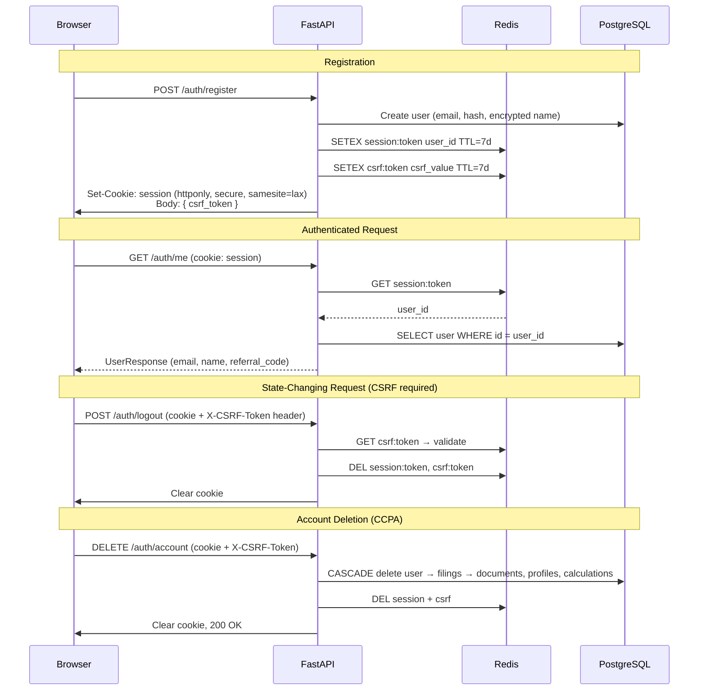
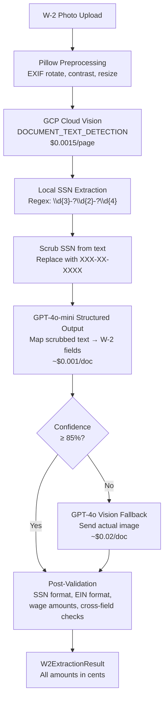
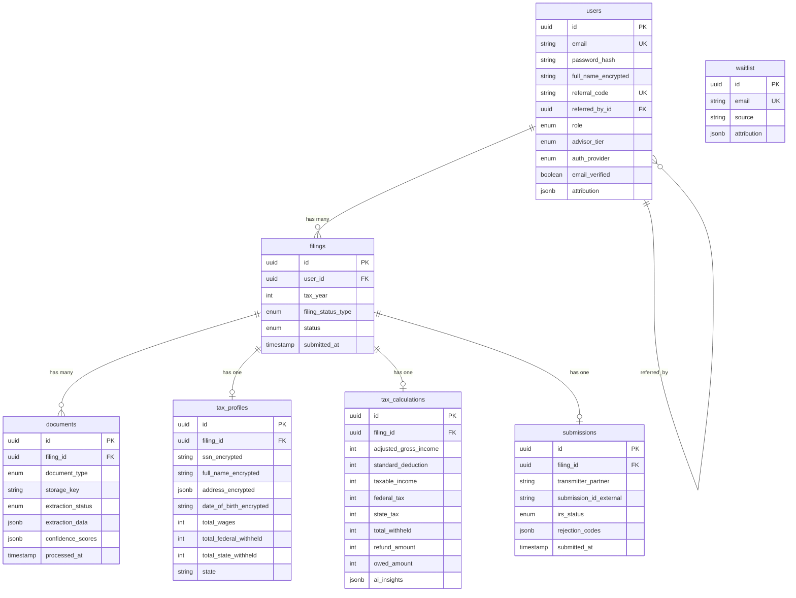
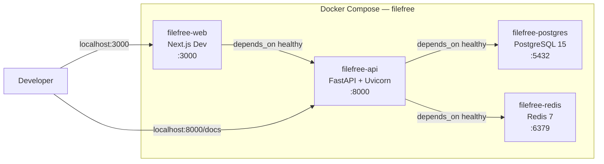
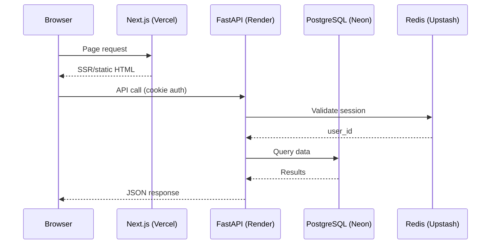

# FileFree — Architecture Reference

**Last updated**: 2026-03-10

A visual-first guide to how FileFree is built. Diagrams are rendered natively on GitHub.

---

## System Overview



### Production Infrastructure

| Service | Provider | Plan | Domain |
|---------|----------|------|--------|
| Frontend | Vercel | Hobby | filefree.tax |
| Backend | Render | Starter ($7/mo) | api.filefree.tax |
| Database | Neon | Free tier | — |
| Sessions | Upstash | Free tier (500K cmd/mo) | — |
| File Storage | GCP Cloud Storage | Pay-per-use | — |
| OCR | GCP Cloud Vision | 1K free/mo, $0.0015/page | — |
| AI | OpenAI | Pay-per-use | — |
| Ops VPS | Hetzner | CX33 ($5.49/mo) | n8n / social.filefree.tax |

---

## Authentication Flow



### Auth Endpoints

| Method | Path | Auth | CSRF | Rate Limit | Description |
|--------|------|------|------|------------|-------------|
| POST | `/auth/register` | No | No | 5/min | Create account, set cookie |
| POST | `/auth/login` | No | No | 5/min | Verify credentials, set cookie |
| POST | `/auth/logout` | Yes | Yes | — | Clear session + cookie |
| GET | `/auth/me` | Yes | No | — | Return current user |
| DELETE | `/auth/account` | Yes | Yes | — | Delete all data (CCPA) |

---

## OCR Pipeline



### SSN Isolation

SSNs are extracted via regex locally from Cloud Vision text output. They are **never** sent to OpenAI or any LLM. The scrubbed text (with `XXX-XX-XXXX` placeholders) is what GPT receives. Google Cloud Vision does not store images or use them for training.

### Cost Model

| Tier | When Used | Cost/doc | % of Requests |
|------|-----------|----------|---------------|
| Tier 1 | Cloud Vision + GPT-4o-mini | ~$0.002 | ~90% |
| Tier 2 | GPT-4o vision fallback | ~$0.02 | ~10% |
| **Blended** | | **~$0.005** | |

---

## Data Model



### Cascade Behavior

All child tables use `ON DELETE CASCADE` at the database level and `cascade="all, delete-orphan"` at the ORM level. Deleting a user cascades through filings to all child records — this powers the CCPA account deletion endpoint.

### PII Encryption

All personally identifiable fields (`full_name`, `ssn`, `address`, `date_of_birth`) are encrypted at rest using AES-256 (Fernet) with a separate key from database encryption. SSNs are never stored in plaintext anywhere.

---

## Local Development Stack



### Quick Reference

```bash
make dev          # Start all services (foreground)
make dev-d        # Start all services (background)
make stop         # Stop all services
make test-local   # Run backend tests (no Docker)
make lint-local   # Run linters (no Docker)
make logs-api     # Tail API logs
make db           # Open psql shell
```

---

## Backend Structure

```
api/
├── app/
│   ├── main.py              # FastAPI app, lifespan, middleware, routes
│   ├── config.py             # Pydantic Settings (env vars)
│   ├── database.py           # SQLAlchemy async engine + session
│   ├── redis.py              # Async Redis pool lifecycle
│   ├── rate_limit.py         # Shared slowapi Limiter instance
│   ├── dependencies.py       # get_current_user, require_csrf
│   ├── models/               # SQLAlchemy models (User, Filing, Document, ...)
│   ├── schemas/              # Pydantic request/response models
│   ├── routers/              # FastAPI route handlers
│   ├── services/             # Business logic (auth, OCR, tax calc)
│   ├── repositories/         # Database access (repository pattern)
│   └── utils/                # Encryption, security, PII scrubbing, exceptions
├── alembic/                  # Database migrations
├── tax-data/                 # Tax brackets and deductions by year
├── tests/                    # pytest + pytest-asyncio
└── requirements.txt
```

---

## Request Flow


