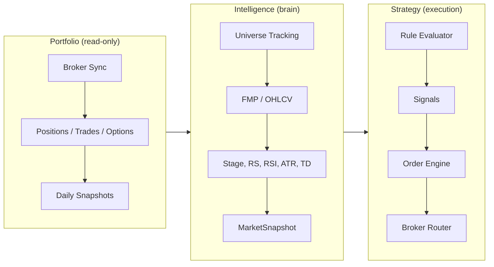
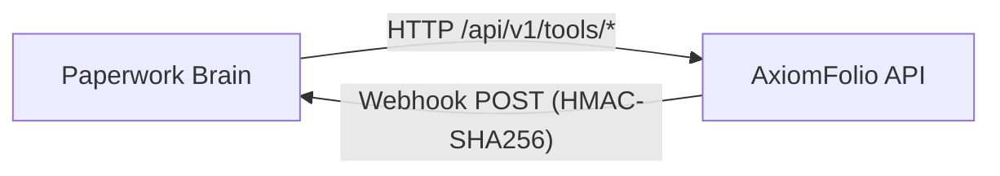
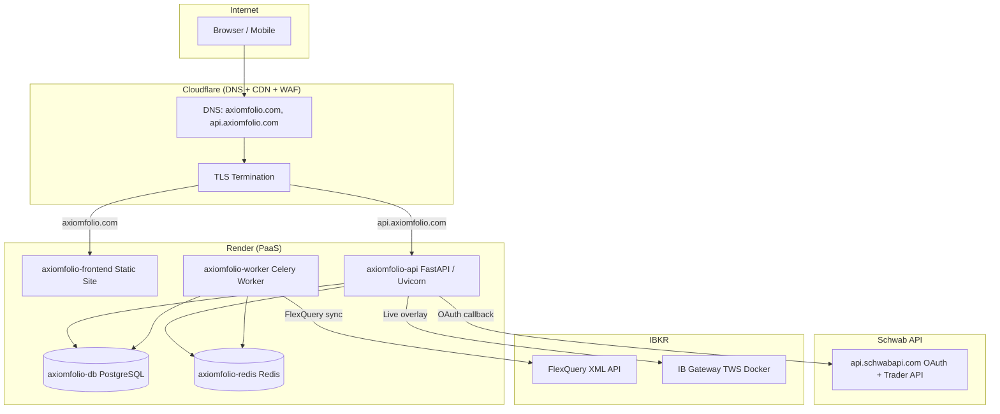
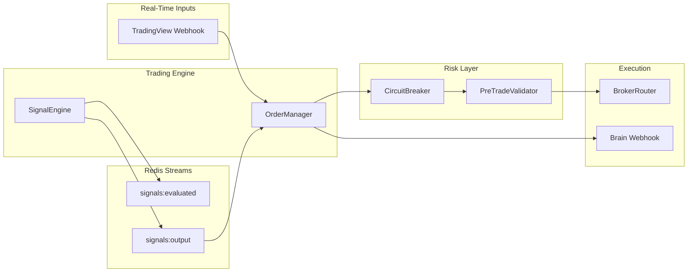
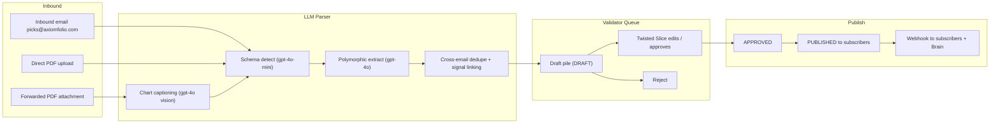
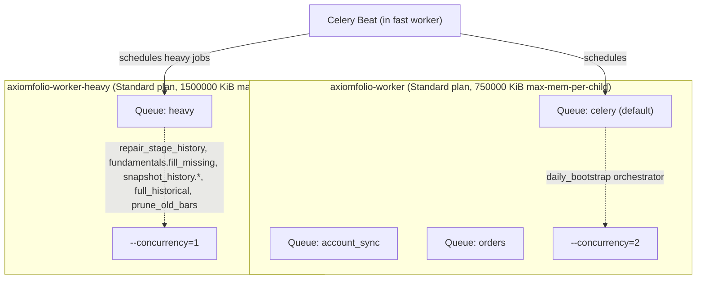

# Architecture Overview

> **2026-04-09 update**: This document reflects the v0 architecture. The current product strategy and v1+World-Class roadmap live in [`docs/plans/MASTER_PLAN_2026.md`](plans/MASTER_PLAN_2026.md). Sections marked **(v1 update)** below describe components shipping in the v1 milestone (target 2026-06-21). New sections at end: [Picks Pipeline (v1)](#picks-pipeline-v1), [Subscription Tiers (v1)](#subscription-tiers-v1), [Two-Worker Topology (v1)](#two-worker-topology-v1).

## Table of contents

- [At a glance](#at-a-glance)
- [Three Pillars](#three-pillars)
- [Brain Integration](#brain-integration)
  - [HTTP tool endpoints](#http-tool-endpoints)
  - [Outbound webhooks](#outbound-webhooks)
  - [Internal agent vs Paperwork Brain](#internal-agent-vs-paperwork-brain)
- [System Overview](#system-overview)
- [Data Model Inventory](#data-model-inventory)
- [Backend Module Structure](#backend-module-structure)
- [Frontend Pages](#frontend-pages)
- [Data Pipelines](#data-pipelines)
- [RBAC](#rbac-role-based-access-control)
- [Auth & Security](#auth--security)
- [Scheduling](#scheduling)
- [Broker Data Strategy](#broker-data-strategy)
- [Production Infrastructure](#production-infrastructure)
- [Real-Time Trading Architecture](#real-time-trading-architecture)
- [Picks Pipeline (v1)](#picks-pipeline-v1)
- [Subscription Tiers (v1)](#subscription-tiers-v1)
- [Two-Worker Topology (v1)](#two-worker-topology-v1)
- [Known Gaps](#known-gaps)

---

## At a glance

| Layer | Stack | Where to read more |
|-------|-------|--------------------|
| **Backend** | FastAPI, Celery, PostgreSQL, Redis | This doc; [PRODUCTION.md](PRODUCTION.md) for deploy |
| **Frontend** | React 19, Radix UI primitives, Tailwind CSS, Vite, TanStack Query, Recharts, lightweight-charts, TradingView, framer-motion | [FRONTEND_UI.md](FRONTEND_UI.md) |
| **Brokers** | IBKR (FlexQuery + Gateway), TastyTrade, Schwab | [CONNECTIONS.md](CONNECTIONS.md) (setup/OAuth); [BROKERS.md](BROKERS.md) (sync impl) |
| **Domain pillars** | Portfolio, Market data | [PORTFOLIO.md](PORTFOLIO.md), [MARKET_DATA.md](MARKET_DATA.md) |

---

## Three Pillars



- **Portfolio (read-only)**: Broker sync -> positions, trades, options, snapshots. Smart categories with drag-and-drop reordering. Frontend consumes via REST; IB Gateway provides live overlay.
- **Intelligence (brain)**: Market data pipeline -> indicators (Weinstein stage, RS Mansfield, TD Sequential, RSI, ATR, etc.) -> MarketSnapshot -> MarketSnapshotHistory (immutable daily ledger). Rule engine evaluates condition trees against snapshot + position context.
- **Strategy (execution)**: Strategy definition -> Rule evaluator -> signals -> Order engine -> Risk gate -> Broker router (paper or live) -> Reconciler.

## Brain Integration

**Paperwork Brain** is the external AI assistant/orchestrator. It calls AxiomFolio over HTTP as a tool provider at **`/api/v1/tools/*`**. The Brain integration standard defines **12 HTTP tool endpoints**; the route table lists the exact paths (including separate POSTs for approve and reject). Typical flows: read portfolio and market state, run scans, preview and execute trades with approvals, list pending approvals, and inspect or dispatch catalog tasks.



### HTTP tool endpoints

Brain calls AxiomFolio under `/api/v1/tools/*` (`backend/api/routes/brain_tools.py`; manifest `docs/brain/axiomfolio_tools.yaml`). The contract includes read, trade, and ops helpers:

| Path | Method | Purpose |
|------|--------|---------|
| `/api/v1/tools/portfolio` | GET | Portfolio summary |
| `/api/v1/tools/regime` | GET | Market regime (R1–R5) |
| `/api/v1/tools/stage/{symbol}` | GET | Stage Analysis for a symbol |
| `/api/v1/tools/scan` | GET | Run scans |
| `/api/v1/tools/risk` | GET | Risk / circuit breaker status |
| `/api/v1/tools/preview-trade` | POST | Create preview order |
| `/api/v1/tools/execute-trade` | POST | Execute order |
| `/api/v1/tools/approve-trade`, `/api/v1/tools/reject-trade` | POST | Approve or reject a pending trade |
| `/api/v1/tools/pending-approvals` | GET | List orders awaiting approval |
| `/api/v1/tools/schedules` | GET | List Celery Beat schedules (catalog-backed) |
| `/api/v1/tools/run-task` | POST | Dispatch a catalog task by id |

All **twelve** HTTP paths above are implemented in `brain_tools.py` (approve and reject are two separate paths).

**Authentication**: `X-Brain-Api-Key` header, compared with timing-safe equality against `BRAIN_API_KEY`. Portfolio and order views use `BRAIN_TOOLS_USER_ID` as the acting user.

### Outbound webhooks

AxiomFolio notifies Brain with **HMAC-SHA256–signed** HTTP POSTs: JSON body signed with `BRAIN_WEBHOOK_SECRET`, sent as `X-Webhook-Signature: sha256=<hex>`. The request URL is `{BRAIN_WEBHOOK_URL}/api/v1/webhooks/axiomfolio` (see `backend/services/brain/webhook_client.py`).

**Event types** (contract Brain can subscribe to): `trade_executed`, `position_closed`, `stop_triggered`, `risk_gate_activated`, `scan_alert`, `regime_change`, `exit_alert`, `approval_required`, `approval_expired`, `daily_digest`, `weekly_brief`. Additional operational or test events may appear from `NotificationService` and related callers.

### Internal agent vs Paperwork Brain

The **internal agent** (`AgentBrain` / **AxiomBrain** in `backend/services/agent/brain.py`) is **not** the same surface as Brain HTTP tools. It is the in-app domain intelligence layer: health remediation (auto-ops), admin chat, and a large set of internal tools in `backend/services/agent/tools.py` (DB, market insight, schedules, codebase read, backtests, etc.). Those tools are invoked as Python callables inside the API/worker, not exposed on `/api/v1/tools/*`.

Paperwork Brain consumes AxiomFolio as one product skill via the 12 curated HTTP tools in the table above (MCP registration in Paperwork’s `apis/brain/app/mcp_server.py`, proxy in `apis/brain/app/tools/axiomfolio.py`).

### User roles (Brain / trading context)

| Role | Permissions |
|------|-------------|
| `owner` | Full access, approve/execute trades |
| `analyst` | Read access, propose trades (needs approval) |
| `viewer` | Read-only |

### Approval workflow (high level)

1. Brain calls `POST /api/v1/tools/preview-trade`.
2. If approval is required → order status `PENDING_APPROVAL`.
3. AxiomFolio webhooks Brain: `approval_required`.
4. User approves or rejects via Brain → `approve-trade` / `reject-trade`.
5. Brain calls `execute-trade` → broker path through `OrderManager` / risk gate.
6. AxiomFolio webhooks Brain: `trade_executed` (and related events as applicable).

## System Overview

- **Backend**: FastAPI, Celery workers for sync and market data jobs.
- **Data**: PostgreSQL (state), Redis (cache/queue).
- **Frontend**: React SPA (Radix UI + Tailwind CSS, TanStack Query, Recharts, lightweight-charts v5, TradingView widget).
- **Brokers**: IBKR (FlexQuery XML + TWS Gateway), TastyTrade (SDK), Schwab (OAuth 2.0 + PKCE via `api.schwabapi.com`).

## Data Model Inventory

Row counts below are illustrative; run DB queries for current state.

| Table | Model | Rows | Notes |
|-------|-------|-----:|-------|
| `users` | `User` | 1 | Single-user for now |
| `broker_accounts` | `BrokerAccount` | 2 | IBKR + TastyTrade |
| `account_syncs` | `AccountSync` | 19 | Sync history records |
| `account_balances` | `AccountBalance` | 1 | Needs refresh after sync |
| `positions` | `Position` | 65 | Current open positions |
| `tax_lots` | `TaxLot` | 554 | Individual tax lots |
| `trades` | `Trade` | 189 | Historical executions |
| `transactions` | `Transaction` | 250 | Cash transactions (all TastyTrade) |
| `dividends` | `Dividend` | 0 | Awaiting IBKR sync |
| `transfers` | `Transfer` | 0 | Awaiting IBKR sync |
| `margin_interest` | `MarginInterest` | 1 | Single record |
| `options` | `Option` | 27 | Option positions |
| `instruments` | `Instrument` | 65 | Securities master |
| `categories` | `Category` | 15 | User-defined groupings |
| `position_categories` | `PositionCategory` | 240 | Position-to-category mapping |
| `portfolio_snapshots` | `PortfolioSnapshot` | 3 | Daily portfolio snapshots |
| `price_data` | `PriceData` | 36806 | OHLCV bars (~34 symbols, ~1255 bars each) |
| `market_snapshot` | `MarketSnapshot` | varies | Latest indicators per symbol; populated by the nightly coverage pipeline (and related jobs). Row counts change with universe size. |
| `market_snapshot_history` | `MarketSnapshotHistory` | varies | Immutable daily ledger; populated when the pipeline records history after indicator computation. |
| `cron_schedule` | `CronSchedule` | ~20 | Job schedules seeded from `job_catalog.py` (aligned with Celery Beat) |

## Backend Module Structure

### API Routes (`backend/api/routes/`)

Routers are mounted from `backend/api/main.py`. Portfolio routes sit under `portfolio/`; market data is split across `market/*.py` and mounted at `/api/v1/market-data`.

| Prefix | Module | Purpose |
|--------|--------|---------|
| `/api/v1/auth` | `auth.py` | Login, register, me, Google/Apple OAuth |
| `/api/v1/accounts` | `settings/account.py` | Add/sync/delete broker accounts |
| `/api/v1/portfolio` | `portfolio/core.py`, `live.py`, `dashboard.py`, `stocks.py`, `statements.py`, `dividends.py`, `categories.py` | Holdings, live, dashboard, statements, dividends, categories |
| `/api/v1/portfolio/options` | `portfolio/options.py` | Options + IB Gateway |
| `/api/v1/portfolio` (activity) | `activity.py` | Activity feed (UNION ALL) |
| `/api/v1/portfolio/orders` | `portfolio/orders.py` | Order preview/submit/cancel (OrderManager path) |
| `/api/v1/risk` | `risk.py` | Circuit breaker status + admin reset |
| `/api/v1/execution` | `execution.py` | Execution quality / slippage stats |
| `/api/v1/strategies` | `strategies.py` | Strategy management |
| `/api/v1/app-settings` | `settings/app.py` | App-level flags (market-only mode, etc.) |
| `/api/v1/watchlist` | `watchlist.py` | Watchlist CRUD |
| `/api/v1/market-data` | `market/__init__.py` (includes below) | Market data, snapshots, admin ops |
| `/api/v1/market-data/admin` | `market/admin.py` | Health, backfills, jobs, indicators, history |
| `/api/v1/market-data/dashboard` | `market/dashboard.py` | Market dashboard + volatility aggregates |
| `/api/v1/market-data/prices` | `market/prices.py` | Prices and historical series |
| `/api/v1/market-data/snapshots` | `market/snapshots.py` | Snapshot CRUD, table/heatmap helpers |
| `/api/v1/market-data/coverage` | `market/coverage.py` | Coverage health |
| `/api/v1/market-data/regime` | `market/regime.py` | Regime state and history |
| `/api/v1/market-data/intelligence` | `market/intelligence.py` | Intelligence briefs |
| `/api/v1/market-data` (universe) | `market/universe.py` | Index constituents, tracked universe, symbol refresh |
| `/api/v1/tools/*` | `brain_tools.py` | Brain HTTP tools (`X-Brain-Api-Key`); 12 endpoints |
| `/api/v1/webhooks` | `webhooks/tradingview.py` | TradingView alert webhook |
| `/api/v1/admin` | `admin/management.py` | User invites, admin user ops |
| `/api/v1/admin` | `admin/scheduler.py` | Cron schedule CRUD + run-now |
| `/api/v1/admin` | `admin/agent.py` | In-app agent admin |
| `/api/v1/aggregator` | `aggregator.py` | OAuth callbacks, aggregation |

### Services (`backend/services/`)

| Module | Purpose |
|--------|---------|
| `portfolio/ibkr_sync_service.py` | IBKR comprehensive sync (2092 lines - refactor target) |
| `portfolio/tastytrade_sync_service.py` | TastyTrade sync |
| `portfolio/schwab_sync_service.py` | Schwab sync (positions, transactions, options, balances) |
| `portfolio/broker_sync_service.py` | Broker-agnostic dispatcher |
| `portfolio/activity_aggregator.py` | Activity UNION ALL across tables |
| `portfolio/portfolio_analytics_service.py` | Portfolio analytics |
| `portfolio/account_credentials_service.py` | Encrypted credential management |
| `portfolio/tax_lot_service.py` | Tax lot computations |
| `portfolio/reconciliation.py` | Position reconciliation service |
| `portfolio/drawdown.py` | Drawdown tracking + alerts |
| `clients/ibkr_flexquery_client.py` | FlexQuery API + XML parsers (2040 lines - refactor target) |
| `clients/ibkr_client.py` | IB Gateway (ib_insync) client |
| `clients/tastytrade_client.py` | TastyTrade API client |
| `clients/schwab_client.py` | Schwab Trader API client (OAuth, token refresh with DB persist) |
| `market/indicator_engine.py` | Indicator computation (Stage, RS, RSI, etc.) |
| `market/coverage_service.py` | Coverage pipeline |
| `market/snapshot_service.py` | Snapshot persistence |
| `market/provider_service.py` | Multi-provider OHLCV fetch |
| `market/multi_timeframe.py` | Multi-timeframe stage confirmation (1H/4H/1D/1W) |
| `market/regime_inputs.py` | VIX, breadth, NH-NL data feeds |
| `engine/signal_engine.py` | Real-time strategy evaluation via Redis Streams |
| `risk/circuit_breaker.py` | 3-tier daily loss limits |
| `risk/pre_trade_validator.py` | Position sizing + concentration checks |
| `execution/order_manager.py` | Single order path (preview → submit → fill) |
| `execution/approval_service.py` | Trade approval workflow for Tier 3 |
| `strategy/ai_strategy_builder.py` | LLM-powered strategy generation |
| `strategy/walk_forward.py` | Walk-forward validation with veto gates |
| `strategy/rule_evaluator.py` | Condition tree evaluation engine |
| `brain/webhook_client.py` | Notify Brain of trade events |
| `notifications/notification_service.py` | Unified in-app + Brain notifications |
| `security/credential_vault.py` | Fernet encryption vault |

### Celery Tasks (`backend/tasks/`)

Beat loads **`backend/tasks/job_catalog.py`** (`CATALOG`) into `celery_app` `beat_schedule` (`backend/tasks/celery_app.py`). Example entries (see catalog for the full list):

| Catalog `id` | Celery task | Default schedule | Purpose |
|------|-------------|------------------|---------|
| `admin_coverage_backfill` | `backend.tasks.market.coverage.daily_bootstrap` | `0 1 * * *` UTC | Nightly chain: constituents, tracked cache, daily bars, `recompute_universe`, regime, scan overlay, snapshot history, exit/strategy eval, `health_check` (coverage cache), audit, digest |
| `ibkr-daily-flex-sync` | `backend.tasks.account_sync.sync_all_ibkr_accounts` | `15 2 * * *` UTC | IBKR FlexQuery sync |
| `fundamentals_fill` | `backend.tasks.market.fundamentals.fill_missing` | `15 3 * * *` UTC | Fill missing fundamentals on snapshots |
| `auto_ops_health_check` | `backend.tasks.auto_ops_tasks.auto_remediate_health` | `*/15 * * * *` UTC | Auto-ops remediation loop |

`recompute_universe`, snapshot history (`snapshot_last_n_days`), and `health_check` run **inside** `daily_bootstrap` as tracked steps (JobRun labels such as `admin_indicators_recompute_universe`, `admin_snapshots_history_backfill`, `admin_coverage_refresh`); they are not separate catalog jobs unless added explicitly.

## Frontend Pages

Defined in `frontend/src/App.tsx` (lazy-loaded page components under `frontend/src/pages/`).

| Route | Component | Purpose |
|-------|-----------|---------|
| `/` | `MarketDashboard` | Market overview with indicators |
| `/market/dashboard` | `MarketDashboard` | Same dashboard (alias path) |
| `/market/tracked` | `MarketTracked` | Tracked symbol management |
| `/market/education` | `MarketEducation` | Indicator glossary + deep-dives |
| `/market/intelligence` | `MarketIntelligence` | Intelligence briefs |
| `/market/scanner` | `Scanner` | Scanner / table views |
| `/terminal` | `Terminal` | Terminal view |
| `/portfolio` | `PortfolioOverview` | Dashboard with P&L, allocation |
| `/portfolio/holdings` | `PortfolioHoldings` | Position list with market data |
| `/portfolio/options` | `PortfolioOptions` | Options + IB Gateway chain |
| `/portfolio/transactions` | `PortfolioTransactions` | Activity feed |
| `/portfolio/categories` | `PortfolioCategories` | Category management (dnd-kit) |
| `/portfolio/tax` | `PortfolioTaxCenter` | Tax lot analysis |
| `/portfolio/orders` | `PortfolioOrders` | Orders |
| `/portfolio/workspace` | `PortfolioWorkspace` | Charts workspace |
| `/market/strategies` | `Strategies` | Strategy list |
| `/market/strategies/manage` | `StrategiesManager` | Strategy management |
| `/market/strategies/:strategyId` | `StrategyDetail` | Strategy detail |
| `/strategies`, `/strategies/:id` | Navigate to `/market/strategies` | Legacy redirects |
| `/settings/profile` | `SettingsProfile` | Profile |
| `/settings/preferences` | `SettingsPreferences` | Preferences |
| `/settings/notifications` | `SettingsNotifications` | Notifications |
| `/settings/connections` | `SettingsConnections` | Broker + data connections |
| `/settings/admin/system` | `SystemStatus` | System status, health, operator actions |
| `/settings/admin/users` | `SettingsUsers` | User admin |
| `/settings/admin/agent` | `AdminAgent` | Agent admin |
| `/onboarding` | `Onboarding` | Onboarding |
| `/login`, `/register`, `/auth/callback`, `/invite/:token` | Auth pages | Authentication flows |

## Data Pipelines

### Broker Sync Pipeline

```
Trigger (manual or Celery Beat–scheduled)
  -> Celery sync_account_task
    -> BrokerSyncService.sync_account_async()
      -> IBKRSyncService / TastyTradeSyncService / SchwabSyncService / ETradeSyncService
        -> FlexQuery XML fetch + parse (IBKR)
          -> positions, tax_lots, trades, transactions, dividends, transfers, balances, options
        -> Bronze adapters (E*TRADE + Tradier today, Fidelity upcoming — see "Bronze layer" below)
        -> db.commit() (single transaction)
    -> AccountSync record updated
```

### Bronze layer (`backend/services/bronze/<broker>/`)

The **bronze layer** is the raw-broker-ingestion tier of the medallion
architecture (bronze → silver → gold). Each broker adapter owns a small
package under `backend/services/bronze/`:

```
backend/services/bronze/
  __init__.py
  etrade/              # first bronze adapter
    __init__.py
    client.py          # thin v1 data-API wrapper (.json suffix) — reuses
                       # ETradeSandboxAdapter._signed_request for HMAC-SHA1
    sync_service.py    # ETradeSyncService — same shape as SchwabSyncService
  tradier/             # second bronze adapter
    __init__.py
    client.py          # thin /v1/{user,accounts} wrapper; OAuth 2.0 bearer
    sync_service.py    # TradierSyncService (live + sandbox ids)
```

Contract (all bronze adapters must follow — pinned by D130):

- **Entry point**: `sync_account_comprehensive(account_number: str, session: Session) -> dict`.
- **Credentials**: loaded from `BrokerOAuthConnection` filtered by `user_id`
  (and both environment ids where applicable, e.g. `etrade` / `etrade_sandbox`),
  decrypted via `backend.services.oauth.encryption.decrypt`. For OAuth 1.0a
  brokers, `refresh_token_encrypted` stores the access-token *secret*.
- **Sessions**: caller passes a `Session` in; the service never creates a
  session and never commits. `session.flush()` is used to materialize ids
  between related inserts (e.g. `Position` → `Transaction` → `Trade`).
- **Per-row isolation**: every inner loop exposes structured counters
  `written / skipped / errors` and asserts `written + skipped + errors == total`
  (no silent drops — see `.cursor/rules/no-silent-fallback.mdc`).
- **Idempotency**: `external_id` on `Transaction` + `execution_id` on `Trade`
  + `(account_id, symbol)` on `Position` make re-syncs additive, not duplicative.
- **Error classification**: the client raises `ETradeAPIError(permanent=bool)`;
  the sync service translates permanent errors to `{"status": "error",
  "permanent": True}` (caller surfaces as reauth) and lets transient errors
  propagate so Celery can retry them.
- **HMAC signing is never duplicated**. For OAuth 1.0a brokers the client
  calls the OAuth adapter's internal `_signed_request` helper directly; this
  is the single sanctioned second caller and the pattern downstream brokers
  (Tradier, Fidelity) are expected to follow verbatim.
- **Capability flags**: if any option row is seen during sync,
  `BrokerAccount.options_enabled` is flipped `True` so downstream UI routes
  the account to the options workspace without a separate enable step.

Fan-out task: one module per broker under `backend/tasks/portfolio/` (e.g.
`etrade_sync.sync_all_etrade_accounts`, `tradier_sync.sync_all_tradier_accounts`) — kept separate from the umbrella
`backend.tasks.account_sync` namespace so per-broker fan-out modules stay
small. Each task declares explicit `time_limit` / `soft_time_limit`
matching `JobTemplate.timeout_s` in `backend/tasks/job_catalog.py`
(iron-law; see `engineering.mdc`).

### Market Data Pipeline

```
Coverage Pipeline (daily 01:00 UTC)
  1. Fetch OHLCV bars from provider (FMP -> TwelveData -> yfinance)
  2. Persist to price_data table
  3. Compute indicators (Stage, RS, RSI, ATR, TD Sequential, SMAs, MACD)
  4. Persist to market_snapshot (latest) + market_snapshot_history (daily ledger)
  5. Refresh coverage health
```

### Activity Aggregation

```
Activity endpoint (/activity)
  -> UNION ALL across: trades, transactions, dividends, transfers, margin_interest
  -> Sorted by date, paginated
  -> Category types: TRADE, DIVIDEND, PAYMENT_IN_LIEU, WITHHOLDING_TAX,
     COMMISSION, BROKER_INTEREST_PAID, BROKER_INTEREST_RECEIVED, DEPOSIT,
     OTHER_FEE, TAX_REFUND, INTEREST, TRANSFER, OTHER
```

### Materialized Views

Pre-computed aggregations refreshed nightly after indicator computation. Eliminates expensive aggregation queries on 7M+ row `market_snapshot_history` table.

| View | Source | Content | Refresh |
|------|--------|---------|---------|
| `mv_breadth_daily` | `market_snapshot_history` | Daily % above SMA50/SMA200, total count | Nightly (CONCURRENTLY) |
| `mv_stage_distribution` | `market_snapshot_history` | Daily stage label counts | Nightly (CONCURRENTLY) |
| `mv_sector_performance` | `market_snapshot` | Sector avg perf_20d, avg RS Mansfield | Nightly (CONCURRENTLY) |

Query path: Redis cache → MV → raw table fallback. Managed by `MarketMVService` in `backend/services/market/market_mv_service.py`.

## RBAC (Role-Based Access Control)

- JWT includes `sub` (username) and `role` claim.
- `/api/v1/auth/me` returns `{ id, username, email, role }`.
- Use `require_roles([UserRole.ADMIN])` to guard routes.
- Non-admins receive HTTP 403 on admin routes.

## Auth & Security

- JWT helpers in `backend/api/security.py`.
- All routes resolve current user via `backend/api/dependencies.py`.
- Admin seeding (dev-only): when `DEBUG=True` and `ADMIN_*` are set.
- Broker credentials: Fernet symmetric encryption via `CredentialVault`.

## Scheduling

- **Source of truth**: All recurring jobs are defined in the job catalog (`backend/tasks/job_catalog.py`). In production on Render, Beat is embedded in the worker process (`--beat` flag). Legacy Render cron jobs are suspended but the sync code (`render_sync_service.py`) remains for potential non-Beat deployments.
- **Runtime**: Celery Beat loads periodic tasks from the catalog. Rows in `cron_schedule` mirror that catalog for admin UI and history; Beat is the runtime driver.
- **Catalog scope**: Twenty scheduled tasks across six areas: **portfolio**, **market_data**, **strategy**, **intelligence**, **maintenance**, and **auto-ops** (health remediation every 15 minutes; registered in the catalog alongside other maintenance entries).
- **`JobTemplate` fields** (each catalog row): `id`, `display_name`, `group`, Celery `task`, `default_cron`, `default_tz`, optional `job_run_label` (for `JobRun` history lookup), plus timeouts, queues, and payload defaults.
- **Admin UI**: Admin → Schedules for CRUD on stored schedules.
- **Agent**: Schedule inspection and ad-hoc dispatch use `list_schedules` and `run_task_now` in `backend/services/agent/tools.py`.

## Broker Data Strategy

Broker setup and OAuth: [CONNECTIONS.md](CONNECTIONS.md). Sync implementation: [BROKERS.md](BROKERS.md).

- **IBKR FlexQuery**: Trades, cash transactions, tax lots, balances, options, transfers. Requires "Last 365 Calendar Days" period configuration.
- **IBKR TWS/Gateway**: Live overlay for prices/positions/Greeks. Docker container (`ghcr.io/extrange/ibkr:stable`). Read-only.
- **TastyTrade SDK**: Positions, trades, transactions, dividends, balances via encrypted credentials.
- **Schwab**: OAuth client implemented (connect with credentials, token refresh with DB persistence, account hash resolution). Sync service mirrors TastyTrade pattern: positions, transactions, options, balances.

## Production Infrastructure

Operational details: [PRODUCTION.md](PRODUCTION.md).

### Architecture Diagram



### Render Service Map

| Service | Type | Hostname | Custom Domain |
|---------|------|----------|---------------|
| `axiomfolio-api` | Web (Docker) | `axiomfolio-api.onrender.com` | `api.axiomfolio.com` |
| `axiomfolio-worker` | Worker (Docker) | _(internal)_ | — |
| `axiomfolio-frontend` | Static Site | `axiomfolio-frontend.onrender.com` | `axiomfolio.com` |
| `axiomfolio-db` | PostgreSQL | _(internal)_ | — |
| `axiomfolio-redis` | Key-Value Store | _(internal)_ | — |

### Cloudflare Configuration

- **Nameservers**: `emely.ns.cloudflare.com`, `kayden.ns.cloudflare.com` (registered at Spaceship)
- **SSL Mode**: Full (strict)
- **Proxy**: All records proxied (orange cloud)
- **Tunnel**: Token-based tunnel available for routing `api.axiomfolio.com` to local dev machine

### Dev vs Production Environment

| Aspect | Development | Production |
|--------|-------------|------------|
| Frontend | `localhost:5173` (Vite dev server) | `axiomfolio.com` (Render static) |
| Backend | `localhost:8000` (Docker Compose) | `api.axiomfolio.com` (Render web) |
| Database | Local Docker PostgreSQL | Render managed PostgreSQL |
| Redis | Local Docker Redis | Render managed Redis |
| Worker | Local Docker Celery | Render worker service |
| IB Gateway | `make ib-up` (Docker, profile: ibkr) | Not deployed (local only) |
| Schwab OAuth | Cloudflare Tunnel → local backend | Cloudflare → Render → backend |
| TLS | Self-signed / HTTP | Cloudflare Full (strict) + Render cert |
| Docker Compose | `infra/compose.dev.yaml` | Render `render.yaml` |

## Real-Time Trading Architecture

### Event-Driven Flow



### Key Components

| Component | File | Purpose |
|-----------|------|---------|
| SignalEngine | `backend/services/engine/signal_engine.py` | Consumes prices, evaluates strategies, emits signals |
| CircuitBreaker | `backend/services/risk/circuit_breaker.py` | 3-tier daily loss limits (2%/3%/5%) |
| PreTradeValidator | `backend/services/risk/pre_trade_validator.py` | Position sizing, concentration checks |
| OrderManager | `backend/services/execution/order_manager.py` | Single order path, preview → submit → fill |
| BrainWebhookClient | `backend/services/brain/webhook_client.py` | Notifies Brain of trades, alerts, approvals |

### Circuit Breaker Tiers

| Tier | Loss % | Behavior |
|------|--------|----------|
| 1 | 2% | Warning, position caps at 50% |
| 2 | 3% | Limit orders only, position caps at 25% |
| 3 | 5% | Kill switch - all trading halted |

Resets at 4 AM ET (configurable via `trading_day_timezone`, `trading_day_reset_hour`).

---

## Picks Pipeline (v1)

The picks pipeline is the v1 differentiator. Validators (founder, Twisted Slice) submit market intelligence via email or PDF; LLM polymorphic parser extracts structured drafts; validator queue UI surfaces them for approve/edit/publish; tier-gated publish reaches subscribers.



### Schema templates (polymorphic, LLM-selected)

| Template | Example email |
|----------|---------------|
| `single_stock_bullets` | Per-symbol blocks with bullets (ticker + key levels + thesis) |
| `single_stock_research_note` | Detailed paragraph from a research provider (e.g., Stock Pulse) |
| `macro_recap_with_position_changes` | Hedge fund daily recap with timestamps + position deltas (e.g., Hedgeye) |
| `daily_market_recap_narrative` | Multi-asset narrative with embedded charts and attributed quotes (e.g., ZeroHedge) |
| `mixed` | Hybrid; runs multiple extractors and dedupes |

### Key data models

| Model | Purpose |
|-------|---------|
| `ValidatedPick` | Single-symbol actionable pick with action/conviction/levels/targets/thesis |
| `MacroOutlook` | Asset-class or theme view (Gold/Oil/SPY/IWM, etc.) |
| `SectorRanking` | Sector ranking update from validator |
| `PositionChange` | Long→short, size up/down, etc. — high-signal extract from research recaps |
| `RegimeCall` | Framework-level signals (Quad N, Trump put, cash is king) |
| `FlowSignal` | Structured flow data attributed to a source (Goldman desk, etc.) |
| `AttributedQuote` | Verbatim quotes with `source` field (for licensed redistribution) |

### Source attribution

Every published item carries:
- `validator` — always `twisted_slice` or `founder` (publicly visible)
- `original_author` — when forwarded (e.g., "Keith McCullough / Hedgeye"); shown as badge
- `source_type` — `ORIGINAL_ANALYSIS` / `FORWARDED_RECAP` / `EDITED_FORWARD`
- Trusted senders configured via `PICKS_TRUSTED_SENDERS` env var

### Tier gating

- **Free**: 24h-delayed picks, watchlist add only
- **Lite**: real-time picks (no autotrade), email/SMS alerts
- **Pro / Pro+**: + one-click execute (paper or live), + auto-execute via `SignalToOrder`

---

## Subscription Tiers (v1)

Six tiers, Stripe-backed. See [`docs/plans/MASTER_PLAN_2026.md`](plans/MASTER_PLAN_2026.md) Phase 0.5 for scaffolding details.

| Tier | Monthly | Picks | Autotrade | Brokers | Native chat | LLM budget |
|------|---------|-------|-----------|---------|-------------|------------|
| Free | $0 | 24h delayed | — | 1 | — | $0 |
| Lite | $9 | Real-time | — | 3 | — | $0 |
| Pro | $29 | Real-time | Paper + Live | 5 | — | $5 |
| Pro+ | $79 | Real-time | + bracket + tax-aware | unlimited | Yes | $20 |
| Quant Desk | $299 | + walk-forward + plugin SDK | + Trade Copy | unlimited | + custom prompts | unlimited |
| Enterprise | custom | + white-label | + SSO + SLA | unlimited | + custom models | custom |

Implementation: `User.tier` enum + `Entitlement` model + `TierGate` decorator + Stripe webhook receiver. Multi-tenancy hardening (per-user circuit breaker, per-tenant Redis namespaces, GDPR export/delete) is a v1 launch blocker (D88).

---

## Two-Worker Topology (v1)

Phase 0 stabilization splits the single Celery worker into a fast queue worker + a heavy queue worker (D81 + master plan Phase 0).



**Routing**: `backend/tasks/celery_app.py` `task_routes` maps task names to queues. Heavy queue receives all multi-hour CPU-bound or memory-bound jobs so they don't block the fast queue (which handles dashboard warming, exit cascade evaluation, account sync, order processing).

**Why split**: Pre-split, a 4h `repair_stage_history` task on the single worker (`--concurrency=1`) blocked all other tasks; pipeline trigger API timed out at 120s waiting for the worker. Post-split: fast queue stays responsive while heavy work runs in parallel.

---

## Known Gaps

1. `dividends` table has 0 rows -- IBKR data ready but sync not yet triggered post-FlexQuery fix
2. `transfers` table has 0 rows -- same as above
3. TastyTrade sync stuck (`RUNNING`) due to encryption token mismatch
4. IBKR sync code needs refactor (2 x 2000+ line files with god functions)
5. Paper trading mode not yet implemented (planned Phase 9)
6. **(v1 fix)** `BRAIN_TOOLS_USER_ID=1` hardcoded — must scope per-tenant before billing launch (D88)
7. **(v1 fix)** Global `CircuitBreaker` — must be per-user before multi-tenancy (D88, master plan Phase 8c)
8. **(v1 fix)** No GDPR data export/delete endpoints — multi-tenancy requirement (D88)
