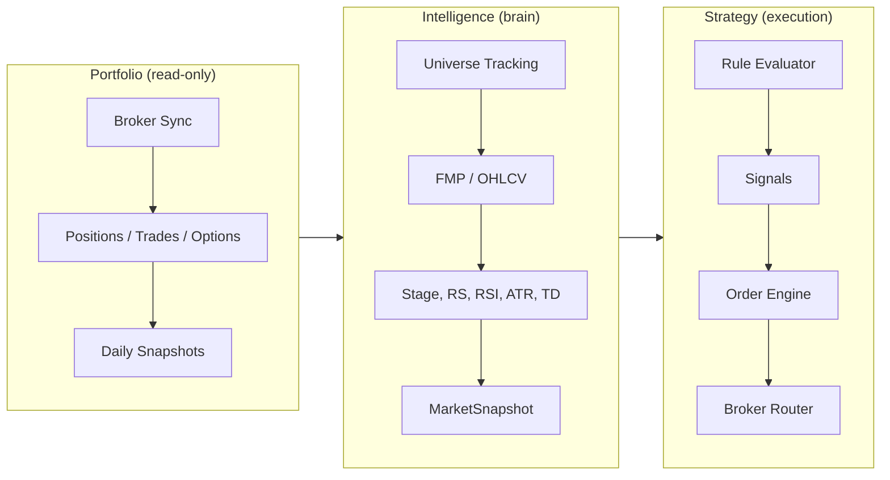
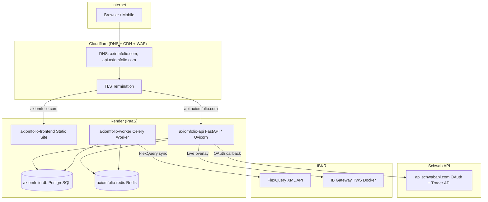
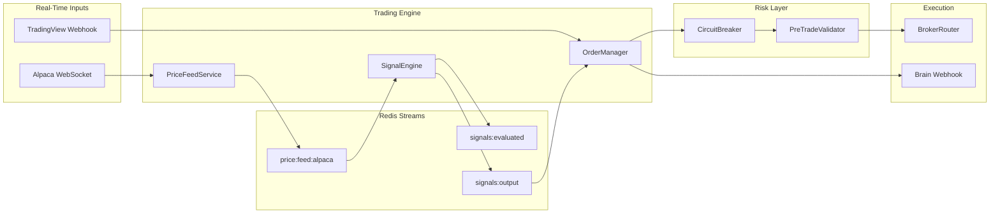

# Architecture Overview

## Table of contents

- [At a glance](#at-a-glance)
- [Three Pillars](#three-pillars)
- [System Overview](#system-overview)
- [Data Model Inventory](#data-model-inventory)
- [Backend Module Structure](#backend-module-structure)
- [Frontend Pages](#frontend-pages)
- [Data Pipelines](#data-pipelines)
- [RBAC](#rbac-role-based-access-control)
- [Auth & Security](#auth--security)
- [Scheduling](#scheduling)
- [Broker Data Strategy](#broker-data-strategy)
- [Production Infrastructure](#production-infrastructure)
- [Real-Time Trading Architecture](#real-time-trading-architecture)
- [Brain Integration](#brain-integration)
  - [AxiomFolio Agent vs Paperwork Brain](#axiomfolio-agent-vs-paperwork-brain)
- [Known Gaps](#known-gaps)

---

## At a glance

| Layer | Stack | Where to read more |
|-------|-------|--------------------|
| **Backend** | FastAPI, Celery, PostgreSQL, Redis | This doc; [PRODUCTION.md](PRODUCTION.md) for deploy |
| **Frontend** | React, Chakra v3, Vite, React Query, Recharts, TradingView | [FRONTEND_UI.md](FRONTEND_UI.md) |
| **Brokers** | IBKR (FlexQuery + Gateway), TastyTrade, Schwab | [CONNECTIONS.md](CONNECTIONS.md) (setup/OAuth); [BROKERS.md](BROKERS.md) (sync impl) |
| **Domain pillars** | Portfolio, Market data | [PORTFOLIO.md](PORTFOLIO.md), [MARKET_DATA.md](MARKET_DATA.md) |

---

## Three Pillars



- **Portfolio (read-only)**: Broker sync -> positions, trades, options, snapshots. Smart categories with drag-and-drop reordering. Frontend consumes via REST; IB Gateway provides live overlay.
- **Intelligence (brain)**: Market data pipeline -> indicators (Weinstein stage, RS Mansfield, TD Sequential, RSI, ATR, etc.) -> MarketSnapshot -> MarketSnapshotHistory (immutable daily ledger). Rule engine evaluates condition trees against snapshot + position context.
- **Strategy (execution)**: Strategy definition -> Rule evaluator -> signals -> Order engine -> Risk gate -> Broker router (paper or live) -> Reconciler.

## System Overview

- **Backend**: FastAPI, Celery workers for sync and market data jobs.
- **Data**: PostgreSQL (state), Redis (cache/queue).
- **Frontend**: React SPA (Chakra v3, React Query, Recharts, lightweight-charts v5, TradingView widget).
- **Brokers**: IBKR (FlexQuery XML + TWS Gateway), TastyTrade (SDK), Schwab (OAuth 2.0 + PKCE via `api.schwabapi.com`).

## Data Model Inventory

Row counts below are illustrative; run DB queries for current state.

| Table | Model | Rows | Notes |
|-------|-------|-----:|-------|
| `users` | `User` | 1 | Single-user for now |
| `broker_accounts` | `BrokerAccount` | 2 | IBKR + TastyTrade |
| `account_syncs` | `AccountSync` | 19 | Sync history records |
| `account_balances` | `AccountBalance` | 1 | Needs refresh after sync |
| `positions` | `Position` | 65 | Current open positions |
| `tax_lots` | `TaxLot` | 554 | Individual tax lots |
| `trades` | `Trade` | 189 | Historical executions |
| `transactions` | `Transaction` | 250 | Cash transactions (all TastyTrade) |
| `dividends` | `Dividend` | 0 | Awaiting IBKR sync |
| `transfers` | `Transfer` | 0 | Awaiting IBKR sync |
| `margin_interest` | `MarginInterest` | 1 | Single record |
| `options` | `Option` | 27 | Option positions |
| `instruments` | `Instrument` | 65 | Securities master |
| `categories` | `Category` | 15 | User-defined groupings |
| `position_categories` | `PositionCategory` | 240 | Position-to-category mapping |
| `portfolio_snapshots` | `PortfolioSnapshot` | 3 | Daily portfolio snapshots |
| `price_data` | `PriceData` | 36806 | OHLCV bars (~34 symbols, ~1255 bars each) |
| `market_snapshot` | `MarketSnapshot` | varies | Latest indicators per symbol; populated by the nightly coverage pipeline (and related jobs). Row counts change with universe size. |
| `market_snapshot_history` | `MarketSnapshotHistory` | varies | Immutable daily ledger; populated when the pipeline records history after indicator computation. |
| `cron_schedule` | `CronSchedule` | ~20 | Job schedules seeded from `job_catalog.py` (aligned with Celery Beat) |

## Backend Module Structure

### API Routes (`backend/api/routes/`)

| Prefix | File | Purpose |
|--------|------|---------|
| `/api/v1/auth` | `auth.py` | Login, register, me, Google/Apple OAuth |
| `/api/v1/accounts` | `account_management.py` | Add/sync/delete broker accounts |
| `/api/v1/portfolio` | `portfolio.py` | General portfolio endpoints |
| `/api/v1/portfolio/live` | `portfolio_live.py` | Live portfolio data |
| `/api/v1/portfolio/stocks` | `portfolio_stocks.py` | Stock positions |
| `/api/v1/portfolio/options` | `portfolio_options.py` | Options + IB Gateway |
| `/api/v1/portfolio/statements` | `portfolio_statements.py` | Statements |
| `/api/v1/portfolio/dividends` | `portfolio_dividends.py` | Dividends |
| `/api/v1/portfolio/dashboard` | `portfolio_dashboard.py` | Dashboard aggregations |
| `/api/v1/portfolio/categories` | `portfolio_categories.py` | Category CRUD + reorder |
| `/api/v1/portfolio` (activity) | `activity.py` | Activity feed (UNION ALL) |
| `/api/v1/market-data` | `market_data.py` | Market data + technicals + volatility dashboard |
| `/api/v1/market-data/regime` | `market/regime.py` | Current regime, history |
| `/api/v1/market-data/intelligence` | `market/intelligence.py` | Intelligence briefs |
| `/api/v1/strategies` | `strategies.py` | Strategy management |
| `/api/v1/risk` | `risk.py` | Circuit breaker status + reset |
| `/api/v1/tools/*` | `brain_tools.py` | Brain tool endpoints (API key auth) |
| `/api/v1/webhooks/tradingview` | `webhooks/tradingview.py` | TradingView alert webhook |
| `/api/v1/admin` | `admin.py` | Admin operations |
| `/api/v1/admin/agent` | `admin/agent.py` | Agent management |
| `/api/v1/admin/schedules` | `admin_scheduler.py` | Cron schedule CRUD |
| `/api/v1/aggregator` | `aggregator.py` | OAuth callbacks, aggregation |

### Services (`backend/services/`)

| Module | Purpose |
|--------|---------|
| `portfolio/ibkr_sync_service.py` | IBKR comprehensive sync (2092 lines - refactor target) |
| `portfolio/tastytrade_sync_service.py` | TastyTrade sync |
| `portfolio/schwab_sync_service.py` | Schwab sync (positions, transactions, options, balances) |
| `portfolio/broker_sync_service.py` | Broker-agnostic dispatcher |
| `portfolio/activity_aggregator.py` | Activity UNION ALL across tables |
| `portfolio/portfolio_analytics_service.py` | Portfolio analytics |
| `portfolio/account_credentials_service.py` | Encrypted credential management |
| `portfolio/tax_lot_service.py` | Tax lot computations |
| `portfolio/reconciliation.py` | Position reconciliation service |
| `portfolio/drawdown.py` | Drawdown tracking + alerts |
| `clients/ibkr_flexquery_client.py` | FlexQuery API + XML parsers (2040 lines - refactor target) |
| `clients/ibkr_client.py` | IB Gateway (ib_insync) client |
| `clients/tastytrade_client.py` | TastyTrade API client |
| `clients/schwab_client.py` | Schwab Trader API client (OAuth, token refresh with DB persist) |
| `market/indicator_engine.py` | Indicator computation (Stage, RS, RSI, etc.) |
| `market/coverage_service.py` | Coverage pipeline |
| `market/snapshot_service.py` | Snapshot persistence |
| `market/provider_service.py` | Multi-provider OHLCV fetch |
| `market/price_feed.py` | Alpaca WebSocket → Redis Streams |
| `market/multi_timeframe.py` | Multi-timeframe stage confirmation (1H/4H/1D/1W) |
| `market/regime_inputs.py` | VIX, breadth, NH-NL data feeds |
| `engine/signal_engine.py` | Real-time strategy evaluation via Redis Streams |
| `risk/circuit_breaker.py` | 3-tier daily loss limits |
| `risk/pre_trade_validator.py` | Position sizing + concentration checks |
| `execution/order_manager.py` | Single order path (preview → submit → fill) |
| `execution/approval_service.py` | Trade approval workflow for Tier 3 |
| `strategy/ai_strategy_builder.py` | LLM-powered strategy generation |
| `strategy/walk_forward.py` | Walk-forward validation with veto gates |
| `strategy/rule_evaluator.py` | Condition tree evaluation engine |
| `brain/webhook_client.py` | Notify Brain of trade events |
| `notifications/notification_service.py` | Unified in-app + Brain notifications |
| `security/credential_vault.py` | Fernet encryption vault |

### Celery Tasks (`backend/tasks/`)

| Task (Celery path) | Schedule | Purpose |
|------|----------|---------|
| `backend.tasks.account_sync.sync_account_task` | Manual/on-add | Sync single broker account |
| `backend.tasks.account_sync.sync_all_ibkr_accounts` | Planned daily | Sync all IBKR accounts |
| `backend.tasks.market.indicators.recompute_universe` | 03:35 UTC | Compute indicators for all tracked symbols |
| `backend.tasks.market.history.record_daily` | Part of coverage pipeline | Persist daily snapshot history |
| `backend.tasks.market.coverage.daily_bootstrap` | 01:00 UTC | Full coverage pipeline |
| `backend.tasks.market.coverage.health_check` | Hourly | Coverage health check |

## Frontend Pages

| Route | Component | Purpose |
|-------|-----------|---------|
| `/` | `MarketDashboard` | Market overview with indicators |
| `/market/tracked` | `MarketTracked` | Tracked symbol management |
| `/market/coverage` | `MarketCoverage` | Data coverage status |
| `/market/education` | `MarketEducation` | Indicator glossary + deep-dives |
| `/portfolio` | `PortfolioOverview` | Dashboard with P&L, allocation |
| `/portfolio/holdings` | `PortfolioHoldings` | Position list with market data |
| `/portfolio/options` | `PortfolioOptions` | Options + IB Gateway chain |
| `/portfolio/transactions` | `PortfolioTransactions` | Activity feed |
| `/portfolio/categories` | `PortfolioCategories` | Category management (dnd-kit) |
| `/portfolio/tax` | `PortfolioTaxCenter` | Tax lot analysis |
| `/portfolio/workspace` | `PortfolioWorkspace` | Charts workspace |
| `/strategies` | `Strategies` | Strategy list |
| `/settings/connections` | `SettingsConnections` | Broker + data connections |
| `/settings/admin/dashboard` | `AdminDashboard` | Admin operations |

## Data Pipelines

### Broker Sync Pipeline

```
Trigger (manual/cron)
  -> Celery sync_account_task
    -> BrokerSyncService.sync_account_async()
      -> IBKRSyncService / TastyTradeSyncService / SchwabSyncService
        -> FlexQuery XML fetch + parse (IBKR)
          -> positions, tax_lots, trades, transactions, dividends, transfers, balances, options
        -> db.commit() (single transaction)
    -> AccountSync record updated
```

### Market Data Pipeline

```
Coverage Pipeline (daily 01:00 UTC)
  1. Fetch OHLCV bars from provider (FMP -> TwelveData -> yfinance)
  2. Persist to price_data table
  3. Compute indicators (Stage, RS, RSI, ATR, TD Sequential, SMAs, MACD)
  4. Persist to market_snapshot (latest) + market_snapshot_history (daily ledger)
  5. Refresh coverage health
```

### Activity Aggregation

```
Activity endpoint (/activity)
  -> UNION ALL across: trades, transactions, dividends, transfers, margin_interest
  -> Sorted by date, paginated
  -> Category types: TRADE, DIVIDEND, PAYMENT_IN_LIEU, WITHHOLDING_TAX,
     COMMISSION, BROKER_INTEREST_PAID, BROKER_INTEREST_RECEIVED, DEPOSIT,
     OTHER_FEE, TAX_REFUND, INTEREST, TRANSFER, OTHER
```

## RBAC (Role-Based Access Control)

- JWT includes `sub` (username) and `role` claim.
- `/api/v1/auth/me` returns `{ id, username, email, role }`.
- Use `require_roles([UserRole.ADMIN])` to guard routes.
- Non-admins receive HTTP 403 on admin routes.

## Auth & Security

- JWT helpers in `backend/api/security.py`.
- All routes resolve current user via `backend/api/dependencies.py`.
- Admin seeding (dev-only): when `DEBUG=True` and `ADMIN_*` are set.
- Broker credentials: Fernet symmetric encryption via `CredentialVault`.

## Scheduling

- **Source of truth**: Celery Beat loads periodic tasks from `backend/tasks/job_catalog.py`. Rows in `cron_schedule` mirror that catalog for admin UI and history; the beat schedule is the runtime driver.
- **Render cron jobs**: Retired. They added cost (three extra Docker builds) without meaningful resilience beyond Beat + workers; all recurring work now runs on the Celery worker via Beat.
- **Catalog scope**: Twenty scheduled tasks across six areas: **portfolio**, **market_data**, **strategy**, **intelligence**, **maintenance**, and **auto-ops** (health remediation every 15 minutes; registered in the catalog alongside other maintenance entries).
- **`JobTemplate` fields** (each catalog row): `id`, `display_name`, `group`, Celery `task`, `default_cron`, `default_tz`, optional `job_run_label` (for `JobRun` history lookup), plus timeouts, queues, and payload defaults.
- **Admin UI**: Admin → Schedules for CRUD on stored schedules.
- **Agent**: Schedule inspection and ad-hoc dispatch use `list_schedules` and `run_task_now` in `backend/services/agent/tools.py`.

## Broker Data Strategy

Broker setup and OAuth: [CONNECTIONS.md](CONNECTIONS.md). Sync implementation: [BROKERS.md](BROKERS.md).

- **IBKR FlexQuery**: Trades, cash transactions, tax lots, balances, options, transfers. Requires "Last 365 Calendar Days" period configuration.
- **IBKR TWS/Gateway**: Live overlay for prices/positions/Greeks. Docker container (`ghcr.io/extrange/ibkr:stable`). Read-only.
- **TastyTrade SDK**: Positions, trades, transactions, dividends, balances via encrypted credentials.
- **Schwab**: OAuth client implemented (connect with credentials, token refresh with DB persistence, account hash resolution). Sync service mirrors TastyTrade pattern: positions, transactions, options, balances.

## Production Infrastructure

Operational details: [PRODUCTION.md](PRODUCTION.md).

### Architecture Diagram



### Render Service Map

| Service | Type | Hostname | Custom Domain |
|---------|------|----------|---------------|
| `axiomfolio-api` | Web (Docker) | `axiomfolio-api.onrender.com` | `api.axiomfolio.com` |
| `axiomfolio-worker` | Worker (Docker) | _(internal)_ | — |
| `axiomfolio-frontend` | Static Site | `axiomfolio-frontend.onrender.com` | `axiomfolio.com` |
| `axiomfolio-db` | PostgreSQL | _(internal)_ | — |
| `axiomfolio-redis` | Key-Value Store | _(internal)_ | — |

### Cloudflare Configuration

- **Nameservers**: `emely.ns.cloudflare.com`, `kayden.ns.cloudflare.com` (registered at Spaceship)
- **SSL Mode**: Full (strict)
- **Proxy**: All records proxied (orange cloud)
- **Tunnel**: Token-based tunnel available for routing `api.axiomfolio.com` to local dev machine

### Dev vs Production Environment

| Aspect | Development | Production |
|--------|-------------|------------|
| Frontend | `localhost:5173` (Vite dev server) | `axiomfolio.com` (Render static) |
| Backend | `localhost:8000` (Docker Compose) | `api.axiomfolio.com` (Render web) |
| Database | Local Docker PostgreSQL | Render managed PostgreSQL |
| Redis | Local Docker Redis | Render managed Redis |
| Worker | Local Docker Celery | Render worker service |
| IB Gateway | `make ib-up` (Docker, profile: ibkr) | Not deployed (local only) |
| Schwab OAuth | Cloudflare Tunnel → local backend | Cloudflare → Render → backend |
| TLS | Self-signed / HTTP | Cloudflare Full (strict) + Render cert |
| Docker Compose | `infra/compose.dev.yaml` | Render `render.yaml` |

## Real-Time Trading Architecture

### Event-Driven Flow



### Key Components

| Component | File | Purpose |
|-----------|------|---------|
| PriceFeedService | `backend/services/market/price_feed.py` | Alpaca WebSocket → Redis Streams |
| SignalEngine | `backend/services/engine/signal_engine.py` | Consumes prices, evaluates strategies, emits signals |
| CircuitBreaker | `backend/services/risk/circuit_breaker.py` | 3-tier daily loss limits (2%/3%/5%) |
| PreTradeValidator | `backend/services/risk/pre_trade_validator.py` | Position sizing, concentration checks |
| OrderManager | `backend/services/execution/order_manager.py` | Single order path, preview → submit → fill |
| BrainWebhookClient | `backend/services/brain/webhook_client.py` | Notifies Brain of trades, alerts, approvals |

### Circuit Breaker Tiers

| Tier | Loss % | Behavior |
|------|--------|----------|
| 1 | 2% | Warning, position caps at 50% |
| 2 | 3% | Limit orders only, position caps at 25% |
| 3 | 5% | Kill switch - all trading halted |

Resets at 4 AM ET (configurable via `trading_day_timezone`, `trading_day_reset_hour`).

---

## Brain Integration

AxiomFolio exposes itself as a tool provider for the Paperwork Brain orchestrator.

### Tool Endpoints

| Endpoint | Method | Tier | Description |
|----------|--------|------|-------------|
| `/api/v1/tools/portfolio` | GET | 0 | Portfolio summary |
| `/api/v1/tools/regime` | GET | 0 | Market regime R1-R5 |
| `/api/v1/tools/stage/{symbol}` | GET | 0 | Stage Analysis |
| `/api/v1/tools/scan` | GET | 0 | Run scans |
| `/api/v1/tools/risk` | GET | 0 | Circuit breaker status |
| `/api/v1/tools/preview-trade` | POST | 2 | Create PREVIEW order |
| `/api/v1/tools/execute-trade` | POST | 3 | Execute order |
| `/api/v1/tools/approve-trade` | POST | 3 | Approve pending |
| `/api/v1/tools/reject-trade` | POST | 3 | Reject pending |

Authentication: `X-Brain-Api-Key` header (compared via `secrets.compare_digest`).

### Webhook Events

AxiomFolio → Brain via POST to `{BRAIN_WEBHOOK_URL}/webhooks/axiomfolio`:

| Event | Trigger |
|-------|---------|
| `trade_executed` | Order filled |
| `position_closed` | Position fully closed |
| `stop_triggered` | Stop loss hit |
| `risk_gate_activated` | Circuit breaker tripped |
| `approval_required` | Tier 3 trade needs approval |

### User Roles

| Role | Permissions |
|------|-------------|
| `owner` | Full access, approve/execute trades |
| `analyst` | Read access, propose trades (needs approval) |
| `viewer` | Read-only |

### Approval Workflow

```
1. Brain calls POST /tools/preview-trade
2. If approval required → status = PENDING_APPROVAL
3. AxiomFolio webhooks Brain: approval_required
4. Brain posts to Slack with [Approve] [Reject]
5. User clicks → Brain calls approve-trade or reject-trade
6. Brain calls execute-trade → broker execution
7. AxiomFolio webhooks Brain: trade_executed
```

### AxiomFolio Agent vs Paperwork Brain

Two distinct "brains" exist in the ecosystem:

| | AxiomFolio AgentBrain | Paperwork Brain |
|---|---|---|
| Role | Domain intelligence — health remediation, interactive chat, market analysis | Orchestrator — routes user intent to the right product/skill |
| Location | `backend/services/agent/brain.py` | `paperwork/apis/brain/app/mcp_server.py` |
| Tools | 55 internal tools (DB queries, Celery dispatch, market analysis) | 9 AxiomFolio HTTP tools + tools from other products |
| Protocol | Direct Python method calls | HTTP API (`/api/v1/tools/*`) via MCP |
| Autonomy | Rule-based + LLM with risk taxonomy (SAFE/MODERATE/RISKY/CRITICAL) | User-driven with approval workflows |

The AgentBrain handles three responsibilities:

- **Health remediation** (`analyze_and_act`): Called by auto-ops every 15 min to assess system health and dispatch fixes
- **Interactive chat** (`chat`): Powers the Agent Chat panel in the admin dashboard
- **Tool execution**: 55 tools spanning market insight, schedule management, codebase exploration, and strategy research

Paperwork Brain consumes AxiomFolio as one of several "skills" via HTTP. The 9 exposed tools (`brain_tools.py`) are a curated subset: portfolio summary, regime status, scan results, and trading actions. See `docs/brain/axiomfolio_tools.yaml` for the manifest.

---

## Known Gaps

1. `dividends` table has 0 rows -- IBKR data ready but sync not yet triggered post-FlexQuery fix
2. `transfers` table has 0 rows -- same as above
3. TastyTrade sync stuck (`RUNNING`) due to encryption token mismatch
4. IBKR sync code needs refactor (2 x 2000+ line files with god functions)
5. Paper trading mode not yet implemented (planned Phase 9)
