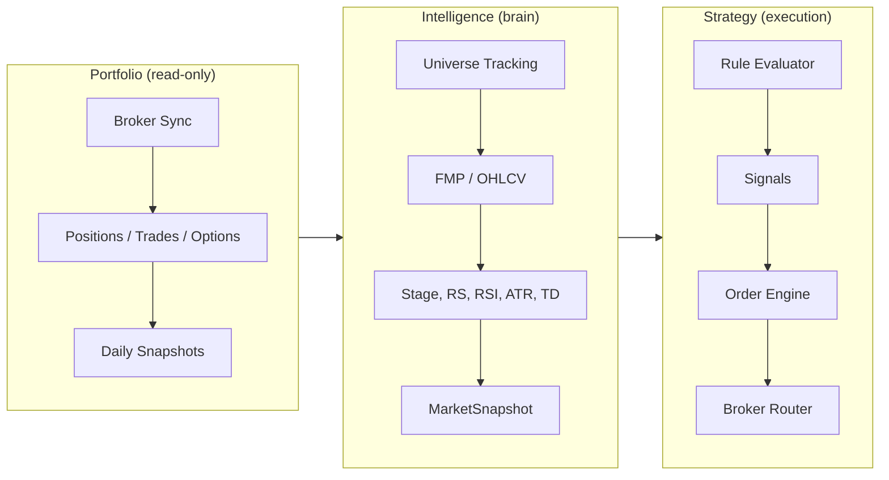
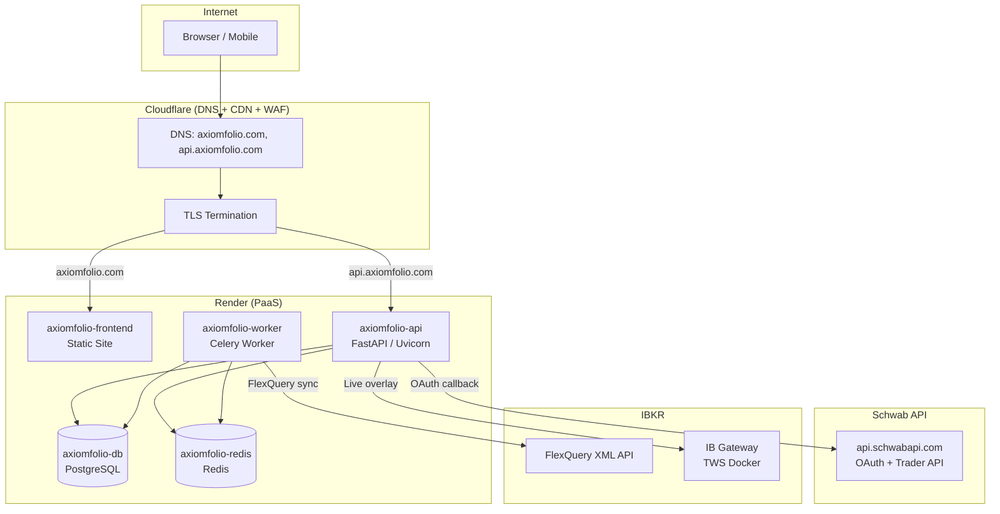

# Architecture Overview

## Three Pillars



- **Portfolio (read-only)**: Broker sync -> positions, trades, options, snapshots. Smart categories with drag-and-drop reordering. Frontend consumes via REST; IB Gateway provides live overlay.
- **Intelligence (brain)**: Market data pipeline -> indicators (Weinstein stage, RS Mansfield, TD Sequential, RSI, ATR, etc.) -> MarketSnapshot -> MarketSnapshotHistory (immutable daily ledger). Rule engine evaluates condition trees against snapshot + position context.
- **Strategy (execution)**: Strategy definition -> Rule evaluator -> signals -> Order engine -> Risk gate -> Broker router (paper or live) -> Reconciler.

## System Overview

- **Backend**: FastAPI, Celery workers for sync and market data jobs.
- **Data**: PostgreSQL (state), Redis (cache/queue).
- **Frontend**: React SPA (Chakra v3, React Query, Recharts, lightweight-charts v5, TradingView widget).
- **Brokers**: IBKR (FlexQuery XML + TWS Gateway), TastyTrade (SDK), Schwab (OAuth 2.0 + PKCE via `api.schwabapi.com`).

## Data Model Inventory

| Table | Model | Rows | Notes |
|-------|-------|-----:|-------|
| `users` | `User` | 1 | Single-user for now |
| `broker_accounts` | `BrokerAccount` | 2 | IBKR + TastyTrade |
| `account_syncs` | `AccountSync` | 19 | Sync history records |
| `account_balances` | `AccountBalance` | 1 | Needs refresh after sync |
| `positions` | `Position` | 65 | Current open positions |
| `tax_lots` | `TaxLot` | 554 | Individual tax lots |
| `trades` | `Trade` | 189 | Historical executions |
| `transactions` | `Transaction` | 250 | Cash transactions (all TastyTrade) |
| `dividends` | `Dividend` | 0 | Awaiting IBKR sync |
| `transfers` | `Transfer` | 0 | Awaiting IBKR sync |
| `margin_interest` | `MarginInterest` | 1 | Single record |
| `options` | `Option` | 27 | Option positions |
| `instruments` | `Instrument` | 65 | Securities master |
| `categories` | `Category` | 15 | User-defined groupings |
| `position_categories` | `PositionCategory` | 240 | Position-to-category mapping |
| `portfolio_snapshots` | `PortfolioSnapshot` | 3 | Daily portfolio snapshots |
| `price_data` | `PriceData` | 36806 | OHLCV bars (~34 symbols, ~1255 bars each) |
| `market_snapshot` | `MarketSnapshot` | 0 | **GAP**: Indicators never computed |
| `market_snapshot_history` | `MarketSnapshotHistory` | 0 | **GAP**: History never backfilled |
| `cron_schedule` | `CronSchedule` | 11 | Job schedules |

## Backend Module Structure

### API Routes (`backend/api/routes/`)

| Prefix | File | Purpose |
|--------|------|---------|
| `/api/v1/auth` | `auth.py` | Login, register, me |
| `/api/v1/accounts` | `account_management.py` | Add/sync/delete broker accounts |
| `/api/v1/portfolio` | `portfolio.py` | General portfolio endpoints |
| `/api/v1/portfolio/live` | `portfolio_live.py` | Live portfolio data |
| `/api/v1/portfolio/stocks` | `portfolio_stocks.py` | Stock positions |
| `/api/v1/portfolio/options` | `portfolio_options.py` | Options + IB Gateway |
| `/api/v1/portfolio/statements` | `portfolio_statements.py` | Statements |
| `/api/v1/portfolio/dividends` | `portfolio_dividends.py` | Dividends |
| `/api/v1/portfolio/dashboard` | `portfolio_dashboard.py` | Dashboard aggregations |
| `/api/v1/portfolio/categories` | `portfolio_categories.py` | Category CRUD + reorder |
| `/api/v1/portfolio` (activity) | `activity.py` | Activity feed (UNION ALL) |
| `/api/v1/market-data` | `market_data.py` | Market data + technicals + volatility dashboard |
| `/api/v1/strategies` | `strategies.py` | Strategy management |
| `/api/v1/admin` | `admin.py` | Admin operations |
| `/api/v1/admin/schedules` | `admin_scheduler.py` | Cron schedule CRUD |
| `/api/v1/aggregator` | `aggregator.py` | OAuth callbacks, aggregation |

### Services (`backend/services/`)

| Module | Purpose |
|--------|---------|
| `portfolio/ibkr_sync_service.py` | IBKR comprehensive sync (2092 lines - refactor target) |
| `portfolio/tastytrade_sync_service.py` | TastyTrade sync |
| `portfolio/schwab_sync_service.py` | Schwab sync (positions, transactions, options, balances) |
| `portfolio/broker_sync_service.py` | Broker-agnostic dispatcher |
| `portfolio/activity_aggregator.py` | Activity UNION ALL across tables |
| `portfolio/portfolio_analytics_service.py` | Portfolio analytics |
| `portfolio/account_credentials_service.py` | Encrypted credential management |
| `portfolio/tax_lot_service.py` | Tax lot computations |
| `clients/ibkr_flexquery_client.py` | FlexQuery API + XML parsers (2040 lines - refactor target) |
| `clients/ibkr_client.py` | IB Gateway (ib_insync) client |
| `clients/tastytrade_client.py` | TastyTrade API client |
| `clients/schwab_client.py` | Schwab Trader API client (OAuth, token refresh with DB persist) |
| `market/indicator_engine.py` | Indicator computation (Stage, RS, RSI, etc.) |
| `market/coverage_service.py` | Coverage pipeline |
| `market/snapshot_service.py` | Snapshot persistence |
| `market/provider_service.py` | Multi-provider OHLCV fetch |
| `security/credential_vault.py` | Fernet encryption vault |

### Celery Tasks (`backend/tasks/`)

| Task | Schedule | Purpose |
|------|----------|---------|
| `sync_account_task` | Manual/on-add | Sync single broker account |
| `sync_all_ibkr_accounts` | Planned daily | Sync all IBKR accounts |
| `recompute_indicators_universe` | 03:35 UTC | Compute indicators for all tracked symbols |
| `record_daily_history` | Part of coverage pipeline | Persist daily snapshot history |
| `bootstrap_daily_coverage_tracked` | 01:00 UTC | Full coverage pipeline |
| `monitor_coverage_health` | Hourly | Coverage health check |

## Frontend Pages

| Route | Component | Purpose |
|-------|-----------|---------|
| `/` | `MarketDashboard` | Market overview with indicators |
| `/market/tracked` | `MarketTracked` | Tracked symbol management |
| `/market/coverage` | `MarketCoverage` | Data coverage status |
| `/market/education` | `MarketEducation` | Indicator glossary + deep-dives |
| `/portfolio` | `PortfolioOverview` | Dashboard with P&L, allocation |
| `/portfolio/holdings` | `PortfolioHoldings` | Position list with market data |
| `/portfolio/options` | `PortfolioOptions` | Options + IB Gateway chain |
| `/portfolio/transactions` | `PortfolioTransactions` | Activity feed |
| `/portfolio/categories` | `PortfolioCategories` | Category management (dnd-kit) |
| `/portfolio/tax` | `PortfolioTaxCenter` | Tax lot analysis |
| `/portfolio/workspace` | `PortfolioWorkspace` | Charts workspace |
| `/strategies` | `Strategies` | Strategy list |
| `/settings/connections` | `SettingsConnections` | Broker + data connections |
| `/settings/admin/dashboard` | `AdminDashboard` | Admin operations |

## Data Pipelines

### Broker Sync Pipeline

```
Trigger (manual/cron)
  -> Celery sync_account_task
    -> BrokerSyncService.sync_account_async()
      -> IBKRSyncService / TastyTradeSyncService / SchwabSyncService
        -> FlexQuery XML fetch + parse (IBKR)
          -> positions, tax_lots, trades, transactions, dividends, transfers, balances, options
        -> db.commit() (single transaction)
    -> AccountSync record updated
```

### Market Data Pipeline

```
Coverage Pipeline (daily 01:00 UTC)
  1. Fetch OHLCV bars from provider (FMP -> TwelveData -> yfinance)
  2. Persist to price_data table
  3. Compute indicators (Stage, RS, RSI, ATR, TD Sequential, SMAs, MACD)
  4. Persist to market_snapshot (latest) + market_snapshot_history (daily ledger)
  5. Refresh coverage health
```

### Activity Aggregation

```
Activity endpoint (/activity)
  -> UNION ALL across: trades, transactions, dividends, transfers, margin_interest
  -> Sorted by date, paginated
  -> Category types: TRADE, DIVIDEND, PAYMENT_IN_LIEU, WITHHOLDING_TAX,
     COMMISSION, BROKER_INTEREST_PAID, BROKER_INTEREST_RECEIVED, DEPOSIT,
     OTHER_FEE, TAX_REFUND, INTEREST, TRANSFER, OTHER
```

## RBAC (Role-Based Access Control)

- JWT includes `sub` (username) and `role` claim.
- `/api/v1/auth/me` returns `{ id, username, email, role }`.
- Use `require_roles([UserRole.ADMIN])` to guard routes.
- Non-admins receive HTTP 403 on admin routes.

## Auth & Security

- JWT helpers in `backend/api/security.py`.
- All routes resolve current user via `backend/api/dependencies.py`.
- Admin seeding (dev-only): when `DEBUG=True` and `ADMIN_*` are set.
- Broker credentials: Fernet symmetric encryption via `CredentialVault`.

## Scheduling

- **Source of truth**: `cron_schedule` table, auto-seeded from `backend/tasks/job_catalog.py`.
- **Admin CRUD**: Admin -> Schedules page.
- **Render sync**: "Sync to Render" creates/updates/deletes Render Cron Jobs.
- **Execution**: Render Cron -> task HTTP trigger -> Celery -> worker.

## Broker Data Strategy

- **IBKR FlexQuery**: Trades, cash transactions, tax lots, balances, options, transfers. Requires "Last 365 Calendar Days" period configuration.
- **IBKR TWS/Gateway**: Live overlay for prices/positions/Greeks. Docker container (`ghcr.io/extrange/ibkr:stable`). Read-only.
- **TastyTrade SDK**: Positions, trades, transactions, dividends, balances via encrypted credentials.
- **Schwab**: OAuth client implemented (connect with credentials, token refresh with DB persistence, account hash resolution). Sync service mirrors TastyTrade pattern: positions, transactions, options, balances.

## Production Infrastructure

### Architecture Diagram



### Render Service Map

| Service | Type | Hostname | Custom Domain |
|---------|------|----------|---------------|
| `axiomfolio-api` | Web (Docker) | `axiomfolio-api.onrender.com` | `api.axiomfolio.com` |
| `axiomfolio-worker` | Worker (Docker) | _(internal)_ | — |
| `axiomfolio-frontend` | Static Site | `axiomfolio-frontend.onrender.com` | `axiomfolio.com` |
| `axiomfolio-db` | PostgreSQL | _(internal)_ | — |
| `axiomfolio-redis` | Key-Value Store | _(internal)_ | — |

### Cloudflare Configuration

- **Nameservers**: `emely.ns.cloudflare.com`, `kayden.ns.cloudflare.com` (registered at Spaceship)
- **SSL Mode**: Full (strict)
- **Proxy**: All records proxied (orange cloud)
- **Tunnel**: Token-based tunnel available for routing `api.axiomfolio.com` to local dev machine

### Dev vs Production Environment

| Aspect | Development | Production |
|--------|-------------|------------|
| Frontend | `localhost:5173` (Vite dev server) | `axiomfolio.com` (Render static) |
| Backend | `localhost:8000` (Docker Compose) | `api.axiomfolio.com` (Render web) |
| Database | Local Docker PostgreSQL | Render managed PostgreSQL |
| Redis | Local Docker Redis | Render managed Redis |
| Worker | Local Docker Celery | Render worker service |
| IB Gateway | `make ib-up` (Docker, profile: ibkr) | Not deployed (local only) |
| Schwab OAuth | Cloudflare Tunnel → local backend | Cloudflare → Render → backend |
| TLS | Self-signed / HTTP | Cloudflare Full (strict) + Render cert |
| Docker Compose | `infra/compose.dev.yaml` | Render `render.yaml` |

## Known Gaps

1. `dividends` table has 0 rows -- IBKR data ready but sync not yet triggered post-FlexQuery fix
2. `transfers` table has 0 rows -- same as above
3. TastyTrade sync stuck (`RUNNING`) due to encryption token mismatch
4. IBKR sync code needs refactor (2 x 2000+ line files with god functions)
