# Architecture Reference

**Last updated**: 2026-04-24

Visual guide to how products are built. Diagrams render on GitHub. For **live deploy vs. blueprint drift** (AxiomFolio repo pointer, `launchfree-api` presence, etc.), see [docs/infra/RENDER_INVENTORY.md](docs/infra/RENDER_INVENTORY.md).

## TL;DR

- **Shape**: One monorepo: [`apps/`](../apps) (Vercel), [`apis/`](../apis) (Render), shared [`packages/`](../packages). [Studio](../apps/studio) → [Brain](../apis/brain) (LLM, personas, tools); [filefree](../apis/filefree), [launchfree](../apis/launchfree), and [axiomfolio](../apis/axiomfolio) are the product backends. Postgres, Redis, and vendor keys per [INFRA.md](INFRA.md).
- **Constraint**: **Multi-tenant and product boundaries are explicit** — no cross-tenant or cross-product data access without the app-layer scopes in [BRAIN_ARCHITECTURE.md](BRAIN_ARCHITECTURE.md) and each product’s auth model; never bypass session/API-key checks.
- **In flight** (Q2 2026): [Docs streamline & frontmatter](DOCS_STREAMLINE_2026Q2.md) across `docs/`; AxiomFolio **Render services still point at the legacy `paperwork-labs/axiomfolio` repo** — repoint to the monorepo and sync [apis/axiomfolio/render.yaml](https://github.com/paperwork-labs/paperwork/blob/main/apis/axiomfolio/render.yaml) per [docs/infra/RENDER_INVENTORY.md](docs/infra/RENDER_INVENTORY.md#f-1--four-axiomfolio--services-still-point-to-the-old-standalone-repo-).

## Production system map (Vercel, Render, data)

**Request path (scannable):** [Studio `apps/studio`](../apps/studio) (UI) → [Brain `apis/brain`](../apis/brain) (orchestration, [personas](../apis/brain/app/personas)) → product APIs; Studio also **health-probes** FileFree/LaunchFree endpoints from [command-center.ts](../apps/studio/src/lib/command-center.ts). Product UIs call their own APIs directly. **Do not** assume a separate `apis/studio` service — it does not exist in this repo.

```
  ┌──────────────┐     ┌─────────────────┐     Personas: apis/brain/app/personas/
  │ Studio (UI)  │───▶│  Brain API      │     (routing + .mdc specs)
  │ Vercel :3004 │     │  Render/8003*   │            │
  └──────┬───────┘     └────────┬────────┘            ▼
         │                    │            ┌────────────────┐
         │ health / admin       ├───────────▶│ AxiomFolio API│──▶ Neon + Redis
         ├─▶ filefree/launchfree│            │ apis/axiomfolio│    (dedicated
         ▼   APIs (Render)     │            └────────────────┘     Render DB)
  ┌────────────┐  ┌───────────┴──────────┐
  │FileFree API│  │LaunchFree API        │
  │ :8001      │  │ :8002                 │
  └─────┬──────┘  └──────────┬──────────┘
        │                    │
        └────────┬───────────┘
                 ▼
        Neon, Upstash, GCS, Vision, OpenAI, Gemini, Stripe, …
        (* host port from [infra/compose.dev.yaml](../infra/compose.dev.yaml) — see Local dev)
```

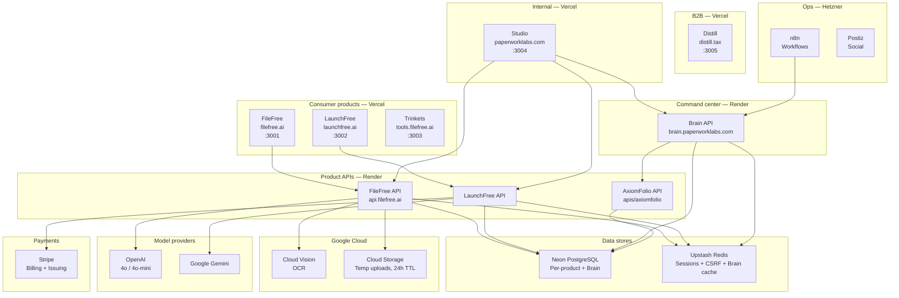

[apps/distill](../apps/distill) is a **stub B2B UI** (no API calls in tree yet); the historical pattern “Distill B2B shares FileFree’s backend” is a product intent, not a verified wire in the current `apps/distill` code.

### Where production runs

| Layer | Code / docs | Where it runs |
|-------|---------------|---------------|
| **Frontends** | [apps/filefree](../apps/filefree), [apps/launchfree](../apps/launchfree), [apps/trinkets](../apps/trinkets), [apps/studio](../apps/studio), [apps/distill](../apps/distill), [apps/axiomfolio](../apps/axiomfolio) | Vercel (per app) |
| **FileFree API** | [apis/filefree](../apis/filefree) | Render → api.filefree.ai (consumer; B2B direction shares this API) |
| **LaunchFree API** | [apis/launchfree](../apis/launchfree) | Render (see note below) |
| **Brain API** (Studio command center, LLM, personas) | [apis/brain](../apis/brain) | Render → `https://brain.paperworklabs.com` ([`render.yaml`](../render.yaml)) |
| **AxiomFolio** | [apis/axiomfolio](../apis/axiomfolio) | Render ([`apis/axiomfolio/render.yaml`](../apis/axiomfolio/render.yaml)) |
| **Data & cache** | [INFRA.md](INFRA.md) | Neon, Upstash, per-Blueprint Redis/Postgres on Render |
| **Vendors** | wired per service | GCS, Cloud Vision, Stripe, OpenAI, Gemini, Anthropic, … |
| **Ops automation** | [infra/hetzner](../infra/hetzner) | Hetzner: n8n, Postiz, … |

<!-- STALE 2026-04-24: LaunchFree — [RENDER_INVENTORY F-2](docs/infra/RENDER_INVENTORY.md#f-2--launchfree-api-is-defined-in-renderyaml-but-not-deployed): `launchfree-api` in root `render.yaml` may be absent in live Render. Studio’s default health URL is `https://launchfree-api.onrender.com` in [command-center.ts](../apps/studio/src/lib/command-center.ts). -->

<!-- STALE 2026-04-24: AxiomFolio on Render — [RENDER_INVENTORY F-1](docs/infra/RENDER_INVENTORY.md#f-1--four-axiomfolio--services-still-point-to-the-old-standalone-repo-): live `axiomfolio-*` services may still use repo `paperwork-labs/axiomfolio` until repointed; monorepo `apis/axiomfolio/` is the current source tree. -->

---

## Monorepo layout (repo root)

The Git root is the monorepo (there is no `venture/` directory — that name appears only in older docs). High-level:

```
  apps/           # Next.js (and product UIs) — e.g. filefree, launchfree, studio, trinkets, distill, axiomfolio
  apis/           # FastAPI: filefree, launchfree, brain, axiomfolio  (no apis/studio)
  packages/       # shared libraries (ui, data, tax-engine, …)
  infra/          # [compose.dev.yaml](../infra/compose.dev.yaml) — single dev stack; see [INFRA.md](INFRA.md)
  docs/           # this tree
  render.yaml     # root Render Blueprint (brain-api, filefree-api, launchfree-api, …)
```

Layout matches [INFRA.md](INFRA.md) (single `docker compose -f infra/compose.dev.yaml` dev stack, per-app DBs on one Postgres). Product listing: [pnpm-workspace.yaml](../pnpm-workspace.yaml).

---

## Shared packages: one engine, many surfaces

Consumer and B2B surfaces pull from the same [`packages/`](../packages) libraries (tax engine, filing engine, `document-processing`, shared `data`, UI, auth), so one implementation funds multiple product routes.

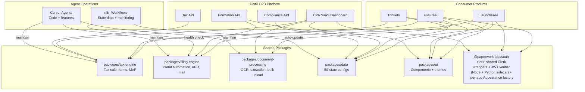

---

## Per-product identity (optional venture link)

Each product owns its own user table in its own database. A venture layer can add SSO and cross-product intelligence; it must remain **optional** so products stay separable.

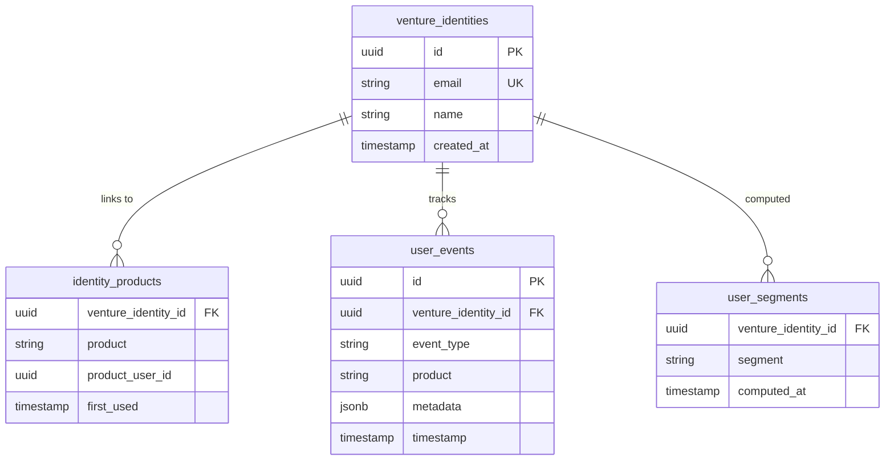

**Product databases** (independent, can be separated):

```
filefree DB:
  users: id, email, name, password_hash, ...filefree-specific...
         venture_identity_id (OPTIONAL, nullable FK)

launchfree DB:
  users: id, email, name, password_hash, ...launchfree-specific...
         venture_identity_id (OPTIONAL, nullable FK)
```

If FileFree is acquired: remove the `venture_identity_id` column. FileFree still works independently.

---

## Auth patterns (session cookies vs B2B API key)

### Consumer (FileFree, LaunchFree) — cookie session + CSRF

Implemented in [apis/filefree](../apis/filefree) / [apis/launchfree](../apis/launchfree) (see routers under `app/routers/`).

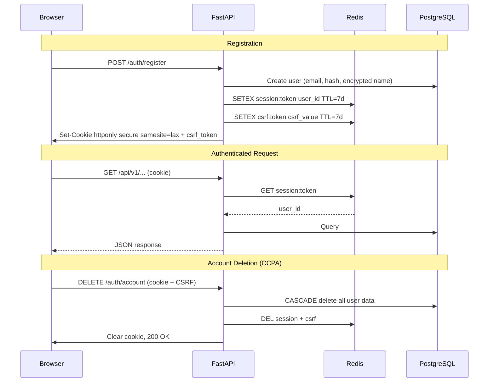

### B2B (Distill) — API key, firm-scoped

<!-- STALE 2026-04-24: The sequence below is the **intended** Distill B2B pattern. Grep did not find `/api/v1/pro/` in [apis/filefree](../apis/filefree) — re-verify before copying paths into runbooks. -->

Target: tenant-isolated, API-key access to the same document/tax **capabilities** as FileFree (as productized B2B routes on the FileFree or follow-on API surface).

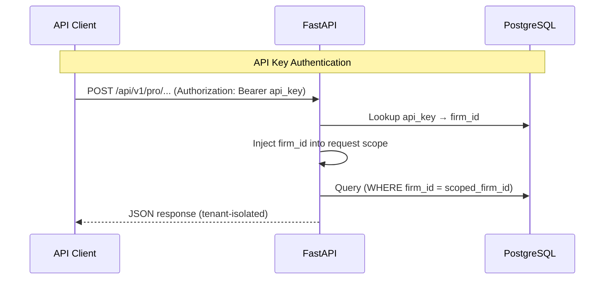

---

## Document OCR and extraction (FileFree + Distill)

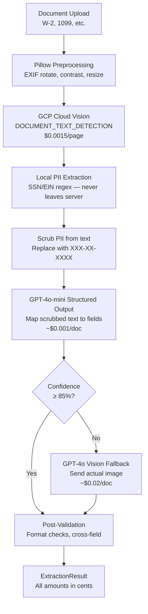

| Tier | When Used | Cost/doc | % of Requests |
|------|-----------|----------|---------------|
| Tier 1 | Cloud Vision + GPT-4o-mini | ~$0.002 | ~90% |
| Tier 2 | GPT-4o vision fallback | ~$0.02 | ~10% |
| **Blended** | | **~$0.005** | |

---

## State Filing Engine (LaunchFree + Distill formation API)

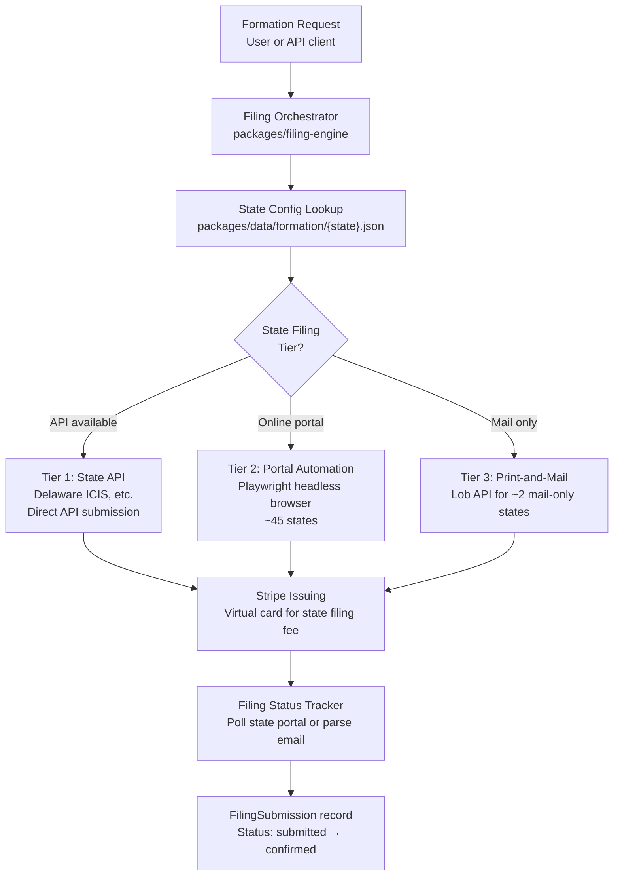

### Tier Breakdown

| Tier | Method | States | Marginal Cost | Example |
|------|--------|--------|---------------|---------|
| 1 | State API | ~3-5 (Delaware ICIS, etc.) | ~$0 + filing fee | Delaware |
| 2 | Playwright automation | ~45 | ~$0.25 compute + filing fee | California, Texas, New York |
| 3 | Print-and-mail (Lob) | ~2 | ~$1.50 postage + filing fee | Maine |

**Dual-use**: Same engine serves LaunchFree (consumer, $0 service fee) and Distill Formation API (B2B, $20-40/filing).

---

## Data models (by product)

### FileFree (Tax)

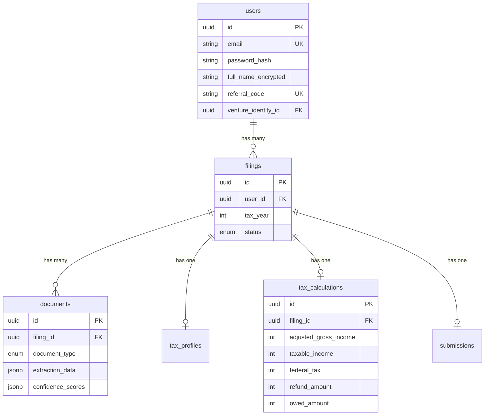

### LaunchFree (Formation)

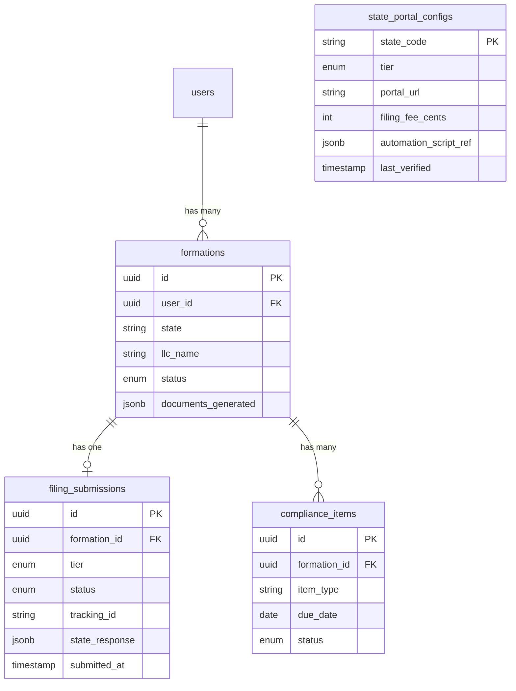

### Distill (B2B)

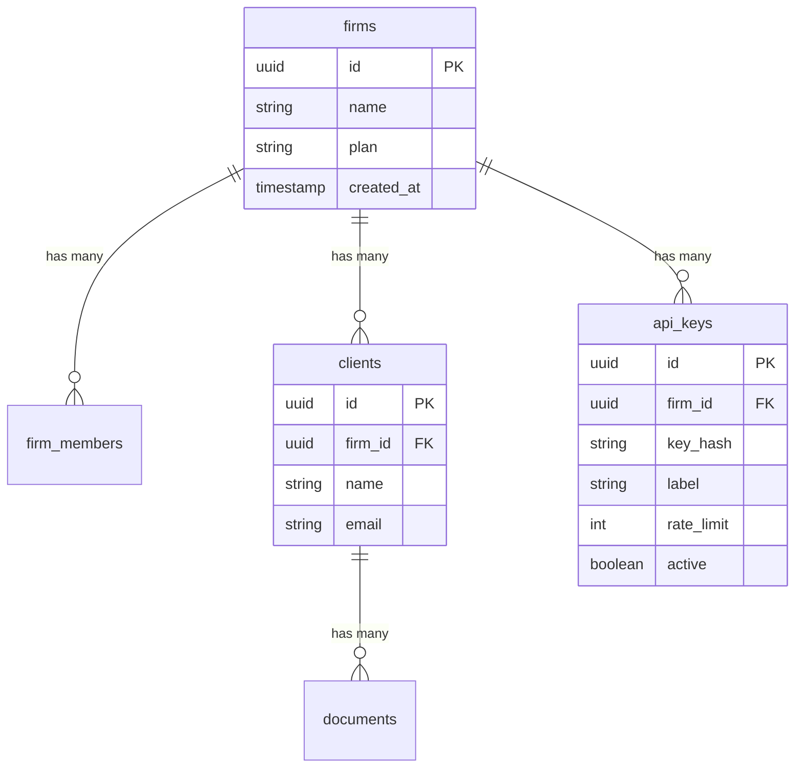

---

## Ops agents (Cursor, n8n)

**Cursor** for repo work; **n8n** on Hetzner for schedules and webhooks. The **LLM + agent loop** for the command center is in [apis/brain](https://github.com/paperwork-labs/paperwork/tree/main/apis/brain) ([`render.yaml`](../render.yaml) `brain-api`); n8n is a channel adapter, not the primary “brain” (see [BRAIN_ARCHITECTURE.md](BRAIN_ARCHITECTURE.md) D1–D2).

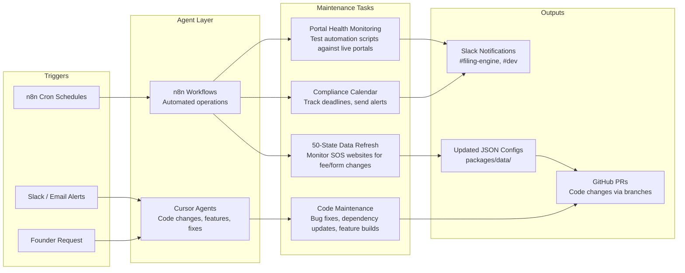

### Agent Maintenance Cadence

| Task | Frequency | Agent | Output |
|------|-----------|-------|--------|
| State fee/form change detection | Weekly | n8n + Gemini | Updated `packages/data/formation/*.json` |
| Portal automation health check | Daily | n8n + Playwright | Slack alert if script fails |
| Filing Engine status check | Hourly | n8n | Slack alert for stuck/failed submissions |
| Tax bracket updates | Annually (October) | Cursor agent | Updated `packages/data/tax/*.json` |
| Dependency updates | Monthly | Cursor agent | PR with updated packages |
| Compliance deadline alerts | Daily | n8n | Slack + email to affected users |

<!-- STALE 2026-04-24: Agent cadence (models per row) — re-verify “n8n + Gemini” for state/fee detection against the workflows checked into [infra/hetzner](../infra/hetzner) and n8n. -->

---

## Local development ([`infra/compose.dev.yaml`](../infra/compose.dev.yaml))

Host port map and service names match [INFRA.md](INFRA.md) (`postgres` **5433**, `redis` **6380** on the host — not 5432/6379).

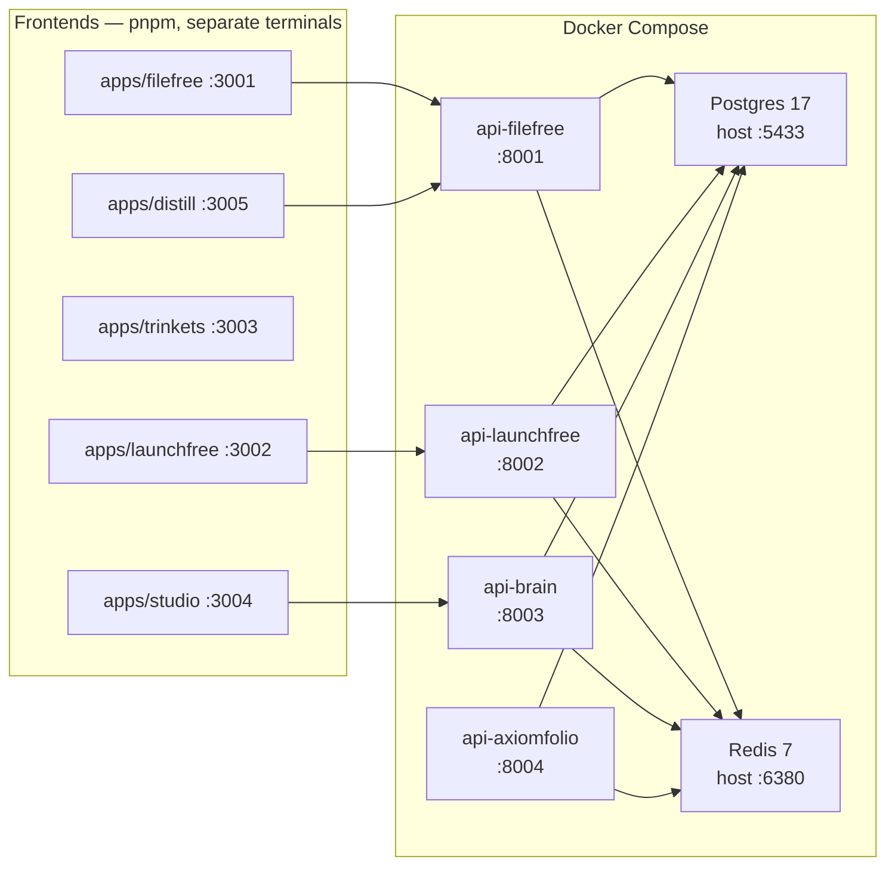

### Port map (see [INFRA.md](INFRA.md) for full table)

| Service | Host port |
|---------|-----------|
| apps/filefree | 3001 |
| apps/launchfree | 3002 |
| apps/trinkets | 3003 |
| apps/studio | 3004 |
| apps/distill | 3005 |
| apis/filefree | 8001 |
| apis/launchfree | 8002 |
| apis/brain | 8003 |
| apis/axiomfolio | 8004 |
| postgres | 5433 |
| redis | 6380 |

### Quick Reference

```bash
make dev          # Start Docker services + all apps
make dev-d        # Start Docker services (background)
make stop         # Stop all services
make test         # Run all tests
make lint         # Run all linters
make format       # Auto-fix formatting
make migrate      # Run Alembic migrations (all APIs)
```

---

## Degradation behavior and PII

### Circuit Breakers

| External Service | Degradation Behavior |
|-----------------|---------------------|
| GCP Cloud Vision | Return "manual entry required" — user types fields |
| OpenAI GPT | Skip AI insights, show static tips. OCR falls back to manual. |
| Stripe | Queue payment, retry with exponential backoff |
| State Portal (Filing Engine) | Queue submission, alert via Slack, manual fallback |
| Neon PostgreSQL | App returns 503, retry after 30s |
| Upstash Redis | Fall back to stateless JWT (no session revocation) |

### PII Encryption

All personally identifiable fields (`full_name`, `ssn`, `ein`, `address`, `date_of_birth`) are encrypted at rest using AES-256 (Fernet) with a key separate from database encryption. PII is never stored in plaintext. PII is never logged.

---

## Related docs

- [INFRA.md](INFRA.md) — single dev compose, ports, and per-app databases.
- [BRAIN_ARCHITECTURE.md](BRAIN_ARCHITECTURE.md) — Brain API, memory, personas, and agent loop.
- [philosophy/INFRA_PHILOSOPHY.md](philosophy/INFRA_PHILOSOPHY.md) — why infra is split the way it is.
- [philosophy/BRAIN_PHILOSOPHY.md](philosophy/BRAIN_PHILOSOPHY.md) — product philosophy for the Brain.
- [axiomfolio/ARCHITECTURE.md](axiomfolio/ARCHITECTURE.md) — AxiomFolio (portfolio / trading data plane).
  
There is no `MEDALLION_ARCHITECTURE.md` at the repo root; medallion details live under [docs/axiomfolio/](axiomfolio/) and related data docs.
