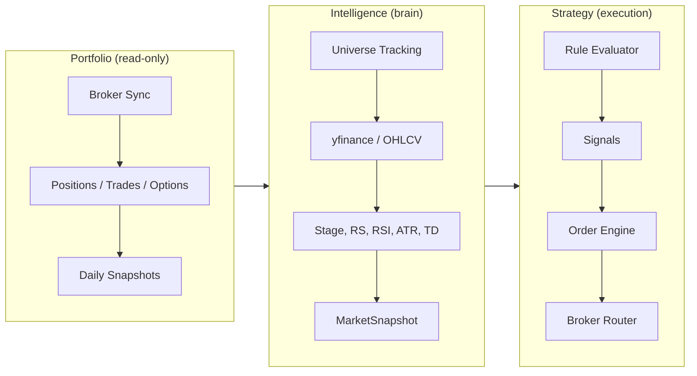

# Architecture Overview

## Three Pillars

- **Portfolio (read-only)**: Broker sync → positions, trades, options, snapshots. Smart categories (planned) with rules and allocation drift. Frontend consumes via REST; no live broker connection for read views.
- **Intelligence (brain)**: Market data pipeline → indicators (Weinstein stage, RS Mansfield, TD Sequential, RSI, ATR, etc.) → MarketSnapshot. Rule engine evaluates condition trees against MarketSnapshot + position context to produce signals.
- **Strategy (execution)**: Strategy definition → Rule evaluator → signals → Order engine → Risk gate → Broker router (paper or live) → Reconciler. Order model tracks idempotency and status lifecycle.

## System Overview

- **Backend**: FastAPI service exposing REST endpoints; Celery workers for sync and market data jobs.
- **Data**: PostgreSQL (state), Redis (cache/queue).
- **Frontend**: React SPA (Chakra v3, React Query, Recharts, TradingView widget).
- **Brokers**: IBKR (FlexQuery + TWS), TastyTrade (SDK).

## RBAC (Role-Based Access Control)

- JWT includes `sub` (username) and `role` claim.
- `/api/v1/auth/me` returns `{ id, username, email, role }`.
- Use `require_roles([UserRole.ADMIN])` to guard routes. Admin router is mounted at `/api/v1/admin`.
- Non-admins receive HTTP 403 on admin routes.

## Auth & Security

- JWT helpers in `backend/api/security.py`: `create_access_token`, `decode_token`, `JWT_ALGORITHM = "HS256"`.
- All routes resolve the current user via `backend/api/dependencies.py` (`get_current_user`, `get_optional_user`, `require_roles`).
- Admin seeding (dev-only): when `DEBUG=True` and `ADMIN_*` are set, an admin user is auto-seeded. Configure via `.env`: `ADMIN_USERNAME`, `ADMIN_EMAIL`, `ADMIN_PASSWORD`, `DEBUG`.

## Sync Lifecycle

1. **Broker account add**: POST /accounts/add → backend enqueues Celery `sync_account_task`; response includes `sync_task_id` for polling.
2. **Auto-sync**: Positions, trades, tax lots, transactions, dividends, options, account balances, and portfolio snapshots are populated by sync tasks.
3. **Daily snapshot**: Scheduled tasks persist portfolio and market snapshots for history.
4. **Frontend**: POST /accounts/sync-all returns `{ status: "queued", task_ids }`; frontend can trigger sync on login when accounts are NEVER_SYNCED.

## Market Data Pipeline

1. **Universe tracking**: Tracked symbols drive which symbols get OHLCV and indicators.
2. **Fetch**: Provider-prioritized (FMP → TwelveData → yfinance), Redis caching, backfills.
3. **Indicator calculation**: Stage, RS Mansfield, RSI, ATR, TD Sequential, SMAs/EMAs, MACD — computed locally (pandas/numpy).
4. **MarketSnapshot**: Latest per-symbol snapshot stored; consumed by Market Dashboard and portfolio enrichment.

## Market–Portfolio Bridge

- `GET /portfolio/stocks?include_market_data=true` LEFT JOINs latest `MarketSnapshot` per symbol.
- Positions are enriched with `stage_label`, `rs_mansfield_pct`, `perf_1d`/`perf_5d`/`perf_20d`, `rsi`, `atr_14`.
- Portfolio symbols are part of the tracked universe; no separate sync.

## Strategy Engine (planned)

- **Rule evaluator**: Walks JSON condition trees (entry_rules, exit_rules, trim_rules) against MarketSnapshot + Position; returns list of signals.
- **Signal types**: ENTRY, EXIT, SCALE_OUT, STOP_LOSS, ALERT, TRIM, REBALANCE, ROTATE.
- **Strategy status**: DRAFT → BACKTESTING → PAPER_TRADING → ACTIVE. No strategy goes live without paper trading first.

## Category Engine (planned)

- **CategoryRule** model: rule_type, operator, field, value (JSON), priority. Presets: market cap, sector, Weinstein stage, account type.
- **CategoryEngine**: auto_categorize(), compute_drift(), generate_rebalance_orders(). Hooked into post-sync when user has rules.

## Scheduling

- **Source of truth**: `cron_schedule` table in PostgreSQL; auto-seeded from `backend/tasks/job_catalog.py`.
- **Admin CRUD**: Admin → Schedules for create/read/update/delete, cron editing, pause/resume, audit trail.
- **Render sync**: "Sync to Render" creates/updates/deletes Render Cron Jobs to match DB state.
- **Execution**: Render Cron → task HTTP trigger → Celery → worker; JobRun rows and Redis last-run; failures surface in Admin Dashboard.

## Frontend Architecture

- **Stack**: React, Chakra v3 (single `system` in `theme/system.ts`), React Query, Recharts, TradingView widget.
- **Portfolio**: Shared components (StatCard, StageBar, StageBadge, PnlText, Skeleton), AccountFilterWrapper, SortableTable; AccountContext for global account selection; hooks in `usePortfolio.ts`.
- **Market**: SymbolLink + ChartSlidePanel + ChartContext for hover sparkline and click-to-chart without leaving the page.

## Broker Data Strategy

- **IBKR FlexQuery**: Trades, cash transactions, tax lots, balances, options. Celery `sync_all_ibkr_accounts`; configure `IBKR_FLEX_LOOKBACK_YEARS`.
- **IBKR TWS/Gateway**: Live overlay for prices/positions only; do not overwrite cost basis.
- **TastyTrade SDK**: Discovery, positions, trades, transactions, dividends, balances via credentials; no hardcoded account numbers.

## Security

- Env-only secrets; JWT for user auth; scoped tokens for production.
