# Paperwork Labs — Architecture Reference

**Last updated**: 2026-03-16

Visual-first guide to how Paperwork Labs products are built. Diagrams render natively on GitHub.

---

## System Overview

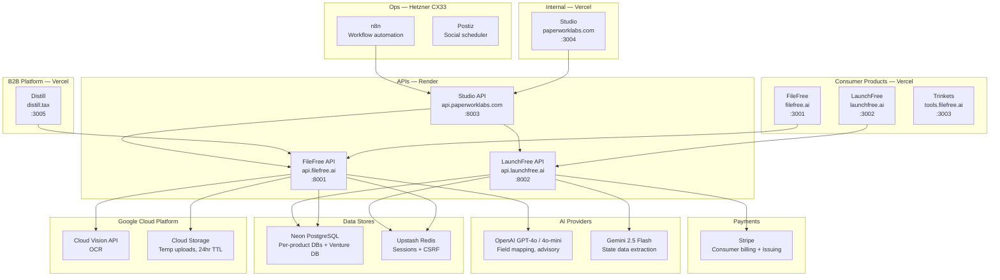

### Production Infrastructure

| Service | Provider | Cost | Domain |
|---------|----------|------|--------|
| Frontend (5 apps) | Vercel | Hobby → $20/mo Pro | filefree.ai, launchfree.ai, distill.tax, paperworklabs.com, tools.filefree.ai |
| Backend (FileFree + Distill) | Render | $7/mo Starter | api.filefree.ai |
| Backend (LaunchFree) | Render | $7/mo Starter | api.launchfree.ai |
| Backend (Studio) | Render | $7/mo Starter | api.paperworklabs.com |
| Portal Automation Worker | Render | $7/mo | — (Playwright headless) |
| Database | Neon | Free tier (0.5 GB) | — |
| Sessions | Upstash | Free tier (500K cmd/mo) | — |
| File Storage | GCP Cloud Storage | Pay-per-use | — |
| OCR | GCP Cloud Vision | 1K free/mo, $0.0015/page | — |
| AI | OpenAI + Gemini | Pay-per-use | — |
| Payments | Stripe | Standard + Issuing | — |
| Ops VPS | Hetzner CX33 | $6/mo | n8n.paperworklabs.com |

---

## Monorepo Structure

```
venture/
  apps/
    filefree/               # filefree.ai — Next.js, consumer tax filing
    launchfree/             # launchfree.ai — Next.js, LLC formation
    distill/                # distill.tax — Next.js, B2B compliance SaaS
    studio/                 # paperworklabs.com — Next.js, command center
    trinkets/               # tools.filefree.ai — Next.js SSG, utility tools
  packages/
    ui/                     # shadcn components + 4 brand themes
    auth/                   # shared auth hooks, middleware, session
    analytics/              # PostHog + attribution + PII scrubbing
    data/                   # 50-state configs (formation + tax + compliance)
      formation/{state}.json
      tax/{year}.json
      compliance/{state}.json
    tax-engine/             # tax calculation, form generators, MeF XML
    document-processing/    # OCR pipeline, field extraction, bulk upload
    filing-engine/          # State Filing Engine (portal automation, APIs, mail)
    intelligence/           # financial profiles, recommendations, campaigns
    email/                  # shared email templates (React Email)
  apis/
    filefree/               # FastAPI — consumer tax + Distill B2B routes
    launchfree/             # FastAPI — formation service
    studio/                 # FastAPI — command center aggregator
  infra/
    compose.dev.yaml        # Docker Compose (local dev)
    hetzner/                # n8n + Postiz ops stack
    render.yaml             # Render Blueprints IaC
  docs/                     # All documentation
```

---

## Shared Infrastructure Layer

The core architectural insight: consumer products and B2B APIs consume the same shared packages. Building LaunchFree's Filing Engine simultaneously creates Distill's Formation API. Building FileFree's tax engine simultaneously creates Distill's Tax API.

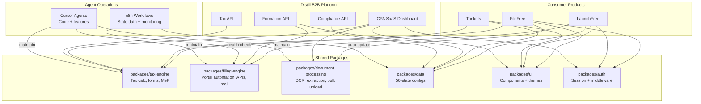

---

## Federated Identity

Each product owns its own user table in its own database. The venture layer adds SSO and cross-product intelligence on top but is fully removable without breaking any product.

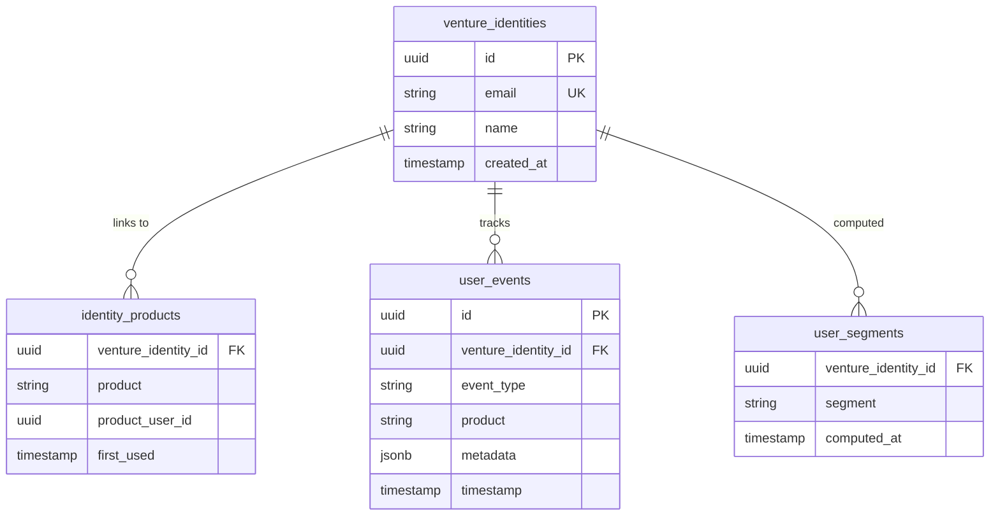

**Product databases** (independent, can be separated):

```
filefree DB:
  users: id, email, name, password_hash, ...filefree-specific...
         venture_identity_id (OPTIONAL, nullable FK)

launchfree DB:
  users: id, email, name, password_hash, ...launchfree-specific...
         venture_identity_id (OPTIONAL, nullable FK)
```

If FileFree is acquired: remove the `venture_identity_id` column. FileFree still works independently.

---

## Authentication

### Consumer Auth (FileFree, LaunchFree)

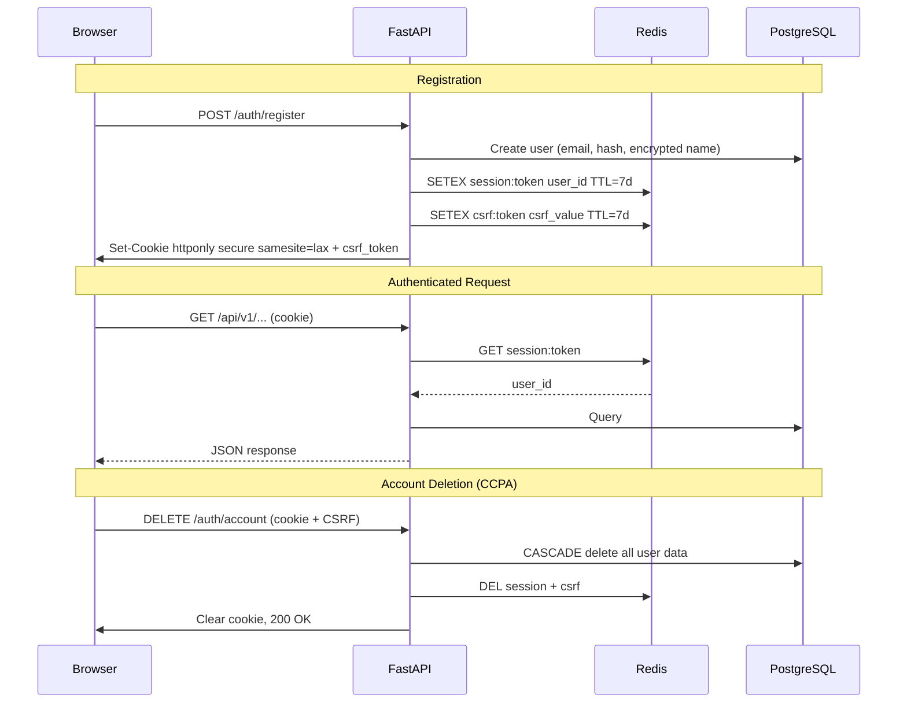

### B2B Auth (Distill)

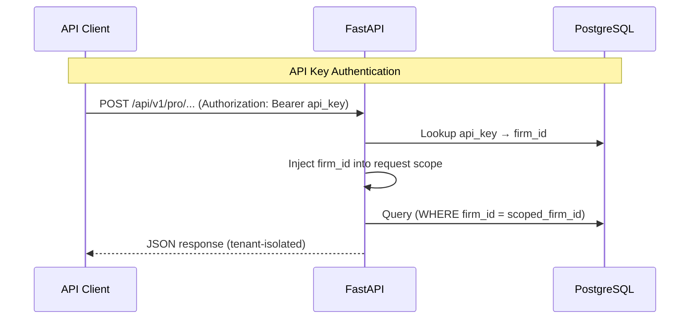

---

## OCR Pipeline (FileFree + Distill)

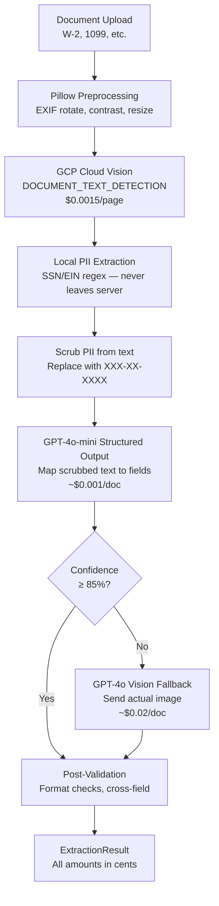

| Tier | When Used | Cost/doc | % of Requests |
|------|-----------|----------|---------------|
| Tier 1 | Cloud Vision + GPT-4o-mini | ~$0.002 | ~90% |
| Tier 2 | GPT-4o vision fallback | ~$0.02 | ~10% |
| **Blended** | | **~$0.005** | |

---

## State Filing Engine (LaunchFree + Distill Formation API)

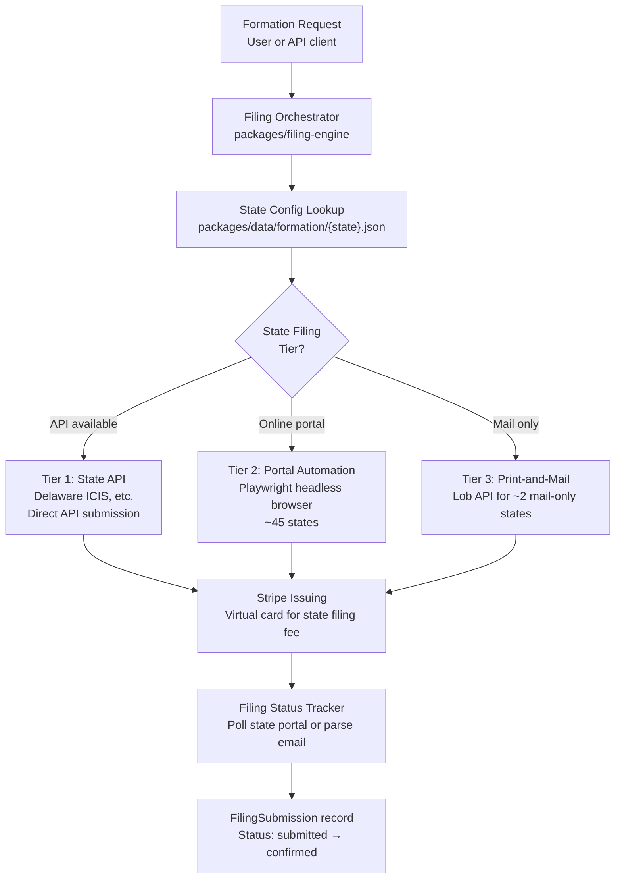

### Tier Breakdown

| Tier | Method | States | Marginal Cost | Example |
|------|--------|--------|---------------|---------|
| 1 | State API | ~3-5 (Delaware ICIS, etc.) | ~$0 + filing fee | Delaware |
| 2 | Playwright automation | ~45 | ~$0.25 compute + filing fee | California, Texas, New York |
| 3 | Print-and-mail (Lob) | ~2 | ~$1.50 postage + filing fee | Maine |

**Dual-use**: Same engine serves LaunchFree (consumer, $0 service fee) and Distill Formation API (B2B, $20-40/filing).

---

## Data Models

### FileFree (Tax)

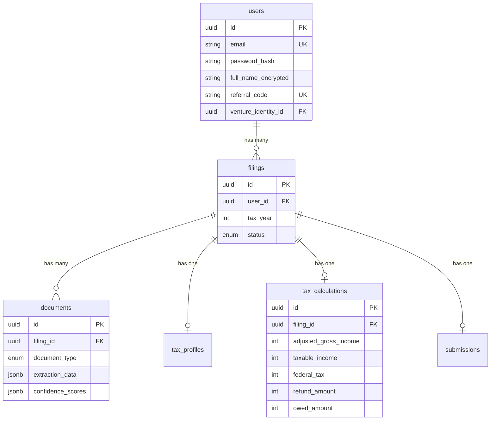

### LaunchFree (Formation)

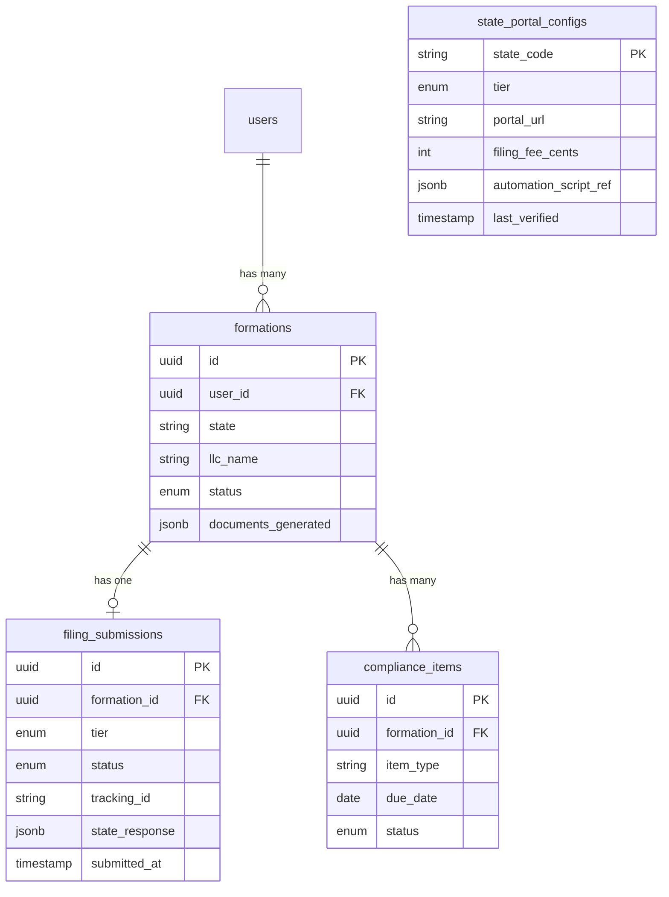

### Distill (B2B)

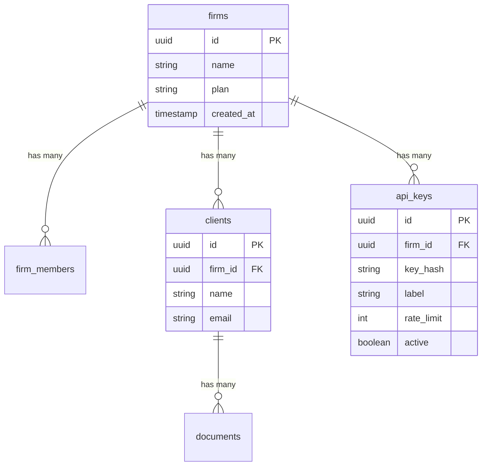

---

## Agent Operations Architecture

AI agents are the operations team. They maintain the 50-state data layer, monitor infrastructure health, and handle ongoing codebase maintenance.

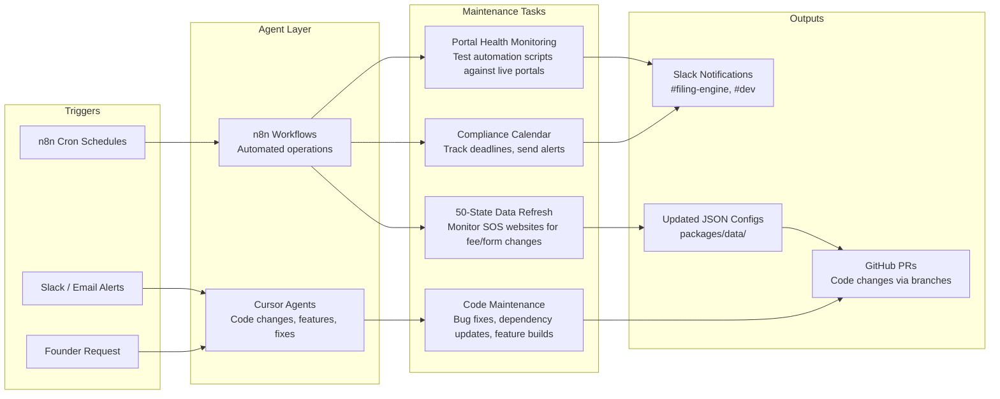

### Agent Maintenance Cadence

| Task | Frequency | Agent | Output |
|------|-----------|-------|--------|
| State fee/form change detection | Weekly | n8n + Gemini | Updated `packages/data/formation/*.json` |
| Portal automation health check | Daily | n8n + Playwright | Slack alert if script fails |
| Filing Engine status check | Hourly | n8n | Slack alert for stuck/failed submissions |
| Tax bracket updates | Annually (October) | Cursor agent | Updated `packages/data/tax/*.json` |
| Dependency updates | Monthly | Cursor agent | PR with updated packages |
| Compliance deadline alerts | Daily | n8n | Slack + email to affected users |

---

## Local Development

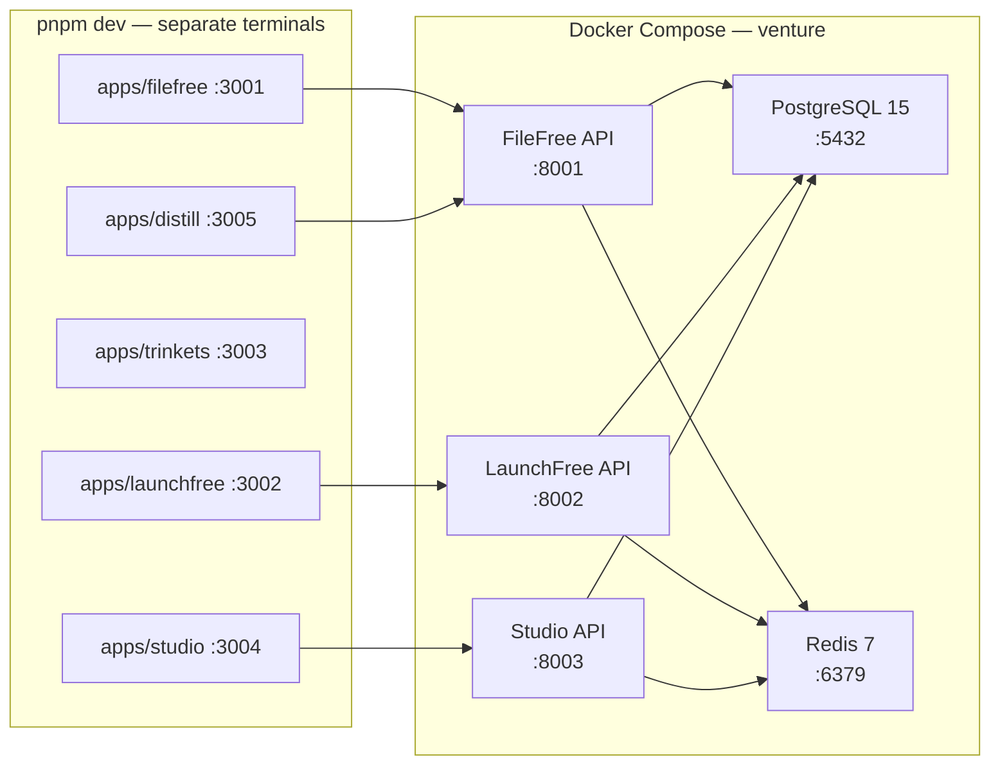

### Port Map

| Service | Port |
|---------|------|
| apps/filefree | 3001 |
| apps/launchfree | 3002 |
| apps/trinkets | 3003 |
| apps/studio | 3004 |
| apps/distill | 3005 |
| apis/filefree | 8001 |
| apis/launchfree | 8002 |
| apis/studio | 8003 |
| PostgreSQL | 5432 |
| Redis | 6379 |

### Quick Reference

```bash
make dev          # Start Docker services + all apps
make dev-d        # Start Docker services (background)
make stop         # Stop all services
make test         # Run all tests
make lint         # Run all linters
make format       # Auto-fix formatting
make migrate      # Run Alembic migrations (all APIs)
```

---

## Production Reliability

### Circuit Breakers

| External Service | Degradation Behavior |
|-----------------|---------------------|
| GCP Cloud Vision | Return "manual entry required" — user types fields |
| OpenAI GPT | Skip AI insights, show static tips. OCR falls back to manual. |
| Stripe | Queue payment, retry with exponential backoff |
| State Portal (Filing Engine) | Queue submission, alert via Slack, manual fallback |
| Neon PostgreSQL | App returns 503, retry after 30s |
| Upstash Redis | Fall back to stateless JWT (no session revocation) |

### PII Encryption

All personally identifiable fields (`full_name`, `ssn`, `ein`, `address`, `date_of_birth`) are encrypted at rest using AES-256 (Fernet) with a key separate from database encryption. PII is never stored in plaintext. PII is never logged.
