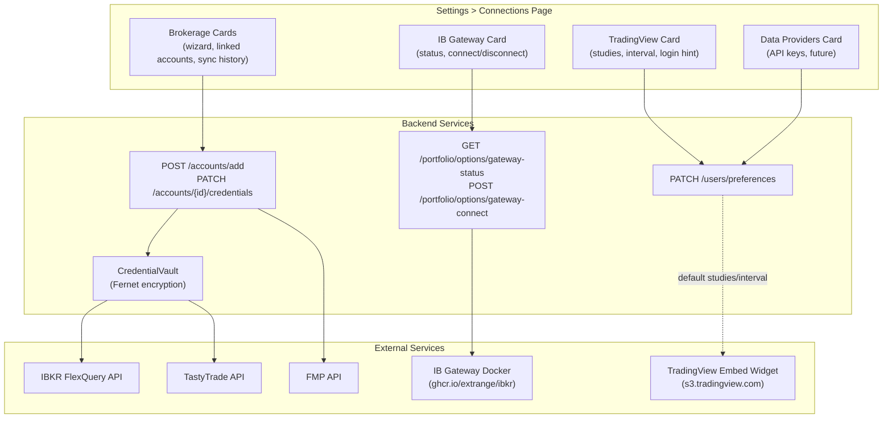

# Connections

Settings > Connections is the unified hub for all external service integrations. Previously named "Brokerages," it now encompasses any service AxiomFolio connects to.

## Page Structure

```
CONNECTIONS
├── Brokerages (existing -- wizard, linked accounts, sync history)
│   ├── Interactive Brokers (FlexQuery Token + Query ID)
│   ├── Tastytrade (OAuth client_secret + refresh_token)
│   └── Charles Schwab (OAuth redirect, planned)
├── IB Gateway (live data connection)
│   ├── Status badge (connected / offline / error)
│   ├── Host, Port, Trading Mode display
│   ├── Connect / Reconnect / Refresh Status buttons
│   ├── View Gateway (noVNC) button → http://localhost:6080
│   └── Last connected timestamp
├── TradingView (charting preferences)
│   ├── Default studies (EMA, RSI, MACD, Volume, Bollinger, VWAP)
│   ├── Default interval (1m, 5m, 15m, 1h, D, W, M)
│   ├── Info box (explains embed limitations, pop-out to full TV)
│   └── Future: Charting Library license key (account integration)
└── Data Providers (future)
    ├── FMP API key
    └── Twelve Data API key
```

## Connection Types

| Type | Service | Auth Method | Data Flow | Status |
|------|---------|-------------|-----------|--------|
| Brokerage | IBKR FlexQuery | Flex Token + Query ID | Positions, trades, options, tax lots, balances | Active |
| Brokerage | TastyTrade | OAuth (client_secret + refresh_token) | Positions, trades, transactions, dividends | Active |
| Brokerage | Schwab | OAuth redirect | Positions (planned) | Planned |
| Live Data | IB Gateway | TWS API (host:port:clientId) | Real-time quotes, option chains, Greeks | Active |
| Charting | TradingView | Preferences (no auth) | Default studies, interval (public embed, no account link) | Active |
| Data Provider | FMP | API key | OHLCV, fundamentals, index constituents | Future |
| Data Provider | Twelve Data | API key | OHLCV fallback | Future |

## Architecture



## Credential Storage

All sensitive credentials are encrypted at rest using Fernet symmetric encryption (`CredentialVault`). Each user has their own encryption context via `AccountCredentials`. The vault stores:

- IBKR: FlexQuery Token, Query ID, and optional Gateway settings (host, port, client_id)
- TastyTrade: OAuth client_secret, refresh_token
- Schwab: OAuth access_token, refresh_token (auto-refreshed on 401)
- IB Gateway: Per-user gateway host/port/client_id stored in the same `AccountCredentials` row as FlexQuery creds
- FMP: API key (future, per-user)

### Gateway Credential Payload Structure

IBKR `AccountCredentials.encrypted_credentials` JSON blob:

```json
{
  "flex_token": "...",
  "query_id": "...",
  "gateway_host": "ib-gateway",
  "gateway_port": 8888,
  "gateway_client_id": 1
}
```

The `gateway_*` fields are optional. When present, the gateway-connect endpoint uses them instead of global env vars. Managed via `PATCH /accounts/{id}/gateway-settings`.

## TradingView Integration

The TradingView experience is fully in-app. Users never leave the application.

**How it works**: We use the free TradingView public embed widget (`s3.tradingview.com/external-embedding/embed-widget-advanced-chart.js`). This is an anonymous iframe — it does **not** connect to the user's TradingView account. Pine Scripts, saved templates, and custom indicators are not available in the embed. Built-in studies (EMA, RSI, MACD, Bollinger, VWAP, Volume) are toggled via our own toolbar.

**Where TV charts appear**:

1. `ChartSlidePanel` (Market Dashboard / Market Tracked): Click any symbol -> full-height panel slides in with embedded TV widget.
2. `PortfolioWorkspace`: Toggle between Intelligence Chart (lightweight-charts with custom overlays) and embedded TV chart. Both inline.

**What the Connections card manages**:

- Default studies/interval: Synced to server-side user preferences (previously localStorage-only). Persists across devices/browsers.
- Info box: Explains the embed limitations and how to pop out to the full TV site.
- Future: Charting Library license key field (unlocks custom data feeds, account integration, no watermark).

## IB Gateway Connection

The IB Gateway runs as a Docker container (`ib-gateway` service in `compose.dev.yaml`) using the `ghcr.io/extrange/ibkr:stable` image. This image was chosen over `ghcr.io/gnzsnz/ib-gateway` because the latter has a known ARM64 (Apple Silicon) bug where the API port never opens after login.

**Key ports**:

- `8888` -- Unified API port (the image auto-forwards the correct internal port based on trading mode)
- `6080` -- noVNC browser access (view the gateway UI at `http://localhost:6080`)

**Environment variables** (mapped in `compose.dev.yaml`):

- `USERNAME` / `PASSWORD` -- IBKR credentials (from `IBKR_USERNAME` / `IBKR_PASSWORD` in `env.dev`)
- `GATEWAY_OR_TWS: gateway` -- Run IB Gateway (not TWS)
- `IBC_TradingMode` -- `paper` or `live` (from `IBKR_TRADING_MODE` in `env.dev`)
- `IBC_ReadOnlyApi: "yes"` -- Read-only API access

**Connection strategy**:

- On-demand reconnection via `_ensure_connected()` -- called before any Gateway operation.
- Exponential backoff: 1s, 2s, 4s, 8s, 16s with `max_attempts=5`.
- No periodic Celery reconnect -- IBKR connections are stateful with limited client ID slots.
- Manual reconnect button in Settings > Connections and via GatewayStatusBadge.
- "View Gateway (noVNC)" button opens `http://localhost:6080` for visual debugging.

**Makefile targets**:

- `make ib-up` -- Start IB Gateway container
- `make ib-down` -- Stop IB Gateway container
- `make ib-verify` -- Start container, wait for login, verify API connectivity

## Multi-Tenant IB Gateway (Future Architecture)

IB Gateway only supports one authenticated session per username. The current dev setup uses a single global container. For production multi-user support, the architecture needs to evolve:

### Option A: Container-Per-User

Each user gets a dedicated `ib-gateway` container with their own IBKR credentials:

- **Orchestrator service** dynamically creates/destroys containers via Docker API or K8s
- **Port allocation**: Each container gets a unique host port (8888, 8889, 8890, ...)
- **Connection pool**: `IBKRClient` keyed by `user_id` instead of singleton
- **Session lifecycle**: IBKR forces daily reconnect (~midnight ET maintenance). Containers auto-restart via IBC.
- **Cost**: Each container uses ~200MB RAM. Scales linearly with user count.

### Option B: IBKR Client Portal API (Lighter Weight)

IBKR also offers a REST-based Client Portal API that doesn't require a persistent container:

- Stateless HTTP calls with session cookie auth
- No container needed per user
- More limited than TWS API (no streaming, limited order types)
- Better for read-only portfolio data; worse for live trading

### Current State

- **Dev**: Single Gateway container, credentials from `env.dev`, singleton `IBKRClient`
- **Production**: Per-user gateway settings stored encrypted in `AccountCredentials`. Gateway host/port/client_id can be customized per account via Settings > Connections. Container orchestration is deferred -- currently limited to one concurrent Gateway user.
- **Migration path**: When multi-tenant is needed, implement the orchestrator, switch `IBKRClient` from singleton to connection pool, and add container lifecycle management.

## FlexQuery Configuration Requirements

For IBKR data sync to work correctly, the FlexQuery must be configured on IBKR's Account Management portal:

1. Go to **Reports > Flex Queries > Activity Flex Query**
2. Create or edit a query that includes these sections:
   - **Open Positions** (with LOT-level detail)
   - **Trades** (executions, closed lots, wash sales)
   - **Cash Transactions** (dividends, interest, fees, withholding tax)
   - **Account Information** (balances, margin data)
   - **Interest Accruals** (margin interest)
   - **Transfers** (ACATS, position transfers)
3. Set **Period** to "Last 365 Calendar Days" (critical — this determines how much history is fetched)
4. Set **Format** to XML
5. Go to **Flex Web Service** and enable it
6. Generate a token and note the Query ID
7. Store token and query ID in the AxiomFolio connection wizard

**Diagnostic**: Use `GET /api/v1/accounts/flexquery-diagnostic` to verify sections, row counts, and date range.

## Schwab Integration

Schwab uses OAuth 2.0 via the Schwab Trader API:

1. Register a developer app at developer.schwab.com
2. Configure `SCHWAB_CLIENT_ID` and `SCHWAB_CLIENT_SECRET` in environment
3. Link account via Settings > Connections (triggers OAuth flow)
4. Tokens are stored encrypted and auto-refreshed on 401

**Status**: OAuth scaffold implemented, client ready for real API calls once credentials are configured.

## Key Files

| File | Purpose |
|------|---------|
| `frontend/src/pages/SettingsConnections.tsx` | Connections page (renamed from SettingsBrokerages) |
| `frontend/src/pages/SettingsShell.tsx` | Settings navigation (label: "Connections") |
| `frontend/src/components/charts/TradingViewChart.tsx` | Embedded TV widget (no external link) |
| `frontend/src/components/market/SymbolChartUI.tsx` | ChartSlidePanel for in-app TV charts |
| `backend/services/clients/ibkr_client.py` | IB Gateway connection singleton |
| `backend/api/routes/portfolio_options.py` | Gateway status/connect endpoints |
| `backend/services/portfolio/account_credentials_service.py` | Credential vault |
| `infra/compose.dev.yaml` | IB Gateway Docker service |
