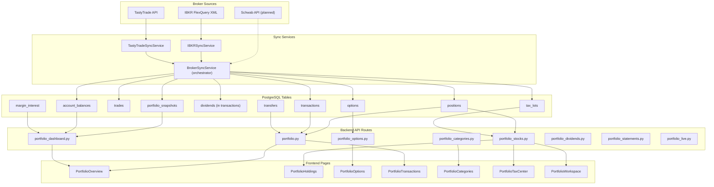
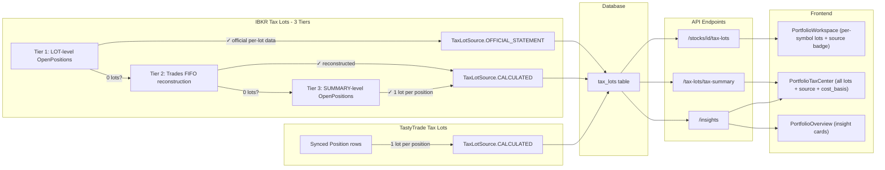
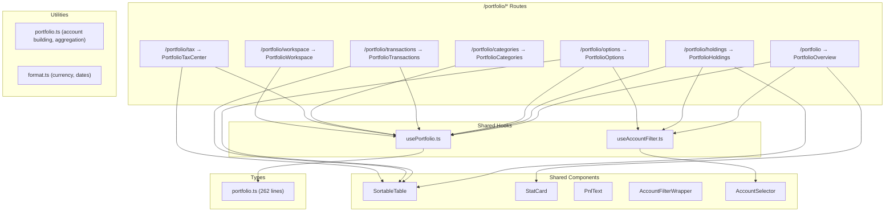

# Portfolio Pillar

Architecture, data flow, and file inventory for the Portfolio section of AxiomFolio.

---

## Data Sync Flow

Broker data enters the system through sync services, gets persisted to PostgreSQL, served by FastAPI routes, and consumed by React pages.

## Tax Lot Data Flow (Three-Tier Priority)

Tax lots are synced from brokers using a three-tier priority chain for IBKR, then served to the Tax Center and Workspace pages. Each tier is tried in order; the first to produce data wins.

**Tier 1 (LOT-level)** parses `_parse_tax_lots_from_lot_rows()` from the `<OpenPositions>` section where `levelOfDetail="LOT"`. This is official IBKR per-lot data including individual `costBasisPrice`, `openDateTime`, `holdingPeriodDateTime`, `originatingOrderID`. Marked as `OFFICIAL_STATEMENT`.

**Tier 2 (Trades FIFO)** reconstructs lots from the `<Trades>` XML section using FIFO ordering. Marked as `CALCULATED`.

**Tier 3 (SUMMARY fallback)** creates one lot per position from `<OpenPositions>` SUMMARY rows. Least granular. Marked as `CALCULATED`.

## Frontend Component Architecture

## Routes

| Route | Page | Description |
|-------|------|-------------|
| `/portfolio` | PortfolioOverview | KPIs, allocation donut, performance chart, stage distribution, top movers, insight cards, **Account Health** (cash/margin/leverage), **Margin Interest** |
| `/portfolio/holdings` | PortfolioHoldings | Enriched SortableTable (stage, RS%, sector, **5D%**, **20D%**, **RSI**, **ATR**, **industry**, **cost basis** -- hidden cols), filter presets (**High RS**, **Oversold**, **Concentrated**), heatmap toggle |
| `/portfolio/options` | PortfolioOptions | Summary KPIs, positions grouped by underlying with **IV**, **realized P&L**, **commission**; **account filter now active** |
| `/portfolio/transactions` | PortfolioTransactions | Unified activity feed with **account/broker column**, **date+time** display, pagination, transfers included |
| `/portfolio/categories` | PortfolioCategories | Category cards, target/actual allocation, CRUD, position assignment |
| `/portfolio/tax` | PortfolioTaxCenter | Tax lot summary, harvest candidates, approaching-LT, full lot table with **cost basis**, **source badge** (Official/Estimated), loading/error states for insights |
| `/portfolio/workspace` | PortfolioWorkspace | Per-symbol deep dive: **symbol summary bar**, chart, tax lots with **source badge** and **empty states**, dividends with **improved filter**, sidebar with **cost basis** |

## Sync Lifecycle

1. **Add account** (Settings > Brokerages): POST `/accounts/add` -> Celery `sync_account_task` enqueued; response includes `sync_task_id`.
2. **Sync populates**: `positions`, `tax_lots`, `trades`, `transactions`, `dividends`, `options`, `account_balances`, `margin_interest`, `transfers`, `portfolio_snapshots`.
3. **Tax lot strategy**: IBKR uses three-tier priority (LOT rows > Trades FIFO > SUMMARY fallback). TastyTrade generates one lot per position from average cost.
4. **Transaction mapping**: Cash transactions now map all ~40 FlexQuery fields to the Transaction model (trade_id, order_id, conid, commissions breakdown, tax info, corporate action flags, etc.).
5. **Trade enrichment**: Trades now store `order_id`, `settlement_date`, `realized_pnl`, `is_opening`, `notes` in typed columns (previously only in JSON blob).
6. **Activity feed**: Unified UNION ALL across trades, transactions, dividends, and **transfers** (deposits/withdrawals/ACATS).
7. **Frontend trigger**: POST `/accounts/sync-all` returns `{ status: "queued", task_ids }`; auto-triggered on login when accounts are `NEVER_SYNCED`.

## Market Data Bridge

- `GET /portfolio/stocks?include_market_data=true` LEFT JOINs latest `MarketSnapshot` per symbol.
- Positions enriched with `stage_label`, `rs_mansfield_pct`, `perf_1d`/`perf_5d`/`perf_20d`, `rsi`, `atr_14`.
- Portfolio symbols are part of the tracked universe; no separate sync.

## File Inventory

### Frontend

| Layer | File | Lines |
|-------|------|------:|
| **Pages** | `pages/portfolio/PortfolioOverview.tsx` | 390 |
| | `pages/portfolio/PortfolioHoldings.tsx` | 308 |
| | `pages/portfolio/PortfolioTaxCenter.tsx` | 303 |
| | `pages/portfolio/PortfolioTransactions.tsx` | 294 |
| | `pages/portfolio/PortfolioCategories.tsx` | 281 |
| | `pages/portfolio/PortfolioOptions.tsx` | 268 |
| | `pages/PortfolioWorkspace.tsx` | 476 |
| **Hooks** | `hooks/usePortfolio.ts` | 410 |
| | `hooks/useAccountFilter.ts` | 205 |
| **Components** | `components/SortableTable.tsx` | 772 |
| | `components/ui/AccountSelector.tsx` | 316 |
| | `components/ui/AccountFilterWrapper.tsx` | 87 |
| | `components/shared/StatCard.tsx` | 83 |
| | `components/shared/PnlText.tsx` | 52 |
| **Utils** | `utils/portfolio.ts` | 146 |
| | `utils/format.ts` | 102 |
| **Types** | `types/portfolio.ts` | 261 |

### Backend API Routes

| File | Lines | Key Endpoints |
|------|------:|---------------|
| `portfolio.py` | 505 | `/sync-all`, `/insights`, `/analytics` |
| `portfolio_stocks.py` | 274 | `/stocks`, `/stocks/{id}/tax-lots`, `/tax-lots/tax-summary` |
| `portfolio_options.py` | 266 | `/options/accounts`, `/options/positions` |
| `portfolio_dashboard.py` | 350 | `/dashboard`, `/performance/history`, **`/balances`**, **`/margin-interest`** |
| `portfolio_categories.py` | 228 | `/categories` CRUD, `/categories/{id}/positions` |
| `portfolio_live.py` | 139 | `/live/positions`, `/live/prices` |
| `portfolio_statements.py` | 138 | `/statements` |
| `portfolio_dividends.py` | 72 | `/dividends` |

### Backend Services

| File | Lines | Purpose |
|------|------:|---------|
| `ibkr_sync_service.py` | 1895 | IBKR FlexQuery sync: positions, tax lots, trades, options, snapshots |
| `tastytrade_sync_service.py` | 466 | TastyTrade sync: positions, tax lots, trades, transactions, dividends |
| `tax_lot_service.py` | 678 | Tax lot queries, enrichment, analytics |
| `portfolio_analytics_service.py` | 359 | Portfolio-level analytics and aggregation |
| `account_config_service.py` | 350 | Broker account configuration |
| `broker_sync_service.py` | 283 | Orchestrator dispatching to broker-specific services |
| `activity_aggregator.py` | 262 | Cross-broker activity feed |
| `schwab_sync_service.py` | 173 | Schwab sync (planned) |
| `account_credentials_service.py` | 68 | Encrypted credential storage/retrieval |

### Broker Clients

| File | Lines | Purpose |
|------|------:|---------|
| `ibkr_flexquery_client.py` | 1849 | FlexQuery XML parsing, report fetching |
| `tastytrade_client.py` | 866 | TastyTrade SDK wrapper |

### Models

| File | Lines | Tables |
|------|------:|--------|
| `transaction.py` | 280 | `transactions` (includes dividends) |
| `position.py` | 269 | `positions` |
| `options.py` | 173 | `options` |
| `tax_lot.py` | 164 | `tax_lots` |
| `account_balance.py` | 164 | `account_balances` |
| `trade.py` | 143 | `trades` |
| `portfolio.py` | 132 | `portfolio_snapshots` |
