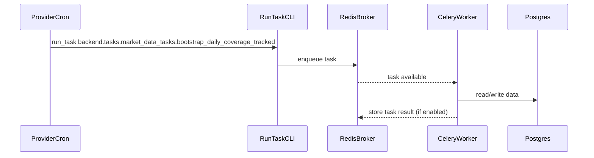
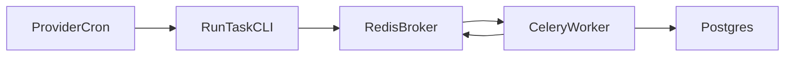

# Production Operations Guide

## Goals
- Provider-agnostic deployment (Render + Fly supported)
- Immutable Docker images
- Release-time DB migrations (no auto-migrate on app startup)
- Cost-aware scheduling (cron jobs instead of always-on beat)

## Core Services
- API (FastAPI web service)
- Worker (Celery)
- Cron runner (scheduled task enqueuer)
- Postgres (managed)
- Redis (managed)

## Required Env Vars (minimum)
- `ENVIRONMENT=production`
- `SECRET_KEY` (non-default)
- `DATABASE_URL`
- `REDIS_URL`
- `CELERY_BROKER_URL`
- `CELERY_RESULT_BACKEND`
- `CORS_ORIGINS`
- `RATE_LIMIT_DEFAULT`

Optional:
- `RATE_LIMIT_STORAGE_URL` (Redis-backed limiter)
- `NEW_RELIC_LICENSE_KEY`

## CI/CD (GitHub Actions)
1. Build and push Docker images to GHCR.
2. Run DB migrations using backend image.
3. Trigger provider deploy hooks or run Fly deploys.
4. Smoke test `/health`.

## Domains
- Frontend (static): `https://axiomfolio.com`
- API: `https://api.axiomfolio.com`

## DNS + TLS
- Point `axiomfolio.com` to the Render static service and `api.axiomfolio.com` to the Render web service.
- Wait for Render to issue TLS certificates before enabling production traffic.
- Ensure `CORS_ORIGINS` includes the new frontend domain.

## Database migration (rename + preserve data)
If you are renaming the database (e.g., `old_db` → `axiomfolio`), migrate data before cutover:
1. Create the new database in the provider (empty).
2. Export from the old database: `pg_dump --format=custom --no-owner --no-acl "$OLD_DATABASE_URL" -f axiomfolio.dump`.
3. Import into the new database: `pg_restore --no-owner --no-acl --dbname "$NEW_DATABASE_URL" axiomfolio.dump`.
4. Validate row counts for key tables and keep a rollback snapshot of the old DB.
5. Point `DATABASE_URL` and related env vars at the new DB and run migrations via CI.

## Scheduling (cron, no always-on beat)
Use scheduled jobs to enqueue tasks:
- `backend.tasks.account_sync.sync_all_ibkr_accounts`
- `backend.tasks.market_data_tasks.bootstrap_daily_coverage_tracked`
- `backend.tasks.market_data_tasks.monitor_coverage_health`
- `backend.tasks.market_data_tasks.enforce_price_data_retention`

### Execution flow (production)

### System flow (cron → queue → workers → DB)

### Midnight example (UTC)
1. Provider cron triggers a job (e.g., 03:00 UTC).
2. `backend/scripts/run_task.py` enqueues the Celery task.
3. Worker pulls the task from Redis and executes it.
4. Data updates land in Postgres; status is recorded in JobRun.

### Dev vs prod behavior
- **Production:** `ENABLE_CELERY_BEAT=false` and `ENABLE_REDBEAT=false` (cron-only scheduling).
- **Development:** keep beat enabled for convenience (`ENABLE_CELERY_BEAT=true`, `ENABLE_REDBEAT=true`).

## Backups
- Postgres: enable provider backups and periodic exports.
- Redis: if used for caching only, persistence can be lower priority; for RedBeat, ensure persistence.

## Scaling
- Scale API based on latency and request rate.
- Scale workers based on queue depth and job duration.
- Use rate limiting to protect upstream providers and DB.

## Rollback
- Roll back by redeploying the previous image tag.
- If migrations are non-reversible, use guarded feature flags until data migrations complete.
