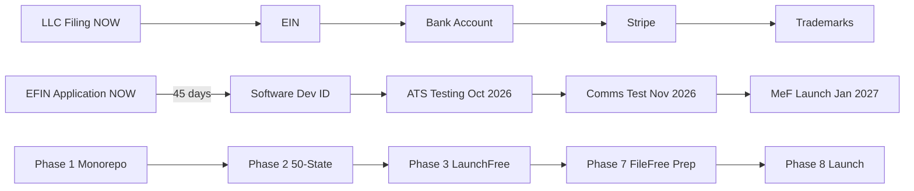

# Paperwork Labs — Venture Build Tasks

**Version**: 11.0 | **Updated**: 2026-03-22

Work through these in phase order. Each task is scoped for one PR. Reference [PRD.md](PRD.md) for business context, [BRAIN_ARCHITECTURE.md](BRAIN_ARCHITECTURE.md) for Brain technical spec, [PRODUCT_SPEC.md](PRODUCT_SPEC.md) for FileFree UX specs, [VENTURE_MASTER_PLAN.md](VENTURE_MASTER_PLAN.md) for deep strategy, [PARTNERSHIPS.md](PARTNERSHIPS.md) for partner playbook, [.cursorrules](../.cursorrules) for coding conventions.

**Historical MVP tasks**: Sprint 0-6 detailed specs archived in [TASKS-ARCHIVE.md](TASKS-ARCHIVE.md). All completed work (Tasks 0.1-2.7, B.1-B.11, I.1) preserved there for reference.

**Founding team**: Two co-founders. Founder 1 (Product/Engineering) owns all code tasks. Founder 2 (Partnerships/Revenue) owns partner outreach tasks. See [PARTNERSHIPS.md](PARTNERSHIPS.md) for the full playbook.

**Products**:

- **FileFree** (filefree.ai) -- Free tax filing. Revenue: refund routing, financial referrals, audit shield, Tax Optimization Plan. Launches January 2027.
- **LaunchFree** (launchfree.ai) -- Free LLC formation. Revenue: RA credits, banking/payroll/insurance referrals. Launches Summer 2026.
- **Distill** (distill.tax) -- B2B compliance automation platform. Umbrella brand for tax, formation, and compliance APIs + CPA SaaS dashboard. Revenue: SaaS subscriptions ($49-199/mo) + Formation API ($20-40/filing) + Tax API ($5-15/return). Launches Summer 2026.
- **Trinkets** (tools.filefree.ai) -- Utility tools (calculators, converters). Revenue: AdSense + cross-sell. Low complexity.
- **Studio / Command Center** (paperworklabs.com) -- Venture admin dashboard, agent monitor, intelligence campaigns.

**Entity**: Paperwork Labs LLC (California). DBA filings for "FileFree", "LaunchFree", "Trinkets", and "Distill".

---

## Critical Dates (Hard Deadlines)

| Milestone | Deadline | Status | Notes |
| --- | --- | --- | --- |
| LLC filing (CA SOS) + EIN | TODAY | NOT STARTED | Blocks EFIN, bank account, Stripe, trademarks. Do FIRST. See instructions below. |
| EFIN application (Form 8633) | TODAY (after LLC + EIN) | NOT STARTED | 45-day IRS processing. Blocks entire MeF certification chain. See instructions below. |
| Cyber liability insurance ($1M) | Before first SSN collected | NOT STARTED | Non-negotiable for handling SSNs. Company-ending risk without it. |
| MeF XML generator development | Start June 2026 | NOT STARTED | Must begin 4 months before ATS testing window. |
| ATS testing (IRS) | October 2026 | NOT STARTED | 13 federal test scenarios + 42 state schema validations. |
| Column Tax partnership | October 2026 | NOT STARTED | Fallback e-file partner for CA/MA and unsupported forms. |
| Communication test (IRS) | November 2026 | NOT STARTED | End-to-end transmission verification. |
| Tax season launch | January 2027 | NOT STARTED | IRS accepts returns ~late January. Hard external deadline. |
| GitHub PAT rotation | June 1, 2026 | NOT STARTED | n8n.paperworklabs.com fine-grained PAT expires Jun 15, 2026. Rotate 2 weeks early. Update: n8n credentials UI + Hetzner .env + GitHub Actions secrets. |

---

## Critical Path

---

## Pre-Code Blockers (Section 0G)

These are existential risk mitigations that cost under $5K total. Complete before writing any product code. See [VENTURE_MASTER_PLAN.md](VENTURE_MASTER_PLAN.md) Section 0G.

| # | Action | Cost | Deadline | Blocks | Status |
| --- | --- | --- | --- | --- | --- |
| 1 | Decide LLC name | $0 | -- | -- | DONE |
| 2 | Apply for EFIN (Form 8633) | $0 | THIS WEEK | Phase 8 (MeF transmitter). 45-day IRS processing. Chain: EFIN -> Software Dev ID -> ATS (Oct 2026) -> Comms test (Nov) -> Go-live (Jan 2027). Every day of delay compresses the October ATS window. **See [EFIN_FILING_INSTRUCTIONS.md](EFIN_FILING_INSTRUCTIONS.md) for full step-by-step guide.** | NOT STARTED |
| 3 | Get cyber liability insurance (E&O + cyber, $1M coverage) | $1,500-3,000/yr | Before first SSN collected | Phase 7 (FileFree launch). Non-negotiable for handling SSNs. A single breach without it is company-ending. | NOT STARTED |
| 4 | Draft data breach response plan | $0 (SANS/NIST templates) | Before first SSN collected | Phase 7. Need: notification timeline by state tier, template notification letter, forensics firm contact, first-call list. | NOT STARTED |
| 5 | 1-hour startup attorney consultation | ~$300-500 | Before Phase 3 (LaunchFree MVP) | Two questions: (a) does AI-assisted operating agreement survive UPL analysis in CA, TX, NY, FL? (b) is wholesale RA arrangement structured to minimize agency liability? | NOT STARTED |
| 6 | Self-serve affiliate apps (Marcus, Wealthfront, Betterment via Impact.com/CJ) | $0 | April 2026 | Plan B revenue. Online forms, no calls needed. | NOT STARTED |

---

### EFIN Filing Instructions

**Full step-by-step guide**: [EFIN_FILING_INSTRUCTIONS.md](EFIN_FILING_INSTRUCTIONS.md)

**Order**: LLC (CA SOS, $70) → EIN (IRS.gov, instant) → PTIN ($18.75) → e-Services account (ID.me) → EFIN application (Form 8633) → Livescan fingerprinting. Total: ~2 hours, ~$104-139. EFIN approval takes up to 45 days.

**CRITICAL**: EFIN cannot transfer between entities. Do NOT apply as sole proprietor. Use `sankalp@paperworklabs.com` for ALL registrations.

---

## Phase 0: Infrastructure (Weeks 1-3)

**Dependency chain**: P0.1 (DONE) -> P0.2, P0.3, P0.4, P0.5 (parallel) -> P0.6 (blocked on LLC name) -> P0.7 -> P0.8 (needs specimen, after launch) -> P0.9 (parallel with anything)

**Pre-code blockers (Section 0G)**: EFIN application, cyber insurance, breach response plan, attorney consult. These run parallel to Phase 0 tasks below.

See [VENTURE_MASTER_PLAN.md](VENTURE_MASTER_PLAN.md) Section 7 (Phase 0).

P0.1 Buy domains (DONE)

- **Task ID**: P0.1
- **Owner**: Founder 1
- **Branch**: N/A (no code)
- **Files/Specs**: N/A
- **Acceptance Criteria**: launchfree.ai + filefree.ai registrar confirmed
- **Depends On**: None
- **Status**: DONE

P0.2 Migrate FileFree domain

- **Task ID**: P0.2
- **Owner**: Founder 1
- **Branch**: `chore/domain-migration`
- **Files/Specs**: `web/next.config.ts` (redirects), Vercel dashboard (custom domain), DNS provider (A/CNAME records)
- **Acceptance Criteria**: filefree.ai serves the app. filefree.tax 301-redirects to filefree.ai. All existing links preserved. SSL cert issued.
- **Depends On**: P0.1
- **Status**: NOT STARTED

P0.3 Google Workspace -- DONE

- **Task ID**: P0.3
- **Owner**: Founder 1
- **Branch**: N/A (no code)
- **Files/Specs**: Google Workspace Business Starter (1 seat, $6/mo). Primary domain: paperworklabs.com. Alias domains: filefree.ai, launchfree.ai, distill.tax. Department aliases (hello@, support@, legal@, partnerships@, api@) on each domain route to founder inbox (sankalp@paperworklabs.com).
- **Acceptance Criteria**: Emails received at hello@filefree.ai, hello@launchfree.ai. SPF/DKIM/DMARC configured for all domains.
- **Depends On**: P0.1
- **Status**: DONE (see D76 in KNOWLEDGE.md)

P0.4 Google Drive HQ

- **Task ID**: P0.4
- **Owner**: Founder 1
- **Branch**: N/A (no code)
- **Files/Specs**: Create folder structure: `Paperwork Labs HQ/Operations/Daily Briefings/`, `Paperwork Labs HQ/Operations/Weekly Plans/`, `Paperwork Labs HQ/Trinkets/One-Pagers/`, `Paperwork Labs HQ/Trinkets/PRDs/`, `Paperwork Labs HQ/Intelligence/`. Add GDrive MCP server to `.cursor/mcp.json`.
- **Acceptance Criteria**: GDrive accessible from Cursor via MCP. Folder structure matches EA spec in `ea.mdc`.
- **Depends On**: P0.3
- **Status**: PARTIAL — GDrive MCP working, Strategy folder created, PARTNERSHIPS.md + PITCH_PACKAGE.md uploaded. Remaining: create Operations/Daily Briefings/, Operations/Weekly Plans/, Trinkets/ subfolders.

P0.5 Secure social handles

- **Task ID**: P0.5
- **Owner**: Founder 1
- **Branch**: N/A (no code)
- **Files/Specs**: Register @launchfree on TikTok, Instagram, X, YouTube. Set profile pic to monogram, link to launchfree.ai.
- **Acceptance Criteria**: All 4 accounts created, profile pics set, bios written, URLs point to launchfree.ai.
- **Depends On**: P0.1
- **Status**: NOT STARTED

P0.6 Form LLC

- **Task ID**: P0.6
- **Owner**: Founder 1
- **Branch**: N/A (no code)
- **Files/Specs**: California SOS online filing. DBA filings at county clerk (FileFree, LaunchFree, Trinkets).
- **Acceptance Criteria**: Articles of Organization filed with CA SOS. Confirmation number received. DBA filings submitted. EIN applied for on IRS.gov (same day as LLC confirmation). Bank account opened.
- **Depends On**: LLC name decided (Section 0G #1) -- DONE
- **Status**: NOT STARTED

P0.7 Migrate DNS subdomains

- **Task ID**: P0.7
- **Owner**: Founder 1
- **Branch**: `chore/dns-migration`
- **Files/Specs**: DNS provider records: ops.paperworklabs.com -> Hetzner (n8n), social.paperworklabs.com -> Hetzner (Postiz). Point paperworklabs.com -> Vercel (apps/studio). Remove old filefree.tax subdomains.
- **Acceptance Criteria**: n8n accessible at ops.paperworklabs.com. Postiz accessible at social.paperworklabs.com. paperworklabs.com serves studio app. Old subdomains return 404 or redirect.
- **Depends On**: P0.2
- **Status**: NOT STARTED

P0.8 File trademarks (DEFERRED)

- **Task ID**: P0.8
- **Owner**: Founder 1
- **Branch**: N/A (no code)
- **Files/Specs**: USPTO TEAS Plus application. FILEFREE: Class 036 + 042. LAUNCHFREE: Class 035 + 042. Supplemental Register.
- **Acceptance Criteria**: Applications filed. Serial numbers received. Docket dates noted in TASKS.md.
- **Depends On**: Product launch (needs specimen of use)
- **Status**: DEFERRED

P0.9 Legal compliance setup

- **Task ID**: P0.9
- **Owner**: Founder 1
- **Branch**: `chore/legal-compliance`
- **Files/Specs**: Update `.cursor/rules/social.mdc`, `growth.mdc`, `brand.mdc` to include Content Review Gate checklist from Section 0C. Create/update `web/src/app/(legal)/privacy/page.tsx`, `web/src/app/(legal)/terms/page.tsx`.
- **Acceptance Criteria**: Every content-producing persona .mdc includes the Content Review Gate checklist verbatim. Privacy policy and ToS pages updated with cross-sell consent language from Section 0C Legal Risk Matrix.
- **Depends On**: None (can start immediately)
- **Status**: NOT STARTED

---

## Phase 1: Monorepo Restructure -- COMPLETE

All 13 tasks done (P1.1–P1.11 including P1.9b, P1.9c). pnpm workspace with 5 apps (`apps/filefree`, `apps/launchfree`, `apps/studio`, `apps/trinkets`, `apps/distill`), 2 APIs (`apis/filefree`, `apis/launchfree`), and 3 shared packages (`packages/ui`, `packages/auth`, `packages/analytics`). Original `web/` → `apps/filefree/`, `api/` → `apis/filefree/`. Per-product themes via `[data-theme]` CSS variables.

**Completed tasks**: P1.1 (pnpm init), P1.2 (packages/ui, 22 shadcn components), P1.3 (packages/auth), P1.4 (packages/analytics), P1.5 (move filefree frontend), P1.6 (move filefree API), P1.7 (scaffold launchfree), P1.8 (scaffold launchfree API), P1.9 (scaffold studio), P1.9b (scaffold trinkets), P1.9c (scaffold distill), P1.10 (infra updates), P1.11 (verification).

**Remaining polish** (non-blocking):
- [ ] P1.10a: Add `dorny/paths-filter@v3` to CI for path-filtered builds per workspace
- [ ] P1.10b: Verify Docker Compose dev environment with new monorepo paths
- [x] P1.10c: Turborepo parallel builds — **DONE** (`turbo.json`, root `package.json` scripts). Optional polish: remote cache / per-app pipeline tuning when scaling CI.

---

## Phase 1.5: First Trinket + Agent Pipeline Test (Week 3-4)

3-5 days of work. Tests the venture's agent infrastructure end-to-end while producing a real deployed product. The financial calculators are pre-decided; the agent pipeline validates a second trinket idea from market discovery.

See [VENTURE_MASTER_PLAN.md](VENTURE_MASTER_PLAN.md) Section 0F and Section 7 (Phase 1.5).

| Task | Owner | Details | Depends On | Status |
| --- | --- | --- | --- | --- |
| P1.5.1 Build financial calculator trinket | Founder 1 | Mortgage, compound interest, savings goal, budget planner. Client-side JS. Establishes the `apps/trinkets/` pattern. | P1.9b | NOT STARTED |
| P1.5.2 Create tool-layout component | Founder 1 | Shared layout: header, ad unit slots, SEO head, footer, internal links between tools | P1.5.1 | NOT STARTED |
| P1.5.3 Create trinket templates | Founder 1 | `docs/templates/trinket-one-pager.md` + `docs/templates/trinket-prd.md` -- templates the agent pipeline uses | None | NOT STARTED |
| P1.5.4 Test Trinket Factory pipeline | Founder 1 | Run the 3-stage agent pipeline (GPT-5.4 Discovery -> Claude Sonnet PRD -> Claude Sonnet Build) on a second trinket idea to validate the flow | P1.5.1 | NOT STARTED |
| P1.5.5 Deploy to Vercel | Founder 1 | SSG, AdSense placeholder, verify SEO (JSON-LD, sitemap, meta tags) | P1.5.2 | NOT STARTED |

---

## Phase 2: 50-State Data Infrastructure (Weeks 4-7)

This is not a coding task with a side of research. This is an AI-powered data pipeline that populates, validates, and keeps fresh ALL 50 states from day one. The marginal cost of state #11 through #50 is near zero when AI does the extraction.

See [VENTURE_MASTER_PLAN.md](VENTURE_MASTER_PLAN.md) Section 3B (50-state architecture) and Section 7 (Phase 2).

| Task | Owner | Details | Depends On | Status |
| --- | --- | --- | --- | --- |
| P2.1 Create packages/data scaffold | Founder 1 | TypeScript types, Zod schemas (formation + tax), directory structure, state engine API. Also scaffold `packages/tax-engine/` (empty, interfaces only) and `packages/document-processing/` (empty, interfaces only) for future phases. | P1.1 | **DONE** (PR #28) |
| P2.2 Build Source Registry | Founder 1 | 50 state configs: SOS URL, DOR URL, Tax Foundation reference, aggregator URLs, scrape method per source | P2.1 | **DONE** (PR #34) |
| P2.3 AI-extract 50-state tax data | Founder 1 | Scrape Tax Foundation 2026 table -> GPT-4o structured extraction -> 50 JSON files -> cross-validate against state DOR sites | P2.2 | **DONE** (vault-backed `OPENAI_API_KEY`, 51 jurisdictions incl. DC; DC uses TF state rates page) |
| P2.4 AI-extract 50-state formation data | Founder 1 | Scrape aggregator tables (WorldPopReview, ChamberOfCommerce) -> GPT-4o extraction -> 50 JSON files -> cross-validate against state SOS sites | P2.2 | **DONE** (SOS fetch + `ai_extraction_fallback` when sites block bots; human review in P2.5) |
| P2.5 Human review + approval | Founder 1 | Founder reviews AI extractions in batch (est. 4-6 hours total). Each state JSON gets `last_verified`, `sources[]`, `verified_by` | P2.3, P2.4 | **DONE** (PR #37 review CLI + PR #38 data fixes) |
| P2.6 Build state engine | Founder 1 | getStateFormationRules(), getStateTaxRules(), calculateStateTax(), getAllStates(), getStateFreshness() | P2.5 | **DONE** (PR #37 engine loader + clearCache + loadAllStates) |
| P2.7 Validation suite | Founder 1 | Zod schemas + sanity checks + 100% test coverage + CI enforcement | P2.6 | **DONE** (PR #38 CI enforcement + 1769 tests) |
| P2.8 n8n: Source Monitor workflow | Founder 1 | Weekly cron: scrape Tax Foundation + aggregator sites, compute content hashes, detect changes, alert on diffs | P2.5 | **DONE** (n8n workflow JSON: data-source-monitor.json) |
| P2.9 n8n: Deep Validator workflow | Founder 1 | Monthly cron: scrape all 50 state SOS + DOR sites directly, AI cross-validate against our stored data, flag discrepancies | P2.5 | **DONE** (n8n workflow JSON: data-deep-validator.json) |
| P2.10 n8n: Annual Update workflow | Founder 1 | October cron: triggered by IRS Revenue Procedure release, full federal + state refresh cycle | P2.9 | **DONE** (n8n workflow JSON: data-annual-update.json) |

---

## Phase 3: LaunchFree MVP (Weeks 6-14)

This is an entire product: formation wizard, state-specific PDF generation, Stripe integration, RA credit system, dashboard, AND the State Filing Engine (portal automation for top 10 states, Delaware ICIS API integration, Stripe Issuing for payment orchestration). LaunchFree files your LLC with the state on your behalf. Nearly all 50 states (~48) have online filing portals; only ~2 are mail-only.

See [VENTURE_MASTER_PLAN.md](VENTURE_MASTER_PLAN.md) Section 1B (LaunchFree business model), Section 7 (Phase 3), and State Filing Engine section in Section 7B.

| Task | Owner | Details | Depends On | Status |
| --- | --- | --- | --- | --- |
| P3.1 LaunchFree landing page | Founder 1 | Hero, how it works, state selector, pricing, trust badges | P1.7 | PARTIAL (home page updated with CTA, needs full landing) |
| P3.2 Formation wizard | Founder 1 | State selection -> name check -> details -> review -> submit | P3.1, P2.6 | **DONE** (PR #62) |
| P3.3 Articles of Organization PDF | Founder 1 | @react-pdf/renderer, state-specific templates | P3.2 | PARTIAL (CA template done, need 9 more states) |
| P3.4 Backend: formation service | Founder 1 | Create formation, store state, generate PDF, track status | P1.8 | PARTIAL (Formation model + CRUD API done in PR #61) |
| P3.4a State Filing Engine orchestrator | Founder 1 | Core engine in `packages/filing-engine/`. Receives formation ID, determines tier (API/portal/mail), dispatches to correct handler, tracks status. State config from `packages/data/portals/`. **Branch**: `feat/filing-engine-core`. **Files**: `packages/filing-engine/src/orchestrator.ts`, `packages/filing-engine/src/types.ts`, `packages/filing-engine/src/handlers/`. **AC**: (1) Given a formation with state_code, engine selects correct tier and dispatches. (2) Status transitions: pending -> submitting -> submitted -> confirmed/failed. (3) Screenshot capture at each portal step. (4) Error log populated on failure. (5) Retry logic (max 3 retries with exponential backoff). | P3.4 | **DONE** (PR #61, #62) |
| P3.4b Per-state portal configs (top 10) | Founder 1 | JSON configs for CA, TX, FL, DE, WY, NY, NV, IL, GA, WA. Each config: portal URL, form field CSS/XPath selectors, fee schedule, payment method, confirmation page selectors, RA login path. **Branch**: `feat/state-portal-configs`. **Files**: `packages/data/src/portals/{state_code}.json`. **AC**: (1) All 10 states have complete configs. (2) Zod schema validates all configs. (3) Each config tested against live portal (manual verification). (4) Fee schedule matches state SOS website. 187 validation tests, fees verified against official SOS sources. | P3.4a | **DONE** (PR #62) |
| P3.4c Delaware ICIS API integration | Founder 1 | Direct API integration with Delaware DCIS ICIS PublicXMLService. Tier 1 handler. Same-day programmatic filing. **Branch**: `feat/delaware-icis`. **Files**: `packages/filing-engine/src/handlers/api/delaware.ts`, `packages/filing-engine/src/handlers/api/delaware.test.ts`. **AC**: (1) Sandbox filing succeeds with test data. (2) XML request matches ICIS schema. (3) Filing confirmation number returned. (4) Error handling for DCIS downtime. (5) Credential rotation support. **Depends**: DCIS credentials approved (background task). | P3.4a, DCIS credentials | NOT STARTED |
| P3.4d Playwright automation scripts (top 10) | Founder 1 | Headless browser automation for portal filing. Tier 2 handler. One script per state. RA/agent filing paths where available. **Files**: `packages/filing-engine/src/handlers/portal/{state_code}.ts`, shared helpers in `packages/filing-engine/src/handlers/portal/shared/`. **AC**: (1) All 10 states file successfully in staging. (2) Multiple selector strategies per field (CSS > XPath > text > ARIA). (3) Screenshot taken at every form page + confirmation. (4) Payment handled via Stripe Issuing virtual card. (5) RA login used where available. (6) Graceful failure -> manual fallback queue. | P3.4b, P3.4e | PARTIAL (10 handler classes created in PR #62, need live portal testing + shared helpers) |
| P3.4e Stripe Issuing integration | Founder 1 | Virtual card creation for programmatic state fee payment. Create card per filing, set spend limit to state fee, delete after confirmation. **Branch**: `feat/stripe-issuing`. **Files**: `packages/filing-engine/src/payment/stripe-issuing.ts`, `packages/filing-engine/src/payment/stripe-issuing.test.ts`. **AC**: (1) Virtual card created with correct spend limit per state fee schedule. (2) Card details available for portal automation. (3) Card deactivated after filing confirmed. (4) Stripe webhook handles payment success/failure. (5) Reconciliation report: cards created vs charges posted. **Depends**: Stripe Issuing access approved (background task). | P3.4a, Stripe Issuing access | NOT STARTED |
| P3.4f Filing status tracker | Founder 1 | Track filing from submission through state confirmation. Multi-channel verification: portal confirmation numbers, email parsing, periodic status polling. **Branch**: `feat/filing-status-tracker`. **Files**: `packages/filing-engine/src/status/tracker.ts`, `apis/launchfree/routes/filing_status.py`. **AC**: (1) Formation dashboard shows real-time filing status. (2) Confirmation number stored when available. (3) Email parser checks for state confirmation emails. (4) Status polling for states with online lookup. (5) User notified on status change (email + in-app). | P3.4a | NOT STARTED |
| P3.4g Portal health monitoring | Founder 1 | Automated daily health checks for top 10 state portals. Detect redesigns, downtime, changed selectors. **Branch**: `feat/portal-health`. **Files**: `packages/filing-engine/src/health/monitor.ts`, `packages/filing-engine/src/health/reporter.ts`. **AC**: (1) Daily automated check hits each portal login/landing page. (2) Selector validation (do our CSS/XPath selectors still resolve?). (3) Health status: healthy/degraded/down. (4) Alerts to #filing-engine Slack on degraded/down. (5) Health history stored for trend analysis. | P3.4b | NOT STARTED |
| P3.4h Manual fallback queue | Founder 1 | Queue for formations that fail automated submission. Founder manually submits within 4-hour SLA, then fixes script within 48 hours. **Branch**: `feat/filing-fallback-queue`. **Files**: `apis/launchfree/routes/admin_filings.py`, admin UI component in `apps/studio/`. **AC**: (1) Failed filings auto-queued with error details + screenshots. (2) Admin view shows queue with priority sorting (oldest first). (3) Manual submission marks filing as confirmed with filing number. (4) Alert if queue depth > 5 or any filing > 4hrs old. (5) Script fix tracked as GitHub issue. | P3.4a, P3.4d | NOT STARTED |
| P3.5 RA credit system | Founder 1 | $49/yr base, earn credits via partner actions (banking, payroll) | P3.4 | NOT STARTED |
| P3.6 Stripe integration | Founder 1 | RA subscription, one-time formation fees (for paid states) | P0.6 (EIN + bank), P3.5 | NOT STARTED |
| P3.7 LaunchFree dashboard | Founder 1 | User's LLC status, compliance checklist, RA status, next steps, filing submission status | P3.4, P3.4f | NOT STARTED |
| P3.8 Legal pages | Founder 1 | Privacy policy, ToS for LaunchFree (adapt from FileFree). UPL disclaimer on all formation pages. | P3.1 | NOT STARTED |

**Phase 3.5 (post-LaunchFree MVP)**: Compliance-as-a-Service subscription ($49-99/yr). Add `compliance_calendar` table, extend 50-state JSON configs with annual report deadlines and franchise tax amounts, build email/push reminder engine via n8n workflow, and add compliance dashboard page in LaunchFree. See [VENTURE_MASTER_PLAN.md](VENTURE_MASTER_PLAN.md) Section 1B.1 for full business case.

---

## Phase 4: Command Center (Weeks 8-14)

The command center is the control plane for the entire venture. It is what makes the "one human + 44 agents" model operationally viable. Every page is spec'd in detail in [VENTURE_MASTER_PLAN.md](VENTURE_MASTER_PLAN.md) Section 3.

### Tier 1 -- COMPLETE (daily operations enabled)

Studio app live at paperworklabs.com. Completed: P4.1 (landing page), P4.2 (admin auth via Basic Auth + ADMIN_EMAILS), P4.4 (Mission Control dashboard), P4.5 (Agent Monitor), P4.6 (Infrastructure health), P4.14 (Docs viewer at `/docs/*`). P4.3 (Studio API) DEFERRED -- server components cover Tier 1. **Infra additions (Mar 18)**: 5-layer Slack-first observability (PR #25), auto-deploy n8n workflows via GitHub Action, infra health check workflow (n8n self-monitor every 30min), external canary (GH Action every 6h), native Slack integrations (GitHub, Vercel, Google Drive for Slack).

### Tier 2 -- Build Next (enables growth operations)

| Task | Owner | Page | Data Sources | Complexity | Depends On | Status |
| --- | --- | --- | --- | --- | --- | --- |
| P4.7 Analytics | Founder 1 | `/admin/analytics` | PostHog API or embeds | Medium | P4.3 | DONE |
| P4.8 Support inbox | Founder 1 | `/admin/support` | Support bot PostgreSQL (Hetzner) | Medium | P4.3 | NOT STARTED |
| P4.9 Social media command | Founder 1 | `/admin/social` | Postiz API | Medium | P4.3 | NOT STARTED |
| P4.10 State Data observatory | Founder 1 | `/admin/data` | packages/data JSON + n8n validator results | Low | P2.7 | NOT STARTED |

### Tier 3 -- Build When Revenue Flows

| Task | Owner | Page | Data Sources | Complexity | Depends On | Status |
| --- | --- | --- | --- | --- | --- | --- |
| P4.11 Revenue intelligence | Founder 1 | `/admin/revenue` | Stripe API + affiliate dashboards | Medium | P3.6 | NOT STARTED |
| P4.12 Campaign control | Founder 1 | `/admin/campaigns` | Campaign tables in studio DB | High | P5.1 | NOT STARTED |
| P4.13 User intelligence | Founder 1 | `/admin/users` | Venture identity DB + cross-product queries | High | P5.1 | NOT STARTED |

---

## Phase 5: User Intelligence Platform (Weeks 10-12)

Cross-product user intelligence, consent management, lifecycle campaigns, and the recommendation engine. Requires Phase 3 completion.

See [VENTURE_MASTER_PLAN.md](VENTURE_MASTER_PLAN.md) Section 4 (User Intelligence) and Section 7 (Phase 5).

| Task | Owner | Details | Depends On | Status |
| --- | --- | --- | --- | --- |
| P5.1 Venture identity data model | Founder 1 | VentureIdentity, IdentityProduct, UserEvent, UserSegment, Campaign, CampaignEvent tables. Also create marketplace tables (empty, schema-only): partner_products, partner_eligibility, fit_scores, partner_bids, recommendations, recommendation_outcomes. Tables exist from day 1 per strategic architecture. | P4.3 | NOT STARTED |
| P5.2 Cross-product opt-in consent | Founder 1 | "I consent to [LLC Name] using my information across FileFree, LaunchFree, and related services..." Unchecked default. Per-brand unsubscribe in email footer. See Section 0C Legal Risk Matrix. | P5.1 | NOT STARTED |
| P5.3 packages/intelligence engine | Founder 1 | Rules-based recommendation engine (Phase 1) with profile builder, partner matcher, and campaign triggers. See Section 4. | P5.1 | NOT STARTED |
| P5.4 packages/email templates | Founder 1 | React Email templates: onboarding series, lifecycle campaigns, partner offers (Legal reviewed) | P5.1 | NOT STARTED |
| P5.5 LaunchFree onboarding emails | Founder 1 | 5-email welcome series via n8n + Gmail (with cross-product opt-in respect) | P5.4 | NOT STARTED |
| P5.6 LaunchFree -> FileFree campaigns | Founder 1 | Tax season blast, post-formation nudge (only for users who opted in) | P5.2, P5.4 | NOT STARTED |
| P5.7 User event tracking | Founder 1 | Emit UserEvents from both products on key milestones (formed LLC, filed taxes, clicked partner). PostHog event taxonomy per Section 4C. | P5.1 | NOT STARTED |
| P5.8 Campaign analytics + admin | Founder 1 | PostHog events, UTM tracking, campaign performance in admin dashboard | P5.7 | NOT STARTED |
| P5.9 Experimentation framework | Founder 1 | PostHog feature flags for A/B testing recommendation placements and partner ordering. FTC compliance constraints baked in. See Section 4K. | P5.3 | NOT STARTED |
| P5.10 KPI dashboard setup | Founder 1 | PostHog dashboards for company KPIs: activation rate, completion rate, MAU, partner conversion rate. See Section 4L. | P5.7 | NOT STARTED |
| P5.11 Lifecycle campaign workflows | Founder 1 | n8n workflows for 7 trigger-based campaigns (post-filing refund, mid-year check-in, post-formation banking, credit score change, tax season return, annual report deadline, dormant re-engagement). See Section 4L. | P5.4, P5.7 | NOT STARTED |
| P5.12 Partner auth scaffold | Founder 1 | API key + partner ID authentication for partner dashboard (Section 4N Stage 2+). Build routes at `/api/v1/partners/*`. Initially unused -- scaffold exists so partner auth is ready. Includes: partner registration, API key generation, rate limiting. | P5.1 | NOT STARTED |

---

## Phase 6: Agent Restructure + Social Pipeline (Weeks 10-14)

Restructure Cursor personas for venture-wide scope. Build the faceless content pipeline. Migrate from Notion to Google Drive.

See [VENTURE_MASTER_PLAN.md](VENTURE_MASTER_PLAN.md) Section 6 (Team) and Section 7 (Phase 6).

| Task | Owner | Details | Depends On | Status |
| --- | --- | --- | --- | --- |
| P6.1 Update 9 venture-level personas | Founder 1 | engineering, strategy, legal, cfo, qa, partnerships, ux, workflows (update content for venture-wide scope) | None | DONE (D73, D78) |
| P6.2 Split 3 personas into product-specific | Founder 1 | social -> filefree-social + launchfree-social; brand -> split; growth -> split | P6.1 | NOT STARTED |
| P6.3 Create 6 new personas | Founder 1 | formation-domain, launchfree-social, launchfree-growth, launchfree-brand, studio, agent-ops | P6.2 | PARTIAL (agent-ops created D40) |
| P6.4 Update 6 existing n8n workflows | Founder 1 | Rewritten for Slack-first output (D78). Now: Agent Thread Handler, EA Daily, EA Weekly, PR Summary, Decision Logger. | None | DONE (D78) |
| P6.5 Build faceless content pipeline | Founder 1 | n8n workflow: topics -> GPT script -> ElevenLabs -> video assembly -> Postiz | P6.4 | NOT STARTED |
| P6.6 Build 12 new n8n workflows | Founder 1 | Support bots, state validator, competitive intel, analytics, infra monitor, campaign engine | P6.4 | NOT STARTED |
| P6.7 Migrate Notion to Google Drive | Founder 1 | Move docs, update n8n output nodes. Notion removed from stack; GDrive via MCP pending. | P0.4 | NOT STARTED |

---

## Phase 7: FileFree Season Prep (October 2026 -- HARD DEADLINE)

IRS season doesn't move. Must start MeF XML generator by June 2026 to hit October ATS testing window. This phase covers: additional form support, 50-state return engines, MeF certification pipeline, and production reliability infrastructure.

See [VENTURE_MASTER_PLAN.md](VENTURE_MASTER_PLAN.md) Section 2B (Production Reliability), Section 7D (MeF Local Validation), Section 7E (Tiered State Tax Engine), and Section 7 (Phase 7).

P7.1 Resume FileFree Sprint 4

- **Task ID**: P7.1
- **Owner**: Founder 1
- **Branch**: `feat/sprint-4-resume`
- **Files/Specs**: All 50 state tax calculations (data already built in P2.3), PDF polish for completed tax returns.
- **Acceptance Criteria**: All 50 state tax calculations produce correct results per state DOR rates. Tax return PDF renders cleanly with all relevant schedules.
- **Depends On**: P2.6 (state engine)
- **Status**: NOT STARTED

P7.2 Column Tax integration

- **Task ID**: P7.2
- **Owner**: Founder 1
- **Branch**: `feat/column-tax-integration`
- **Files/Specs**: Column Tax SDK integration, sandbox testing environment, e-file submission flow for CA FTB and MA DOR (independent state systems).
- **Acceptance Criteria**: Test e-file submission succeeds in Column Tax sandbox. Error handling for rejected submissions. Circuit breaker wrapper (`cb_column_tax`) per Section 2B.2.
- **Depends On**: Column Tax partnership (Founder 2, Background Task)
- **Status**: NOT STARTED

P7.3 TaxAudit partnership

- **Task ID**: P7.3
- **Owner**: Founder 2
- **Branch**: N/A (partnership)
- **Files/Specs**: White-label audit shield integration. If Founder 2 closed deal, implement API integration and upsell flow.
- **Acceptance Criteria**: Audit shield purchasable from Refund Plan screen. Coverage confirmation displayed in dashboard.
- **Depends On**: TaxAudit partnership (Background Task)
- **Status**: NOT STARTED

P7.4 Refund Plan screen

- **Task ID**: P7.4
- **Owner**: Founder 1
- **Branch**: `feat/refund-plan`
- **Files/Specs**: HYSA referrals, financial product recs, audit shield upsell, refund splitting UI (Form 8888), goal-based savings recommendations. See [VENTURE_MASTER_PLAN.md](VENTURE_MASTER_PLAN.md) Section 1B.3.
- **Acceptance Criteria**: Refund Plan screen renders with personalized recommendations. Form 8888 data captures correctly. Partner links fire affiliate tracking events.
- **Depends On**: P7.1
- **Status**: NOT STARTED

P7.5 Transactional emails

- **Task ID**: P7.5
- **Owner**: Founder 1
- **Branch**: `feat/transactional-emails`
- **Files/Specs**: Welcome email, filing confirmation, abandonment drip sequence. React Email templates via `packages/email/`.
- **Acceptance Criteria**: Welcome email sends on signup. Filing confirmation sends on successful submission. Abandonment drip triggers after 48hr of inactivity on in-progress return.
- **Depends On**: P5.4 (email templates)
- **Status**: NOT STARTED

P7.6 FileFree -> LaunchFree campaigns

- **Task ID**: P7.6
- **Owner**: Founder 1
- **Branch**: `feat/cross-sell-campaigns`
- **Files/Specs**: Post-filing cross-sell for users with business income (detected from Schedule C or 1099-NEC). Only for users who opted in via P5.2 consent.
- **Acceptance Criteria**: Users with business income see LaunchFree CTA after filing. Campaign respects opt-in status. Events tracked in PostHog.
- **Depends On**: P5.6
- **Status**: NOT STARTED

P7.7 Marketing page refresh

- **Task ID**: P7.7
- **Owner**: Founder 1
- **Branch**: `feat/marketing-refresh`
- **Files/Specs**: Social proof, filing counter, comparison table (FileFree vs TurboTax vs H&R Block vs FreeTaxUSA).
- **Acceptance Criteria**: Landing page shows live filing count. Comparison table renders with accurate competitor data. Social proof section includes testimonials placeholder.
- **Depends On**: P7.1
- **Status**: NOT STARTED

P7.8 1099-NEC + Schedule C support

- **Task ID**: P7.8
- **Owner**: Founder 1
- **Branch**: `feat/1099-nec-schedule-c`
- **Files/Specs**: 1099-NEC extraction via OCR pipeline, Schedule C business income/expenses, self-employment tax (Schedule SE).
- **Acceptance Criteria**: 1099-NEC OCR extraction with >85% field confidence. Schedule C calculates net business income. Self-employment tax computed correctly. Results flow into 1040 calculation.
- **Depends On**: P7.1
- **Status**: NOT STARTED

P7.9 Dependent support

- **Task ID**: P7.9
- **Owner**: Founder 1
- **Branch**: `feat/dependent-support`
- **Files/Specs**: Dependent information capture, Child Tax Credit ($2,000/child), EITC calculations, HOH filing status determination.
- **Acceptance Criteria**: Users can add dependents with SSN/ITIN. Child Tax Credit calculates correctly per income phase-out. EITC calculations match IRS tables. HOH filing status auto-suggested when qualifying dependent present.
- **Depends On**: P7.1
- **Status**: NOT STARTED

P7.10 Schedule B (interest/dividends)

- **Task ID**: P7.10
- **Owner**: Founder 1
- **Branch**: `feat/schedule-b`
- **Files/Specs**: Interest and ordinary dividend income, auto-populate from 1099-INT/1099-DIV OCR extraction.
- **Acceptance Criteria**: 1099-INT and 1099-DIV OCR extraction works. Schedule B auto-populates. Totals flow correctly to 1040 lines 2b and 3b.
- **Depends On**: P7.1
- **Status**: NOT STARTED

P7.11 Schedule 1 (additional income)

- **Task ID**: P7.11
- **Owner**: Founder 1
- **Branch**: `feat/schedule-1`
- **Files/Specs**: Student loan interest deduction, educator expenses, HSA deductions, IRA contribution deductions.
- **Acceptance Criteria**: Each above-the-line deduction calculates correctly with IRS limits. Deduction amounts flow into 1040 Schedule 1 and reduce AGI.
- **Depends On**: P7.1
- **Status**: NOT STARTED

P7.12 All 50 state return engines

- **Task ID**: P7.12
- **Owner**: Founder 1
- **Branch**: `feat/50-state-returns`
- **Files/Specs**: Data-driven state tax calculation engine. Each state defined in JSON (rates, brackets, credits, conformity). Three tiers: Tier 1 (~30 conforming states, JSON config only), Tier 2 (~12 semi-conforming, config + modifiers), Tier 3 (~5 independent states: CA, NJ, PA, MA, NH, custom modules). 7 no-income-tax states flagged as `"hasIncomeTax": false`. See [VENTURE_MASTER_PLAN.md](VENTURE_MASTER_PLAN.md) Section 7E.
- **Acceptance Criteria**: All 50 states produce correct tax calculations or correctly identify as no-income-tax states. State return PDFs render with state-specific forms. 100% test coverage for Tier 3 states.
- **Depends On**: P2.6, P7.1
- **Status**: NOT STARTED

P7.13 MeF schema acquisition

- **Task ID**: P7.13
- **Owner**: Founder 1
- **Branch**: `feat/mef-schemas`
- **Files/Specs**: Download ALL IRS XML schemas from irs.gov/downloads/irs-schema. Download state MeF schemas from E-Standards (statemef.com). Parse into Zod types (TypeScript) and Pydantic models (Python). Build schema version tracker.
- **Acceptance Criteria**: All IRS 1040 XML schemas downloaded and parsed. 42 MeF-participating state schemas acquired. Zod types and Pydantic models auto-generated from XSD. Schema version tracker identifies schema updates.
- **Depends On**: None (can start June 2026)
- **Timeline**: June 2026
- **Status**: NOT STARTED

P7.14 MeF local validation engine

- **Task ID**: P7.14
- **Owner**: Founder 1
- **Branch**: `feat/mef-local-validation`
- **Files/Specs**: Build XML generator from tax calculation output. Build local schema validator. Generate all 13 IRS test scenarios programmatically. Iterate until 100% local pass rate. See [VENTURE_MASTER_PLAN.md](VENTURE_MASTER_PLAN.md) Section 7D.
- **Acceptance Criteria**: XML generator produces valid IRS 1040 XML from tax calculation output. Local validator validates against IRS schemas. All 13 IRS test scenarios pass local validation with 0 errors.
- **Depends On**: P7.13
- **Timeline**: June-July 2026
- **Status**: NOT STARTED

P7.15 State test return factory

- **Task ID**: P7.15
- **Owner**: Founder 1
- **Branch**: `feat/state-test-returns`
- **Files/Specs**: For each of 42 MeF-participating states, generate a test return with correct state schema piggyback. Validate ALL state attachments locally. Generate coverage report. See [VENTURE_MASTER_PLAN.md](VENTURE_MASTER_PLAN.md) Section 7D.
- **Acceptance Criteria**: 42 state test returns generated and locally validated. Coverage report shows 100% state schema coverage. CA FTB and MA DOR identified as Column Tax fallback.
- **Depends On**: P7.14, P7.12
- **Timeline**: August 2026
- **Status**: NOT STARTED

P7.16 ATS submission

- **Task ID**: P7.16
- **Owner**: Founder 1
- **Branch**: `feat/ats-submission`
- **Files/Specs**: Submit all 13 federal scenarios (already locally validated) to IRS ATS. Monitor acknowledgments. Auto-fix and resubmit any rejections. See [VENTURE_MASTER_PLAN.md](VENTURE_MASTER_PLAN.md) Section 7D.
- **Acceptance Criteria**: All 13 IRS test scenarios accepted by ATS. All 42 state schema attachments validated. Zero schema-related rejections after fix cycle.
- **Depends On**: P7.14, P7.15, EFIN (Background Task)
- **Timeline**: October 2026
- **Status**: NOT STARTED

P7.17 Communication test

- **Task ID**: P7.17
- **Owner**: Founder 1
- **Branch**: `feat/comms-test`
- **Files/Specs**: Automated end-to-end transmission test with IRS. See [VENTURE_MASTER_PLAN.md](VENTURE_MASTER_PLAN.md) Section 7D.
- **Acceptance Criteria**: End-to-end transmission succeeds. IRS acknowledgment received and parsed. Automated monitoring confirms round-trip communication.
- **Depends On**: P7.16
- **Timeline**: November 2026
- **Status**: NOT STARTED

P7.18 Idempotency middleware

- **Task ID**: P7.18
- **Owner**: Founder 1
- **Branch**: `feat/idempotency-keys`
- **Files/Specs**: FastAPI middleware + Redis backend. `X-Idempotency-Key` header on all filing/payment/submission endpoints. Client-generated UUIDv4. Redis schema: `idempotency:{endpoint}:{key}` -> JSON `{status_code, body, created_at}`. TTL 24hr. See [VENTURE_MASTER_PLAN.md](VENTURE_MASTER_PLAN.md) Section 2B.1.
- **Acceptance Criteria**: Duplicate POST/PUT requests to `/api/v1/filings/*`, `/api/v1/payments/*`, `/api/v1/submissions/*` return cached response. Frontend generates idempotency key on form mount. Integration tests verify double-submit prevention.
- **Depends On**: P1.6
- **Status**: NOT STARTED

P7.19 Circuit breaker wrappers

- **Task ID**: P7.19
- **Owner**: Founder 1
- **Branch**: `feat/circuit-breakers`
- **Files/Specs**: `pybreaker` integration for 5 external services: Cloud Vision (`cb_cloud_vision`), OpenAI (`cb_openai`), IRS MeF (`cb_irs_mef`), Column Tax (`cb_column_tax`), Affiliate Tracking (`cb_affiliate`). States: CLOSED -> OPEN (5 failures in 60s, fast-fail 30s) -> HALF-OPEN (1 probe). Degradation strategies per service defined in Section 2B.2.
- **Acceptance Criteria**: Each service wrapped in circuit breaker. Cloud Vision degrades to queued retry. OpenAI degrades to rule-based mapping. IRS MeF degrades to PostgreSQL queue. Column Tax degrades to PDF download. Affiliate tracking degrades to local logging. Tests verify state transitions.
- **Depends On**: P1.6
- **Status**: NOT STARTED

P7.20 Reconciliation pipeline

- **Task ID**: P7.20
- **Owner**: Founder 1
- **Branch**: `feat/tax-reconciliation`
- **Files/Specs**: Dual-path tax calculation verification. Path A (Forward): Income -> deductions -> credits -> liability -> payments -> refund/owed. Path B (Reverse): Refund + total tax -> effective rate -> back-calculate taxable income -> compare. $1 tolerance, flag for manual review on mismatch. Nightly batch reconciliation. IRS Pub 17 test vectors (20+ worked examples). See [VENTURE_MASTER_PLAN.md](VENTURE_MASTER_PLAN.md) Section 2B.3.
- **Acceptance Criteria**: Every tax return runs dual-path verification. Mismatches > $1 flagged. Nightly batch job re-validates all day's calculations. All 20+ IRS Pub 17 test vectors pass. Pre-launch coverage report published.
- **Depends On**: P7.1
- **Status**: NOT STARTED

P7.21 OpenTelemetry instrumentation

- **Task ID**: P7.21
- **Owner**: Founder 1
- **Branch**: `feat/opentelemetry`
- **Files/Specs**: Distributed tracing across OCR-to-filing pipeline. Each filing gets a trace ID. Spans: ocr.upload, ocr.preprocess, ocr.cloud_vision, ocr.field_mapping, tax.calculate, tax.reconcile, filing.pdf_generate, filing.submit, filing.ack. Stack: OpenTelemetry SDK (Python) + OTLP exporter to Grafana Cloud free tier. Filing Health dashboard. See [VENTURE_MASTER_PLAN.md](VENTURE_MASTER_PLAN.md) Section 2B.4.
- **Acceptance Criteria**: Full pipeline traced end-to-end. Filing Health dashboard shows pipeline success rate, p50/p95/p99 latency per span, OCR confidence distribution. Grafana alerting rules: p99 > 60s, error rate > 1%, reconciliation failure > 0.1%.
- **Depends On**: P7.1
- **Status**: NOT STARTED

P7.22 Load testing suite

- **Task ID**: P7.22
- **Owner**: Founder 1
- **Branch**: `feat/load-testing`
- **Files/Specs**: k6 scripts for 4 scenarios: Steady state (100 users, 1hr), Deadline surge (100->1000 ramp, 15min), OCR bottleneck (500 uploads, 30min), Soak test (2x avg load, 8hr). Performance budget: p95 < 30s, p99 < 60s, zero data loss, error rate < 0.1% at 10x load. See [VENTURE_MASTER_PLAN.md](VENTURE_MASTER_PLAN.md) Section 2B.5.
- **Acceptance Criteria**: All 4 k6 scenarios scripted and runnable. Baseline performance numbers documented. Monthly cadence starting October 2026. Results posted with trend comparison.
- **Depends On**: P7.1
- **Timeline**: Monthly from October 2026
- **Status**: NOT STARTED

---

## Form Coverage Roadmap

| Milestone | Forms | Notes |
| --- | --- | --- |
| **January 2027 launch** | 1040 + Schedule 1 + Schedule B + Schedule C + 1099-NEC/INT/DIV + dependents + ALL 50 state returns | Covers ~80% of US filers. Phase 7-8. |
| **February 2027 (mid-season)** | Schedule A (itemized deductions) + Schedule D (capital gains basics) | Covers homeowners + basic investors. Phase 8. |
| **Year 2 (2027-2028 season)** | Schedule E (rental), Schedule SE (self-employment tax), multi-state, HSA (Form 8889), K-1 pass-through | Covers small landlords, full self-employed, health savings. Phase 10 (K-1). |
| **Year 2 (business filing)** | Form 1065 (partnership/LLC), Form 1120-S (S-Corp), Schedule K-1 generation | Business returns. $49-99/return (consumer), included in Distill Pro Firm plan. Phase 10. |
| **Year 3+** | Depreciation (Form 4562), AMT (Form 6251), brokerage import (CSV/API), foreign income (Form 2555) | Edge cases, power users. |

**MeF ATS testing scope**: The October 2026 ATS testing must cover 1040 + Schedule 1 + B + C + state return XML schemas for ALL 50 states. Start XML generator development by June 2026.

---

## Phase 8: FileFree Launch (January 2027 -- HARD DEADLINE)

Tax season start. IRS accepts returns ~late January. This phase covers the MeF transmitter go-live, premium features, marketing launch, and mid-season form releases.

See [VENTURE_MASTER_PLAN.md](VENTURE_MASTER_PLAN.md) Section 7 (Phase 8).

P8.1 MeF transmitter go-live

- **Task ID**: P8.1
- **Owner**: Founder 1
- **Branch**: `feat/mef-transmitter`
- **Files/Specs**: Build production XML generator. Pass IRS ATS testing (October). Communication test (November). Test schemas for 1040 + Schedules 1, B, C + all 50 state returns.
- **Acceptance Criteria**: Production MeF transmitter submits returns to IRS. Federal + 42 state returns accepted via MeF. CA FTB and MA DOR via Column Tax fallback. Zero schema-related rejections in production.
- **Depends On**: P7.14, P7.16, P7.17
- **Status**: NOT STARTED

P8.2 E-file go-live

- **Task ID**: P8.2
- **Owner**: Founder 1
- **Branch**: `feat/efile-golive`
- **Files/Specs**: Switch from Column Tax to own transmitter for supported forms. Column Tax remains as fallback for CA/MA and any unsupported edge cases.
- **Acceptance Criteria**: Users can e-file directly through FileFree's own transmitter. IRS acknowledgments received and displayed to users. Filing status tracking functional.
- **Depends On**: P8.1
- **Status**: NOT STARTED

P8.3 Tax Optimization Plan

- **Task ID**: P8.3
- **Owner**: Founder 1
- **Branch**: `feat/tax-optimization-plan`
- **Files/Specs**: Stripe subscription ($29/yr), premium dashboard with year-round tax optimization insights, AI-powered tax planning recommendations.
- **Acceptance Criteria**: Users can subscribe via Stripe. Premium dashboard accessible to subscribers. AI insights stream with typewriter effect per UX spec. Subscription management (cancel/upgrade) functional.
- **Depends On**: P3.6 (Stripe), P7.1
- **Status**: NOT STARTED

P8.4 Product Hunt + HN launch

- **Task ID**: P8.4
- **Owner**: Founder 1
- **Branch**: N/A (marketing)
- **Files/Specs**: Product Hunt listing, Hacker News Show HN post. Coordinate with filing season start for maximum impact.
- **Acceptance Criteria**: Product Hunt listing live with screenshots, description, maker story. HN post drafted and timed for peak engagement. Launch day monitoring plan in place.
- **Depends On**: P8.2
- **Status**: NOT STARTED

P8.5 Paid amplification

- **Task ID**: P8.5
- **Owner**: Founder 1
- **Branch**: N/A (marketing)
- **Files/Specs**: TikTok Spark Ads + Meta boost on winning organic content. $100-300/mo max. Boost proven organic winners only.
- **Acceptance Criteria**: Spark Ads running on top-performing organic TikTok content. Meta boost configured. ROAS tracking via PostHog UTM attribution.
- **Depends On**: P8.4
- **Status**: NOT STARTED

P8.6 Schedule A (itemized deductions)

- **Task ID**: P8.6
- **Owner**: Founder 1
- **Branch**: `feat/schedule-a`
- **Files/Specs**: Mid-season release (February 2027). Mortgage interest (Form 1098), SALT deduction ($10K cap), charitable contributions.
- **Acceptance Criteria**: Schedule A calculates correctly per IRS rules. SALT cap enforced. Itemized vs standard deduction comparison shown to user. MeF XML includes Schedule A attachment.
- **Depends On**: P8.2
- **Status**: NOT STARTED

P8.7 Schedule D (capital gains)

- **Task ID**: P8.7
- **Owner**: Founder 1
- **Branch**: `feat/schedule-d`
- **Files/Specs**: Mid-season release (February 2027). Basic stock sales, 1099-B import via OCR. Short-term vs long-term capital gains.
- **Acceptance Criteria**: 1099-B OCR extraction works. Schedule D calculates short-term and long-term gains correctly. Wash sale rule flagged (informational). MeF XML includes Schedule D attachment.
- **Depends On**: P8.2
- **Status**: NOT STARTED

P8.8 Refund Advance integration

- **Task ID**: P8.8
- **Owner**: Founder 1
- **Branch**: `feat/refund-advance`
- **Files/Specs**: If partner secured by Founder 2. Early refund access as acquisition tool. Integration with partner's refund advance API.
- **Acceptance Criteria**: Users with qualifying refunds see refund advance option. Partner API integration functional. Disclosure and terms displayed per FTC requirements.
- **Depends On**: Refund advance partnership (Background Task)
- **Status**: NOT STARTED

---

## Phase 9: Distill -- Full B2B Compliance Platform (Summer 2026)

Distill is the B2B umbrella brand for all Paperwork Labs compliance automation. Phase 9 launches the **full platform**: CPA SaaS + Formation API + Tax API + Compliance API. ~80% of the tech is shared infrastructure from Phases 1-3 and 7. The incremental B2B work is multi-tenant auth, firm scoping, API key management, billing, and docs. AI-augmented development compresses what would traditionally be a Year 2 effort into summer 2026.

See [VENTURE_MASTER_PLAN.md](VENTURE_MASTER_PLAN.md) Section 1C (Distill product spec, brand architecture), Section 5M (bootstrapped GTM), and Section 7 (Phase 9).

P9.1 Scaffold apps/distill

- **Task ID**: P9.1
- **Owner**: Founder 1
- **Branch**: `feat/distill-scaffold`
- **Files/Specs**: Next.js app at `apps/distill/`. Package name `@venture/distill`. `[data-theme="distill"]` (own brand, dark professional theme). Landing at `/`, dashboard at `/dashboard`. Note: basic scaffold already exists from P1.9c; this task adds full product pages.
- **Acceptance Criteria**: Distill app runs at distill.tax. Professional branding distinct from FileFree. Dashboard structure with client management layout.
- **Depends On**: P1.9c
- **Status**: NOT STARTED

P9.2 CPA firm onboarding flow

- **Task ID**: P9.2
- **Owner**: Founder 1
- **Branch**: `feat/distill-onboarding`
- **Files/Specs**: Firm registration (name, firm size, tax software used), team invites, role management (admin/preparer/reviewer). Multi-tenant data model: `firms`, `firm_members`, `firm_clients` tables.
- **Acceptance Criteria**: CPA firm can register, invite team members, assign roles. Multi-tenant data isolation enforced at query level. Firm admin can manage team.
- **Depends On**: P9.1
- **Status**: NOT STARTED

P9.3 Bulk document upload

- **Task ID**: P9.3
- **Owner**: Founder 1
- **Branch**: `feat/distill-bulk-upload`
- **Files/Specs**: Drag-and-drop multiple W-2s/1099s per client. Queue through shared OCR pipeline (`apis/filefree/` with firm-scoped routes). Batch progress tracking with per-document status.
- **Acceptance Criteria**: Multiple documents upload simultaneously. OCR processes in queue with visible progress per document. Firm-scoped routes prevent cross-firm data access.
- **Depends On**: P9.2
- **Status**: NOT STARTED

P9.4 Professional dashboard

- **Task ID**: P9.4
- **Owner**: Founder 1
- **Branch**: `feat/distill-dashboard`
- **Files/Specs**: Client list, per-client document status, extraction confidence scores, field-by-field review workflow, approval/correction interface.
- **Acceptance Criteria**: CPA sees all clients in sortable/filterable list. Per-client view shows uploaded docs with confidence scores. Field-by-field review allows corrections. Approved returns export-ready.
- **Depends On**: P9.3
- **Status**: NOT STARTED

P9.5 Tax software export

- **Task ID**: P9.5
- **Owner**: Founder 1
- **Branch**: `feat/distill-export`
- **Files/Specs**: Generate import files for UltraTax (CSV), Drake (XML), ProConnect (CSV), Lacerte (CSV). Publicly documented formats. Per-client or batch export.
- **Acceptance Criteria**: Export produces valid import files for all 4 tax software platforms. Batch export works for multiple clients. Export files validated against sample imports in each platform.
- **Depends On**: P9.4
- **Status**: NOT STARTED

P9.6 Stripe B2B billing

- **Task ID**: P9.6
- **Owner**: Founder 1
- **Branch**: `feat/distill-billing`
- **Files/Specs**: Monthly subscription plans: Solo ($49/mo), Team ($99/mo), Firm ($199/mo). Seat-based billing, usage metering (returns/mo), annual discount (20%).
- **Acceptance Criteria**: Stripe subscriptions functional for all 3 tiers. Seat-based billing adjusts on team size change. Usage metering tracks returns processed. Annual discount applies correctly.
- **Depends On**: P3.6 (Stripe), P9.2
- **Status**: NOT STARTED

P9.7 CPA-specific landing page

- **Task ID**: P9.7
- **Owner**: Founder 1
- **Branch**: `feat/distill-landing`
- **Files/Specs**: `distill.tax` landing page. SEO targets: "AI tax preparation software for CPAs", "automated W-2 data entry". Comparison with manual entry and competitor tools.
- **Acceptance Criteria**: Landing page live at distill.tax. SEO meta tags and structured data in place. Comparison table renders. CTA leads to onboarding flow.
- **Depends On**: P9.1
- **Status**: NOT STARTED

P9.8 CPA outreach campaign

- **Task ID**: P9.8
- **Owner**: Founder 2
- **Branch**: N/A (marketing)
- **Files/Specs**: Target independent CPAs and small firms (1-10 preparers). LinkedIn + direct email campaign. Tax season urgency messaging. Product Hunt launch for B2B segment.
- **Acceptance Criteria**: Outreach campaign launched on LinkedIn and email. Pipeline tracked in CRM. Product Hunt B2B listing live.
- **Depends On**: P9.7
- **Status**: NOT STARTED

P9.9 Multi-tenant security audit

- **Task ID**: P9.9
- **Owner**: Founder 1
- **Branch**: `feat/distill-security-audit`
- **Files/Specs**: Pre-launch security audit: verify RLS policies prevent cross-firm data leakage, test firm-scoped middleware injection, penetration test B2B routes, validate audit log immutability.
- **Acceptance Criteria**: RLS policies verified with cross-firm access attempts (all blocked). Middleware injection tested. B2B routes penetration tested. Audit log immutability confirmed. Security report documented.
- **Depends On**: P9.4
- **Status**: NOT STARTED

P9.10 DPA template + onboarding

- **Task ID**: P9.10
- **Owner**: Founder 1
- **Branch**: `feat/distill-dpa`
- **Files/Specs**: Data Processing Agreement template (attorney consult scope). Automated firm onboarding agreement flow. Covers: data processing scope, 24hr image retention, no cross-product data usage, CCPA/state privacy compliance.
- **Acceptance Criteria**: DPA template reviewed by attorney (or self-authored from standard templates). Firms must accept DPA during onboarding. Signed agreements stored securely. DPA terms reflected in actual data handling.
- **Depends On**: P9.2
- **Status**: NOT STARTED

P9.11 Audit trail implementation

- **Task ID**: P9.11
- **Owner**: Founder 1
- **Branch**: `feat/distill-audit-trail`
- **Files/Specs**: Immutable audit log for all extractions, edits, exports, submissions. 7-year retention. CSV export for CPA compliance. Timestamped with user ID + firm ID.
- **Acceptance Criteria**: All data operations logged immutably. Audit log queryable by firm, client, date range. CSV export functional. 7-year retention policy enforced. Logs include user ID, firm ID, timestamp, action, before/after values.
- **Depends On**: P9.4
- **Status**: NOT STARTED

---

## Phase 10: Business Tax Filing (Year 2, 2027-2028)

Business returns (1065, 1120-S) serve both consumer FileFree users with pass-through entities and Distill CPA firms. Priced at $49-99/return for consumer, included in Distill Firm plan.

See [VENTURE_MASTER_PLAN.md](VENTURE_MASTER_PLAN.md) Section 7 (Phase 10).

| Task | Owner | Details | Depends On | Status |
| --- | --- | --- | --- | --- |
| P10.1 Form 1065 engine | Founder 1 | Partnership/multi-member LLC return. Schedule K-1 generation for each partner. Pass-through income/loss allocation. | P8.2 | NOT STARTED |
| P10.2 Form 1120-S engine | Founder 1 | S-Corp return. Schedule K-1 generation. Reasonable compensation analysis (AI-assisted). | P8.2 | NOT STARTED |
| P10.3 Business expense categorization | Founder 1 | AI-powered expense categorization from uploaded bank statements or manual entry. Map to Schedule C/1065/1120-S line items. | P10.1 | NOT STARTED |
| P10.4 K-1 import for personal returns | Founder 1 | Recipients of K-1s can import pass-through income into their 1040 via OCR or manual entry. | P10.1 | NOT STARTED |
| P10.5 MeF business return schemas | Founder 1 | Download IRS business return XML schemas. Extend MeF local validation engine (Section 7D) to cover 1065 and 1120-S. | P7.14, P10.1 | NOT STARTED |
| P10.6 Business filing pricing | Founder 1 | Stripe integration: $49/return (1065), $99/return (1120-S). Free for Distill Pro Firm plan subscribers. LaunchFree cross-sell: first business return free. | P3.6, P10.1 | NOT STARTED |
| P10.7 LaunchFree -> FileFree Business | Founder 1 | Mandatory cross-sell path: every LaunchFree LLC former who selects "Partnership" or "S-Corp" tax election sees "File your business taxes with FileFree" at formation and at tax season. | P10.1, P3.7 | NOT STARTED |

---

## Phase 9.5: Distill APIs — Formation + Tax + Compliance (Summer 2026)

Exposes Paperwork Labs shared infrastructure as B2B APIs. The Formation API wraps `packages/filing-engine/` (built in Phase 3). The Tax API wraps `packages/tax-engine/` (built in Phase 7, calculation-only until MeF transmitter ships January 2027). The Compliance API wraps `packages/data/` (50-state configs). All APIs live at `api.distill.tax`.

See [VENTURE_MASTER_PLAN.md](VENTURE_MASTER_PLAN.md) Section 1C (Distill APIs) and State Filing Engine section.

| Task | Owner | Details | Depends On | Status |
| --- | --- | --- | --- | --- |
| P9.5a Formation API endpoints | Founder 1 | B2B formation endpoints at `/api/v1/pro/formations`. Uses `packages/filing-engine/`. API key auth. **Branch**: `feat/distill-formation-api`. **AC**: (1) `POST /api/v1/pro/formations` creates + submits formation. (2) `GET /api/v1/pro/formations/{id}` returns status. (3) `GET /api/v1/pro/states` returns available states and fees. (4) Rate limiting per API key. | P3.4a, P9.1 | NOT STARTED |
| P9.5b Tax API endpoints | Founder 1 | B2B tax calculation endpoints at `/api/v1/pro/tax`. Uses `packages/tax-engine/`. Calculation-only MVP (e-file endpoint activates January 2027). **Branch**: `feat/distill-tax-api`. **AC**: (1) `POST /api/v1/pro/tax/calculate` returns tax liability, refund estimate. (2) `GET /api/v1/pro/tax/brackets/{year}` returns bracket data. (3) `POST /api/v1/pro/tax/estimate` returns quarterly estimate. | P7.1, P9.1 | NOT STARTED |
| P9.5c Compliance API endpoints | Founder 1 | B2B compliance endpoints at `/api/v1/pro/compliance`. Uses `packages/data/`. **Branch**: `feat/distill-compliance-api`. **AC**: (1) `GET /api/v1/pro/compliance/calendar/{state}` returns deadlines. (2) `GET /api/v1/pro/compliance/requirements/{state}` returns state requirements. (3) Webhook subscription for deadline reminders. | P2.1, P9.1 | NOT STARTED |
| P9.5d Per-use API billing | Founder 1 | Per-filing/per-call pricing via Stripe. Formation: $20-40/filing. Tax: $5-15/return. Compliance: $0.10/call. Volume discounts. **Branch**: `feat/distill-api-billing`. **AC**: (1) Usage metering per API key. (2) Volume discount tiers. (3) Monthly invoice. | P9.5a, P9.6 | NOT STARTED |
| P9.5e API documentation site | Founder 1 | Docs at `docs.distill.tax`. OpenAPI spec for all 3 APIs. Code examples in Python, Node, cURL. Interactive explorer. **Branch**: `feat/distill-api-docs`. **AC**: (1) OpenAPI spec auto-generated. (2) Getting started guide. (3) Authentication guide. (4) Code examples. | P9.5a, P9.5b, P9.5c | NOT STARTED |
| P9.5f Partner onboarding | Founder 1 | Self-serve API key generation. Partner dashboard: usage, billing, status. DPA acceptance flow. **Branch**: `feat/distill-partner-portal`. **AC**: (1) Self-serve signup at distill.tax. (2) API key generated after DPA. (3) Dashboard with real-time usage. | P9.5a, P9.5d | NOT STARTED |
| P9.5g Webhook system | Founder 1 | Webhook delivery for formation status changes, tax calculation completions, compliance deadline alerts. **Branch**: `feat/distill-webhooks`. **AC**: (1) Partners configure webhook URLs. (2) Events delivered within 30s. (3) Retry with exponential backoff (3 attempts). (4) Event log in dashboard. | P9.5a | NOT STARTED |

---

## Phase 11: Brain — AI Life Intelligence (Parallel Track)

The Brain is the meta-product of Paperwork Labs. Internal-first strategy: Brain serves as Paperwork Labs copilot before becoming a consumer product. Proactive-primary interaction model: Brain TELLS you things, chat is secondary.

See [BRAIN_ARCHITECTURE.md](BRAIN_ARCHITECTURE.md) for the definitive technical spec (60 design decisions, 228 findings, 11 review rounds). Does NOT block Phases 3-10. Runs parallel. Start when there's a gap in the critical path.

### Phase 11-alpha: Internal Brain (~4 weeks)

Brain as the operating system for building Paperwork Labs. Dogfood path per BRAIN_ARCHITECTURE.md D54.

P11.1 Brain API scaffold

- **Task ID**: P11.1
- **Owner**: Founder 1
- **Branch**: `feat/brain-api-scaffold`
- **Files/Specs**: `apis/brain/` (greenfield FastAPI). Render Standard ($25/mo per D1/F59). Domain: `brain.paperworklabs.com`. Database: same Neon instance, `agent_*` tables. Health endpoint, BRAIN_API_SECRET auth (D9).
- **Acceptance Criteria**: Brain API running on Render. Health check passing. Internal auth via shared secret. CORS restricted to n8n and Studio origins.
- **Depends On**: None (can start immediately)
- **Status**: NOT STARTED

P11.2 Agent loop with persona routing

- **Task ID**: P11.2
- **Owner**: Founder 1
- **Branch**: `feat/brain-agent-loop`
- **Files/Specs**: Input normalization, persona selection from `.cursor/rules/*.mdc`, LLM call (Opus primary, Sonnet fallback per D14), tool dispatch, max 5 iterations (D2). Query reformulation before memory search (D4). Request idempotency via Redis (D10).
- **Acceptance Criteria**: POST `/brain/process` accepts message + context, routes to correct persona, returns LLM response. Fallback chain works when primary model is unavailable. Idempotency prevents duplicate processing.
- **Depends On**: P11.1
- **Status**: NOT STARTED

P11.3 Memory system

- **Task ID**: P11.3
- **Owner**: Founder 1
- **Branch**: `feat/brain-memory`
- **Files/Specs**: Episodes table with pgvector embeddings. Hybrid retrieval: vector (0.4) + FTS (0.35) + entity (0.15) + graph (0.10) with RRF fusion (D5). Memory classification framework: GREEN/YELLOW/RED (D23). PII scrubbing on all stored text (D11). Memory fatigue: recently-recalled episodes penalized (D15).
- **Acceptance Criteria**: Episodes stored with embeddings. Hybrid retrieval returns relevant memories. PII patterns scrubbed before storage. Memory fatigue prevents repetitive recall.
- **Depends On**: P11.1
- **Status**: NOT STARTED

P11.4 Knowledge seed ingestion

- **Task ID**: P11.4
- **Owner**: Founder 1
- **Branch**: `feat/brain-knowledge-seed`
- **Files/Specs**: Ingest `docs/KNOWLEDGE.md`, `docs/TASKS.md`, `docs/BRAIN_ARCHITECTURE.md`, `docs/PRD.md`, `docs/VENTURE_MASTER_PLAN.md` as seed episodes. Brain knows all venture decisions (D## entries), task status, architecture, and strategy from day 1.
- **Acceptance Criteria**: All 5 docs ingested as episodes. Brain can answer "what decisions have we made?" and "what's the status of Phase 3?" accurately. Seed episodes refresh on doc changes.
- **Depends On**: P11.3
- **Status**: NOT STARTED

P11.5 Slack channel adapter

- **Task ID**: P11.5
- **Owner**: Founder 1
- **Branch**: `feat/brain-slack-adapter`
- **Files/Specs**: n8n thin adapter per D2. n8n receives Slack events, forwards to Brain API `/brain/process`, posts response back to thread. Brain API does ALL intelligence (persona routing, memory, tools). n8n is a channel adapter only. Smart persona routing by channel context (per ea.mdc routing rules).
- **Acceptance Criteria**: Brain responds in Slack threads with venture context. Knows decisions, tasks, architecture. Persona routing works (engineering questions → engineering persona, strategy → strategy persona). Thread history maintained.
- **Depends On**: P11.2, P11.4
- **Status**: NOT STARTED

P11.6 Trinket copilot validation

- **Task ID**: P11.6
- **Owner**: Founder 1
- **Branch**: N/A (validation checkpoint, not code)
- **Files/Specs**: Use Brain to help build first trinket (Phase 1.5). Validate that the internal Brain meaningfully accelerates product building. Track: time saved, quality of suggestions, retrieval accuracy.
- **Acceptance Criteria**: Brain used daily for 2+ weeks. Qualitative assessment: "Did the Brain help build things faster?" Decision gate: proceed to 11-beta (Y) or iterate on retrieval/memory (N).
- **Depends On**: P11.5, Phase 1.5 (any trinket task)
- **Status**: NOT STARTED

### Phase 11-beta: Consumer Foundation (~4 weeks)

Add the consumer data ingestion layer. One Google OAuth = three signal sources. Proactive-primary interaction model.

**Decision gate**: Only start after P11.6 validates the internal Brain.

P11.7 Google OAuth connector

- **Task ID**: P11.7
- **Owner**: Founder 1
- **Branch**: `feat/brain-google-oauth`
- **Files/Specs**: One OAuth flow grants access to Gmail metadata (`https://www.googleapis.com/auth/gmail.metadata`), Google Calendar (`https://www.googleapis.com/auth/calendar.readonly`), and Google Maps Timeline / Location History (`https://www.googleapis.com/auth/maps.timeline.readonly`, plus Takeout where API access is insufficient). D39 Tier 1. Store OAuth tokens encrypted. Refresh token rotation.
- **Acceptance Criteria**: Single Google sign-in grants all 3 scopes. Tokens stored securely. Refresh works. Revocation cleans up all data.
- **Depends On**: P11.1
- **Status**: NOT STARTED

P11.8 Calendar ingestion pipeline

- **Task ID**: P11.8
- **Owner**: Founder 1
- **Branch**: `feat/brain-calendar-ingest`
- **Files/Specs**: Ingest Google Calendar events. Detect: routines (recurring events), travel (multi-day events with location), social patterns (event density), work patterns (meeting count). Zero LLM cost — all regex/pattern matching.
- **Acceptance Criteria**: Calendar events ingested as episodes. Routine detection works ("gym Tuesday/Thursday"). Travel detection works ("trip to Atlanta, 4 days"). Pattern insights generated without LLM.
- **Depends On**: P11.7, P11.3
- **Status**: NOT STARTED

P11.9 Google Maps Location History

- **Task ID**: P11.9
- **Owner**: Founder 1
- **Branch**: `feat/brain-maps-ingest`
- **Files/Specs**: Ingest Google Maps Location History via Takeout or Timeline API. Detect: restaurant visits (cuisine, frequency, neighborhood), gym visits, commute pattern, store visits, travel destinations. Zero LLM cost.
- **Acceptance Criteria**: Location history ingested. Restaurant visits detected with venue classification. Visit frequency computed. Cross-reference with calendar events ("trip to Portland" + restaurants visited there).
- **Depends On**: P11.7, P11.3
- **Status**: NOT STARTED

P11.10 Email metadata pipeline

- **Task ID**: P11.10
- **Owner**: Founder 1
- **Branch**: `feat/brain-email-metadata`
- **Files/Specs**: Gmail metadata processing per D52. Sender-domain classification (500+ known domains), subject-line regex (amounts, order numbers), frequency analysis (subscriptions), timestamp analysis (behaviors), thread analysis (social graph). 600-800 items in 30 seconds, zero LLM. `https://www.googleapis.com/auth/gmail.metadata` scope only — never reads email bodies in free tier.
- **Acceptance Criteria**: Metadata pipeline produces 600+ items from a typical Gmail account. Subscriptions detected. Vendors classified. Purchase patterns identified. Zero LLM calls.
- **Depends On**: P11.7, P11.3
- **Status**: NOT STARTED

P11.11 Proactive insight engine

- **Task ID**: P11.11
- **Owner**: Founder 1
- **Branch**: `feat/brain-proactive-insights`
- **Files/Specs**: Brain surfaces insights unprompted per D60. Cross-references calendar + maps + email metadata. Weekly Brain Brief email digest (Monday). Push notification for high-impact insights only. In-app proactive cards. Batch-processed, amortized LLM cost (~$0.001/insight).
- **Acceptance Criteria**: Brain generates 3-5 proactive insights per week from ingested data. Weekly Brain Brief email renders correctly. Insights cross-reference multiple data sources ("your trip to Atlanta: 4 days, 6 restaurants").
- **Depends On**: P11.8, P11.9, P11.10
- **Status**: NOT STARTED

P11.12 Brain Fill Meter v1

- **Task ID**: P11.12
- **Owner**: Founder 1
- **Branch**: `feat/brain-fill-meter`
- **Files/Specs**: Animated counter showing items learned per D51. 8 psychological effects (Endowed Progress, IKEA Effect, Loss Aversion, Variable Reward, Zeigarnik Effect, Social Proof, Commitment Escalation, Peak-End Rule). 6 gamification levels: Awakening -> Curious -> Connected -> Aware -> Deep -> Omniscience.
- **Acceptance Criteria**: Fill meter animates during onboarding (real-time counter). Level progression works. "847 things learned" display is compelling. Upgrade prompt at level gate.
- **Depends On**: P11.10
- **Status**: NOT STARTED

P11.13 Consumer dogfood

- **Task ID**: P11.13
- **Owner**: Founder 1
- **Branch**: N/A (validation checkpoint)
- **Files/Specs**: Both founders connect personal Google accounts. 2 weeks of daily use. Validate: (1) Are the wow moments real? (2) Does proactive delivery work? (3) Is the Brain Fill Meter engaging? (4) Would you show this to friends?
- **Acceptance Criteria**: Decision gate: "Is the wow real?" Y = proceed to 11-full. N = evaluate fallback hooks: calendar-first (skip email), tax doc scan (existing OCR), Plaid bank connection, conversational Q&A onboarding.
- **Depends On**: P11.11, P11.12
- **Status**: NOT STARTED

### Phase 11-full: Brain Product (DEFERRED)

Everything below is DEFERRED until Phase 11-beta decision gate (P11.13) validates consumer value. Task IDs reserved for future scoping.

| Task | Details | BRAIN_ARCHITECTURE.md Reference | Status |
| --- | --- | --- | --- |
| P11.14 Mobile app (Expo) | React Native via Expo. Chat-first single page. | D48 | DEFERRED |
| P11.15 Circle sharing | Couples/family/partners. Auto-detection from metadata. | D53 | DEFERRED |
| P11.16 Plaid integration | Bank accounts, credit cards, investments. | D39 Tier 1 | DEFERRED |
| P11.17 Full email processing | Paid tier: email body analysis via Gemini Flash + GPT-4o-mini. | D50, D52 | DEFERRED |
| P11.18 Generative UI components | RestaurantCard, TripCard, RoutineCard, LifestyleInsightCard. | D45, F223 | DEFERRED |
| P11.19 Trust Escalation Ladder | Progressive trust-building through product features. | D46 | DEFERRED |
| P11.20 Tax Season Wrapped | Annual summary of tax insights + life highlights. | D47 | DEFERRED |
| P11.21 Referral engine | Double-sided referral with functional motivation. | D32 | DEFERRED |
| P11.22 Community (Discord) | Community growth flywheel. | D48 | DEFERRED |
| P11.23 Microsoft 365 connector | Graph API for Outlook + calendar. | D39 Tier 2, D50 | DEFERRED |
| P11.24 IMAP fallback | Yahoo, iCloud, ~5% of users. | D50 | DEFERRED |
| P11.25 Correction system | Correction boosting, cross-user conflict detection. | D16 | DEFERRED |

---

## Background Tasks (Continuous -- with Hard Deadlines)

These run in parallel with all phases. Some have hard deadlines that block downstream phases.

| Task | Owner | Deadline | Status | Notes |
| --- | --- | --- | --- | --- |
| EFIN application (Form 8633) | Founder 1 | TODAY | NOT STARTED | 45-day processing. Blocks entire MeF chain. LLC + EIN must be done first (EFIN cannot transfer between entities). See detailed instructions in Section 0G above. |
| Self-serve affiliate apps (Marcus, Wealthfront, Betterment via Impact.com/CJ) | Founder 1 | April 2026 | NOT STARTED | Plan B revenue. Online forms, no calls needed. Do this regardless of Founder 2. |
| Cyber liability insurance ($1M E&O + cyber) | Founder 1 | Before first SSN collected | NOT STARTED | $1,500-3,000/yr. Non-negotiable. See Section 0G. |
| Data breach response plan | Founder 1 | Before first SSN collected | NOT STARTED | 2-page doc from SANS/NIST templates. See Section 0G. |
| Startup attorney consult (1 hour) | Founder 1 | Before Phase 3 | NOT STARTED | UPL + RA questions. ~$300-500. See Section 0G. |
| Apply for Delaware DCIS credentials (ICIS API) | Founder 1 | April 2026 | NOT STARTED | ICIS PublicXMLService for programmatic Delaware filing (Tier 1). Requires DCIS ID, RA number, IP registration. Approval takes 2-4 weeks. Without it: fallback to portal automation (Tier 2). |
| Apply for Stripe Issuing access | Founder 1 | May 2026 | NOT STARTED | Required for programmatic virtual card creation to pay state filing fees during automated submission. Requires verified Stripe account. |
| Purchase formationapi.com (defensive) | Founder 1 | April 2026 | NOT STARTED | ~$12/yr. Redirect to distill.tax/formation. Prevents competitor registration. |
| Column Tax partnership | Founder 2 | June 2026 | NOT STARTED | Book demo, negotiate sandbox access. |
| TaxAudit / audit shield partnership | Founder 2 | September 2026 | NOT STARTED | 3-6 month lead time, start Q2 2026. |
| HYSA affiliate applications (banking partners) | Founder 2 | October 2026 | NOT STARTED | At least 1 banking partner for first tax season. |
| MeF certification prep | Founder 1 | Start June 2026 | NOT STARTED | XML generator -> ATS testing (October) -> Comms test (November). |
| TikTok Spark Ads budget | Founder 1 | At LaunchFree launch | NOT STARTED | $100-300/mo max. Boost proven organic winners only. See Section 5K. |
| Pre-launch audience building | Founder 1 | Ongoing, start NOW | NOT STARTED | SEO blog posts, Reddit, waitlist growth. See Section 5K. |
| SSN Vision Fallback Fix (CRITICAL) | Founder 1 | Before first SSN collected | NOT STARTED | GPT-4o vision fallback sends full W-2 image (contains SSN) to OpenAI — violates security rule #1. Options: image redaction via Cloud Vision bounding boxes, region masking, or fallback-to-manual-entry. Security-critical, needs careful tradeoff analysis. |
| CI Auto-Merge n8n Workflow | Founder 1 | June 2026 | NOT STARTED | Modify agent-thread-handler workflow, design pending-merge storage, create GitHub check_suite webhook workflow so PRs auto-merge after CI passes. |
| Cost Collector + Studio Agents Dashboard | Founder 1 | June 2026 | NOT STARTED | n8n workflow pulling from OpenAI/Anthropic/Google Usage APIs to Studio Neon DB. Studio dashboard with cost-per-model and cost-per-workflow Recharts charts at `/admin/agents`. |
| Model Evaluation (GPT-5.4 family and new releases) | Founder 1 | Ongoing | NOT STARTED | Evaluate new model releases against `docs/AI_MODEL_REGISTRY.md`. Run comparison tests, analyze quality/cost tradeoffs, update the registry, swap n8n workflow models where beneficial. |

---

## Phase Timeline Summary

**Only two hard deadlines**: IRS MeF ATS testing (October 2026) and tax season start (January 2027). Everything else ships as fast as agents can build it. Phase 9 (Distill) runs parallel with Phases 5-6, not sequentially. Phase 11 (Brain) runs parallel with everything — no blockers.

| Phase | Target | Status |
| --- | --- | --- |
| Phase 0 (Infrastructure) | March 2026 | PARTIAL (LLC/EFIN pending) |
| Phase 1 (Monorepo) | April 2026 | **COMPLETE** |
| Phase 2 (50-State Data) | May 2026 | **COMPLETE** |
| Phase 4 Tier 1 (Command Center) | March 2026 | **COMPLETE** |
| Phase 6 Partial (Agent Restructure) | March 2026 | **PARTIAL** (workflows done, personas pending) |
| Phase 11-alpha (Internal Brain) | April 2026 | NOT STARTED |
| Phase 1.5 (First Trinket) | April 2026 | NOT STARTED |
| Phase 3 (LaunchFree MVP) | June-July 2026 | NOT STARTED |
| Phase 5 (User Intelligence) | July 2026 | NOT STARTED |
| Phase 9 (Distill Platform) | July-August 2026 | NOT STARTED |
| Phase 11-beta (Consumer Brain) | After 11-alpha validation | NOT STARTED |
| Phase 7 (FileFree Prep) | **October 2026 (HARD)** | NOT STARTED |
| Phase 8 (FileFree Launch) | **January 2027 (HARD)** | NOT STARTED |
| Phase 9.5 (Distill APIs) | Summer 2026 | NOT STARTED |
| Phase 10 (Business Filing) | 2027-2028 | NOT STARTED |
| Phase 11-full (Brain Product) | After 11-beta validation | DEFERRED |
