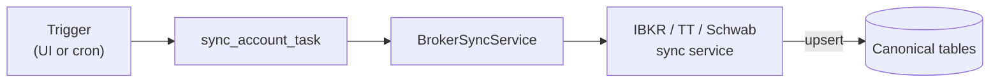

# Brokers and Data Services

**Broker implementation guide** — per-broker auth, sync architecture, how to add a broker. Connections page and OAuth flows: [CONNECTIONS.md](CONNECTIONS.md).

---

## Table of contents

- [Broker integrations](#broker-integrations)
- [Credential storage](#credential-storage)
- [Sync architecture](#sync-architecture)
- [Approach to add a broker](#approach-to-add-a-broker)
- [Index constituents](#index-constituents-service)

---

## Broker integrations

### Implemented

#### IBKR
- **History (system of record):** FlexQuery (trades, tax lots, cash transactions incl. dividends/fees/taxes, account balances, margin interest, transfers, options + exercises)
- **Live overlay:** TWS/Gateway (intraday prices/positions, account summary, discovery)
- **Per-user credentials:** FlexQuery token + query ID stored encrypted in `AccountCredentials` via `CredentialVault` (Fernet). Falls back to env vars `IBKR_FLEX_TOKEN` / `IBKR_FLEX_QUERY_ID` for dev seed accounts.

#### TastyTrade (SDK v12+ OAuth)
- **Auth:** OAuth via `client_secret` + `refresh_token` (no username/password in v12+). The SDK exchanges the refresh token for a session token on each connect.
- **Per-user credentials:** `client_secret` and `refresh_token` stored encrypted in `AccountCredentials`. Falls back to env vars `TASTYTRADE_CLIENT_SECRET` / `TASTYTRADE_REFRESH_TOKEN`.
- **Data:** Accounts, positions (equity + options with greeks/IV), trades, transactions, dividends, balances.
- **Connect flow:**
  1. Frontend posts OAuth credentials to `POST /api/v1/aggregator/tastytrade/connect`
  2. Backend creates a connect job in `ConnectJobStore` (Redis-backed, 600s TTL)
  3. Backend attempts TastyTrade SDK login, discovers accounts, encrypts + stores credentials
  4. Frontend polls `GET /api/v1/aggregator/tastytrade/status?job_id=...` with exponential backoff (1s -> 5s cap)
  5. On success, accounts are created as `BrokerAccount` rows and user is prompted to sync

#### Schwab

OAuth 2.0 + PKCE via `api.schwabapi.com`. Account discovery and token refresh with DB persistence; sync mirrors TastyTrade pattern (positions, transactions, options, balances). Details: [CONNECTIONS.md](CONNECTIONS.md#schwab-integration).

### Planned

- **Fidelity:** No broad public trading API. Possible via partner/experimental; likely read-only first.
- **Robinhood:** Private/undocumented API; trading possible but stability/ToS concerns. Prefer read-only.

## Credential storage

Credentials live in `account_credentials` (one row per broker account), encrypted at rest with Fernet via `CredentialVault`; key from `ENCRYPTION_KEY` (or `SECRET_KEY`-derived in dev). **Key rotation:** [ENCRYPTION_KEY_ROTATION.md](ENCRYPTION_KEY_ROTATION.md). Vault details and UI: [CONNECTIONS.md](CONNECTIONS.md#credential-storage).

## Sync architecture

### Broker sync flow

1. User triggers sync via UI or Celery beat schedule
2. `sync_account_task` (Celery) creates an `AccountSync` row (status=RUNNING)
3. `BrokerSyncService.sync_account_async()` dispatches to broker-specific sync service
4. Sync service loads per-user credentials via `AccountCredentialsService`, falls back to env
5. Positions, trades, transactions, balances upserted into canonical tables
6. `AccountSync` row updated with status, duration, row counts, or error message
7. `BrokerAccount.sync_status` and `last_successful_sync` updated

### Approach to add a broker
1. Client in `app/services/clients/<broker>_client.py` (credential-agnostic)
2. Normalize to canonical fields (`market_value`, `asset_category`, `account_id` FK)
3. Add sync service under `app/services/portfolio/`
4. Expose account add/list/sync routes under `/api/v1/accounts`
5. Store per-user credentials via `AccountCredentials` + `CredentialVault`
6. Optional: env-driven seeding for dev convenience

## Index constituents service
- File: `app/services/market/index_constituents_service.py`
- Purpose: Fetch and cache constituents for SP500, NASDAQ100, DOW30 (FMP primary, Polygon optional, Wikipedia fallback)
- Used to build ATR universe and market scanners
- Cached 24h in Redis to minimize API calls
