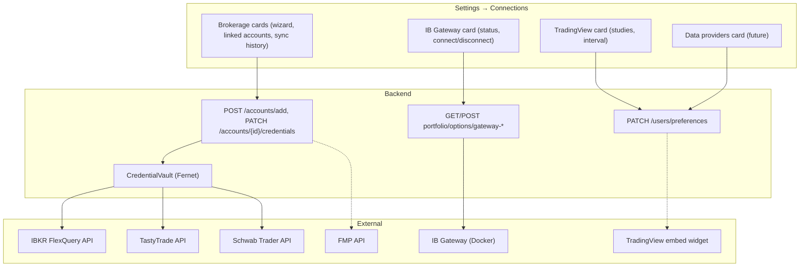
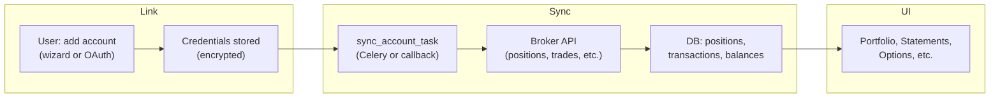
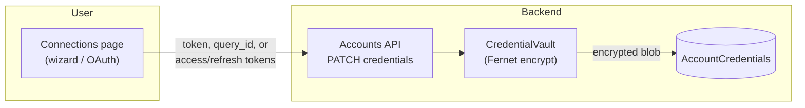
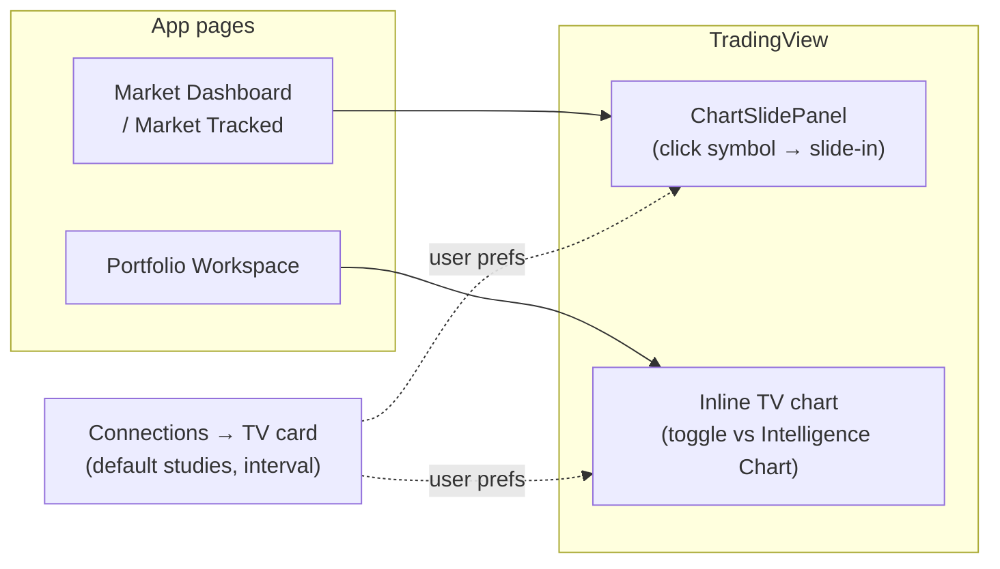
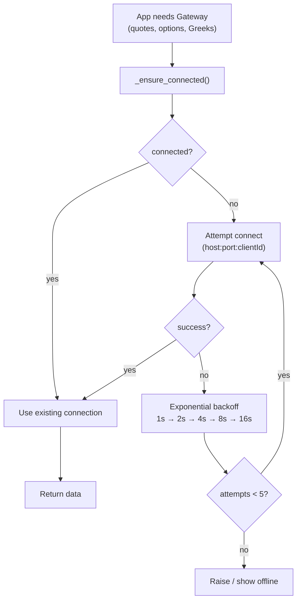
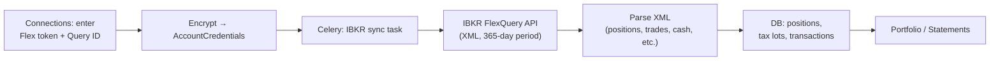
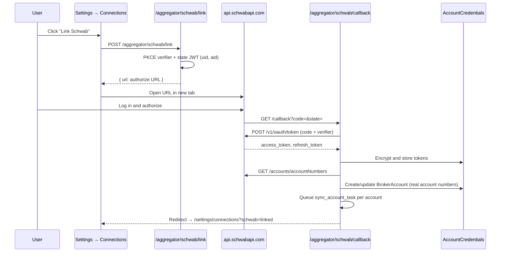
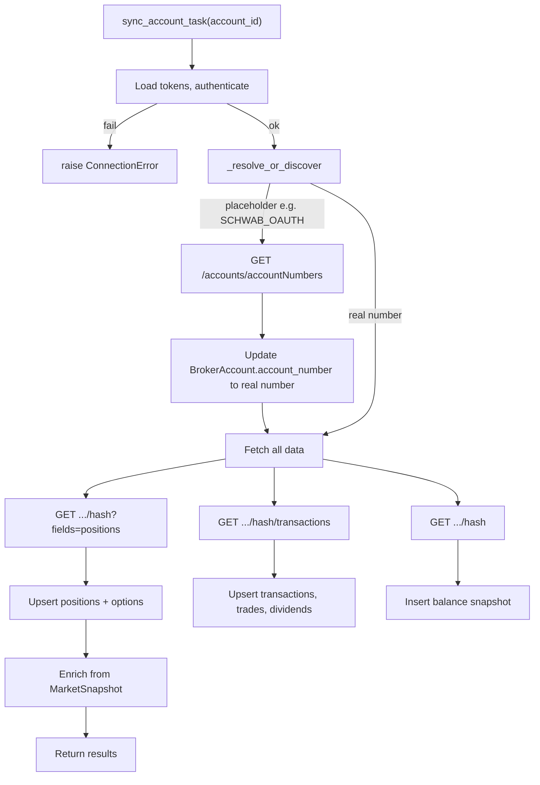

# Connections

**Settings → Connections** is the unified hub for all external service integrations (brokerages, live data, charting preferences, and future data providers). Previously named "Brokerages," the page now encompasses every service AxiomFolio connects to.

---

## Table of contents

- [At a glance](#at-a-glance)
- [Page structure](#page-structure)
- [Connection types](#connection-types)
- [Architecture](#architecture)
- [Credential storage](#credential-storage)
- [TradingView integration](#tradingview-integration)
- [IB Gateway connection](#ib-gateway-connection)
- [FlexQuery configuration (IBKR)](#flexquery-configuration-requirements)
- [Schwab integration](#schwab-integration)
- [Key files](#key-files)

---

## At a glance

| Section | What it covers |
|--------|-----------------|
| **Brokerages** | Link IBKR, TastyTrade, and Schwab; manage credentials and sync history via a wizard. |
| **IB Gateway** | Status, connect/reconnect, and noVNC link for the live data container. |
| **TradingView** | Default studies and interval for in-app charts (no account link). |
| **Data providers** | (Future) FMP and Twelve Data API keys. |

Credentials are encrypted at rest (Fernet). OAuth flows (TastyTrade, Schwab) use PKCE; IBKR uses FlexQuery token + Query ID.

---

## Page structure

The Connections page is organized as cards, one per integration area:

```
Settings → Connections
│
├── Brokerages
│   ├── Interactive Brokers   (FlexQuery token + Query ID)
│   ├── TastyTrade            (OAuth: client_secret + refresh_token)
│   └── Charles Schwab        (OAuth 2.0 + PKCE, account discovery + auto-sync)
│   └── Wizard: add account → credentials → linked accounts → sync history
│
├── IB Gateway
│   ├── Status badge          (connected / offline / error)
│   ├── Host, port, trading mode
│   ├── Connect / Reconnect / Refresh status
│   ├── View Gateway (noVNC)  → http://localhost:6080
│   └── Last connected
│
├── TradingView
│   ├── Default studies       (EMA, RSI, MACD, Volume, Bollinger, VWAP)
│   ├── Default interval      (1m, 5m, 15m, 1h, D, W, M)
│   ├── Info box              (embed limits, pop-out to full TV)
│   └── (Future) Charting Library license key
│
└── Data providers (future)
    ├── FMP API key
    └── Twelve Data API key
```

---

## Connection types

| Type | Service | Auth | Data flow | Status |
|------|---------|------|-----------|--------|
| Brokerage | IBKR FlexQuery | Flex token + Query ID | Positions, trades, options, tax lots, balances | Active |
| Brokerage | TastyTrade | OAuth (client_secret + refresh_token) | Positions, trades, transactions, dividends | Active |
| Brokerage | Schwab | OAuth 2.0 + PKCE | Positions, transactions, options, balances | Active |
| Live data | IB Gateway | TWS API (host:port:clientId) | Real-time quotes, option chains, Greeks | Active |
| Charting | TradingView | Preferences only | Default studies/interval (public embed) | Active |
| Data provider | FMP | API key | OHLCV, fundamentals, index constituents | Future |
| Data provider | Twelve Data | API key | OHLCV fallback | Future |

---

## Architecture



### Brokerage data lifecycle (high level)

From linking an account to seeing data in the app:



---

## Credential storage

All sensitive credentials are encrypted at rest with **Fernet** symmetric encryption (`CredentialVault`). Storage is per-user via `AccountCredentials`. Key rotation invalidates stored credentials; procedure: [ENCRYPTION_KEY_ROTATION.md](ENCRYPTION_KEY_ROTATION.md).



| Integration | Stored in vault |
|-------------|-----------------|
| IBKR | FlexQuery token, Query ID; optional gateway host/port/client_id |
| TastyTrade | OAuth client_secret, refresh_token |
| Schwab | OAuth access_token, refresh_token (auto-refreshed on 401) |
| FMP | (Future) API key, per-user |

### IBKR credential payload

`AccountCredentials.encrypted_credentials` for IBKR (decrypted shape):

```json
{
  "flex_token": "...",
  "query_id": "...",
  "gateway_host": "ib-gateway",
  "gateway_port": 8888,
  "gateway_client_id": 1
}
```

The `gateway_*` fields are optional. When set, gateway-connect uses them instead of global env. Managed via `PATCH /accounts/{id}/gateway-settings`.

---

## TradingView integration

Charts are **in-app only**; users do not leave AxiomFolio.



- **Widget**: Free public embed (`s3.tradingview.com/.../embed-widget-advanced-chart.js`). Anonymous iframe — no TradingView account link. No Pine Scripts or saved layouts; built-in studies (EMA, RSI, MACD, Bollinger, VWAP, Volume) are toggled via our toolbar.
- **Where used**: (1) **ChartSlidePanel** on Market Dashboard / Market Tracked (click symbol → slide-in panel); (2) **PortfolioWorkspace** (toggle Intelligence Chart vs embedded TV).
- **Connections card**: Default studies and interval are saved to server-side user preferences (cross-device). Info box explains embed limits and how to open full TradingView in a new tab. Future: Charting Library license key for custom data and account integration.

---

## IB Gateway connection

IB Gateway runs as a Docker service (`ib-gateway` in `compose.dev.yaml`) using `ghcr.io/extrange/ibkr:stable` (chosen over `gnzsnz/ib-gateway` due to ARM64 API port issues).

| Port | Purpose |
|------|---------|
| 8888 | Unified API (TWS) |
| 6080 | noVNC (gateway UI at `http://localhost:6080`) |

**Env (in `compose.dev.yaml`)**: `USERNAME` / `PASSWORD` (from `IBKR_USERNAME` / `IBKR_PASSWORD`), `GATEWAY_OR_TWS: gateway`, `IBC_TradingMode` (paper/live), `IBC_ReadOnlyApi: "yes"`.

**Connection behavior**: On-demand reconnect via `_ensure_connected()` before any Gateway call; exponential backoff (1s → 2s → 4s → 8s → 16s, max 5 attempts). No Celery keep-alive; reconnect is manual (Connections page or GatewayStatusBadge). "View Gateway (noVNC)" opens the gateway UI.



**Makefile**: `make ib-up` | `make ib-down` | `make ib-verify`.

### Session Persistence

IB Gateway settings are persisted via `TWS_SETTINGS_PATH=/settings` and `ibkr-settings` Docker volume. This ensures:

- API port configuration (4001 for live, 4002 for paper) survives container restarts
- Gateway preferences are retained
- 2FA is only required after cold restarts or weekly session expiry

### 2FA Behavior

IBKR requires second-factor authentication. Best practices:

- Use **IBKR Mobile (IB Key)** push notifications - acknowledge on phone
- Session persists after initial auth, reducing 2FA frequency
- Full 2FA only needed after: weekly credential expiry, container recreation without volume, manual logout
- `IBC_AcceptIncomingConnectionAction=accept` auto-accepts API client connections

### Multi-tenant (future)

One authenticated session per IBKR username per container. **Current**: dev = single Gateway container from env; production = per-account gateway host/port/client_id in encrypted credentials, one concurrent Gateway user. **Future options**: (A) Container-per-user via Docker/K8s orchestrator, port allocation, connection pool keyed by user; (B) IBKR Client Portal API (REST, no container, read-only focused). Migration: add orchestrator, switch `IBKRClient` from singleton to pool, add container lifecycle.

---

## FlexQuery configuration requirements

For IBKR sync, the FlexQuery must be set up in IBKR Account Management.



Setup steps:

1. **Reports → Flex Queries → Activity Flex Query** — create or edit.
2. **Sections to include**: Open Positions (lot-level), Trades, Cash Transactions, Account Information, Interest Accruals, Transfers.
3. **Period**: Last 365 Calendar Days.
4. **Format**: XML.
5. **Flex Web Service**: Enable; generate token and note Query ID.
6. Enter token and Query ID in the AxiomFolio connection wizard.

**Check**: `GET /api/v1/accounts/flexquery-diagnostic` for sections, row counts, and date range.

---

## Schwab integration

Schwab uses **OAuth 2.0 + PKCE** against the Schwab Trader API (`api.schwabapi.com`).

### Developer portal

| Field | Value |
|-------|--------|
| Portal | [developer.schwab.com](https://developer.schwab.com) |
| Callback URL | `https://api.axiomfolio.com/api/v1/aggregator/schwab/callback` |
| API domain | `api.schwabapi.com` (post–TD Ameritrade) |

### OAuth flow



### Token and API details

- **Authorize**: `https://api.schwabapi.com/v1/oauth/authorize`
- **Token**: `https://api.schwabapi.com/v1/oauth/token` (HTTP Basic with client_id:client_secret)
- **PKCE**: S256; verifier in state JWT (`cv` claim) — no Redis.
- **Refresh**: On 401, `SchwabClient._ensure_token()` refreshes and persists via callback.
- **Discovery**: Callback calls `GET /accounts/accountNumbers`, creates/updates `BrokerAccount` with real numbers, then queues sync for each.

### Environment variables

| Variable | Purpose |
|----------|---------|
| `SCHWAB_CLIENT_ID` | App Key from portal |
| `SCHWAB_CLIENT_SECRET` | App Secret |
| `SCHWAB_REDIRECT_URI` | Must match portal (e.g. `https://api.axiomfolio.com/api/v1/aggregator/schwab/callback`) |
| `SCHWAB_AUTH_BASE` | Optional override for authorize URL |

### Local OAuth testing

Callback is fixed to production URL. Options:

- **Tunnel**: `make tunnel-on` (tunnel to local backend), complete OAuth at `http://localhost:5173/settings/connections`, then `make tunnel-off`. See [PRODUCTION.md](PRODUCTION.md#cloudflare-tunnel-local-dev-oauth).
- **Prod**: Link from `https://axiomfolio.com/settings/connections`; dev and prod share `OAUTH_STATE_SECRET`, so tokens work on both.

### Trader API (summary)

Base: `https://api.schwabapi.com/trader/v1`

| Endpoint | Method | Purpose |
|----------|--------|---------|
| `/accounts/accountNumbers` | GET | List account numbers + hashValue |
| `/accounts/{hash}?fields=positions` | GET | Positions (equity + options) and balances |
| `/accounts/{hash}/transactions` | GET | Transactions (max 60 days) |
| `/accounts/{hash}` | GET | Balances (default fields) |

Positions and options come from the same `?fields=positions` response; client filters by `instrument.assetType`.

### Sync flow (account discovery fallback)

When `account_number` is still the placeholder (e.g. `SCHWAB_OAUTH`) — for example if sync ran before the OAuth callback updated it — the sync service uses `_resolve_or_discover` to call `GET /accounts/accountNumbers`, pick the real account, update the `BrokerAccount` record, then proceed. So the flow below covers both “already real number” and “placeholder → auto-correct → then sync.”



---

## Key files

| Area | File | Purpose |
|------|------|---------|
| **Frontend** | `frontend/src/pages/SettingsConnections.tsx` | Connections page (ex-SettingsBrokerages) |
| | `frontend/src/pages/SettingsShell.tsx` | Settings nav (label "Connections") |
| | `frontend/src/components/charts/TradingViewChart.tsx` | Embedded TV widget |
| | `frontend/src/components/market/SymbolChartUI.tsx` | ChartSlidePanel (TV in dashboard/workspace) |
| **Backend** | `app/api/routes/aggregator.py` | `/schwab/link`, `/schwab/callback` |
| | `app/services/aggregator/schwab_connector.py` | OAuth URL, token exchange, refresh |
| | `app/services/clients/schwab_client.py` | Schwab Trader API client |
| | `app/services/portfolio/schwab_sync_service.py` | Sync orchestration, _resolve_or_discover |
| | `app/services/portfolio/account_credentials_service.py` | Credential vault access |
| | `app/services/clients/ibkr_client.py` | IB Gateway client (singleton) |
| | `app/api/routes/portfolio_options.py` | Gateway status/connect |
| **Infra** | `infra/compose.dev.yaml` | IB Gateway service (ports 8888, 6080) |
