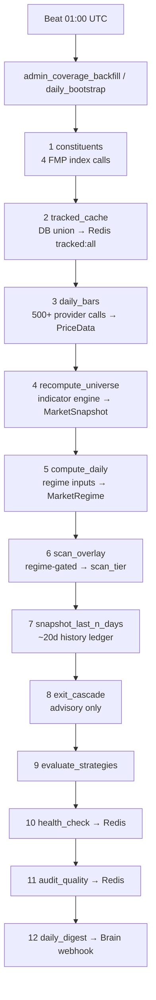
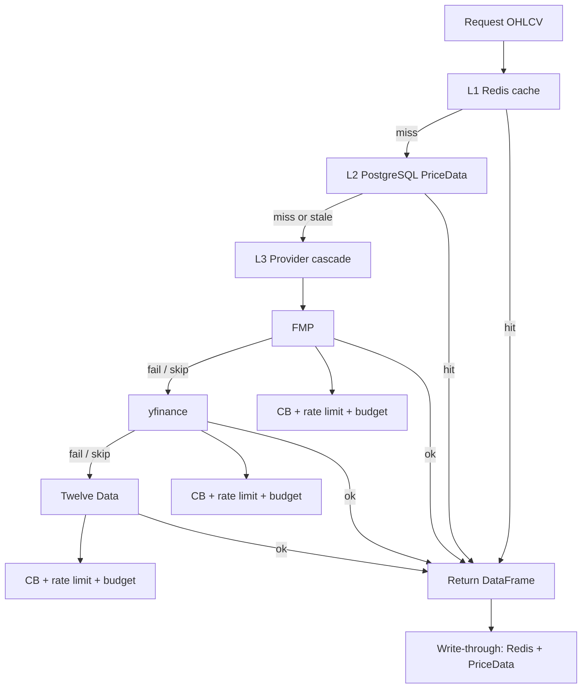
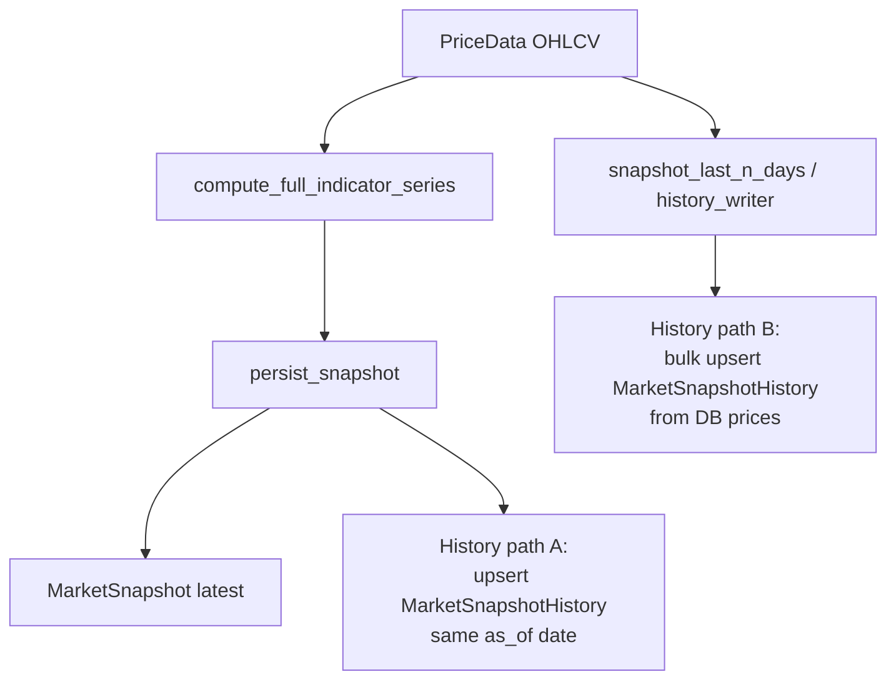
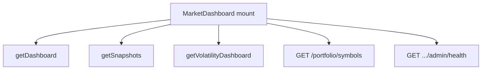

# Market Data Ingest and Storage Strategy

Pipeline overview and scheduling: [ARCHITECTURE.md](ARCHITECTURE.md#data-pipelines).

---

## Table of contents

- [At a glance](#at-a-glance)
- [Goals](#goals)
- [Scope and Sources](#scope-and-sources)
- [Environment configuration](#environment-configuration-dev)
- [Data We Compute/Serve](#data-we-computeserve-indicator_engine)
- [Architecture diagrams](#architecture-diagrams)
- [Dev world](#dev-world-local)
- [Persistence Model](#persistence-model)
- [Scheduling](#scheduling)
- [Paid mode operations](#paid-mode-operations)
- [Data flows](#data-flows)

---

## At a glance

| Item | Summary |
|------|---------|
| **Goals** | Centralize market data; 200-day indicators for SPY, NASDAQ 100, Dow 30, held symbols; lightweight snapshots |
| **Sources** | FMP → Twelve Data → yfinance (paid); Finnhub → Twelve Data → yfinance (free) |
| **Persistence** | `price_data` (OHLCV), `market_snapshot` (latest), `market_snapshot_history` (daily ledger); Redis cache |

---

## Goals
- Centralize market data access via `app/services/market/market_data_service.py`
- Provide reliable indicators for last 200 trading days for: SPY, NASDAQ 100, Dow 30, and all held symbols (Russell 2000 roadmap)
- Persist lightweight, query-friendly snapshots when needed; avoid over-storing raw API payloads
- Schedule refreshes and cache to keep API usage efficient

## Scope and Sources
- OHLCV only from providers; ALL indicators computed locally from stored OHLCV
- Provider priority (paid mode): FMP → Twelve Data → yfinance; (free mode): Finnhub → Twelve Data → yfinance
- Redis cache for transient responses and computed indicators

## Environment configuration (dev)

- **Run dev via Makefile only**: `make up` from `apis/axiomfolio/` drives the root `infra/compose.dev.yaml`; env values come from `infra/env.dev.defaults` + `.env.secrets` at repo root (see `docs/INFRA.md`).
- **Source of truth**: put all dev secrets (FMP/Finnhub keys, Brain webhook URL/secret, etc.) into repo-root **`.env.secrets`** (gitignored).
- **Do not rely on root `.env`**: backend settings no longer implicitly load a repo-root `.env`. If you truly need an env file outside Docker, set `QM_ENV_FILE=/path/to/file`.
- **Frontend safety**: the `frontend` and `ladle` containers do **not** receive `infra/env.dev` (to avoid leaking secrets). Only `VITE_*` variables explicitly passed in compose are available to the browser build.

## Data We Compute/Serve (indicator_engine)
For each symbol:
- RSI(14)
- SMA(5/8/21/20/50/100/200), EMA(10/8/21/200)
- ATR(14), ATR percent, ATR distance to SMA50
- ADX(14), DI+, DI-
- MACD(12,26,9), signal line
- Performance: 1d, 3d, 5d, 20d, 60d, 120d, 252d, MTD, QTD, YTD
- MA alignment flags, MA bucket (LEADING/LAGGING/NEUTRAL)
- Classification: sector, industry, sub-industry (best-effort)

Responsibilities by layer
-------------------------
- indicator_engine.py: Pure computations from OHLCV (SMA/EMA/RSI/ATR/MACD/ADX, perf windows, MA bucket, TD/gaps/trendlines, weekly stage helpers).
- market_data_service.py: Provider access (prices/history/info), Redis caching, DB snapshot assembly from local `price_data`, enrichment (chart metrics + fundamentals), and persistence to `MarketSnapshot`.
- `app/tasks/market/`: Celery orchestration only. Builds tracked sets, backfills OHLCV, invokes service to build/enrich/persist snapshots, and records daily history (see per-module tasks under `backfill`, `coverage`, `history`, `indicators`, etc.).

## Architecture diagrams

### Data flow (requests + tasks)

### Scheduling (dev vs prod)

## Dev world (local)
- Use `make up` from `apis/axiomfolio/` to start Postgres, Redis, backend, and workers. Frontend runs host-side via `pnpm dev:axiomfolio` from repo root.
- Trigger any task manually with `make task-run TASK=app.tasks.market.<module>.<function>` (example: `app.tasks.market.coverage.daily_bootstrap`).
- Use Admin > Schedules in the UI to create/edit/pause/resume schedules and trigger tasks via "Run Now".
- Coverage refresh path: run `admin_coverage_refresh`, then check `/api/v1/market-data/coverage`.

## Persistence Model
- `market_data.PriceData`: daily/intraday OHLCV with unique `(symbol, date, interval)` (constraint: `uq_symbol_date_interval`)
- `market_data.MarketSnapshot`: compact latest technical snapshot per symbol with expiry (`expiry_timestamp`), including `ma_bucket`
  - Includes persisted stage fields: `stage_label`, `stage_slope_pct`, `stage_dist_pct`
- `market_data.MarketSnapshotHistory`: immutable daily snapshots keyed by `(symbol, analysis_type, as_of_date)`

## Scheduling
- Weekly constituents refresh (SP500, NASDAQ100, DOW30) → table `index_constituents`
- Nightly tracked-universe cache build (Redis: `tracked:all`, `tracked:new`)
- Nightly backfill for newly tracked symbols only (reads `tracked:new`)
- Nightly delta backfill safety for portfolio symbols (last-200)
- Nightly recompute indicators for full universe (from local `price_data`)
- Nightly history recording (`market_snapshot_history`)
- Coverage-health snapshot (`admin_coverage_refresh` / `health_check`) caches freshness buckets + stale symbol lists in Redis so Admin coverage views can render SLAs quickly and alert on drift (runs after nightly bootstrap and on demand).

### Schedule Management (DB + Celery Beat)

Schedules are stored in the `cron_schedule` PostgreSQL table for admin UI, history, and overrides. **Runtime scheduling** is driven by **Celery Beat**, which builds `beat_schedule` from `app/tasks/job_catalog.py` (`app/tasks/celery_app.py`). Default rows are seeded from the same catalog on deploy (`seed_schedules`). The Admin > Schedules UI provides CRUD (create, edit cron, pause, resume, delete) on the DB mirror.

Legacy **Render cron sync** (`render_sync_service.py`, `sync_render_crons`) exists for optional platform cron deployments but is **not** the primary driver when Beat runs in the worker (`--beat`). See D44 in [KNOWLEDGE.md](KNOWLEDGE.md).

Paid mode operations
--------------------
- Ensure provider policy is set to paid (default): `MARKET_PROVIDER_POLICY=paid`
- Configure API keys in `.env`: `FMP_API_KEY`, `TWELVE_DATA_API_KEY`, `FINNHUB_API_KEY`
- To force ingestion now (admin flow):
  - Refresh constituents: POST `/api/v1/market-data/admin/backfill/index?index=SP500`
  - Backfill index OHLCV: POST `/api/v1/market-data/admin/backfill/index` (SP500/NASDAQ100/DOW30)
  - Refresh portfolio indicators: Celery task `refresh_portfolio_indicators`
  - Refresh index indicators: POST `/api/v1/market-data/admin/indicators/refresh-index`
  - Record history: POST `/api/v1/market-data/admin/snapshots/history/record`
  - Compute chart metrics for an index: scheduled via Celery (`chart-metrics-sp500`) or call task `compute_chart_metrics_index`
  - Compute chart metrics for the universe: scheduled via Celery 

### FMP Tier Configuration

Throughput is controlled by a **single env var**: `MARKET_PROVIDER_POLICY` (default `paid`).  
All per-provider budgets, rate limits, and concurrency derive from the selected tier via `ProviderPolicy` in `backend/config.py`.

| Setting | `free` | `starter` ($22/mo) | `paid` ($59/mo) | `unlimited` |
|---------|--------|---------------------|-----------------|-------------|
| FMP daily budget | 200 | 3,000 | 100,000 | 999,999 |
| FMP calls/min | 250 | 280 | 700 | 2,800 |
| TwelveData daily | 100 | 800 | 800 | 800 |
| yfinance daily | 5,000 | 10,000 | 10,000 | 10,000 |
| Backfill concurrency | 5 | 25 | 50 | 100 |
| Deep backfill allowed | No | No | No | Yes |
| Full historical cron | No | No | No | Yes |
| Auto-ops backfill | No | No | No | Yes |

> **Legacy env vars** (`PROVIDER_DAILY_BUDGET_FMP`, `RATE_LIMIT_FMP_CPM`, `MARKET_BACKFILL_CONCURRENCY_PAID`) are deprecated. They are ignored when `MARKET_PROVIDER_POLICY` is set. See `infra/env.dev.example` for migration notes.

**Switching tiers:**

1. Change `MARKET_PROVIDER_POLICY` in Render Dashboard (API + Worker services) or `infra/env.dev` locally
2. Deploy both services (env var change requires restart)
3. All ingested data stays in the DB — historical depth is preserved
4. Daily maintenance (`stale_daily`) needs ~50-100 calls/day, trivial at any paid tier
5. No code changes needed

**Switching to Free tier:**

1. Set `MARKET_PROVIDER_POLICY=free` in Render (or `infra/env.dev` locally)
2. yfinance becomes the effective primary for daily maintenance; FMP reserved for high-priority symbols within the 200/day budget

**Deep historical backfill:**

- Trigger via: `POST /api/v1/market-data/admin/backfill/since-date?since_date=1990-01-01`
- `daily_since` bypasses the L2 DB cache (`skip_l2=True`) so every symbol hits the external API
- Premium plan: ~2500 symbols at 700/min ≈ 20 min fetch + 60 min persist + 60 min indicators/snapshots
- The `full_historical` task has 3h soft / 4h hard time limits

Notes on retention
------------------
- Default OHLCV backfill keeps ~270 recent daily bars to support SMA(200) and 252d windows quickly.
- For deeper history, call provider directly via service or extend tasks to multi-year fetch using FMP `historical_price_full`.

## API Contracts
- `GET /api/v1/market/prices?symbol=SPY&range=200d&interval=1d`: returns OHLCV
- `GET /api/v1/market/atr?symbol=SPY`: ATR and volatility regime
- `GET /api/v1/market/ta?symbol=SPY`: RSI, MAs, MACD, ADX, performance windows

## Index Constituents
- `app/services/market/index_constituents_service.py` fetches SP500, NASDAQ100, DOW30 (R2K roadmap)
- Persisted in DB: `app/models/index_constituent.py` with `is_active`, `first_seen_at`, `became_inactive_at`
- We do not drop symbols that leave an index; they are marked inactive and remain tracked

## Notes
- Provider selection is adaptive; when keys exist, paid providers take precedence
- Avoid duplicating raw provider payloads; store normalized OHLCV + compact snapshots

## End-to-End Indicator Pipeline
1) Fetch historical data
   - Source order: FMP → Twelve Data → yfinance (fallbacks) with adaptive rate limiting (free mode uses Finnhub first)
   - Cached in Redis per `(symbol, period, interval)`
2) Compute indicators (indicator_engine)
   - Core set: RSI, ATR, SMA/EMA, MACD+signal, ADX/DI, performance windows, MA alignment, ATR-matrix metrics
3) Build snapshot
   - Prefer local DB: `MarketDataService.build_snapshot_from_db_prices(db, symbol)`
   - Fallback: `MarketDataService.build_indicator_snapshot(symbol)` (pull OHLCV then compute)
   - Enrich: `MarketDataService.enrich_chart_metrics_and_fundamentals(db, symbol, snapshot)` adds TD/gaps/trendlines + best-effort sector/industry/market_cap
4) Persist snapshot
   - `MarketDataService.persist_snapshot(db, symbol, snapshot)` upserts latest into `MarketSnapshot` and stores `raw_analysis`
5) History recording (optional)
   - `admin_snapshots_history_record` writes one row per `(symbol, as_of_date)` into `MarketSnapshotHistory` with headline fields + full payload
6) Scheduling
   - Celery Beat triggers:
     - nightly guided daily backfill → `admin_coverage_backfill`
     - coverage cache refresh → `admin_coverage_refresh` (end of `daily_bootstrap`, or on-demand from Admin)
     - nightly 5m backfill → `app.tasks.market.intraday.bars_5m_last_n_days` (job id `admin_backfill_5m`)
     - retention enforcement (5m) → `app.tasks.market.maintenance.prune_old_bars` (job id `admin_retention_enforce`)

## Intraday (5m) Backfill and Retention
- Persist 5m bars for tracked symbols (default lookback: 5–30 days)
- Providers: FMP `historical_chart(5min)` → Twelve Data 5min → yfinance 5m
- Retain last 90 days of 5m data by default; enforce via scheduled retention task

## Admin Area (RBAC: admin)
- Dashboard: freshness KPIs, last task statuses, quick actions (tracked update, backfills, recompute, record history, coverage monitor)
- Jobs: view recent `job_run` rows with durations, counters, errors, and drill-in modal for params/counters/logs
- Schedules: full CRUD via DB-backed API (mirror of catalog + edits). Inline cron editing, pause/resume, delete, run-now. Default jobs seeded from `job_catalog.py`. Beat consumes the catalog at worker startup; keep catalog and DB aligned after deploy seeds.
- Coverage: daily and 5m coverage summary, stale (>48h) lists, missing 5m table, education/hints, one-click schedule for coverage monitor
- Tracked: view `tracked:all` and `tracked:new` (Redis), optional columns (price, ATR, stage, market cap, sector), quick actions to refresh/update/backfill (admin-only for any mutations)

## API Additions
- `GET /api/v1/market-data/admin/db/history?symbol=SPY&interval=1d|5m&start&end&limit`
- `GET /api/v1/market-data/coverage` and `/coverage/{symbol}`
- `POST /api/v1/market-data/indices/constituents/refresh` (admin)
- `POST /api/v1/market-data/symbols/{symbol}/refresh` (admin)
- `POST /api/v1/market-data/admin/backfill/5m?n_days=5&batch_size=50` (admin)
- `POST /api/v1/market-data/admin/retention/enforce?max_days_5m=90` (admin)
- `GET /api/v1/market-data/admin/jobs` (admin)
- `GET /api/v1/market-data/admin/tasks` and `POST /api/v1/market-data/admin/tasks/run` (limited set; admin)
- `GET /api/v1/admin/schedules` / `POST|PUT|DELETE /admin/schedules/{id}` / `POST /admin/schedules/{id}/pause|resume` / `POST /admin/schedules/sync|run-now` / `GET /admin/schedules/preview` — DB-backed schedule CRUD (Celery Beat is the live scheduler; see D44)

## Coverage & Freshness (SLA)

- `GET /api/v1/market-data/coverage` returns:
  - symbols: distinct symbols in `price_data`
  - tracked_count: Redis `tracked:all` size
  - indices: active member counts (SP500, NASDAQ100, DOW30)
  - daily/m5: { count, last: {symbol->iso ts}, freshness buckets: {"<=24h","24-48h",">48h","none"} }
- SLA guidance:
  - Daily coverage ≥ 90% of symbols
  - No symbols in >48h bucket under normal operation
  - 5m coverage present for D‑1 during market days

## Universe Bootstrap Runbook

This runbook has been replaced by the guided operator flow below (“Backfill Daily Coverage (Tracked)”),
which encapsulates the daily backfill chain without exposing redundant backfill endpoints.

Troubleshooting:
- If Refresh fetched 0 members: check provider reachability; FMP quota; Wikipedia blocked; rerun.
- If freshness shows many >48h: run Backfill Daily, Recompute, then Record History.
- If 5m coverage is 0 after market opens: run Backfill 5m (D‑1).

## Index Refresh Observability

- Provider strategy: FMP-first, Wikipedia fallback (HTML tables)
- JobRun.counters per index include: fetched, inserted, reactivated, inactivated, provider_used, fallback_used
- Redis meta: `index_constituents:{INDEX}:meta` stores {provider_used, fallback_used, count} for 24h

## Schedule Architecture

- **Celery Beat** builds the live periodic schedule from `app/tasks/job_catalog.py` (`CATALOG`); see `app/tasks/celery_app.py`.
- The `cron_schedule` PostgreSQL table stores the **admin-editable mirror** (seeded on deploy, CRUD in UI) for visibility, run-now, and optional legacy Render sync metadata.
- Default definitions live in `job_catalog.py` and are seeded via `app/scripts/seed_schedules.py`.
- The Admin Schedules UI provides full CRUD: create, inline-edit cron expressions, pause/resume, delete, and "Run Now".
- Optional **Render cron sync** (`app/services/render_sync_service.py`) may still mirror DB rows to Render cron services when enabled; primary production path is Beat in the worker (D44).
- Pre-deploy often runs `seed_schedules` after migrations; `sync_render_crons` is only relevant if platform crons are in use.

### Scheduler Alerts & Prometheus Hooks

- Per-job hooks can target **Brain** (and other channels supported by `NotificationService` / task_run metadata). Prefer Brain webhook delivery for operational alerts (D33).
- Event types emitted by `task_run`:
  - `failure` (default) when task raises.
  - `slow` when runtime exceeds `metadata.safety.timeout_s`.
  - `success` when runs complete (opt-in by including `"success"` in `alert_on`).
- `hooks.prometheus_endpoint` can point to a Pushgateway-compatible URL. Each run writes `axiomfolio_task_duration_seconds{task="...",event="...",queue="..."} <value>` so Grafana/Prometheus alerting rules can detect spikes.
- Admin Schedules UI surfaces hook fields under Alerts & Observability (targets, Prometheus endpoint, opt-in events).

## Coverage Health Monitor

- Celery task `admin_coverage_refresh` (`health_check`) runs after nightly bootstrap and on demand (e.g. Admin "Refresh coverage now"); it caches:
  - `generated_at`, total tracked symbols, index member counts
  - Daily + 5m coverage counts, freshness buckets, stale lists (first 50 symbols per bucket)
  - Status summary (`ok` / `degraded`) plus tracked symbols
- Redis key `coverage:health:last` feeds Admin Dashboard/Coverage quick actions and SLA banners, enabling Brain/alert hooks to detect drift without hitting Postgres every refresh.

### Manual refresh / UI behavior

- **Admin Dashboard “Refresh coverage now”** calls `POST /api/v1/market-data/admin/backfill/coverage/refresh` which enqueues `admin_coverage_refresh`.
- **Auto-refresh**: Admin Dashboard will auto-trigger a refresh when the cached snapshot is missing or older than ~15 minutes, but still renders immediately using the current response.
- **Cache vs DB**: `GET /api/v1/market-data/coverage` returns `meta.source` (`cache` or `db`) and `meta.updated_at` so you can see whether you’re looking at the last monitor run or a direct DB fallback.

## Operator Runbook (recommended)

### Goal: backfill Daily coverage to green (tracked universe)

- **Use this when**: Coverage shows `>48h` or `none` buckets, or Daily % drops.
- **Primary button** (Settings → Admin → Dashboard): **Backfill Daily Coverage (Tracked)**
  - Enqueues: `admin_coverage_backfill`
  - What it does (no 5m): refresh constituents → update tracked → backfill last-200 daily bars (tracked) → recompute indicators → record history → refresh coverage cache.
  - Snapshot history window: controlled by an explicit `history_days` parameter (current API/cron default is 20 days), so the “days since last successful run” auto behavior in `app.tasks.market.coverage.daily_bootstrap` does not apply to this path unless `history_days` is omitted.

### Fast fix: stale-only backfill

- **Use this when**: Only a subset of symbols are stale.
- Click **Backfill Daily (Stale Only)**
  - Calls: `POST /api/v1/market-data/admin/backfill/coverage/stale` then refreshes coverage.

### Fill Missing Fundamentals

- **Use this when**: Symbols in `market_snapshot` have NULL `name`, `sector`, or `industry`. This typically happens when FMP rate-limits during `app.tasks.market.indicators.recompute_universe`.
- Click **Fill Missing Fundamentals** under Show Advanced > Maintenance.
  - Calls: `POST /api/v1/market-data/admin/fundamentals/fill-missing`
  - Safe to re-run; idempotent. Logs `updated`/`skipped`/`errors` counters to Admin > Jobs.
  - If FMP rate-limits again, simply re-trigger later.

### Repair Stage History

- **Use this when**: Stage quality health shows monotonicity violations, or `current_stage_days`/`previous_stage_label`/`previous_stage_days` look wrong in history.
- Click **Repair Stage History** under Show Advanced > Maintenance.
  - Calls: `POST /api/v1/market-data/admin/stage/repair?days=120`
  - Recomputes `current_stage_days`, `previous_stage_label`, `previous_stage_days` for the last 120 days of `market_snapshot_history`.
  - Also syncs the latest stage run metadata to the corresponding `market_snapshot` row.

### Schedule Visibility

- **All environments**: Schedule definitions originate in `job_catalog.py`; rows in `cron_schedule` mirror them for the Admin > Schedules UI.
- **Production**: **Celery Beat** in the worker executes periodic tasks from the catalog. Optional Render cron sync applies only if that integration is enabled (D44).
- **Local / Dev**: Use Admin > Schedules "Run Now" or `make task-run` to dispatch work; Beat runs when the worker is up with beat enabled.
- Catalog includes jobs such as `audit_quality_refresh` → `app.tasks.market.maintenance.audit_quality` (see `job_catalog.py` for current crons).

### Advanced: index-only vs tracked-universe

Legacy per-universe daily backfill endpoints were removed to keep the operator surface area minimal.

## Data flows

_Merged from `docs/archive/MARKET_DATA_FLOWS.md` on 2026-04-24._

This page is a visual companion to [ARCHITECTURE.md](ARCHITECTURE.md) (system layout, job catalog) and [MARKET_DATA.md](MARKET_DATA.md) (tiers, env, operations). It focuses on **end-to-end data movement**, timing, rough volumes, and how failures are handled.

---

## 1. Nightly pipeline flow

**Timing:** Celery Beat fires **`admin_coverage_backfill`** at **01:00 UTC** (`0 1 * * *`). The orchestrator is `app.tasks.market.coverage.daily_bootstrap`, locked with a single-flight key so only one run proceeds at a time.

**Budget:** Task soft limit **3500s (~58m)** and hard limit **3600s** (`_DEFAULT_SOFT` / `_DEFAULT_HARD` in `coverage.py`); `job_catalog` default `timeout_s` is **3600** for this template.

**Volumes (order of magnitude):** Step 1 hits **four** index constituent sources (FMP) → `IndexConstituent`. Step 3 walks the tracked universe with **hundreds of provider calls** (policy-dependent) → `PriceData`. Step 4 recomputes indicators for the full tracked set → `MarketSnapshot`. Step 7 defaults to **20** SPY-calendar trading days of ledger rows (`history_days` in catalog kwargs).

**Failure handling:** Steps 1–9 and 11–12 wrap most work in **try/except**: failures are **logged**, recorded in the rollup as `status: error`, and the chain **continues** (partial night). **SoftTimeLimitExceeded** aborts the whole task. Step 10 (`health_check`) runs without the same non-fatal wrapper—treat as critical for coverage telemetry.

---

## 2. Provider call chain (historical OHLCV)

**Levels:** **`get_historical_data`** in `market_data_service.py` implements **L1 Redis** (JSON series cache + hit counters), **L2 PostgreSQL `PriceData`** (fresh-enough bars short-circuit to cache), **L3 provider loop** in policy order (typically **FMP → yfinance → Twelve Data** for `historical_data`).

**Per L3 attempt:** **`_is_provider_available`** (circuit breaker), **Redis hash budget** check on `provider:calls:{YYYY-MM-DD}`, then **`provider_rate_limiter.acquire(...)`** before HTTP. Successful fetches **write through** to Redis cache and **best-effort** `persist_price_bars` → `PriceData`.

**Failures:** Provider exceptions increment CB failure counts and **try the next provider**. Empty or over-budget providers are **skipped** with warnings.

---

## 3. Snapshot lifecycle

**Computation:** All indicator fields flow through **`compute_full_indicator_series()`** in `indicator_engine.py` (single path from `PriceData` / OHLCV).

**`MarketSnapshot`:** Latest technical row per symbol is written via **`persist_snapshot`** (and related recompute paths) as the **mutable head**.

**`MarketSnapshotHistory` (ledger):** Two complementary write paths:

1. **Inline with persist:** `persist_snapshot` **upserts** a history row for the snapshot’s **`as_of`** trading date (idempotent by symbol + type + date).
2. **Batch backfill:** **`snapshot_last_n_days`** (nightly step 7) rebuilds ledger rows from **local** `PriceData` over the window (bulk upsert / per-symbol tasks), independent of a single persist call.

**Failure handling:** Persist and history upserts log and roll back per transaction boundaries; batch steps aggregate errors per symbol/batch.

---

## 4. Dashboard data load (Market Dashboard)

**Timing:** On **`MarketDashboard`** mount, **five** independent React Query hooks each issue **parallel** HTTP calls (no single `Promise.all`, but simultaneous on first paint).

**Client methods / routes (actual code):**

| Shorthand | Implementation |
|-----------|----------------|
| `getDashboard` | `marketDataApi.getDashboard()` → market dashboard aggregate API |
| `getSnapshots` | `marketDataApi.getSnapshots(limit)` → large snapshot table payload |
| `getVolatility` | `marketDataApi.getVolatilityDashboard()` (volatility hook) |
| `getPortfolioSymbols` | `GET /portfolio/symbols` via `usePortfolioSymbols` |
| `getAdminHealth` | `GET /market-data/admin/health` via `useAdminHealth` |

**Volumes:** Snapshots default to **5000** rows (`SNAPSHOT_LIMIT` in `useMarketSnapshots`). Dashboard aggregate is bounded server-side; admin health is a composite JSON blob.

**Failure handling:** Each query has its **own** error/loading state; dashboard body can still render partially if one query fails.

---

## Known single points of failure

| Risk | Impact | Notes |
|------|--------|--------|
| **Redis as gateway for budget check** | L1 miss; L3 budget tally reads Redis | Counters in `provider:calls:{date}`. **Fixed:** **fail-open-with-warning** when the budget check cannot read Redis—provider calls proceed with a warning instead of treating the provider as over-budget. (See `get_historical_data` in `app/services/market/market_data_service.py`.) |
| **SPY benchmark** | RS Mansfield and stage classification need a reliable benchmark series | Thin or missing SPY history triggers fallback fetches; prolonged benchmark gaps degrade relative-strength and stage quality. |
| **Single 12-step nightly chain** | One long soft-time window (~58m) for the whole pipeline | Any slow step (bars, full recompute, history backfill) consumes the shared budget; partial nights surface as rollup `partial` status. |

For remediation tasks and health dimensions, see [MARKET_DATA_RUNBOOK.md](MARKET_DATA_RUNBOOK.md) and the Admin Health dimensions in [ARCHITECTURE.md](ARCHITECTURE.md).
