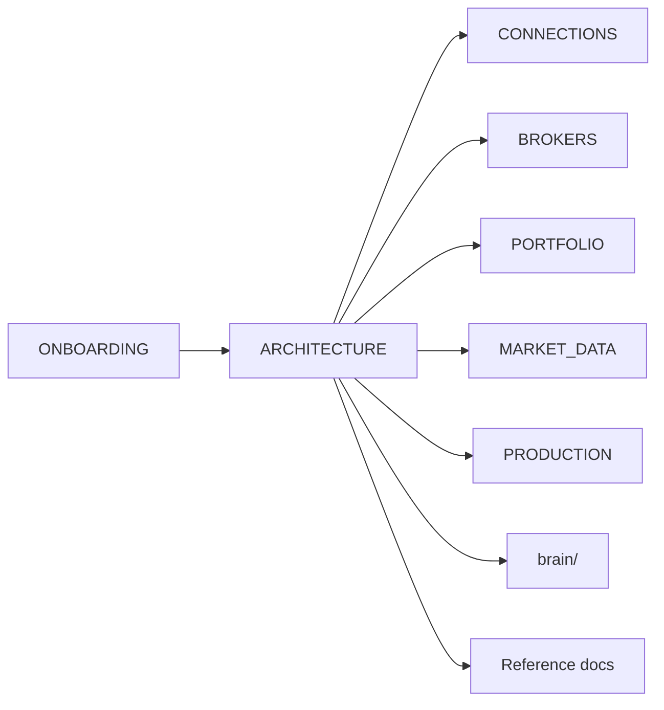

# AxiomFolio documentation

This folder contains onboarding, architecture, domain pillars (connections, portfolio, market data), operations runbooks, and reference docs. Use the tables below to find the right doc for your task.

---

## Doc map

| Doc | Purpose | Read when |
|-----|---------|-----------|
| [KNOWLEDGE.md](KNOWLEDGE.md) | Decision log with rationale (**40+** entries, D1 onward) | Before making architectural changes |
| [../archive/AXIOMFOLIO_TASKS.md](../archive/AXIOMFOLIO_TASKS.md) | Archived AxiomFolio `TASKS.md` (2026-04-24); open items merged into [plans/MASTER_PLAN_2026.md](plans/MASTER_PLAN_2026.md) | Historical phase tables / traceability |
| [PRD.md](PRD.md) | Product requirements, vision, three pillars | Understanding the "why" |
| [ONBOARDING.md](ONBOARDING.md) | Quick start, golden rules, Docker-first | New to repo |
| [ARCHITECTURE.md](ARCHITECTURE.md) | System overview, pillars, modules, pipelines | Understanding the system |
| [CONNECTIONS.md](CONNECTIONS.md) | Settings → Connections (brokers, IB Gateway, TV, vault) | Integrating brokers/OAuth/credentials |
| [BROKERS.md](BROKERS.md) | Broker implementation guide (add a broker, sync, credentials) | Implementing or debugging broker sync |
| [PORTFOLIO.md](PORTFOLIO.md) | Portfolio pillar (sync flow, routes, pages, file map) | Working on portfolio features |
| [MARKET_DATA.md](MARKET_DATA.md) | Market data ingest, indicators, **Celery Beat** scheduling | Working on market data/coverage |
| [PRODUCTION.md](PRODUCTION.md) | Deploy, env, DNS, Cloudflare, CI/CD | Deploying or operating prod |
| [ENCRYPTION_KEY_ROTATION.md](ENCRYPTION_KEY_ROTATION.md) | Rotate Fernet key (invalidates credentials) | Rotating encryption key |
| [MODELS.md](MODELS.md) | Data models (Position, Trade, Option, etc.) | Understanding DB/API shapes |
| [TESTS.md](TESTS.md) | Test strategy, DB isolation, how to run | Writing or running tests |
| [FRONTEND_UI.md](FRONTEND_UI.md) | Frontend UI patterns (Radix UI + Tailwind + shadcn/ui-style components), Ladle, component map | Frontend layout/components |
| [DESIGN_SYSTEM.md](DESIGN_SYSTEM.md) | Palette, typography, shared visual language | UI consistency and tokens |
| [ROUTES.md](ROUTES.md) | Route and API surface reference | Navigating backend/frontend routes |
| [TRADING_PRINCIPLES.md](TRADING_PRINCIPLES.md) | Non-negotiable trading principles | Strategy, risk, and discipline context |
| [TRADING.md](TRADING.md) | Trading domain notes | Execution and workflow context |
| [STRATEGIES.md](STRATEGIES.md) | Strategy pillar documentation | Rules, signals, backtests |
| [plans/MASTER_PLAN_2026.md](plans/MASTER_PLAN_2026.md) | Per-product master plan; legacy section roadmap merged 2026-04-24 | Planning / status |
| [../archive/AXIOMFOLIO_ROADMAP.md](../archive/AXIOMFOLIO_ROADMAP.md) | Archived `ROADMAP.md` (verbatim) | Historical traceability |
| [PR_AUTOMATION.md](PR_AUTOMATION.md) | Dependabot, agent PR flow, merge rules | Opening/merging PRs |
| [PAPERWORK_HANDOFF.md](PAPERWORK_HANDOFF.md) | Handoff / paperwork checklist | Administrative handoffs |

### Agent / Brain tooling

| Path | Purpose |
|------|---------|
| [brain/axiomfolio_tools.yaml](brain/axiomfolio_tools.yaml) | Manifest for the Brain HTTP tool surface (MCP/external tool registration) |

Other folders under `docs/`:

- **`docs/axiomfolio/plans/`** — ad-hoc planning notes (e.g. nav restructures).
- **`docs/pinescript/`** — Pine Script references (e.g. stage analysis script).

---

## Doc map (diagram)

Typical path: start with **ONBOARDING**, then **ARCHITECTURE** for the big picture; use **CONNECTIONS**, **PORTFOLIO**, or **MARKET_DATA** for domain work; **PRODUCTION** and **ENCRYPTION_KEY_ROTATION** for operations; **MODELS**, **TESTS**, **FRONTEND_UI**, **DESIGN_SYSTEM**, **ROUTES**, **TRADING_PRINCIPLES**, **TRADING**, **STRATEGIES**, **MASTER_PLAN_2026**, **PR_AUTOMATION**, **PAPERWORK_HANDOFF**, and **[brain/axiomfolio_tools.yaml](brain/axiomfolio_tools.yaml)** as needed.

---

## Makefile (quick reference)

**Use the [Makefile](../Makefile) at repo root** for dev and test commands. Run from the repository root.

| Target | Purpose |
|--------|---------|
| `make up` | Start full dev stack (all profiles enabled by default). |
| `make down` | Stop dev stack. |
| `make test` | Run backend tests (isolated test DB; never touches dev DB). |
| `make test-frontend` | Run full frontend suite (install, lint, type-check, test). |
| `make test-all` | Backend + frontend tests. |
| `make frontend-lint` | Lint only. |
| `make frontend-typecheck` | Type-check only. |
| `make frontend-test` | Frontend unit tests only. |
| `make frontend-check` | Full frontend suite (lint + type-check + test). |
| `make ladle-up` | Start Ladle (component explorer). |
| `make ladle-build` | Build Ladle. |
| `make task-run TASK=module.task` | Run a Celery task (dev). |
| `make migrate-up` | Apply Alembic migrations (dev DB). |
| `make migrate-create MSG="message"` | Create a new migration. |
| `make migrate-down REV=-1` | Downgrade migrations (example: one step). |
| `make migrate-stamp-head` | Stamp DB at head without running migrations. |

Details: [ONBOARDING.md](ONBOARDING.md) (quick start), [TESTS.md](TESTS.md) (how to run tests).
