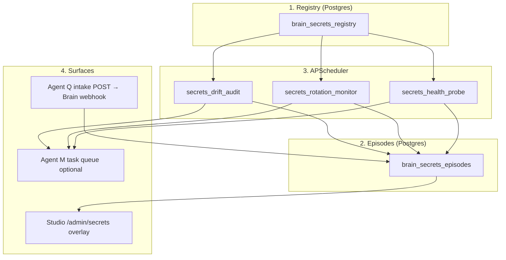

# Brain secrets operational intelligence

Brain maintains a **registry** of high-value credentials (metadata only — never secret values in logs or API responses), **episodes** (memory-style events for continuous learning), and **schedulers** that audit drift (vault vs Vercel/Render fingerprints), rotation windows, and critical service health.

## Architecture (four layers)

## Registry schema (summary)

| Column | Purpose |
| --- | --- |
| `name` | Unique env key (e.g. `CLERK_SECRET_KEY`) |
| `purpose`, `service`, `format_hint`, `expected_prefix` | Operator context |
| `criticality` | `critical` \| `high` \| `normal` \| `low` |
| `depends_in_apps` / `depends_in_services` | Drift audit targets (Vercel project map / Render service map required in env) |
| `rotation_cadence_days`, `last_rotated_at` | Rotation monitor |
| `drift_detected_at`, `drift_summary` | Last drift outcome |
| `lessons_learned` | JSON array of `{date, lesson}` |

## Episode `event_type` values

`intake`, `rotation`, `drift_detected`, `drift_corrected`, `failure`, `revocation`, `registry_update`, `rotation_due`, `health_probe_failure`.

## Schedulers

| Job id | Schedule | Env flag (default `true`) |
| --- | --- | --- |
| `secrets_drift_audit` | Daily **03:00** `America/Los_Angeles` | `BRAIN_OWNS_SECRETS_DRIFT_AUDIT` |
| `secrets_rotation_monitor` | Daily **09:00** `America/Los_Angeles` | `BRAIN_OWNS_SECRETS_ROTATION_MONITOR` |
| `secrets_health_probe` | Hourly (UTC interval) | `BRAIN_OWNS_SECRETS_HEALTH_PROBE` |

Details: [BRAIN_SCHEDULER.md](./BRAIN_SCHEDULER.md).

## API (Brain)

All under `Authorization: Bearer <BRAIN_INTERNAL_TOKEN>`.

| Method | Path | Purpose |
| --- | --- | --- |
| `POST` | `/internal/secrets/events` | Webhook (Studio / Agent Q intake complete, etc.) |
| `GET` | `/internal/secrets/registry` | Read-only registry |
| `GET` | `/internal/secrets/episodes/{name}` | Episode timeline |
| `GET` | `/internal/secrets/health` | Counts: drift, rotations due, criticality mix |

**Studio** proxies via `GET /api/brain/secrets/*` (server uses `BRAIN_API_URL` + `BRAIN_INTERNAL_TOKEN`).

## Drift comparison (safety)

Vault and remote values are compared using **length + 8-char prefix + SHA-256** of the UTF-8 string. No full values are written to logs.

Required configuration for meaningful drift checks:

- `STUDIO_URL`, `SECRETS_API_KEY` — read Studio vault.
- `VERCEL_API_TOKEN` (or `VERCEL_TOKEN`), optional `VERCEL_TEAM_ID`, and `BRAIN_SECRETS_VERCEL_APP_PROJECTS` JSON (app slug → Vercel project id/name).
- `RENDER_API_KEY` and `BRAIN_SECRETS_RENDER_SERVICE_IDS` JSON (service label → Render service id).

## Integration

- **Agent Q (intake)**: on successful submit, `POST` to `/internal/secrets/events` with `event_type: intake` (can land in a follow-up PR; endpoint is live).
- **Agent M**: `AgentTaskSpec` is emitted for drift/rotation/health when the optional `app.services.agent_task_generator` is present; otherwise the bridge logs a would-queue line.

## Founder runbook — “What does Brain know about secrets?”

1. **Studio** — open `/admin/secrets`: per-row **Brain** badge and **Brain notes** popover (registry criticality, drift summary, last 3 episodes) when the proxy is configured.
2. **API** — `GET /internal/secrets/registry` and `/internal/secrets/health` with the internal Bearer token.
3. **DB** — `SELECT * FROM brain_secrets_registry` / `brain_secrets_episodes` (read-only; production DB rules apply).

## Inaugural lessons (CLERK_SECRET_KEY)

- Vercel CLI paste of long keys on macOS can leave `\r\n`, causing 401s — resync from vault when drift is reported.
- A `sk_live` value leaked in chat; **Secret Intake** is the canonical paste path.

## Follow-up (not in this doc)

- Full `/admin/secrets/intelligence` page.
- Per-secret health probes with richer SLOs.
- Tighter Render/Vercel project auto-discovery from org APIs.
