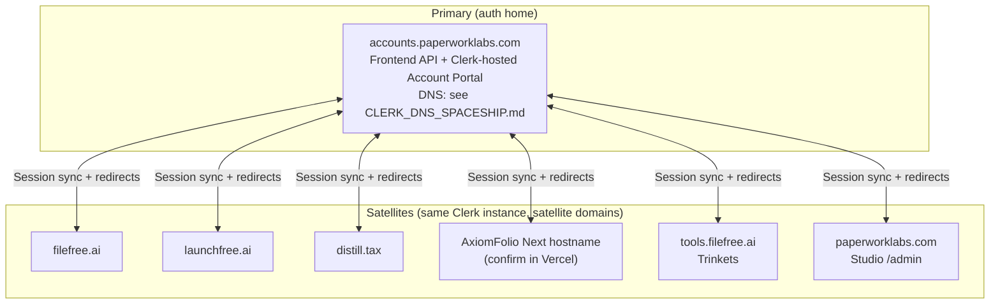

# Clerk multi-domain satellite topology

## Goal

Real cross-app SSO across the Paperwork Labs product family: a user signed in on `filefree.ai` is recognized on `launchfree.ai`, `distill.tax`, Studio (`paperworklabs.com`), Trinkets (`tools.filefree.ai`), and the AxiomFolio Next.js deployment **without a second full sign-in**, subject to Clerk’s satellite sync rules (see [How authentication syncing works](https://clerk.com/docs/guides/dashboard/dns-domains/satellite-domains#how-authentication-syncing-works)).

Today each app tends to behave like its own Clerk surface; cookies do not span unrelated apex domains, so “SSO” across brands is incomplete until this topology is live.

## Architecture



- **Primary:** `accounts.paperworklabs.com` — Clerk Frontend API on this host (custom domain in Dashboard). **Clerk auto-hosts the Account Portal** at this hostname once DNS is verified ([`CLERK_DNS_SPACESHIP.md`](CLERK_DNS_SPACESHIP.md)); a separate **`apps/accounts/`** Next.js deployment is **not** required for that hosted portal. **Track H4** for the `paperworklabs.com` zone is **DNS-only** (plus Dashboard verification), not “build apps/accounts/”. Satellite handoff and embedded flows in each app remain as below.
- **Satellites:** each customer-facing app host above is added under **Domains → Satellites** for the **same** Clerk production instance. Apps use the **same** `NEXT_PUBLIC_CLERK_PUBLISHABLE_KEY` and `CLERK_SECRET_KEY` as the primary.

**Important nuance (cookies):**

- **`paperworklabs.com` and its subdomains** (e.g. `accounts.paperworklabs.com`, `paperworklabs.com` for Studio) follow Clerk’s normal [authentication across subdomains](https://clerk.com/docs/guides/development/deployment/production#authentication-across-subdomains) behavior once the instance domain/DNS is configured correctly. Use the Dashboard **subdomain allowlist** to restrict cross-subdomain callers as Clerk recommends.
- **Separate apex domains** (`filefree.ai`, `launchfree.ai`, `distill.tax`, `tools.filefree.ai`, and the public AxiomFolio hostname) do **not** share a `.paperworklabs.com` cookie. Cross-brand SSO uses Clerk **satellite** session sync (redirect-based handoff with the primary), not a single shared cookie across those zones.

Paid production use of satellite domains requires a [paid Clerk plan](https://clerk.com/pricing); development instances can exercise the flow for free.

## DNS records (founder action)

**`paperworklabs.com` on Spaceship (production Clerk cutover):** use the paste-ready five-CNAME runbook **[`CLERK_DNS_SPACESHIP.md`](CLERK_DNS_SPACESHIP.md)** (`clerk`, `accounts`, `clkmail`, DKIM). That runbook is the source of truth for host formatting in Spaceship.

For **other** zones and **satellite** domains, Clerk shows **exact** record names and targets in the Dashboard. Do not copy placeholder hostnames from this doc — use the live **Domains** page after each domain is added.

### A. Primary — `accounts.paperworklabs.com` (zone: `paperworklabs.com`)

**Spaceship:** follow **[`CLERK_DNS_SPACESHIP.md`](CLERK_DNS_SPACESHIP.md)** for the full set of five CNAMEs (Frontend API on `clerk.*`, Account portal, mail, DKIM) and verification.

**Other DNS providers (e.g. Cloudflare):** In the Clerk Dashboard: **Domains** → add **`paperworklabs.com`** / **`accounts.paperworklabs.com`** per the live wizard. Clerk will display required records, commonly including:

| Type | Name (example) | Value | Notes |
|------|----------------|-------|--------|
| CNAME | `accounts` | *(Dashboard: Clerk target)* | Proxied TLS at Clerk; use **DNS only** at Cloudflare if Clerk verification fails |
| TXT | `_clerk-domain-verify.accounts` or as shown | *(Dashboard)* | Domain verification |
| CNAME | `clkmail` (or as shown) | *(Dashboard)* | Optional: Clerk email / forwarding features |

Verify after propagation:

```bash
dig accounts.paperworklabs.com CNAME +short
dig accounts.paperworklabs.com A +short
```

Wait for Clerk to show **Verified** and for certificates to finish (often minutes; DNS can take longer).

### B. Each satellite apex — `clerk.<your-brand-domain>`

For **each** satellite domain (e.g. `filefree.ai`, `launchfree.ai`, `distill.tax`, `tools.filefree.ai`, AxiomFolio public host, and any dedicated Studio hostname if distinct):

1. Dashboard → **Domains** → **Satellites** → **Add satellite domain** → enter the **exact** host users type in the browser (e.g. `tools.filefree.ai`, not only `filefree.ai`).
2. Open that satellite → **DNS configuration**: add the **`clerk`** (or Dashboard-labeled) **CNAME** in the **satellite domain’s DNS zone** (e.g. `clerk.filefree.ai` in the `filefree.ai` zone).
3. Repeat for every apex/host that serves a distinct Next.js satellite deployment.

**`tools.filefree.ai`:** This is a normal DNS name; Clerk treats it as its own satellite host. Confirm in Dashboard that satellite entries match **production** Vercel aliases. No special “sub-subdomain” SDK flag beyond setting `domain` / `NEXT_PUBLIC_CLERK_DOMAIN` to that **full** host.

**Founder verification:** If Clerk’s UI for a given satellite differs (e.g. proxy / [Frontend API proxy](https://clerk.com/docs/guides/dashboard/dns-domains/proxy-fapi.md#proxying-for-satellite-domains)), follow the Dashboard copy exactly.

## Clerk Dashboard config (founder action)

1. **Single production instance** for the whole portfolio (converge from per-app instances if still separate — key migration is out of scope for this runbook but must be done before satellites are meaningful).
2. **Primary domain / Frontend API:** `accounts.paperworklabs.com` (DNS + verify + SSL as above).
3. **Satellites:** For each product host listed in [Architecture](#architecture), **Domains → Satellites → Add satellite domain**, mark as satellite of the primary application per wizard copy.
4. **Paths:** Ensure sign-in and sign-up paths match what apps use (recommended: `/sign-in`, `/sign-up` on the primary).
5. **Subdomain allowlist:** For `paperworklabs.com`, configure allowed subdomains per Clerk’s security guidance after domains are stable.
6. **`authorizedParties`:** Plan to set explicit allowlists in middleware / `authenticateRequest` per [production deployment](https://clerk.com/docs/guides/development/deployment/production#configure-authorizedparties-for-secure-request-authorization) once all origins are known.

**Note:** The legacy doc URL `https://clerk.com/docs/deployments/set-up-satellite-application` returns **404** as of 2026-04; the maintained guide is **[Authentication across different domains (satellite domains)](https://clerk.com/docs/guides/dashboard/dns-domains/satellite-domains)** (also reachable as `/advanced-usage/satellite-domains`).

## Per-app code changes (Track H2 — engineering)

**Primary / Account Portal host — Track H4 (DNS slice):**

- For **`paperworklabs.com`**, prefer **[`CLERK_DNS_SPACESHIP.md`](CLERK_DNS_SPACESHIP.md)** + Clerk Dashboard verification; the **hosted** Account Portal does not need a custom `apps/accounts/` deployment.
- If you later add a **custom** primary app at `accounts.paperworklabs.com` (embedded flows only), `ClerkProvider` on that app is **not** a satellite. The snippets below apply to that pattern; skip until such an app exists.

**Primary-only app pattern (optional custom `apps/accounts/`):**

- `ClerkProvider` is **not** a satellite.
- `signInUrl` / `signUpUrl`: `/sign-in`, `/sign-up`.
- `allowedRedirectOrigins`: **every** satellite **origin** (e.g. `https://filefree.ai`, `https://launchfree.ai`, `https://distill.tax`, `https://tools.filefree.ai`, `https://paperworklabs.com`, `https://<axiomfolio-host>`). Omitting an origin breaks return redirects after sign-in.

**Every other Next.js app** (`apps/filefree`, `apps/launchfree`, `apps/distill`, `apps/trinkets`, `apps/studio`, `apps/axiomfolio`) becomes a **satellite**:

1. **`ClerkProvider`** — align with [Clerk’s satellite example](https://clerk.com/docs/guides/dashboard/dns-domains/satellite-domains):

   ```tsx
   <ClerkProvider
     isSatellite
     domain={(url) => url.host}
     signInUrl="https://accounts.paperworklabs.com/sign-in"
     signUpUrl="https://accounts.paperworklabs.com/sign-up"
     // appearance={...} — keep existing per-app appearance
   >
   ```

   For a fixed host, you may use `domain="filefree.ai"` **only** if that string always matches the browser host (include port in dev if needed).

2. **`clerkMiddleware` options** — pass the same satellite flags Clerk documents (second argument to `clerkMiddleware`):

   - `isSatellite: true`
   - `domain`: production host string for that deployment (e.g. `filefree.ai`, `tools.filefree.ai`)
   - `signInUrl` / `signUpUrl`: `https://accounts.paperworklabs.com/sign-in` and `/sign-up`
   - Optionally `satelliteAutoSync: true` if you accept a redirect on every cold load to mirror “already signed in on primary” without clicking Sign in (performance tradeoff; default is `false`).

   **AxiomFolio** (`apps/axiomfolio`): Clerk runs in `src/proxy.ts` (Next.js 16), not `middleware.ts` — apply the same `clerkMiddleware` **options** object where the middleware is created.

3. **Sign-in / sign-up links:** With `satelliteAutoSync: false` (default), use [`buildSignInUrl()`](https://clerk.com/docs/nextjs/reference/objects/clerk.md#build-sign-in-url) / [`buildSignUpUrl()`](https://clerk.com/docs/nextjs/reference/objects/clerk.md#build-sign-up-url) (or Clerk’s `<SignInButton />` patterns that use them) so the `__clerk_synced` trigger is applied. Hardcoding bare URLs can **break** session sync when returning from the primary.

4. **Environment variables** (satellite deployments) — Clerk recommends:

   | Variable | Example |
   |----------|---------|
   | `NEXT_PUBLIC_CLERK_PUBLISHABLE_KEY` | *(shared production key)* |
   | `CLERK_SECRET_KEY` | *(shared production secret)* |
   | `NEXT_PUBLIC_CLERK_IS_SATELLITE` | `true` |
   | `NEXT_PUBLIC_CLERK_DOMAIN` | Satellite browser host, e.g. `filefree.ai`, `tools.filefree.ai` |
   | `NEXT_PUBLIC_CLERK_SIGN_IN_URL` | `https://accounts.paperworklabs.com/sign-in` |
   | `NEXT_PUBLIC_CLERK_SIGN_UP_URL` | `https://accounts.paperworklabs.com/sign-up` |

   Use **`NEXT_PUBLIC_CLERK_DOMAIN`** per Clerk; do not introduce a duplicate `CLERK_SATELLITE_DOMAIN` unless an internal wrapper standardizes it (Track C).

   **`NEXT_PUBLIC_CLERK_FRONTEND_API`:** Not listed in Clerk’s satellite env table; the Frontend API origin is normally implied by the instance and custom domain. If Vercel / an integration injects this variable for your project, set it to the **same** Frontend API base you see in the Clerk Dashboard (expected `https://accounts.paperworklabs.com` after cutover). **Founder/engineering:** confirm against the Dashboard **API keys** / domain panel for your instance.

**Current repo touchpoints (pre-migration):**

- Providers: `apps/*/src/app/layout.tsx` — each app wraps `ClerkProvider` with local `signInUrl` / `signUpUrl` only (no `isSatellite` yet).
- Middleware: `apps/filefree`, `launchfree`, `distill`, `trinkets`, `studio` — `src/middleware.ts`; `apps/axiomfolio` — `src/proxy.ts`.
- Per-app Clerk runbooks: [`CLERK_FILEFREE.md`](CLERK_FILEFREE.md), [`CLERK_LAUNCHFREE.md`](CLERK_LAUNCHFREE.md), [`CLERK_DISTILL.md`](CLERK_DISTILL.md), [`CLERK_TRINKETS.md`](CLERK_TRINKETS.md), [`CLERK_STUDIO.md`](CLERK_STUDIO.md), [`CLERK_AXIOMFOLIO.md`](CLERK_AXIOMFOLIO.md).

**Shared package:** Consumption patterns may consolidate in `@paperwork-labs/auth` (Track C). Until then, duplicate the satellite `ClerkProvider` + middleware options carefully per app.

## Test plan

1. Confirm DNS + Dashboard: `accounts.paperworklabs.com` resolves and Clerk shows **Verified** ([`CLERK_DNS_SPACESHIP.md`](CLERK_DNS_SPACESHIP.md)). If you maintain a custom primary app, deploy it with a visible test user.
2. **Cold visit:** Open `https://filefree.ai` (satellite) in a fresh profile — optionally confirm no sync until sign-in if `satelliteAutoSync` is false.
3. Start sign-in from the satellite — should redirect to `accounts.paperworklabs.com`, then back with session active on `filefree.ai`.
4. Navigate to `https://launchfree.ai` — with appropriate sync (e.g. `satelliteAutoSync: true` or explicit sign-in using `buildSignInUrl`), confirm session without full second login where Clerk allows.
5. Repeat for `distill.tax`, `tools.filefree.ai`, Studio, AxiomFolio host.
6. **Sign out** from any property — session should clear across satellites per Clerk’s docs.
7. **Regression:** OAuth providers used in production must have live credentials on the **production** instance (Clerk does not copy SSO integrations from dev).

## Rollback plan

If satellite handoff breaks production:

1. Per-app env: set `NEXT_PUBLIC_CLERK_IS_SATELLITE=false` (or unset).
2. Per-app code: remove `isSatellite` from `ClerkProvider` and satellite options from `clerkMiddleware` / `proxy.ts`; restore prior relative `signInUrl` / `signUpUrl` if those embedded flows were per-app.
3. Users fall back to **per-app** embedded sign-in (no cross-brand SSO) while DNS records for `accounts.paperworklabs.com` can remain; they simply go unused.
4. Dashboard: satellites can stay configured but idle, or be removed if reverting long-term (founder decision).

## Cookie cleanup post-cutover

After satellites land, audit each app for **legacy** cookies / `localStorage` keys from pre-Clerk or hybrid auth (e.g. FileFree session patterns, AxiomFolio `qm_token` per [`CLERK_AXIOMFOLIO.md`](CLERK_AXIOMFOLIO.md)). Remove dead client state on the Track F hygiene path so engineers are not misled in DevTools.

## References

- [Authentication across different domains (satellite domains)](https://clerk.com/docs/guides/dashboard/dns-domains/satellite-domains) (canonical; `/advanced-usage/satellite-domains` redirects here)
- [Deploy your Clerk app to production](https://clerk.com/docs/guides/development/deployment/production) (DNS, subdomains, `authorizedParties`)
- [Clerk multi-domain demo (Turborepo)](https://github.com/clerk/clerk-multidomain-demo)
- Track C: `@paperwork-labs/auth` shared package (workspace)
- Track H4: `paperworklabs.com` Clerk DNS + hosted Account Portal — [`CLERK_DNS_SPACESHIP.md`](CLERK_DNS_SPACESHIP.md) (optional later: custom `apps/accounts/` only if product needs embedded-only control on that host)
- Per-app runbooks: this directory, `CLERK_*.md`

## Status

- [ ] DNS records added (founder)
- [ ] Clerk Dashboard primary + satellites configured (founder)
- [ ] Clerk DNS verified for `paperworklabs.com` (Track H4 — [`CLERK_DNS_SPACESHIP.md`](CLERK_DNS_SPACESHIP.md))
- [ ] Per-app code converted to satellite mode (Track H2)
- [ ] Cross-app test green
- [ ] Cookie cleanup landed (Track F)
