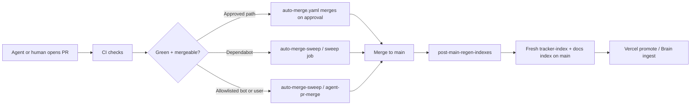

# PR pipeline automation

> **Motivation:** “So there are open PRs for a while — should we fix the cause?” This runbook describes what we automated on `main` to shorten queue time and reduce index/conflict churn without turning off human review.

## Flow (high level)

| Workflow | Role |
| --- | --- |
| `auto-merge.yaml` | Event-driven: merges **human** PRs once there is an approving review and checks pass. |
| `auto-merge-sweep.yaml` | Scheduled (every 15 minutes): **Dependabot** sweep; **agent-pr-merge** for allowlisted authors (see below). |
| `post-main-regen-indexes.yaml` | On every push to `main`, regenerates `apps/studio/src/data/tracker-index.json` and `docs/_index.yaml` when needed; commit message includes `[skip ci]` to avoid loops. |
| `vercel-promote-on-merge.yaml` | (Existing) Deploy after merge. |

### Vercel rate limits

GitHub checks whose names look like **Vercel** and whose failure output indicates **rate limit**, **build limit exceeded**, or **deployment skipped** are treated as **soft failures** in:

- `auto-merge.yaml`
- both jobs in `auto-merge-sweep.yaml`

When that happens, the sweep may post a single informational comment on the PR (deduplicated) so reviewers know production deploy can follow via promote-after-merge.

### Auto-rebase on `main` (deferred)

A workflow that rebases every open PR whenever `main` advances was **not** added here because [PR #241](https://github.com/paperwork-labs/paperwork/pull/241) already introduces a rebase helper and overlapping automation would race. Revisit after that PR merges or is withdrawn.

## Founder runbook

### Disable auto-merge for one PR

Add label **`do-not-merge`** (also respected: `blocked`, `wip`, `hold`). The scheduled jobs skip labeled PRs.

### Who can be auto-merged without approval

Only authors listed in [`.github/auto-merge-allowlist.yaml`](../../.github/auto-merge-allowlist.yaml). The scheduled job also requires:

- No **`CHANGES_REQUESTED`** review (latest state per reviewer).
- No **`🔴`** in PR review or issue comments (Brain / QA “red” marker).
- Addition count **≤ 800** (sanity cap).
- PR age **≥ 5 minutes** (avoid racing the author right after push).
- At most **5** squash merges per workflow run (protects Vercel webhooks).

**Dependabot** PRs are handled only by the **sweep** job, not the agent job (even if a bot login appeared on the allowlist).

### Tuning the allowlist

Edit `.github/auto-merge-allowlist.yaml` in a normal PR. Prefer adding **bot** logins (`cursor-agent[bot]`, etc.) over broad human allowlists.

## Operational notes

- **Concurrency:** `auto-merge-sweep` uses a single concurrency group so scheduled runs do not overlap.
- **Markers:** Workflow summaries include `<!-- auto-merge-sweep:checked:YYYYMMDD-HHMM -->` (UTC) for traceability.
- **Indexes:** If `post-main-regen-indexes` cannot push (branch protection), fix token/permissions or run generators locally and PR.

## Related

- [Brain scheduler / cutover env](BRAIN_SCHEDULER.md)
- `.github/workflows/auto-merge-sweep.yaml`
- `.github/workflows/post-main-regen-indexes.yaml`
