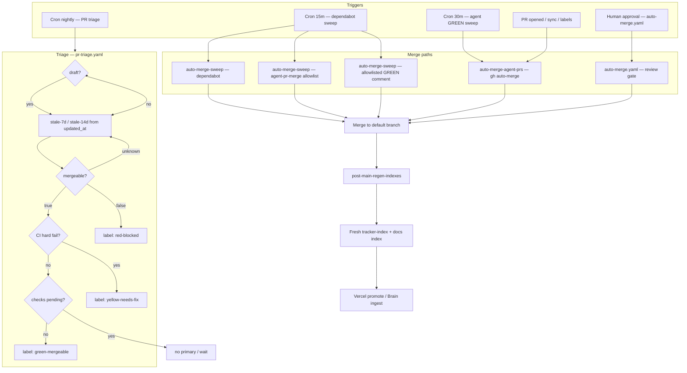
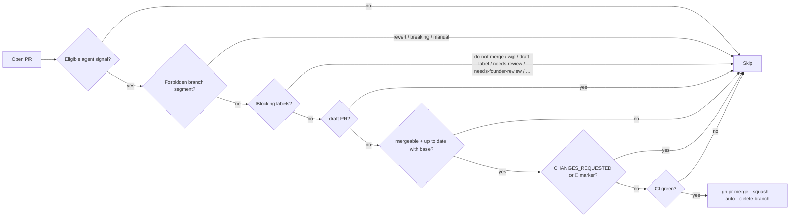

# PR pipeline automation

> **Motivation:** “So there are open PRs for a while — should we fix the cause?” This runbook describes what we automated on `main` to shorten queue time and reduce index/conflict churn without turning off human review or branch protection.

## Flow (automation map)

### Agent GREEN auto-merge (`auto-merge-agent-prs.yaml`)

| Workflow | Role |
| --- | --- |
| `auto-merge.yaml` | Event-driven: merges **human** PRs once there is an approving review and checks pass. |
| `auto-merge-sweep.yaml` | Scheduled (every 15 minutes): **Dependabot** sweep; **agent-pr-merge** for allowlisted authors; **allowlisted-merge** for Copilot-style **🟢 GREEN** comment path. |
| `auto-merge-agent-prs.yaml` | Every **30** minutes and on **pull_request** (opened/sync/labels/ready): eligible **agent-output** PRs get **auto-merge** (squash, delete branch) when gates pass; respects **branch protection** (merge completes when GitHub allows). |
| `pr-triage.yaml` | Nightly: applies **green-mergeable** / **yellow-needs-fix** / **red-blocked** plus **stale-7d** / **stale-14d** (idempotent). |
| `post-main-regen-indexes.yaml` | On every push to `main`, regenerates `apps/studio/src/data/tracker-index.json` and `docs/_index.yaml` when needed; commit message includes `[skip ci]` to avoid CI thrash (other workflows can still run `workflow_run`). |
| `auto-rebase-on-main.yaml` | On push to `main` and when **Post-main regenerate indexes** completes successfully, rebases same-repo open PRs that are behind `main` (skips drafts, forks, opt-out label `no-auto-rebase`). Regen commits use `[skip ci]`; the `workflow_run` trigger catches rebase after indexes land. |
| `pr-pipeline-health.yaml` | Nightly (UTC) + manual: metrics in the workflow summary — open PR count, behind `main`, failing/pending checks (with Vercel soft rules), and a narrow “automation gap” count for sweep-eligible bot/allowlist PRs that are green + mergeable + up to date but still open. |
| `vercel-promote-on-merge.yaml` | (Existing) Deploy after merge. |

### Eligibility for `auto-merge-agent-prs.yaml`

A PR is considered for this workflow if **any** of:

1. Author login starts with `agent-`, or  
2. It has label **`agent-output`**, or  
3. Head branch matches `feat/`, `chore/`, `fix/`, or `docs/` **and** the author is a **GitHub App/bot** (`user.type === Bot`) **or** a login from [`.github/auto-merge-allowlist.yaml`](../../.github/auto-merge-allowlist.yaml) / known agent bots (Copilot, Cursor, Claude, Codex connectors).

**Never** auto-merged by this workflow when:

- Head ref contains **`revert/`**, **`breaking/`**, or **`manual/`** (substring match on branch name).  
- Labels include **`do-not-merge`**, **`wip`**, **`draft`**, **`needs-review`**, **`needs-founder-review`**, **`blocked`**, or **`hold`**.  
- PR is **draft**, **not mergeable**, **behind base**, has **CHANGES_REQUESTED**, or **🔴** in review/issue comments.

**Idempotency:** Re-running the workflow only re-attempts `gh pr merge --auto` where gates pass; already-enabled auto-merge or merged PRs may no-op with a logged error (safe to ignore if the PR is already queued or merged).

### Vercel rate limits

GitHub checks whose names look like **Vercel** and whose failure output indicates **rate limit**, **build limit exceeded**, or **deployment skipped** are treated as **soft failures** in:

- `auto-merge.yaml`
- `auto-merge-sweep.yaml` jobs
- `auto-merge-agent-prs.yaml`

When that happens, the sweep may post a single informational comment on the PR (deduplicated) so reviewers know production deploy can follow via promote-after-merge.

### Auto-rebase on `main`

`auto-rebase-on-main.yaml` rebases **in-repo** branches (not forks) that are behind `main`, with a second trigger when **Post-main regenerate indexes** completes so PRs can follow `[skip ci]` index commits (push workflows do not run for those commits). Opt out with label **`no-auto-rebase`**. **Manual** rebases: `rebase-pr.yaml` and `.github/scripts/rebase_pr_branch.sh`.

### Drift checks (`tracker-index.yaml`, `docs-index.yaml`)

PR and `main` path-filtered checks keep `tracker-index.json` / `docs/_index.yaml` aligned with sources. They complement `post-main-regen-indexes` (which writes both files on `main` after merges).

## Founder runbook

### Disable auto-merge for one PR

Add label **`do-not-merge`** (also respected: `blocked`, `wip`, `hold`, `needs-review`, `needs-founder-review`). Scheduled and agent workflows skip labeled PRs.

### Who can be auto-merged without approval

- **Dependabot:** `auto-merge-sweep` sweep job.  
- **Allowlist + size/review rules:** `agent-pr-merge` in `auto-merge-sweep` — authors in [`.github/auto-merge-allowlist.yaml`](../../.github/auto-merge-allowlist.yaml), addition cap, no **CHANGES_REQUESTED**, no **🔴**, age ≥ 5 minutes, merge budget per run.  
- **Copilot-style GREEN comment:** `allowlisted-merge` job — see workflow.  
- **Agent-output GREEN path:** `auto-merge-agent-prs` — gates above; uses **GitHub auto-merge** so **required reviews and branch protection still apply**.

**Dependabot** PRs are handled by the **sweep** job, not the allowlisted agent job (even if a bot login appeared on the allowlist).

### Triage labels (automation-managed)

| Label | Meaning |
| --- | --- |
| `green-mergeable` | Checks complete, no hard failures (after Vercel soft rules), mergeable, not draft. |
| `yellow-needs-fix` | Mergeable but at least one non-ignored check failed. |
| `red-blocked` | Not mergeable (e.g. conflicts). |
| `stale-7d` / `stale-14d` | PR `updated_at` idle ≥ 7 or ≥ 14 days (mutually exclusive stale tier). |

### Tuning the allowlist

Edit `.github/auto-merge-allowlist.yaml` in a normal PR. Prefer adding **bot** logins (`cursor-agent[bot]`, etc.) over broad human allowlists.

## Operational notes

- **Concurrency:** `auto-merge-sweep` and `auto-merge-agent-prs` each use a dedicated concurrency group so scheduled runs do not overlap per workflow.  
- **Markers:** Workflow summaries include `<!-- auto-merge-sweep:checked:… -->`, `<!-- auto-merge-agent-prs:… -->`, `<!-- pr-triage:… -->` (UTC) for traceability.  
- **Indexes:** If `post-main-regen-indexes` cannot push (branch protection), fix token/permissions or run generators locally and PR.

## Related

- [Brain scheduler / cutover env](BRAIN_SCHEDULER.md)
- `.github/workflows/auto-merge-sweep.yaml`
- `.github/workflows/auto-merge-agent-prs.yaml`
- `.github/workflows/pr-triage.yaml`
- `.github/workflows/post-main-regen-indexes.yaml`
- `.github/workflows/auto-rebase-on-main.yaml`
- `.github/workflows/pr-pipeline-health.yaml`
