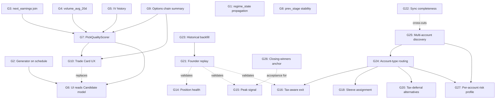

# Production Gaps — 2026 Q2

**Status**: ACTIVE
**Created**: 2026-04-20
**Owner**: TBD per gap (see each entry)
**Source**: discovered during a prod-DB pick-quality verification session — every gap below is backed by a concrete query result against `axiomfolio-db` on 2026-04-20.
**Parent plan**: [MASTER_PLAN_2026.md](MASTER_PLAN_2026.md)

This doc captures gaps in the production pipeline that block confident decision-making. Each gap is one PR (or sub-PR group). Resolve in severity order (P0 first), or per the phase mapping when a gap belongs to an already-scheduled phase.

---

## The user journey that is missing

This is the anchor for everything below. The session that produced this doc forced the user through this flow manually:

```
[BROKEN TODAY]
1. Open Market Dashboard
2. See "Breakout Candidates" — flat list of 156 names, no ranking, no reasoning
3. Eyeball one that "looks right" (NEE, EA were the visual picks)
4. Switch to Schwab, manually pull options chain
5. Eyeball an expiry (probably the next monthly, no earnings check)
6. Eyeball a strike (probably ATM because that's the default)
7. Eyeball a limit price (probably the ask because that's pre-filled)
8. Place order, hope
9. Eat IV crush / earnings / wide spread / random reversal
10. Blame the dashboard
```

What it should look like:

```
[TARGET]
1. Open "Today's Picks" page
2. See 1-3 ranked Trade Cards (not 156 raw names)
3. Each Trade Card contains:
   - Why this name (score breakdown, RS/stage/regime, anti-thesis)
   - Earnings + IV safety check (PASS/FAIL with the actual data)
   - Specific contract: symbol, expiry, strike, type, delta
   - Three limit-price tiers (patient / pullback-trigger / aggressive)
   - Position sizing for the user's actual account size
   - Hard exits: premium stop, stock stop, calendar stop
   - Watchlist alerts to wire into broker
4. "Send to broker" button (Schwab / IBKR / Tastytrade integration)
5. Position appears in "Open Positions" with live P&L vs plan
6. Auto-alert when any exit trigger fires
```

Concrete example of the artifact the system must produce — this is the Trade Card the user assembled by hand on 2026-04-20:

```
PICK 1 of 1 — Score 53/100 (top of safe-pool)
Stock:    DE (Deere & Co), Industrials, $590.46, Stage 2B day 7
Why:     RS 5.6, TD Buy 5/9 forming, slope 2.6, constructive -2.2% pullback
Safety:  Earnings May 21 (31d) - SAFE | IV pctile: UNKNOWN (G5)
         Liquidity $800M/d, ATR% 2.62, no TD Sell
Contract: DE 2026-05-15 580 Call (slight ITM ~0.6Δ, exits 6d before earnings)
Chain:   Bid 26.10 / Mid 27.05 / Ask 28.00 (spread 7.4%)
Limits:  Patient $26.50 GTC | Pullback $24.50 GTC | Aggressive $27.50 (don't)
Size:    $500k account: 1 ct @ $26.50 = $2,650 = 0.53% premium OK
Exits:   Premium stop $13.25 (-50%) | Stock stop close < $577 (SMA21)
         Calendar stop close-by-Mon May 11 EOD, no exceptions
Alerts:  DE @ $585, $577, $570, $610 | Option mid @ $14
```

Every gap below is graded on whether it brings this artifact closer to existing in-product. **G7 (PickQualityScorer) + G9 (options chain) + G10 (Trade Card) are the three that, together, make this artifact real.**

---

## Severity scale

| Tier | Definition | Example |
|---|---|---|
| **P0** | Blocks core user workflow OR creates real risk of capital loss | Earnings data missing breaks options sizing |
| **P1** | Degrades signal quality OR forces manual workarounds | Generator wired but not scheduled |
| **P2** | Display/dev-experience polish | Field unpopulated but downstream still works |

---

## G1 — `regime_state` not propagated from `market_regime` to `market_snapshot.regime_state`

- **Severity**: P2 (display/observability)
- **Phase**: Phase 0 (Stabilization)
- **Effort**: S (1-2 hrs)
- **Suggested owner**: Background Agent (shell + edit)

**Symptom (prod evidence, 2026-04-20):**

```sql
SELECT regime_state, COUNT(*) FROM market_snapshot
WHERE analysis_type='technical_snapshot' AND is_valid=true
GROUP BY regime_state;
-- Result: 1 row, regime_state='', count=2536
```

Yet `market_regime` table has today's row populated correctly (`regime_state='R3'`, `composite_score=2.75`).

**Root cause hypothesis:** [backend/tasks/market/coverage.py](../../backend/tasks/market/coverage.py) `_run_scan_overlay` calls `get_current_regime(session)` to make the gating decision, but never writes `regime.regime_state` back onto the `MarketSnapshot.regime_state` column.

**Acceptance criteria:**
1. After `daily_bootstrap` Step 6 (scan_overlay) runs, `SELECT COUNT(DISTINCT regime_state) FROM market_snapshot WHERE is_valid=true` returns at least 1 non-empty regime.
2. UI components reading `snapshot.regime_state` show the regime tag (R1-R5) on each row.
3. Regression test: re-running scan_overlay updates regime_state when `market_regime` advances.

---

## G2 — `Stage2ARsStrongGenerator` exists but is not on the Beat schedule

- **Severity**: P1
- **Phase**: Phase 0.5 (Candidate Generator) — already scheduled
- **Effort**: S (3-4 hrs incl. acceptance test)
- **Suggested owner**: Background Agent

**Symptom:**

```sql
SELECT generator_name, COUNT(*) FROM candidates GROUP BY generator_name;
-- Result: 0 rows
```

The `candidates` table is empty. The generator class exists at [backend/services/picks/generators/stage2a_rs_strong.py](../../backend/services/picks/generators/stage2a_rs_strong.py) but no Celery Beat entry triggers it. The "Buy Candidates" UI is currently reading from `market_snapshot.scan_tier='Breakout Elite' AND action_label='BUY'` (the scan-overlay path), not from the dedicated `Candidate` model that Phase 0.5 designed.

**Acceptance criteria:**
1. New Beat entry in [backend/tasks/job_catalog.py](../../backend/tasks/job_catalog.py) running daily after `scan_overlay` (Step 6 of `daily_bootstrap`).
2. After one run, `SELECT COUNT(*) FROM candidates WHERE generated_at >= now() - interval '24 hours'` returns > 0.
3. Generated candidates respect the existing `Stage2ARsStrongGenerator` thresholds (min_rs_mansfield_pct=70, max_ext_pct=5, min_range_pos_52w=0.60).
4. Job has `time_limit`/`soft_time_limit`/`lock_ttl_seconds` matching `job_catalog.py` `timeout_s` (per `market-data-guardian.mdc` red lines).

---

## G3 — `next_earnings` 0% populated on `market_snapshot` (data exists in `earnings_calendar`, just not joined)

- **Severity**: **P0** (blocks all options work, creates real capital risk)
- **Phase**: Phase 0 (Stabilization)
- **Effort**: M (4-8 hrs)
- **Suggested owner**: Background Agent

**Symptom:**

```sql
SELECT COUNT(*) AS total, COUNT(next_earnings) AS with_earnings
FROM market_snapshot WHERE is_valid=true;
-- Result: total=2536, with_earnings=0
```

But:

```sql
SELECT COUNT(*) AS rows, COUNT(DISTINCT symbol) AS syms FROM earnings_calendar;
-- Result: rows=3174, syms=2417
```

So earnings data is fetched and stored — the join into `MarketSnapshot.next_earnings` is broken or never wired.

**Why this is P0:** Without earnings on the snapshot, no consumer (UI, generator, options sizing logic, or human reading the dashboard) can avoid IV-crush risk. During this session, the top-2 picks by structural quality (STNG, ATMU) **both reported earnings within 11 days** — recommending 30-DTE calls on either would have spanned earnings = potential disaster. Caught only because we hand-joined `earnings_calendar` separately.

**Acceptance criteria:**
1. After `daily_bootstrap` runs, `SELECT 100.0*COUNT(next_earnings)/COUNT(*) FROM market_snapshot WHERE is_valid=true` returns >= 95%.
2. `MarketSnapshot.next_earnings` reflects the earliest `earnings_calendar.report_date >= CURRENT_DATE` for that symbol.
3. New `days_to_earnings` derived field (or a view) exposed on the snapshot for downstream filters.
4. Idempotent: re-running the join updates rows whose earnings date moved (e.g., reschedule).

---

## G4 — `volume_avg_20d` 0% populated on `market_snapshot`

- **Severity**: P1 (blocks any liquidity-aware ranking; forces consumers to recompute from `price_data`)
- **Phase**: Phase 0
- **Effort**: S (1-2 hrs)
- **Suggested owner**: Background Agent

**Symptom:**

```sql
SELECT COUNT(*) total, COUNT(NULLIF(volume_avg_20d,0)) populated
FROM market_snapshot WHERE is_valid=true;
-- Result: total=2536, populated=0
```

Yet `price_data` has clean daily volumes for every symbol. Easy fix: 20-day SMA of `price_data.volume` joined back during `recompute_universe` (Step 4 of `daily_bootstrap`).

**Why it matters:** Every consumer that wants to compute dollar liquidity (`vol_avg * price`) — including the `PickQualityScorer` proposed in G7 — must re-derive it from `price_data`. Also, the `vol_ratio` field appears unreliable today (most rows show 0.00-0.08), likely because it depends on `volume_avg_20d` and silently divides by zero.

**Acceptance criteria:**
1. After daily pipeline, >= 95% of valid snapshots have `volume_avg_20d > 0`.
2. `vol_ratio` becomes meaningful (most names should distribute 0.3-3.0 in normal markets, not cluster near 0).
3. Add a derived `dollar_volume_20d` column or view (`volume_avg_20d * current_price`) for direct consumption.

---

## G5 — No IV / IV-percentile / IV-rank fields anywhere in the system

- **Severity**: P1 (required for any safe options screening, sizing, or strategy work)
- **Phase**: New (suggest **Phase 0.7 — Options Foundations**) or fold into Phase 0.5
- **Effort**: M-L (1-2 weeks for a v0)
- **Suggested owner**: Opus + provider-integration subagent

**Symptom:** `\d market_snapshot` has no IV-related column. No `option_chain` or `iv_history` table exists.

**Why it matters:** "Don't enter long calls when IV percentile > 70" is the single most important rule for retail options buyers. Without IV data the user (and any AgentBrain assistant) cannot apply that rule and will buy expensive premium that crushes after entry.

**Suggested implementation:**
1. New `option_iv_history` table: `symbol, date, iv30, iv90, iv_rank_252d, iv_pctile_252d`.
2. Provider: FMP has limited IV; consider Tradier (free tier with options data) or yfinance options chains.
3. Daily Beat task to refresh IV at market close.
4. Surface `iv_pctile_252d` on `MarketSnapshot` (denormalized) for fast filtering.

**Acceptance criteria:**
1. Daily IV history populated for tracked universe.
2. UI exposes IV percentile next to each Buy Candidate.
3. `PickQualityScorer` (G7) uses IV percentile as a HARD filter for options-eligible picks.

---

## G6 — UI "Buy Candidates" reads from `scan_tier`, not from `Candidate` model

- **Severity**: P2 (functional but bypasses Phase 0.5 architecture)
- **Phase**: Phase 0.5 (after G2 ships)
- **Effort**: S (2-3 hrs)
- **Suggested owner**: Background Agent

**Symptom:** [frontend/src/pages/MarketDashboard.tsx](../../frontend/src/pages/MarketDashboard.tsx) consumes `payload.setups.breakout_candidates` from `market_dashboard_service`, which queries `MarketSnapshot.scan_tier`. The `Candidate` model and `GET /api/v1/picks/published` route exist but are unused by the dashboard.

**Acceptance criteria:**
1. After G2 ships and `candidates` table is populated daily, dashboard switches to reading from the `Candidate` model.
2. Adds the structured fields (`score`, `rationale_summary`, `suggested_target`, `suggested_stop`) to the UI cards.
3. Existing scan_tier path remains as fallback for the first hour after pipeline runs.

---

## G7 — No `PickQualityScorer` service: analyst-overlay screen lives only in the human's head

- **Severity**: **P1** (this is THE missing world-class-trader logic)
- **Phase**: New (suggest **Phase 0.6 — Pick Quality Layer**, between Generator and UI)
- **Effort**: M (1 week)
- **Suggested owner**: Opus (architecture + acceptance) + Background Agent (implementation)

**The meta-gap.** During this session, the system surfaced 156 names tagged "Breakout Elite + BUY". The user picked NEE/EA off the dashboard — visually plausible, structurally legitimate, but neither was actually tradeable today: NEE just transitioned from Stage 3A (distribution), EA had a TD Sell setup forming + zero volume. The system gave no signal that either was second-tier.

A human trader would have applied a stack of additional gates:
- Liquidity threshold (`dollar_volume_20d >= $50M`)
- Earnings safety (`days_to_earnings >= DTE_of_planned_option + 2`)
- TD Sequential check (`td_sell_setup < 4`)
- Stage trajectory sanity (no `prev_stage in ('3A','3B','4*')`)
- Volume confirmation (`vol_ratio` reliable)
- Range-position sweet spot (60-90)
- TD Buy setup forming bonus
- Constructive pullback bonus (`perf_5d in [-3,0] AND tdb >= 3`)
- IV percentile cap (G5 dependency)
- Sector diversification across the final picks

**These rules are world-class-trader knowledge that should be in code, not in chat.** Without this layer, every user — including AgentBrain — picks names from a list where the top by RS is often the worst by tradability.

**Suggested architecture:**

```
MarketSnapshot ──┐
                 ├─► PickQualityScorer ──► RankedCandidate (scored 0-100, top-N per sector)
EarningsCalendar ┤
                 │
PriceData ───────┤
                 │
OptionIvHistory ─┘  (G5 dependency)
```

- New table `ranked_candidates`: `id, symbol, score, hard_filter_passed, rejected_reasons[], soft_components{}, generated_at`
- Service `PickQualityScorer` with explicit HARD/SOFT rule definitions (mirrors what the analyst screen does manually today)
- Daily Beat task after G2's generator runs
- API: `GET /api/v1/picks/ranked?max_per_sector=2`
- UI: replaces "Buy Candidates" raw list with "Ranked Picks" showing score, reasons, sector spread

**Acceptance criteria:**
1. `PickQualityScorer.rules` is a single declarative module (testable in isolation, hot-swappable rule weights).
2. Each candidate's score breakdown is queryable (no black-box scoring).
3. Top-N output enforces sector diversification.
4. Backtest hook: can replay scorer against historical snapshots to validate rule weights against forward returns.
5. UI exposes "why this score" per candidate, including which HARD filters were closest to failing.

This is the single highest-leverage gap. Fixing G3 + G4 + G7 turns AxiomFolio from "shows you a list of stocks" into "tells you which 2 to buy and why" — the actual product promise from [MASTER_PLAN_2026.md](MASTER_PLAN_2026.md) Mission section.

---

## G8 — `previous_stage_label` mutates between snapshots taken minutes apart

- **Severity**: P2 (consistency / observability)
- **Phase**: Phase 0
- **Effort**: S (investigation) then S-M (fix depending on root cause)
- **Suggested owner**: Background Agent (investigate first)

**Symptom:** During this session, two queries 8 minutes apart returned different `previous_stage_label` values for NEE — first `'2B'`, then `'3A'`. The current `stage_label` did not change. This makes the field unreliable for filters like "exclude names that came from distribution".

**Investigation:** Check whether `previous_stage_label` is computed deterministically vs depending on the lookback window's snapshot density, or whether `recompute_universe` is non-idempotent.

**Acceptance criteria:**
1. Re-running the indicator pipeline against the same OHLCV input produces the same `previous_stage_label`.
2. Doc note in [backend/services/market/stage_classifier.py](../../backend/services/market/stage_classifier.py) explaining the lookback window definition.

---

## G9 — No options-chain liquidity / IV / spread surface

- **Severity**: **P0** (system recommends untradeable contracts without it)
- **Phase**: New (suggest **Phase 0.7 — Options Foundations**, with G5)
- **Effort**: M (1 week for v0, depends on provider choice)
- **Suggested owner**: Opus (architecture + provider choice) + Background Agent (implementation)

**Symptom (prod evidence, 2026-04-20):**

After applying the full G7-style quality screen, the system would have surfaced **EWW** as the #2 pick (Mexico ETF, Score 38, no earnings risk). Pulling the actual Schwab options chain for verification:

```
EWW 2026-06-18 80 Call:  Bid 2.10 / Ask 3.50  → spread = 50% of mid
EWW 2026-06-18 75 Call:  Bid 5.60 / Ask 6.90  → spread = 21% of mid
EWW 2026-06-18 80 Call:  Volume today = 1, OI = 503
```

A 50% bid-ask spread on the ATM strike means the user pays 25% of mid premium just to enter, and another 25% to exit, before the directional thesis even starts to play out. **The system told us EWW was tradeable; the chain says it isn't.**

Compare to DE on the same day:

```
DE 2026-05-15 580 Call:  Bid 26.10 / Ask 28.00  → spread = 7.4% of mid (tradeable)
DE 2026-05-15 590 Call:  Bid 19.60 / Ask 22.50  → spread = 13.8% of mid (acceptable)
```

**Why P0:** Without this data, every `PickQualityScorer` (G7) recommendation is a coin-flip on whether the underlying options market can actually be traded. This is the most expensive blind spot for a product whose users will primarily be buying calls/puts.

**Suggested implementation:**

1. New table `option_chain_summary` (denormalized for speed):
   ```
   symbol, asof_date, atm_iv30, atm_spread_pct, atm_oi, atm_volume,
   chain_total_oi, chain_total_volume, chain_strike_count,
   nearest_weekly_expiry, nearest_monthly_expiry,
   is_tradeable_grade  (A/B/C/F based on composite)
   ```
2. Provider candidates (in order of preference):
   - **Tradier** (free dev tier, has chains + greeks)
   - **Polygon.io** (paid, gold standard for options data)
   - **Yfinance** (free but unreliable, fallback only)
3. Daily Beat task fetching ATM chain summary for the tracked universe (~2,500 symbols × ~5 expiries × ~10 strikes = 125k rows/day; comfortably within Postgres + free-tier provider quotas if cached).
4. `PickQualityScorer` (G7) consumes `is_tradeable_grade`:
   - HARD reject grade F (spread > 25% on ATM)
   - SOFT penalty grade C (spread 15-25%)
   - SOFT bonus grade A (spread < 8% AND OI > 500)

**Acceptance criteria:**

1. After daily pipeline, `option_chain_summary` populated for >= 90% of the elite scan tier.
2. `PickQualityScorer` rejects any candidate with `is_tradeable_grade='F'`.
3. Trade Card (G10) displays ATM spread % and OI alongside the recommended contract.
4. Backtest hook: spread cost subtracted from theoretical option PnL when validating rule weights.

---

## G10 — No "Trade Card" abstraction: system surfaces names, not actionable trades

- **Severity**: **P0** (this is the actual product)
- **Phase**: New (suggest **Phase 0.8 — Trade Card UX**, after G7 + G9)
- **Effort**: L (2-3 weeks for a usable v0)
- **Suggested owner**: Opus (UX spec + acceptance) + Background Agent (frontend) + Background Agent (backend trade-card composer)

**Symptom:** The session that produced this doc demonstrated, end-to-end, that the gap between "system output" and "broker order" is currently bridged by a human running SQL queries, eyeballing chains in a third-party broker UI, and assembling a mental trade plan. See "The user journey that is missing" section at the top of this doc for the full broken-vs-target flow.

**Why this is P0 even though it depends on others:** It is the *only* gap whose acceptance criterion maps directly to the product mission ("tells you which 2 to buy and why, with the order ready to place"). G3, G4, G5, G7, G9 are necessary plumbing. **G10 is the visible product**. Without G10 the user gets exactly what they got today: a list of names and a "go figure it out" experience that requires the user to BE a quant analyst to use a quant analytics platform.

**Suggested architecture:**

```
backend/services/picks/trade_card_composer.py
  inputs:
    - RankedCandidate (from PickQualityScorer, G7)
    - OptionChainSummary (from G9)
    - User account profile (size, risk tolerance, broker)
    - Current regime (from market_regime, gating sizing)
  outputs:
    - TradeCard model:
        rank, score, score_breakdown,
        underlying {symbol, price, sector, stage, why},
        safety {earnings_dte, iv_pctile, liquidity_grade},
        contract {symbol, expiry, strike, type, delta, mid, spread_pct},
        limits [{tier, price, logic, fill_likelihood}, ...],
        sizing {account_bracket, contracts, premium_dollars, premium_pct},
        exits {premium_stop, stock_stop, calendar_stop},
        alerts [{type, level, message}, ...],
        anti_thesis: str

frontend/src/pages/TodaysPicks.tsx
  renders 1-3 TradeCard components
  each card has:
    - "Send to broker" CTA (Phase 1+ broker routing via OrderManager)
    - "Add alerts to broker" CTA (or copy-paste-able alert list)
    - "Save to journal" CTA (Phase 1+)
```

**Acceptance criteria for v0:**

1. `GET /api/v1/trade-cards/today` returns 0-3 TradeCards as structured JSON.
2. Each TradeCard has every field in the example artifact at the top of this doc.
3. UI page `Today's Picks` renders cards in priority order, no truncation.
4. If `PickQualityScorer` (G7) returns 0 candidates that pass all hard gates (e.g., earnings season collapses the safe pool), the page renders an explicit "No tradeable setups today — next earnings clearance: [date]" empty state, NOT a silent empty list.
5. Each card's `score_breakdown` is collapsible, fully transparent ("HARD filters passed: liquidity OK earnings OK TD sell OK; SOFT score components: RS=15/20, slope=10/10...").
6. Trade Cards are immutable per-day snapshots — re-running the pipeline overwrites tomorrow's cards but keeps history (so backtests can replay "what did the system tell the user on date X").
7. **Tiered exit framework** — the card automatically selects the exit-management style based on contract premium relative to user's account size:

   | Tier | Premium per trade | Exit style | Card renders |
   |---|---|---|---|
   | T1 — Lottery | $100 - $1,000 | Premium IS the stop. Hold to expiry minus a single stock-level invalidation. | "T1 — Define risk by premium. No premium-mark stop. Stock close < $X = exit. Calendar exit < earnings date." |
   | T2 — Conviction | $1,000 - $5,000 | Structured: -50% premium stop, stock stop (SMA21 break), calendar stop, +75% scale-half. | Full exit ladder + alert list (matches the DE example artifact above). |
   | T3 — Position | $5,000+ | Active management: roll, scale, hedge with put spreads. v0 not in scope. | "T3 — Beyond v0 scope. Contact for active management." |

   The user's `account_size_bracket` is a profile setting (default $100k); the composer maps premium → tier and renders the appropriate exit ladder. Same underlying pick can produce a T1 card (recommended OTM strike) and a T2 card (recommended ITM/ATM strike) for the same account.

**Acceptance criteria for v1 (Phase 1+):**

7. "Send to broker" button submits via `OrderManager` → `RiskGate` → `BrokerRouter` (the only allowed execution path per IRON LAWS).
8. Open positions track Trade Card vs realized P&L.
9. Calendar/price exit triggers fire alerts back to the user (email + in-app).

**Why this anchors the product:** Look at the example artifact at the top of this doc. That's what a user wants to see when they open AxiomFolio at 9:30 AM ET. Not a 156-row table. Not 8 tabs of charts. Not a heatmap. **One to three Trade Cards, ranked, with the order pre-staged.** Snowball Analytics doesn't have this. Bloomberg Terminal doesn't have this in retail-friendly form. StocksToBuyNow.ai sends names but not orders. **This is the moat.**

---

## G11 — Tracked universe missing high-attention retail names (RDDT, SOFI, others)

- **Severity**: P1 (silently leaves positions un-monitored)
- **Phase**: Phase 0 (Stabilization)
- **Effort**: S (universe-list audit) + ongoing maintenance
- **Suggested owner**: Background Agent

**Symptom (prod evidence, 2026-04-20):**

```sql
SELECT 'snapshot' AS src, symbol FROM market_snapshot
WHERE symbol IN ('RDDT','SOFI') AND is_valid=true;
-- Result: 0 rows

SELECT symbol FROM earnings_calendar
WHERE symbol IN ('RDDT','SOFI') AND report_date >= CURRENT_DATE;
-- Result: 0 rows

SELECT symbol FROM price_data
WHERE symbol IN ('RDDT','SOFI') AND date >= CURRENT_DATE - INTERVAL '7 days';
-- Result: 0 rows
```

The user has open option positions on both RDDT (Reddit) and SOFI (SoFi Technologies). Neither is in the tracked universe. The system cannot warn about earnings risk, stage transitions, TD sell signals, or any other condition on positions the user actually holds.

**Why this is more dangerous than missing data on a random ticker:** The user opened positions because the names matter to them. The system silently skipping these names creates **false confidence** — "the dashboard didn't flag any issues, so my portfolio must be fine." But the dashboard never even loaded the symbol.

**Acceptance criteria:**

1. Universe-coverage health check: `/api/v1/admin/health/universe` returns:
   - `total_symbols`, `with_snapshot`, `with_earnings`, `with_price_data`
   - List of symbols that are present in `instruments` but missing from any of the above
2. **User-positions union into tracked universe**: when a user opens a position (via portfolio sync from any broker), that symbol is auto-added to the tracked universe within 24 hours, even if it doesn't pass other inclusion criteria.
3. Backfill: any symbol in `position` or `tax_lot` tables that is NOT in `market_snapshot` triggers a one-time backfill of price_data + earnings + indicator computation.
4. Trade Card (G10) for an open position with no system data renders an explicit "WARNING: This symbol is outside our tracked universe — auto-backfill scheduled" badge instead of silently rendering empty fields.

---

## G12 — External signal aggregators (StocksToBuyNow.ai, IBD, Zacks, Finviz, TipRanks)

- **Severity**: P2 (enhancement; informs scoring + universe; never overrides risk gate)
- **Phase**: Phase 2+ (after G7 PickQualityScorer exists)
- **Effort**: M (provider adapters) + ongoing per-source maintenance
- **Suggested owner**: Background Agent

**Symptom (live observation, 2026-04-20):**

User received a BUY recommendation on QBTS from `StocksToBuyNow.ai` at the same time AxiomFolio's snapshot rated QBTS as `action_label=AVOID` (Stage 4A, below SMA150/SMA200, TD Sell 7, earnings 24d out, +48% counter-trend bounce). Both verdicts are internally consistent within their own methodology — momentum-screener vs Stage-discipline are different philosophies with different track records. The user has no system-level way to:

1. Capture the external signal alongside the system's verdict
2. Surface the **divergence** explicitly so it triggers manual review rather than silent disagreement
3. Backtest each external provider's quality so providers are weighted by their own forward-return Sharpe, not blindly trusted
4. Detect symbols external sources are pushing that AxiomFolio doesn't even track (feeds into G11 universe expansion)

**Architecture suggestion:**

```python
# backend/services/external_signals/base.py
class ExternalSignalProvider(ABC):
    name: str
    @abstractmethod
    async def fetch_signals(self, as_of: date) -> List[ExternalSignal]: ...

# backend/services/external_signals/providers/
#   stockstobuynow.py    (scrape or API)
#   zacks.py
#   tipranks.py
#   finviz.py
#   ibd.py

# backend/models/external_signals.py
class ExternalSignal(Base):
    symbol: str
    provider: str            # 'stockstobuynow.ai'
    signal_type: str         # 'BUY' | 'STRONG_BUY' | 'HOLD' | 'SELL'
    signal_strength: float   # 0..1 if provider exposes a score
    captured_at: datetime
    raw_payload: JSONB       # original provider response for audit
    forward_30d_return: Decimal | None   # backfilled by ProviderQualityScorer

class ExternalProviderQuality(Base):
    provider: str
    window_days: int          # 30 / 60 / 90
    win_rate: Decimal
    avg_return: Decimal
    sharpe: Decimal
    sample_size: int
    computed_at: datetime
```

**Acceptance criteria:**

1. `ExternalSignalProvider` abstraction with at least one adapter (`StocksToBuyNow.ai`) live in production
2. Daily Beat job pulls signals from each enabled provider, stores them in `external_signal`
3. **Auto-add external signal symbols to tracked universe** (closes the loop with G11) — if a provider mentions a ticker we don't track, queue for backfill
4. **PickQualityScorer (G7) accepts external signals as a soft-score input**, weighted by each provider's `ExternalProviderQuality.sharpe`. A provider with 5 signals total gets near-zero weight (insufficient sample).
5. **Trade Card (G10) renders external alignment row**: `System: BUY (ok)  ·  StocksToBuyNow.ai: BUY (ok)  ·  Zacks: HOLD`
6. **Divergence panel**: when system verdict and external consensus disagree (e.g., system AVOID + 2+ providers BUY), card renders with prominent `Methodology disagreement (warning)` badge linking to a "why" expansion: which signals diverged, and what each one's track record is. **No auto-trade on divergence.** Symbol moves into `manual_review` queue.
7. **Forward-return backfill**: a Beat job 30/60/90 days after each `ExternalSignal` records the symbol's actual forward return and updates `ExternalProviderQuality`. Any provider whose 90-day rolling Sharpe drops below 0 is auto-disabled and operator is notified. **Trust is earned by data, not assumed.**
8. **Hard rule (codified, not a comment)**: external signals NEVER bypass risk_gate, regime_gate, or earnings blackout. They affect the *score* of a candidate, never the *go/no-go*.

**Why P2 not P1:** AxiomFolio is a complete trading system on its own — external signals are validation/diversification, not a dependency. But once G7 (scorer) and G10 (Trade Card) exist, this is where the system gets compounding intelligence: every external source is a peer-reviewed second opinion whose own track record determines its weight.

**Anti-goal:** never let this become "follow the gurus." Each provider must justify its weight in real, recorded P&L over rolling windows. A provider that goes cold gets demoted automatically. A user-trusted provider with no measured edge gets weight 0.

---

## G13 — Runner / scaled-position state tracking (broker-derived)

- **Severity**: P1 (changes the entire management framework for an open contract)
- **Phase**: Phase 1 (after Stripe scaffolding, before full Trade Card v1)
- **Effort**: M (broker trade-history join + state machine + Trade Card UX)
- **Suggested owner**: Background Agent

**Symptom (live observation, 2026-04-20):**

User holds 2 MSTR 8/21/26 250C with cost basis $631.32 and P/L of +208%, AND 1 RDDT 5/15/26 145C with cost basis $820.66 and P/L of +238%. The naive read of the position screen says "huge winners — lock the gains." The actual context: the user **scaled out the bulk on Friday 2026-04-17, leaving only runners** (house-money positions where the original capital and most of the profit have already been booked). 

Runner-state changes the right action completely:

- **Original position management**: take profits at +50% to +100%, manage tightly into earnings, principle "Cut Losses + Lock Wins"
- **Runner management**: capital already booked, the remaining contracts are pure asymmetric-upside plays. GTC moonshot limits are *correct*. Earnings risk on the runner is acceptable because downside is house money. Principle "Let Winners Run."

The system has zero way to express this distinction. Schwab (and other brokers) show only the **post-scale average cost basis**, not the trade ledger. So both AxiomFolio's UI and any auto-generated alerts would treat a runner identically to a fresh position — and recommend the wrong action.

**Why P1 (not P2):**

This is the difference between "AxiomFolio understands my book" and "AxiomFolio is yelling at me to sell my house-money lottery tickets." A runner that gets force-closed by a system alert is a real-money cost. Worse, repeated bad alerts erode user trust in the system's other (correct) signals — leading to ignored stage transitions and missed real exits.

**Architecture suggestion:**

```python
# backend/models/portfolio_position.py
class OptionContractPosition(Base):
    # ...existing fields...
    original_quantity: int           # max quantity ever held
    current_quantity: int            # quantity held now
    realized_pnl_to_date: Decimal    # cumulative locked profit on this contract
    cost_basis_remaining: Decimal    # the broker-shown number
    runner_state: Enum               # 'fresh' | 'partial_scale' | 'runner' | 'pyramid'

# Derivation rules (run nightly + on every broker sync):
def classify_runner_state(position: OptionContractPosition) -> RunnerState:
    if position.original_quantity == position.current_quantity:
        return RunnerState.FRESH
    scaled_pct = 1 - (position.current_quantity / position.original_quantity)
    if scaled_pct >= 0.5 and position.realized_pnl_to_date >= position.cost_basis_remaining:
        return RunnerState.RUNNER         # house money — original cost recovered
    elif scaled_pct >= 0.25:
        return RunnerState.PARTIAL_SCALE  # in transition
    elif position.current_quantity > position.original_quantity:
        return RunnerState.PYRAMID        # added to a winner — different rules again
    else:
        return RunnerState.FRESH
```

**Acceptance criteria:**

1. Broker sync (IBKR FlexQuery, TastyTrade SDK, Schwab) ingests **trade history per contract**, not just current snapshot. `OptionContractTrade` table records every BTO/STC/STO/BTC with quantity, price, timestamp.
2. `RunnerStateClassifier` runs after every sync, updates `OptionContractPosition.runner_state` on the position row.
3. **Trade Card (G10) for an open position renders runner-state badge prominently**:
   - **Fresh** — full management framework applies (T1/T2/T3 exits, earnings exits)
   - **Partial scale** — current position is in transition; show original size, scaled count, locked P&L
   - **Runner** — "House money. Earnings risk acceptable. Stop is $0."
   - **Pyramid** — added to winner; treat as upgraded conviction, tighter stops
4. **Alerts respect runner-state**: an earnings-blackout warning on a Runner reads "MSTR runner — earnings May 5. Optional actions: roll up, take flat, or let ride." Not "URGENT — close before earnings."
5. **Backtest framework treats runners separately**: don't pollute the candidate-generator's win-rate stats with runner P&L (which is mechanically distorted by survivorship — you only have a runner if the original trade was right).
6. **PickQualityScorer (G7) and Trade Card composer (G10) check runner state on ANY position-touching alert** — runner-state is a first-class consideration alongside stage and regime.

**Anti-goal:** never treat a runner like a fresh position. Equally, never treat a fresh position like a runner. Conflating the two breaks trust both ways.

---

## G14 — Position Health Auditor (the unrealized-loss problem)

- **Severity**: P0 (this IS the product differentiator)
- **Phase**: Phase 1 (alongside Trade Card v1 and Stripe scaffolding)
- **Effort**: M (auditor service + dashboard view + alerts)
- **Suggested owner**: Background Agent

**Symptom (founder admission, 2026-04-20):**

> "stockstobuynow.ai made me a lot of money which i didnt realize last years but was also making me loose [sic] money — so we gotta be careful.. I have not realized loses [sic] and thats why building AxiomFolio"

This single sentence is the **product thesis of AxiomFolio**, and the system currently doesn't address it.

External momentum sources (StocksToBuyNow.ai, IBD, Trade Ideas, Finviz, TipRanks) are entry-side tools. They surface names that are moving. **They are silent on exits.** The classic failure mode:

1. User receives BUY signal → enters position
2. Some positions work → user takes profit (realized gain)
3. Some positions don't → user holds ("the algorithm liked it; it'll come back")
4. Realized P&L screen looks great
5. Unrealized losses pile up silently on the books
6. Net P&L = realized wins minus dead-money capital lockup
7. Tax inefficiency (losses unrealized = no offset of realized gains)
8. Emotional drag (sunk-cost mental energy)
9. Options expire worthless or stocks Stage 4 further

The user **personally lived this** with StocksToBuyNow.ai. AxiomFolio exists because the discipline layer that prevents this doesn't exist anywhere as a packaged product.

**The product positioning crystallizes:**

> AxiomFolio is not a stock picker. It is the **discipline layer that external pickers don't give you** — turning "I made money but also lost money" into "I systematically captured edge with measured, mechanically-enforced drawdown."

This means G14 is not a feature, it is **the core product**. Everything else (G1-G13) supports this.

**Architecture suggestion:**

```python
# backend/services/portfolio/position_health.py

class PositionHealthVerdict(Enum):
    HEALTHY      = "healthy"       # Aligned with system thesis, manage normally
    AT_RISK      = "at_risk"       # System thesis weakening; tighter stops
    STUCK_LOSS   = "stuck_loss"    # No thesis remaining; exit candidate
    RUNNER       = "runner"        # House money (see G13); let ride
    EARNINGS_ER  = "earnings_er"   # Earnings within option/stop window; decide

@dataclass
class PositionHealth:
    position_id: int
    verdict: PositionHealthVerdict
    unrealized_pnl_pct: Decimal
    days_held: int
    current_stage: str
    rs_mansfield: Decimal
    thesis_score: int              # 0-100 — how aligned is current system view with original entry thesis
    recommended_action: str        # "exit at market", "tighten stop to X", "hold", "scale half", etc.
    reasons: list[str]             # explainability — why this verdict
    tax_harvest_opportunity: bool  # would realizing this loss offset realized gains YTD?

class PositionHealthAuditor:
    def audit_all(self, user_id: int) -> list[PositionHealth]: ...
```

**Stuck-loss classification rules (initial draft, must be tunable):**

A position is `STUCK_LOSS` if **all** of:
- Unrealized loss ≤ -25% (option) or ≤ -15% (stock)
- Held > 30 calendar days
- Current `stage_label` is 3B, 4A, 4B, or 4C (downtrend confirmed)
- `rs_mansfield_pct` < 0 (underperforming SPY)
- No active TD Buy signal (≤ 6)
- For options: current premium < 25% of original premium AND DTE < 60

**Acceptance criteria:**

1. New endpoint `GET /api/v1/portfolio/health/audit` returns full `PositionHealth[]` for the user
2. New dashboard tile **"Position Health"** on Market Dashboard showing:
   - Healthy: N positions, +$X aggregate unrealized
   - At Risk: N positions
   - Stuck Loss: N positions, -$Y aggregate unrealized — **prominent** (this is the avoidance signal)
   - Runners: N positions, $Z house-money exposure (see G13)
3. Each `STUCK_LOSS` position renders a **Trade Card (G10) with EXIT preset**: limit order pre-staged at current bid + tax-harvest impact + recovery-required-percentage to break even (anchoring effect — show how unlikely recovery is)
4. **Daily digest email** for any user with ≥1 `STUCK_LOSS` position summarizing: "You have $X in capital tied up in positions the system no longer endorses. Last review N days ago." Tier-gated to paying users.
5. **Tax-loss harvesting overlay**: cross-reference user's realized YTD gains against unrealized losses; suggest harvest pairs that would zero out tax liability for the year. Surface in tax-tooling sleeve.
6. **Hard rule**: G14 NEVER auto-closes a position. It surfaces the recommendation and stages the order. User confirms.
7. **Backtest the auditor itself**: for each historical `STUCK_LOSS` flag, did the position recover within 60 days? Goal: ≥75% of `STUCK_LOSS` calls would have been correct exits. Below that, tighten the criteria.

**Why P0:**

Without G14, AxiomFolio is "another picker" — interchangeable with StocksToBuyNow.ai or any momentum service. Founder's own admission proves the picker layer alone is not enough. **The exit/stuck-loss layer is the moat.** This is the feature that converts a curious user into a paying user, because it solves a quantifiable, dollar-denominated problem they have right now (capital tied up in dead positions).

**Anti-goal:** never let G14 become a guilt-trip. The framing is "here's capital you can redeploy", not "you made bad trades". User stays in control; system surfaces the option.

---

## G15 — Peak / Profit-Taking Signal Engine for Conviction Holds

- **Severity**: P0 (other half of the moat — D113 cuts losers, D116 scales winners)
- **Phase**: Phase 1 (alongside G14 Position Health)
- **Effort**: M (signal engine reuses indicator stack; new state machine + alert layer)
- **Suggested owner**: Background Agent

**Symptom (founder admission, 2026-04-20):**

> "i had 1.85m on 10/31/25 in ibkr and if sold at all peaks/close enough would have made atleast 2.4m exit last year.. which i didnt know about.. i thought it would keep going up but i should have sold and paid the taxes"

**Live worked example (read-only psql, 2026-04-20):**

User's Schwab long-term equity holds, with the system's CURRENT verdict (which the user was not surfaced):

| Symbol | Stage | Day | Prev | Px | 52w ATH | % of ATH | RS | Ext vs SMA150 | TD Sell | action_label | Recommended scale |
|---|---|---|---|---|---|---|---|---|---|---|---|
| **GOOGL** | 3A | 43 | 2B | $339.70 | $349.00 | **97.3%** | +25.1 | +14.2% | 4 of 9 | **REDUCE** | **Scale 25-33% now** (peak proximity + Stage 3 day 43 + TD Sell forming) |
| **GOOG** | 3A | 43 | 2B | $337.14 | $350.15 | **96.3%** | +23.9 | +13.3% | 4 of 9 | **REDUCE** | **Scale 25-33% now** (same as GOOGL) |
| **AMZN** | 3A | 10 | 4A | $248.96 | $258.60 | **96.3%** | +3.1 | +10.5% | 0 (TD Buy 1) | **REDUCE** | **Scale 20% now** (peak proximity + just-transitioned to Stage 3) |
| **META** | 3A | 6 | 4A | $679.47 | $796.25 | 85.3% | -7.7 | +2.8% | 4 of 9 | **REDUCE** | **Scale 25%, trail rest at SMA21** (RS already weak, TD Sell forming) |
| **NFLX** | 3A | 12 | 4A | $97.00 | $134.12 | 72.3% | -18.7 | -3.3% | 0 (TD Buy 2) | **REDUCE** | Trail at SMA21 ($98.02); already off ATH |
| **MSFT** | 4A | 5 | 4B | $421.32 | $555.45 | 75.9% | -17.6 | -8.1% | 6 of 9 | **AVOID** | **Exit 50% immediately** (Stage 4 + TD Sell near 9 + RS deeply weak) |
| **ACHR** | 4B | 4 | 4C | $6.03 | $14.62 | **41.2%** | -38.5 | -26.2% | 6 of 9 | **SHORT** | **Exit fully** (Breakdown Elite, Stage 4B, +19% paper gain at risk of going to zero) |
| **RIVN** | — | — | — | — | — | — | — | — | — | — | **NOT IN TRACKED UNIVERSE (G11)** — auto-add and backfill |

The system **already has these verdicts**. The user has **never seen them** because there's no Trade Card surface for long-term equity holds — only short-term breakout candidates surface in the existing dashboard. **Result: $94k+ AMZN, $93k+ GOOGL, $86k+ GOOG unrealized gains sitting unmanaged at 96%+ of ATH, with the system actively saying REDUCE.** This is the literal repeat of the IBKR $1.85M → $2.4M peak → $1.4M now lesson.

**Architecture suggestion:**

```python
# backend/services/signals/peak_signal.py

class PeakSignal(Enum):
    NEUTRAL          = "neutral"           # No action
    APPROACH_PEAK    = "approach_peak"     # Within 5% of 52w ATH, prep mental scale plan
    AT_PEAK          = "at_peak"           # Within 2% of 52w ATH AND Stage 2C/3A
    EXHAUSTION       = "exhaustion"        # TD Sell 9 OR RSI > 80 + climactic vol
    DISTRIBUTION     = "distribution"      # Stage transition 2 -> 3 (any sub-stage)
    BREAKDOWN        = "breakdown"         # Stage transition 3 -> 4 (any sub-stage)

@dataclass
class PeakSignalResult:
    symbol: str
    signal: PeakSignal
    pct_of_52w_ath: Decimal
    days_in_current_stage: int
    rs_mansfield_pct: Decimal
    td_sell_setup: int
    recommended_scale_pct: int     # 0, 20, 25, 33, 50, 75, 100
    recommended_action: str        # "Scale 25%", "Trail at SMA21", "Exit fully"
    reasons: list[str]             # explainable per-trigger basis

class PeakSignalEngine:
    def evaluate(self, symbol: str, position: Position) -> PeakSignalResult:
        snap = get_latest_snapshot(symbol)
        ath = compute_52w_high(symbol)
        # ... rules engine
```

**Triggers (initial, must be tunable per user risk profile):**

- `APPROACH_PEAK`: `current_price >= 0.95 * ath_52w`
- `AT_PEAK`: `current_price >= 0.98 * ath_52w AND stage in {'2C', '3A'}`
- `EXHAUSTION`: `td_sell_setup >= 9 OR (rsi_14 > 80 AND vol_ratio > 1.5)`
- `DISTRIBUTION`: previous_stage_label starts with '2' AND current_stage_label starts with '3'
- `BREAKDOWN`: previous_stage_label starts with '3' AND current_stage_label starts with '4'

**Acceptance criteria:**

1. New service `backend/services/signals/peak_signal.py` with `PeakSignalEngine.evaluate(symbol, position) -> PeakSignalResult`
2. Daily Beat job `evaluate_peak_signals_for_user(user_id)` runs after market close, persists to new `peak_signal_event` table for audit + alerts
3. Trade Card (G10) for any open Conviction-sleeve (G18) position renders the peak signal prominently when `signal != NEUTRAL`
4. Position Health Auditor (G14) consumes `PeakSignalResult` to upgrade verdict (e.g., +208% MSTR runner with `signal=BREAKDOWN` becomes `verdict=EXIT_RECOMMENDED`)
5. Tax-Aware Exit Calculator (G16) consumes the recommended_scale_pct as input to its EV math
6. **Backtest the engine itself**: every historical `AT_PEAK` signal — what was the symbol's 30/60/90-day forward return? Goal: signal correctly predicts ≥10% drawdown within 60 days at ≥60% precision. Below that, tighten triggers.
7. **Tier-gating**: peak signals visible to all paying users (Lite+); the **specific recommended scale percentage and EV math** is Pro+ (composes with G16 tax overlay)

**Why P0:**

This is the dollar-denominated proof of D113. Without G15 the user (and any user) will repeatedly experience the IBKR $1.85M → $2.4M-could-have → $1.4M-now pattern. The system has the data; the gap is the surface. Cheapest possible win in the entire roadmap.

**Anti-goal:**

Never recommend a binary "exit fully" as the default — peak signals must default to **scale**, preserving upside. The user's stated preference is "keep making big badaa boom money", so the engine optimizes for **partial profit + ride-the-trend**, not for **lock everything**. Full-exit is reserved for `BREAKDOWN` with `RS < 0`.

---

## G16 — Tax-Aware Exit Calculator

- **Severity**: P0 (the friction that prevents G15 from being acted on)
- **Phase**: Phase 1 (immediately after G15)
- **Effort**: M (math + cost-basis lots integration + UI; tax rules library exists in tax services)
- **Suggested owner**: Background Agent

**Symptom (founder admission, 2026-04-20):**

> "i thought it would keep going up but i should have sold and paid the taxes"

This sentence is the entire reason the +$450k of unrealized IBKR gains evaporated. The friction isn't ignorance of the signal (G15 will fix that); it's the **emotional + cognitive cost of computing tax impact in real-time**. Until the system surfaces "scale 25% costs $X taxes but avoids $Y expected drawdown = net +$Z EV", the user defaults to inaction (the tax-deferral trap).

**Architecture suggestion:**

```python
# backend/services/exits/tax_aware_exit.py

@dataclass
class ExitScenario:
    scale_pct: int                   # 20 / 25 / 33 / 50 / 75 / 100
    shares_to_sell: int
    proceeds_gross: Decimal
    cost_basis_realized: Decimal     # FIFO or LIFO or HIFO per user pref
    short_term_gain: Decimal         # held < 365 days
    long_term_gain: Decimal          # held >= 365 days
    federal_tax: Decimal
    state_tax: Decimal               # CA / NY / TX / etc per user profile
    net_proceeds_after_tax: Decimal
    wash_sale_blocked_until: date | None
    expected_drawdown_avoided: Decimal   # from G15 historical backtest
    expected_value: Decimal              # net_proceeds + drawdown_avoided - tax
    recommendation: str                  # "DO IT", "BREAK-EVEN", "HOLD"

class TaxAwareExitCalculator:
    def evaluate(
        self,
        position: Position,
        scale_pcts: list[int] = [20, 25, 33, 50, 75, 100],
        user_tax_profile: TaxProfile = ...,
    ) -> list[ExitScenario]: ...
```

**EV math:**

```
EV(scale) = (
    +shares_sold * current_price                          # gross proceeds
    -tax_cost                                             # immediate tax hit
    +shares_sold * expected_drawdown_pct * current_price  # avoided drawdown
)

Recommend "DO IT" if EV > +5% of position value
Recommend "BREAK EVEN" if -5% < EV < +5%
Recommend "HOLD" if EV < -5%
```

`expected_drawdown_pct` is sourced from G15's backtest: e.g., "historical AT_PEAK signals with these characteristics resulted in average 18% drawdown within 60 days, so the tax-protective effect of selling 25% now is `0.25 * 0.18 * position_value`".

**Acceptance criteria:**

1. New service `tax_aware_exit.py` with the calculator
2. **User tax profile**: new `user_tax_profile` table — federal_filing_status, state, st_capital_gains_rate, lt_capital_gains_rate, niit_applicable, alternative_minimum_tax_status. Default per user from address-based heuristic + override.
3. **Wash-sale rule enforcement**: scenarios that would trigger wash-sale flag the affected period (30 days each side of the loss-realizing transaction)
4. **Cost-basis lot selection**: user picks default method (FIFO / LIFO / HIFO / specific-lot). HIFO maximizes immediate tax efficiency on partial scales of winners (smallest gain realized first).
5. **Trade Card (G10) renders scenario ladder** for any peak-signaled position: "Scale 25% / 33% / 50% / Full exit" each with its own EV row, immediate tax cost, net proceeds, drawdown protection.
6. **Tax-loss harvesting overlay** (composes with G14): if user has realized YTD gains, the calculator surfaces matching unrealized losses that would zero out tax liability for the year (e.g., "Realize SOFI loss of $127 alongside scaling GOOGL — net tax = $0 on this batch").
7. **Tier-gated**: Pro+ feature (the math is the differentiator).

**Why P0:**

Without G16, G15's signal is "what" without "how much pain". With G16, every exit recommendation comes with its own dollar-denominated answer to "is this actually worth it after taxes?". This is the single feature that converts the peak signal from "interesting" to "actionable".

**Anti-goal:**

Never give specific tax advice — frame as "estimate based on your profile; consult your CPA for filing-year specifics". Provide explainability for every number (which lots, which rate, which state). The tool informs the decision; the user owns the outcome.

---

## G17 — Margin / Leverage Risk Surface

- **Severity**: P0 (capital protection — comparable risk profile to risk_gate.py)
- **Phase**: Phase 1 (alongside G14 Position Health)
- **Effort**: M (per-account risk metrics + alert + dashboard tile)
- **Suggested owner**: Background Agent

**Symptom (founder admission, 2026-04-20):**

> "ibkr is around 1.4m now - touched like 800 couple weeks back with 1.6ish in fucking margin"

Translated: at the trough, the IBKR account was net $800k with $1.6M in margin debit, meaning gross long exposure was $2.4M against $800k of equity — **3x leverage at a moment when the system was in regime R3 (caution)**. The current code has NO portfolio-level leverage gate. `RiskGate` checks per-order position sizing but is silent on aggregate gross exposure. The IBKR drawdown could have been a wipeout if the underlying basket had moved another 20% against the position.

The user is currently using margin in BOTH accounts — Schwab shows `Cash & Money Market: -$242,095` (cash debit) against $551k equities = ~1.78x leverage on Schwab's long-term sleeve. Same risk shape, smaller magnitude.

**Architecture suggestion:**

```python
# backend/services/risk/portfolio_leverage.py

@dataclass
class LeverageSnapshot:
    account_id: int
    equity: Decimal                    # Net liquidation value
    gross_long_exposure: Decimal       # sum of all long positions at market
    gross_short_exposure: Decimal      # sum of all short positions at market
    net_exposure: Decimal              # long - short
    margin_debit: Decimal              # broker-reported margin balance
    leverage_ratio: Decimal            # gross_exposure / equity
    maintenance_margin_required: Decimal
    margin_headroom_pct: Decimal       # (equity - maint_margin) / equity
    regime: str                        # current Market Regime R1-R5
    regime_max_leverage: Decimal       # configured cap for current regime
    is_over_leverage_cap: bool
    distance_to_margin_call_pct: Decimal  # how much can portfolio drop before MMR breach

class LeverageMonitor:
    REGIME_LEVERAGE_CAPS = {
        "R1": Decimal("2.0"),  # bull regime — aggressive leverage allowed
        "R2": Decimal("1.5"),
        "R3": Decimal("1.2"),  # cautious — limit leverage
        "R4": Decimal("1.0"),  # defensive — no leverage
        "R5": Decimal("0.5"),  # crisis — net short exposure if held
    }

    def evaluate_account(self, account_id: int) -> LeverageSnapshot: ...
    def alert_if_exceeded(self, snapshot: LeverageSnapshot) -> None: ...
```

**Acceptance criteria:**

1. New service `portfolio_leverage.py` evaluating per-account leverage after every broker sync
2. New table `leverage_snapshot_history` records every evaluation for audit + backtest of caps
3. New endpoint `GET /api/v1/portfolio/leverage` returns current snapshots per account
4. New dashboard tile **"Account Leverage"** on Market Dashboard:
   - Per account: current leverage, regime cap, headroom-to-margin-call, color-coded (green/yellow/red)
   - Hard alert if `is_over_leverage_cap` or `distance_to_margin_call_pct < 25%`
5. Daily digest email when any account `is_over_leverage_cap` for ≥2 consecutive days
6. **OrderManager integration**: new orders that would *increase* gross leverage in an over-cap account are flagged with a confirmation step (not blocked — user override allowed with explicit acknowledgment)
7. **Regime change alert**: if regime degrades (R2 → R3 → R4) and existing account leverage is now above the new cap, surface deleveraging recommendations (which positions to scale)
8. **Backtest the caps themselves**: historical drawdowns by leverage band to validate the R1-R5 cap table

**Why P0:**

The IBKR $1.85M → $800k drawdown was a 57% peak-to-trough event, with $1.6M margin in play. Another 20% adverse move = margin call cascade = forced liquidation = potentially career-ending event. The system has NO concept of this risk dimension today. This is the same severity as `risk_gate.py` (which is in DANGER ZONE per `protected-regions.mdc`) but at the portfolio level.

**Anti-goal:**

Never auto-deleverage. The system surfaces, alerts, and recommends — the user executes. Auto-liquidation by software the user doesn't fully understand is exactly the wrong failure mode.

---

## G18 — Two-Mode Position Tagging (Active Sleeve / Conviction Sleeve)

- **Severity**: P0 (architectural prerequisite — every other gap branches on this)
- **Phase**: Phase 1 (must ship before G14/G15/G16 reach v1)
- **Effort**: S-M (enum + migration + classifier + UI badge + branching in consumers)
- **Suggested owner**: Background Agent

**Symptom (founder statement, 2026-04-20):**

> "s&p is slow for me say active trader + i do say i buy indivuidal [sic] stocks and hold too - system recommended"

The user is **two traders simultaneously**. Same broker, same dashboard, but radically different management frameworks per position:

- **Active Sleeve**: short-DTE options, swing trades, structured T1/T2/T3 exits (per G10 Trade Card spec), regime-gated entries, daily attention. Examples today: WMT 5/15 call, DE 5/15 call, MSTR/RDDT/SOUN/SOFI runners.
- **Conviction Sleeve**: multi-year individual-stock holds, scale-at-peaks (G15), tax-aware exits (G16), monthly attention. Examples today: AMZN +118%, GOOGL +234%, GOOG +175%, RDDT 100sh +88%.
- **Runner Sleeve** (G13): house-money positions on either side that have already locked original capital + most profit; let-ride or moonshot-target only.
- **Hedge Sleeve** (future): explicitly defensive positions (puts, inverse ETFs, short positions) sized against the long book.

**Same name can be in multiple sleeves simultaneously.** RDDT today: 100 shares Conviction (+88% on cost basis $88) AND 1 call Runner (originally Active, scaled out the bulk Friday). System advice to user must branch correctly per leg.

**Architecture suggestion:**

```python
# backend/models/portfolio_position.py

class Sleeve(str, Enum):
    ACTIVE     = "active"
    CONVICTION = "conviction"
    RUNNER     = "runner"      # populated by G13 RunnerStateClassifier
    HEDGE      = "hedge"
    UNTAGGED   = "untagged"    # default for legacy positions until classified

class Position(Base):
    # ...existing...
    sleeve: Mapped[Sleeve] = mapped_column(Enum(Sleeve), default=Sleeve.UNTAGGED)
    sleeve_classified_at: Mapped[datetime | None]
    sleeve_classification_reasons: Mapped[list[str] | None]   # JSON
    sleeve_user_overridden: Mapped[bool] = mapped_column(default=False)

# backend/services/portfolio/sleeve_classifier.py

class SleeveClassifier:
    """Heuristic default; user can always override per position."""

    def classify(self, position: Position) -> tuple[Sleeve, list[str]]:
        # Option positions: Active by default unless DTE > 365 (LEAPS)
        if position.is_option:
            if position.dte > 365:
                return Sleeve.CONVICTION, ["LEAPS-style option"]
            return Sleeve.ACTIVE, ["short-dated option"]

        # Equity positions:
        if position.holding_period_days > 90 and position.unrealized_pnl_pct > 50:
            return Sleeve.CONVICTION, ["held >90d", "winner >+50%"]
        if position.holding_period_days < 30:
            return Sleeve.ACTIVE, ["held <30d"]
        if position.position_size_pct_of_account > 5:
            return Sleeve.CONVICTION, ["concentration >5% of account"]
        return Sleeve.UNTAGGED, ["default — user input requested"]
```

**Acceptance criteria:**

1. New `Sleeve` enum + `Position.sleeve` column + Alembic migration `0037_add_position_sleeve.py`
2. `SleeveClassifier` runs after every broker sync; updates `sleeve` only if `sleeve_user_overridden=False`
3. **Trade Card (G10) branches by sleeve**:
   - **Active Trade Card**: T1/T2/T3 exit ladder, regime gate, premium-as-stop / structured-stop framing
   - **Conviction Trade Card**: Peak signal (G15), tax-aware exit (G16), trail at SMA21/SMA50/SMA150 framing, multi-year horizon
   - **Runner Trade Card**: house-money badge (G13), GTC moonshot OR let-ride OR roll, no panic alerts
   - **Hedge Trade Card**: defensive sizing math, correlation to long book, rebalance triggers
4. **Position Health Auditor (G14) branches by sleeve**: stuck-loss criteria differ — an Active-sleeve option down 30% in 5 days is closer to a stop-out than a Conviction-sleeve stock down 30% over 12 months.
5. **Alerts respect sleeve**: an earnings-blackout warning on Conviction reads "AMZN earnings May 1; consider scale-half if not already"; on Active reads "AMZN call May 5 expiry holds through earnings; close before market close 4/30".
6. **Dashboard view toggle**: "Active Sleeve / Conviction Sleeve / All" — quick filter so user can mentally context-switch.
7. **Sleeve-level performance**: aggregate P&L per sleeve, not just per account. Active sleeve win-rate, Conviction sleeve max drawdown, etc.
8. **Per-tier visibility**: free users see sleeve tags but no override; Lite+ can override per position; Pro+ can configure custom sleeves.

**Why P0:**

Every consumer downstream (G7 scorer, G10 Trade Card, G14 health auditor, G15 peak signal, G16 tax exit, G17 leverage monitor) needs to know which sleeve a position is in to give the right advice. Building any of those without G18 means baking in single-mode assumptions that have to be unwound later. Build G18 first.

**Anti-goal:**

Never force a user to sleeve every position manually. Default classification must be good enough that 80%+ of positions land in the right sleeve without user input. Override is the escape hatch, not the workflow.

---

## G19 — Conviction Pick Generator (multi-year horizon)

- **Severity**: P1 (the Conviction Sleeve needs picks; today's CandidateGenerator is short-term only)
- **Phase**: Phase 2 (after G15-G18 ship)
- **Effort**: L (new generator class + new data inputs — fundamentals, valuation, secular thematic — + new ranking)
- **Suggested owner**: Founder + Background Agent jointly (taste + spec)

**Symptom (founder statement, 2026-04-20):**

> "i do say i buy individual stocks and hold too - system recommended"

The user wants the system to **proactively recommend** multi-year individual-stock buy/hold names — not just manage existing ones. Today's `CandidateGenerator` only outputs short-term Stage 2A Breakout Elite candidates (sub-90-day swing horizon). There is no engine that generates "buy AMZN-style names today for the next 3 years" picks.

**Architecture suggestion:**

```python
# backend/services/picks/generators/conviction_secular.py

class ConvictionSecularGenerator(CandidateGenerator):
    """Multi-year horizon picks — secular thematic + fundamental quality + valuation + stage."""

    name = "conviction_secular"
    horizon_days = 365 * 3
    cadence = "weekly"

    SCORE_WEIGHTS = {
        "secular_thematic_alignment":  0.25,  # AI / energy transition / aging demographics / etc.
        "fundamental_quality":         0.25,  # ROIC, FCF margin, revenue CAGR, balance sheet
        "valuation_reasonableness":    0.15,  # P/E vs sector + history, EV/FCF, PEG
        "stage_progression_potential": 0.15,  # Stage 1B → 2A path; multi-year SMA stack
        "rs_relative_to_market":       0.10,
        "founder_or_moat_quality":     0.10,  # qualitative; LLM-assisted if available
    }
```

**Required new data inputs (cross-cutting prerequisites):**

- **Fundamentals layer**: revenue / earnings / FCF / ROIC time series per symbol. Provider: FMP fundamentals endpoint or Polygon. New service `backend/services/fundamentals/`.
- **Valuation layer**: P/E ratio, EV/FCF, PEG ratio, sector-relative percentile. Daily snapshot in `valuation_snapshot` table.
- **Secular thematic taxonomy**: small curated list of secular themes (AI infra, AI applications, energy transition, biotech aging, defense, semis, Latin-America consumer, etc.) with symbol → theme mapping. Maintained as a config file initially; eventually LLM-assisted.

**Acceptance criteria:**

1. Three new services (fundamentals provider, valuation snapshot, secular theme taxonomy) with their own backfill jobs
2. `ConvictionSecularGenerator` extends existing `CandidateGenerator` base class, runs weekly Beat job
3. Output stored in same `Candidate` table with `generator_name='conviction_secular'` and `horizon_days=1095`
4. New API endpoint `GET /api/v1/picks/conviction` returns latest generator output
5. New dashboard tab **"Conviction Picks"** separate from existing breakout candidates
6. **Backtest framework**: every conviction pick gets its 1y / 2y / 3y forward return recorded; generator's track record aggregated and displayed publicly (transparency = trust)
7. **Tier-gating**: Conviction Picks are tier-restricted. Free = top 1 pick with 7-day delay. Lite = top 3 real-time. Pro = full ranked list. Pro+ = + per-pick "why this stock" LLM brief generated by AgentBrain (D83 native chat).
8. Free-tier pick is **the lead acquisition hook** for the entire product — it's the visible "AxiomFolio just told me to buy XYZ and it's up 43% a year later" social moment.

**Why P1 (not P0):**

P0 gaps are all about managing *existing* positions and capturing *missed* exits — that's the immediate moat. G19 generates *new* positions for the Conviction sleeve, which compounds the moat but isn't the entry point. Ship G14-G18 first; users with their existing portfolios get value immediately. G19 turns AxiomFolio from "manages your book" to "tells you what to add", which is a separate (larger) bet that benefits from the management layer being trusted first.

**Anti-goal:**

Never recommend a conviction pick the system itself wouldn't sleeve as Conviction by classifier. Internal consistency is the trust currency. If the generator outputs "buy XYZ for 3 years" and the classifier would tag a fresh XYZ position as `Active`, that's a contradiction — fix the generator or fix the classifier, don't ship the contradiction.

---

## G20 — HNW Tax-Deferral Alternatives Layer

- **Severity**: P1 (decisive moat for the wealth-bracket customer; without it, G16 keeps recommending sales that the user will reject for tax reasons → recommendations rot)
- **Phase**: Phase 2 (after G16 ships and proves we know the math)
- **Effort**: L (new domain — securities-backed lending, charitable trusts, exchange funds, options collars — needs both data integration and qualified-advisor disclaimers)
- **Suggested owner**: Founder + outside CPA review

**Symptom (founder statement, 2026-04-20):**

> "those are long term and i may not wanna sell long term yet — i basically have been thinking i keep long term forever due to tax reason and keep playing the short term ones — we are high net worthish couple basically in cali making like 1m-ish a year — so taxes."

**Problem:** When a HoldForever-sleeve position hits a peak signal (G15) but is also deeply in unrealized gain, G16 will compute "selling now nets X after CA + Federal + NIIT." For a HNW Californian, that "X after tax" is often inferior to alternatives that achieve the same goal (liquidity, diversification, hedge, downside protection) **without the taxable event**. AxiomFolio recommending "sell" loses to user's actual decision "hold for step-up"; AxiomFolio recommending one of the alternatives below stays in the loop and earns trust.

**Architecture suggestion:**

```python
# backend/services/tax/deferral_alternatives.py

class DeferralAlternative(Enum):
    SECURITIES_BACKED_LINE   = "sbloc"          # Borrow at ~SOFR+1.5% against position
    PROTECTIVE_PUT           = "protective_put" # Buy LEAP put as downside floor
    COLLAR                   = "collar"         # Buy put + sell call, net-zero cost
    COVERED_CALL_INCOME      = "covered_call"   # Generate income while holding
    EXCHANGE_FUND            = "exchange_fund"  # Pool with other concentrated holders, 7y lockup
    DIRECT_INDEXING_TRADE    = "di_swap"        # SMA harvests offsetting losses to enable partial exit
    CHARITABLE_REMAINDER     = "crt"            # CRT/DAF: deduct now, donate stock, get income stream
    OPPORTUNITY_ZONE         = "qoz"            # Defer + step-up via QOZ fund (limited window)
    SECTION_351_EXCHANGE     = "351_exchange"   # Contribute to ETF in-kind (Quantinno, etc.)

@dataclass
class DeferralAlternativeRec:
    alternative: DeferralAlternative
    estimated_tax_avoided: Decimal        # vs outright sale
    estimated_cost: Decimal               # interest, premium paid, lockup penalty, fees
    net_advantage_vs_sale: Decimal
    liquidity_achieved_pct: float         # 0.0-1.0 — how much of the "I want to take chips off" goal does this satisfy
    risk_introduced: str                  # "rehypothecation risk", "early-call risk", "lockup illiquidity"
    requires_advisor: bool                # CRT, QOZ, 351 = yes; SBLOC/options = no
    rationale: str

class DeferralAlternativesEngine:
    def evaluate(
        self, position: Position, sleeve: Sleeve, peak_signal: PeakSignalResult,
        user_tax_profile: HNWTaxProfile,
    ) -> list[DeferralAlternativeRec]: ...
```

**Required new data inputs:**

- **HNW tax profile** (per user): federal bracket, state (CA = highest combined rate), NIIT applicability, AMT exposure, estimated step-up basis horizon (life expectancy heuristic or user-input)
- **SBLOC rate feed**: current rates from major brokers (IBKR margin, Schwab Pledged Asset Line, JPM Custom Credit) — even if approximate
- **Options chain for protective puts/collars** (already a G9 prerequisite — reuse)
- **Exchange-fund availability registry** (small curated list of providers — Cache, Aperture, etc. — and minimum sizes)
- **CRT/DAF/QOZ knowledge base** — content-only initially, no live calc

**Acceptance criteria:**

1. For every Conviction-HoldForever position with `unrealized_gain > $50k` AND active peak signal, the engine produces a ranked list of ≥3 alternatives with concrete dollar math
2. Each recommendation shows "if you do this instead of selling, you keep $X in tax + retain $Y exposure + introduce $Z risk"
3. SBLOC and protective-put recommendations are **self-execute** (we surface the action; user calls broker)
4. CRT / QOZ / 351 / Exchange Fund recommendations include a **"talk to your advisor" disclaimer** + a "request introduction" button (we never give legal/tax advice; we surface the option and route to qualified specialists)
5. Engine runs as part of G16 output, not separately — Tax-Aware Exit Calculator outputs `{sell, do_not_sell, defer_via_X}` as a single ranked decision tree
6. **Tier-gating**: Free = no surface. Lite = SBLOC + options awareness only. Pro = full alternatives engine. Pro+ = + concierge "request advisor intro" workflow.

**Why P1 (not P0):**

This is the moat for the HNW segment, but G16 (Tax-Aware Exit) needs to ship first to expose where alternatives matter — you can't recommend a SBLOC instead of a sale until you've computed "selling would cost $X." Sequencing: G16 → G20.

**Anti-goal:**

Never give tax/legal advice. Always frame as "based on your inputs, X mathematically dominates Y; consult your advisor before acting." Compliance line is bright and uncrossable.

---

## G21 — Founder Portfolio Replay Harness

- **Severity**: P0 (closes the feedback loop — without it, every other gap above is a hypothesis; with it, every gap has measurable impact on real user data)
- **Phase**: Phase 1 (after IBKR historical import lands per G23 — needs the corpus)
- **Effort**: M (new service + scheduled replay job + dashboard)
- **Suggested owner**: Founder + Background Agent

**Symptom (founder statement, 2026-04-20):**

> "i mean we already are but you will get an idea looking at my holdings what my peak would have been etc — when i entered, my tax lots, not very bad entries, decent stuff — so basically me as some retailer, kinda bad lost reatailer but also good since I am not broke i guess but basically my port can help us see the vision of how max it would have been"

**Problem:** Every P0/P1 gap in this doc is currently justified by qualitative reasoning ("a peak signal would have helped"). With the founder's actual IBKR + Schwab trade history loaded (G23 historical import), we can quantitatively replay every position through the to-be-built engines and produce a verifiable counterfactual: "if AxiomFolio had been live, your portfolio peak would have been $X (vs actual $Y), and your current value would be $Z (vs actual $W)." That counterfactual becomes the **acceptance test** for G14, G15, G16, G18, and the **demo asset** for the next 1000 users.

**Architecture suggestion:**

```python
# backend/services/replay/founder_replay.py

@dataclass
class ReplayResult:
    user_id: int
    sleeve: Sleeve
    actual_peak_value: Decimal
    actual_current_value: Decimal
    actual_realized_pnl: Decimal
    counterfactual_peak_value: Decimal       # if user had followed every G15 alert
    counterfactual_current_value: Decimal
    counterfactual_realized_pnl: Decimal
    counterfactual_tax_efficiency: float     # vs actual
    n_winners_round_tripped: int             # "the inability to close when winning" — count
    n_losers_held_too_long: int              # G14 anchor — count
    avg_winner_round_trip_pct: float         # how much was given back per winner

class ReplayHarness:
    def replay_user(
        self, user_id: int, start_date: date, end_date: date,
        engines: list[ReplayableEngine],   # G14 + G15 + G16 + ExitCascade
    ) -> ReplayResult: ...

    def replay_position(
        self, position_open_event, price_series: pd.DataFrame,
        engines: list[ReplayableEngine],
    ) -> PositionReplay: ...
```

**Acceptance criteria:**

1. Given founder's full historical IBKR + Schwab trade history (post-G23), the harness reconstructs day-by-day position state going back ≥3 years
2. For each historical day, runs all available engines (G14, G15, ExitCascade) as if they had been live, producing alert events with timestamps
3. Computes counterfactual: "if user had executed every BUY/SELL/SCALE alert at next-day open, portfolio would now be worth $X" — vs actual current value
4. Output rendered as **interactive timeline** in admin/founder UI: actual portfolio value (line) + counterfactual portfolio value (line) + alert markers (dots) + per-position "what AxiomFolio would have said vs what you did" breakdown
5. **The headline number**: "AxiomFolio would have improved your last-12-month return by X%" — this is the founder-personal metric AND the public marketing metric (anonymized)
6. Re-runnable: each time we ship a new engine version, replay re-runs and we compare engine-version-N vs engine-version-N-1 — so we can see whether each engine release actually improves real-world outcomes
7. **Tier-implication**: this becomes the basis for the "AxiomFolio Personal Audit" feature later — premium users upload their broker history, get their personal counterfactual report. Massive activation hook.

**Anti-goal:**

Never use replay to silently tune engine thresholds (overfitting to founder data). Replay is a **validation** harness, not a **fitting** harness. Engine thresholds remain spec-driven (Stage_Analysis.docx, Regime spec). Replay tells us where engines miss; spec tells us how to fix them.

**Critical caveat:**

Replay assumes user would have executed every alert at next-day open — that's an upper-bound counterfactual. Real-world execution slippage, emotional override, and missed-alert latency will all degrade outcome by some haircut. Display counterfactual as a range (best case = full execution, realistic case = 70% execution rate, conservative case = 50% execution rate) so users don't anchor on the upper-bound and feel cheated when their real result lands lower.

---

## G22 — Sync Completeness Validation (no-silent-success)

- **Severity**: P0 (direct violation of `no-silent-fallback.mdc` IRON LAW — partial syncs reporting SUCCESS poison every downstream feature; surfaced live during 2026-04-20 first IBKR sync)
- **Phase**: Phase 0 (small fix, ship immediately — bundled into the IBKR fixes PR)
- **Effort**: S (per-step counters + status enum value `PARTIAL` + UI badge)
- **Suggested owner**: Background Agent

**Symptom (live, 2026-04-20):** First IBKR sync for `U15891532` ran `IBKRSyncService.sync_comprehensive_portfolio` and:
- Synced 1,666 trades OK + 29 cash transactions OK + 45 transfers OK
- Synced **0 positions, 0 tax lots, 0 account balances** FAIL
- Wrote `account_syncs` row with `status='SUCCESS'`, `positions_synced=0`, `new_tax_lots_created=0`
- `broker_accounts.sync_status='SUCCESS'`, no `sync_error_message`
- A user opening the portfolio page would see "$0 portfolio, no positions" and have no way to know that 4 of 9 sync steps silently returned empty data due to a Flex-config gap (NAV + Cash Report sections not enabled) AND a multi-account selection issue (active positions were in the *other* account, U19490886)

**Architecture suggestion:**

```python
# backend/services/portfolio/ibkr/pipeline.py

@dataclass
class StepResult:
    step_name: str
    rows_in_xml: int          # how many we found in the Flex XML
    rows_persisted: int       # how many actually got written
    rows_skipped: int         # skipped due to validation/dedupe
    rows_errored: int
    status: Literal["complete", "empty_legitimate", "empty_suspicious", "partial", "error"]
    notes: list[str]

# Per-step: each sync_* function returns StepResult, not bare dict.

# Pipeline-level cross-step assertions:
def validate_completeness(steps: dict[str, StepResult]) -> SyncStatus:
    if steps["trades"].rows_persisted > 0 and steps["positions"].rows_persisted == 0:
        # The killer assertion: any account with trades must have positions OR an explicit
        # "all positions closed" state derived from net trade math.
        return SyncStatus.PARTIAL  # surface warning, don't claim success
    if steps["account_balances"].rows_persisted == 0 and steps["trades"].rows_persisted > 0:
        return SyncStatus.PARTIAL
    if all(s.status == "complete" for s in steps.values()):
        return SyncStatus.SUCCESS
    return SyncStatus.PARTIAL
```

**Acceptance criteria:**

1. New `SyncStatus.PARTIAL` enum value (Alembic migration on `syncstatus` enum)
2. Per-step `StepResult` returned by every `sync_*` function in `backend/services/portfolio/ibkr/sync_*.py`
3. Pipeline-level `validate_completeness()` runs after all steps, sets `account_syncs.status` to `SUCCESS` only if ALL steps return `status='complete'` or `'empty_legitimate'`
4. New `account_syncs.warnings` JSON field stores per-step issues for UI display
5. UI: yellow badge "Sync completed with warnings" + expandable details listing missing data; replaces the current silent green checkmark
6. **Cross-step rules** (initial set):
   - If `trades.rows > 0` AND `positions.rows == 0` AND no `transfer.direction='OUT'` accounts for the missing positions → PARTIAL with reason "expected non-empty Open Positions"
   - If `trades.rows > 0` AND `account_balances.rows == 0` → PARTIAL with reason "expected non-empty Cash Report / NAV"
   - If `trades.rows == 0` AND `transactions.rows == 0` AND `transfers.rows == 0` → ERROR (not PARTIAL — entire report is empty, likely token/query issue)
7. **Test**: regression test asserts that a synthetic Flex XML with trades-but-no-positions returns `SyncStatus.PARTIAL`, never `SUCCESS`

**Why P0:** This bug exists in **every** broker-sync code path (TastyTrade, Schwab will replicate). Fixing in IBKR pipeline first establishes the pattern; the same `StepResult` discipline rolls into the other sync services next sprint. Until this lands, we cannot trust ANY sync_status in the database — every "SUCCESS" might be a half-failure.

**Anti-goal:** Don't over-engineer toward auto-recovery. The job here is **surface accurately**, not auto-heal. PARTIAL syncs require human-in-the-loop diagnosis (it's almost always a config issue at the broker). Over-eager retries on empty-section sync would just thrash IBKR's rate limits without fixing anything.

---

## G23 — Historical Data Backfill / Multi-Period Sync

- **Severity**: P1 (no first-time user with multi-year broker history can fully onboard today; AxiomFolio's "show me what AxiomFolio would have done with my historical trades" pitch is impossible without this — directly blocks G21 founder replay and the "personal audit" lead-gen feature)
- **Phase**: Phase 0–1 (Path A ships in IBKR fixes PR; Path B/C in Phase 1)
- **Effort**: M (Path A: ~250 LoC backend + ~150 frontend; Path C wizard: ~M more)
- **Suggested owner**: Background Agent

**Symptom (founder statement, 2026-04-20):**

> "i can get older history and you can upload it here or we should give users ability to get previous years or you yourself should run queries to get previous few years on sync the first time.. guessing its since last time then going forward? we should keep track of this process for me too"

**Problem:** Today's IBKR Flex Query is configured `Period: Last 365 Calendar Days`. Each scheduled sync pulls only this rolling year. Three downstream consequences:

1. **First-sync UX is wrong**: a new user expects "import everything I've ever done at this broker." We deliver "last 365 days." This is silent — nobody notices until they look for an old position.
2. **Founder replay (G21) is starved**: 365 days of data is too short to demonstrate the multi-year peak/trough patterns G15/G16 are designed to catch.
3. **Tax-lot integrity is at risk**: a tax lot opened in 2022 against a 2024 sell would show up in trades but with no opening leg; the FIFO reconstructor may miscount cost basis.

**Architecture suggestion (Path A — ship now):**

```python
# backend/api/routes/portfolio/historical_import.py

@router.post("/{account_id}/import-flex-xml", response_model=ImportResult)
async def import_flex_xml(
    account_id: int,
    file: UploadFile = File(...),
    current_user: User = Depends(get_current_user),
    db: Session = Depends(get_db),
) -> ImportResult:
    """Accept a user-generated IBKR FlexQuery XML for historical backfill.

    Reuses every sync_* function from the daily pipeline; idempotency comes free
    via existing unique constraints (uq_trades_account_execution, etc.).
    """
    # 1. AuthZ: account_id belongs to current_user
    # 2. Validate XML root = <FlexQueryResponse>; extract accountId
    # 3. Reject if XML accountId != broker_accounts.account_number
    # 4. Run the same pipeline functions as daily sync, passing report_xml=uploaded_bytes
    # 5. Return per-section ImportResult with rows_added (NEW only, dedupe via UQ)
    # 6. Log to account_syncs with sync_type='historical_import', sync_trigger='manual_upload'
```

**Path A user flow** (documented in onboarding):

1. IBKR Account Management → Performance & Reports → Flex Queries → click ▶ Run on `AxiomFolio` query
2. In the run dialog: Period → Custom Date Range → set `2024-01-01` to `2024-12-31` → Format XML
3. Download `AxiomFolio_2024.xml`
4. Repeat per year (IBKR caps Activity queries at ~365 days per run; need one XML per year)
5. AxiomFolio: Settings → IBKR Account → Import Historical Data → drag-drop multi-file
6. Per-file progress; final summary: "Added 4,837 trades, 142 transfers, 89 cash transactions"

**Architecture suggestion (Path C — Phase 1 wizard):**

```python
# backend/services/portfolio/onboarding/historical_wizard.py

class HistoricalSyncWizard:
    """First-sync orchestrator: detects new account, asks user for desired horizon,
    runs Path B (programmatic period override) where supported, falls back to Path A
    (guided XML upload) where not supported.
    """
    def detect_first_sync(self, broker_account: BrokerAccount) -> bool: ...
    def prompt_horizon(self, ui_session: UISession) -> Literal["1Y", "3Y", "5Y", "since_open"]: ...
    def execute(self, horizon: str, broker_account: BrokerAccount) -> HistoricalSyncResult: ...
```

**Acceptance criteria (Path A — this PR):**

1. New endpoint `POST /api/v1/portfolio/accounts/{account_id}/import-flex-file` (multipart upload, max 50MB per file)
2. **Accepts both formats**: IBKR FlexQuery `XML` AND `CSV` exports. CSV format detection: file starts with `Statement,Header,Field Name,Field Value` row; multi-section parser reads each `Statement` block (Trades, Transfers, CashReport, etc.) by its own Header row. XML format detection: root element `<FlexQueryResponse>`. (Founder's existing `other_assets/U*_*_*.csv` files are the canonical CSV test fixtures — do NOT commit them; they're gitignored.)
3. AuthZ: account belongs to current_user; accountId in file matches broker_accounts.account_number; reject cross-tenant uploads
4. Reuses `sync_trades`, `sync_tax_lots`, `sync_cash_transactions`, `sync_transfers`, `sync_account_balances` from existing pipeline — no duplicated parsing logic. New thin adapter `_csv_to_flex_normalized()` converts CSV multi-section format to the same internal dict structure the XML parser produces, so downstream sync_* functions are format-agnostic.
5. Idempotent: re-uploading same file produces zero new rows (uses existing unique constraints `uq_trades_account_execution`, `uq_transactions_account_execution_id`, `uq_transfers_transaction_id`)
6. New UI panel `Settings → Account → Import Historical Data` with drag-drop multi-file, per-file progress indicator, per-section row count summary, format auto-detect with badge ("XML" / "CSV")
7. Logs to `account_syncs` with `sync_type='historical_import'`, distinguishable from scheduled syncs; warnings array surfaces any partial-section issues per G22
8. Documentation: `docs/runbooks/HISTORICAL_IMPORT_IBKR.md` with step-by-step IBKR Flex Query export instructions for **both XML and CSV** + screenshots
9. **Tests**: regression test asserts uploading the same file twice produces (rows_added_first_run, 0) for every section, for both XML and CSV inputs; CSV-vs-XML cross-test asserts both formats produce identical rows for the same date range

**Acceptance criteria (Path C — Phase 1):**

1. First-sync detection in `add_broker_account` flow
2. UI wizard: "How far back do you want to import? 1Y / 3Y / 5Y / Since Account Opened"
3. For IBKR: try programmatic period override first (Path B); if not supported, walk user through Path A
4. For TastyTrade/Schwab: similar pattern (each broker has its own historical-data ceiling)
5. Tracks progress per year being imported (e.g., "2024 OK, 2023 OK, 2022 in progress, 2021 pending")

**Why P1 (not P0):** Daily syncs work for current users; historical backfill is the *first-time-user* feature plus the *founder-replay* enabler. Ship Path A in the IBKR fixes PR (low effort, high value for founder), then Path C in Phase 1 alongside the broader multi-broker onboarding polish.

**Anti-goal:** Never silently truncate historical data. If user uploads a 2018 XML against an account opened in 2020, surface "2018 XML pre-dates account opening — ignored." Don't quietly skip; user paid attention to those 2018 trades and should know why they didn't import.

---

## G24 — Account-Type-Aware Strategy Logic

- **Severity**: P0 (without this, G16 Tax-Aware Exit + G18 Sleeve assignment + G20 Tax-Deferral all give wrong answers for non-taxable accounts; surfaced live 2026-04-20 when Founder's Traditional IRA was incorrectly typed `TAXABLE` and would have triggered LTCG/wash-sale logic that doesn't apply)
- **Phase**: Phase 1 (must land before G16 ships)
- **Effort**: M (account-type enum is already correct; missing piece is routing logic in every tax/exit/sleeve consumer)
- **Suggested owner**: Background Agent

**Symptom (live, 2026-04-20):** AxiomFolio currently has IBKR account `U15891532` stored with `account_type=TAXABLE`. Per the broker, it's actually a `Traditional IRA` (`Sankalp Sharma`). The other account `U19490886` is a `Joint Taxable` (`Sankalp Sharma + Olga Klinger`). Today both would receive identical strategy advice — which is wrong:

- IRA: no LTCG/STCG distinction (all withdrawals taxed as income at marginal rate, only after 59½), no wash-sale rule (IRS Rev. Rul. 2008-5 specifically extends wash-sale to IRA-to-taxable but not within-IRA), no NIIT, no AMT, RMD obligations starting age 73, contribution limits matter
- Joint Taxable: full LTCG/STCG, wash-sale, NIIT, AMT exposure, step-up basis on death (CA = community property = full basis step-up on first spouse's death — huge for HoldForever sleeve), state tax (CA highest combined rate), gift/estate planning
- Roth IRA: contributions withdrawable any time, qualified withdrawals tax-free, no RMDs (post-SECURE 2.0)
- HSA: triple tax advantage, 20% penalty + income tax if used non-medical pre-65, after 65 withdrawals taxed like Traditional IRA

These are not edge cases. They flip the optimal recommendation for every position.

**Architecture suggestion:**

```python
# backend/services/tax/account_type_router.py

class AccountTypeStrategy(Protocol):
    def applies_wash_sale(self) -> bool: ...
    def applies_ltcg_stcg_distinction(self) -> bool: ...
    def applies_niit(self) -> bool: ...
    def applies_amt(self) -> bool: ...
    def applies_step_up_basis(self) -> bool: ...
    def withdrawal_tax_treatment(self) -> WithdrawalTaxModel: ...
    def contribution_limits(self) -> ContributionLimits: ...
    def required_distributions(self) -> RMDSchedule | None: ...

class TaxableStrategy(AccountTypeStrategy): ...   # full machinery
class TraditionalIRAStrategy(AccountTypeStrategy): ... # withdrawal-only tax model
class RothIRAStrategy(AccountTypeStrategy): ...   # contributions / qualified-withdrawal model
class HSAStrategy(AccountTypeStrategy): ...
class TrustStrategy(AccountTypeStrategy): ...     # depends on revocable / irrevocable / grantor

def get_strategy(account: BrokerAccount) -> AccountTypeStrategy:
    return {
        AccountType.TAXABLE: TaxableStrategy,
        AccountType.IRA: TraditionalIRAStrategy,
        AccountType.ROTH_IRA: RothIRAStrategy,
        AccountType.HSA: HSAStrategy,
        AccountType.TRUST: TrustStrategy,
        AccountType.BUSINESS: BusinessStrategy,
    }[account.account_type]()

# Every consumer (G16, G18, G20, ExitCascade) takes account_type_strategy as a dependency
# instead of hardcoding tax assumptions.
```

**Acceptance criteria:**

1. New `backend/services/tax/account_type_router.py` with strategy classes for all 6 enum values
2. G16 Tax-Aware Exit Calculator routes through `get_strategy(account)` — IRA path skips wash-sale + LTCG checks, returns "no tax friction" for in-account trades
3. G18 sleeve classifier defaults differ by account type: IRA can default everything to ConvictionActive (no tax penalty for trading); Taxable defaults LTCG-eligible holdings to ConvictionHoldForever
4. G20 Tax-Deferral Alternatives never recommends SBLOC against an IRA (margin in IRA = prohibited transaction)
5. ExitCascade's tax-aware tier (when added) checks `applies_ltcg_stcg_distinction()` before computing days-to-LTCG
6. Per-account-type unit tests: same position in TAXABLE vs IRA vs ROTH must produce different recommendations
7. UI: account list shows account_type badge clearly (currently buried); detail page surfaces relevant tax considerations per type

**Why P0:** Building G16/G18/G20 without G24 underneath bakes in single-mode (TAXABLE) assumptions that will need wholesale unwinding later. The cost of building G24 first is low (it's an interface + 6 small classes); the cost of retrofitting it later is high (every G16/G18/G20 consumer touched).

**Anti-goal:** Never imply tax expertise. Surface "consult your CPA / tax advisor" prominently on every IRA-specific recommendation (especially RMDs, Roth conversions, SECURE 2.0 distributions). The system's job is to apply the rules correctly given the account type; the user's job (with their CPA) is to verify the rules apply to their situation.

---

## G25 — Broker Account Auto-Discovery & Metadata Detection

- **Severity**: P0 (today every new broker connection forces a single-account, default-typed setup with manual correction afterward — UX is broken, and silently miscategorizes the account_type which then breaks G24/G16/G18/G20 downstream)
- **Phase**: Phase 0 (bundled into the IBKR fixes PR)
- **Effort**: M (multi-account discovery + AccountInformation parsing + UI flow change)
- **Suggested owner**: Background Agent

**Symptom (live, 2026-04-20):** Founder connected IBKR with a Flex token that covers BOTH `U15891532` (Traditional IRA, sole) and `U19490886` (Joint Taxable, with spouse). AxiomFolio added only `U15891532` (the first account in the response), defaulted account_type to `TAXABLE` (it's actually IRA), and never surfaced that the *primary* account where active holdings live (`U19490886`) was discoverable from the same credentials. Founder statement:

> "i didnt choose one account or the other.. i belive that IRA is the first account and thats why it got synced — we should do multiple accounts automgaically from each brokerage when possible"

**Problem:** Most modern brokers issue credentials at the user level, not the account level (IBKR Flex token covers all accounts in the master; Schwab OAuth scope is the user; TastyTrade SDK auths the user). Single-account-per-credential defaults waste user attention and cause silent under-coverage. AxiomFolio should:

1. Discover all accounts available from one set of credentials
2. Auto-detect each account's type from the broker (IBKR `AccountInformation.AccountType`, Schwab account-detail endpoint, TastyTrade account list)
3. Present the user a checklist "We found 3 accounts at IBKR — which would you like to enable?" instead of asking for one
4. Re-discover periodically (account opens/closes happen between sync runs)

**Architecture suggestion:**

```python
# backend/services/portfolio/onboarding/account_discovery.py

@dataclass
class DiscoveredAccount:
    broker: Broker
    account_number: str
    account_name: str             # from broker (e.g. "Sankalp Sharma and Olga Klinger")
    account_type: AccountType     # detected from broker (IRA, TAXABLE, ROTH_IRA, etc.)
    account_subtype: str | None   # broker-specific (e.g. IBKR "CustomerType=Joint")
    is_already_added: bool
    detected_currency: str
    detected_capabilities: list[str]   # margin, options, futures, etc.
    metadata_source: str          # which broker field/section we read

class BrokerAccountDiscoverer(Protocol):
    async def discover(self, credentials: BrokerCredentials) -> list[DiscoveredAccount]: ...

class IBKRAccountDiscoverer(BrokerAccountDiscoverer):
    async def discover(self, credentials) -> list[DiscoveredAccount]:
        # 1. Fetch one Flex report
        # 2. Parse <AccountInformation> sections (one per account in master)
        # 3. Extract AccountId, AccountAlias, Name, AccountType, CustomerType, AccountCapabilities
        # 4. Map IBKR AccountType strings to our enum:
        #    "Individual" -> TAXABLE
        #    "Joint" -> TAXABLE (with subtype="joint")
        #    "Trust" -> TRUST
        #    "IRA" / "Traditional IRA" -> IRA
        #    "Roth IRA" -> ROTH_IRA
        #    "HSA" -> HSA
        #    "Corporate" -> BUSINESS
        # 5. Cross-check against existing broker_accounts rows for is_already_added
        ...
```

**Acceptance criteria:**

1. New service per broker: `IBKRAccountDiscoverer`, `SchwabAccountDiscoverer`, `TastyTradeAccountDiscoverer`
2. New endpoint `POST /api/v1/portfolio/brokers/{broker}/discover` accepts credentials, returns `list[DiscoveredAccount]`
3. New onboarding UI step: after credentials entered, show discovered accounts as a checklist with: account number, broker-provided name, detected type, currency, "Already added" badge
4. User selects which accounts to enable; backend creates one `broker_accounts` row + one `account_credentials` row per selection (sharing the underlying secret reference where the broker uses one credential per master)
5. Account type is set from discovery, NEVER defaulted to `TAXABLE` (closes G24 prerequisite)
6. **Re-discovery job**: weekly Beat task `account_rediscover` runs `discover()` against each existing master credential; surfaces new accounts as a notification ("We noticed a new account `U22134567` at IBKR — would you like to enable it?")
7. **Migration to fix current state**: one-shot script (or prod psql) updates `U15891532` to `account_type=IRA`, then triggers re-discovery to surface `U19490886` for user confirmation
8. **Multi-tenancy**: all discovered accounts are scoped to `current_user.id`; cross-tenant test asserts user A's discovery cannot return user B's accounts

**Why P0:** This is the silent bug that has been miscategorizing accounts since the broker integration shipped. Every existing user with a multi-account broker is currently under-covered; every new user gets one wrong-typed account. Closes the metadata-correctness root cause for G24.

**Anti-goal:** Don't auto-enable discovered accounts without explicit user opt-in. The discovery step shows "we found these"; the enablement step requires user click. Reason: some users have accounts they explicitly don't want AxiomFolio touching (advisor-managed, irrevocable trust, business sub-accounts under personal credentials).

---

## G26 — Founder Pain Anchor: "Inability to Close When Winning"

- **Severity**: P0 (this is the explicit founder-self-identified failure mode that defines AxiomFolio's primary value prop; treated as anchor for G15 acceptance, not a separate gap to build)
- **Phase**: cross-cutting — embedded into G15 acceptance criteria
- **Effort**: 0 (anchor only; no separate code)
- **Suggested owner**: N/A — included in G15 spec

**Symptom (founder statement, 2026-04-20):**

> "trading profile shows not super dumb but the inability to close when winning"

This single sentence is the canonical user-pain anchor for the entire G15 (Peak Signal Engine) line of work. It also reinforces G14 (Position Health Auditor) on the loss side and G21 (Founder Replay) as the validation harness.

**How this anchors G15 acceptance:**

G15 is **not** a "did the engine fire some peak signals?" pass/fail. G15 passes if and only if, when run against the founder's actual historical IBKR + Schwab data via G21 replay:

1. The engine would have fired a high-confidence peak signal (`AT_PEAK` or higher) on **≥70% of positions that subsequently round-tripped ≥50% of their gain**
2. Median lead time between peak signal and actual peak ≥ 2 trading days (so user has time to act)
3. False-positive rate (peak signal fired but stock continued higher by ≥20%) ≤ 25%
4. Among the round-tripped winners, the counterfactual "if user had scaled 50% on signal" portfolio value > actual portfolio value by ≥ X% (X to be measured during replay; this is the ROI number for the entire feature)

**How this anchors G14 acceptance:**

G14 passes if and only if, on founder replay:

1. Of every position that ended in ≥-30% drawdown, ≥80% triggered a `STUCK_LOSS` alert ≥10 trading days before the bottom
2. Counterfactual "if user had cut at first STUCK_LOSS alert" beats actual by ≥ Y%

**Why anchored, not built:**

The "inability to close when winning" pain doesn't need a separate engine — it's already the design target of G15. What it needs is **explicit recognition in the G15 spec that this is what success looks like**, not the more abstract "peak signal accuracy." Documenting this prevents a future engine version from being declared "shipped" because it hits some abstract metric while still missing the actual pain.

**Source-of-truth marker:** any G15 PR description must reference G26 explicitly and include replay-corpus metrics for the four G15 acceptance criteria above. No G15 ship without G21 replay corpus available + G26 acceptance numbers reported.

---

## G27 — Per-Account Risk Profile (within discipline boundaries)

- **Severity**: P1 (founder is asking for this surface today; ships after G24/G25 land so the per-account scaffolding exists)
- **Phase**: Phase 1 (after G24 routes account-type-specific logic and G25 wires multi-account onboarding)
- **Effort**: M (new `account_risk_profile` table + UI panel + RiskGate + position-sizing wiring)
- **Suggested owner**: Background Agent

**Symptom (founder statement, 2026-04-20):**

> "could be also say profiles like which the system has long term hold account, but like i am guessing non taxable accounts like ira we should try to be playing so short term and making lots and lots of money!!! other account which is say short term with different risk profiles.. maybe we should not do that since gold standard and do wanna allow too much BS"

The founder caught their own intuition mid-sentence: **the desire to use IRAs more aggressively is correct on tax mechanics, dangerous on discipline mechanics.** The architectural answer is to separate the two concepts cleanly so the discipline never bends, but per-account dial settings *within* the discipline can vary.

**Critical principle (D113 + D116 enforcement):**

Account risk profile **never disables** the discipline layer. It tunes parameters that already have safe defaults; it cannot remove guardrails. Specifically:

| Layer | Tunable by risk profile? | Why |
|---|---|---|
| Risk budget per trade (default 0.75% of equity) | YES — Conservative=0.5%, Aggressive=1.5%, Speculative=2.0% (cap) | Reasonable per-trade variation |
| Max single position % (default 5%) | YES — Conservative=3%, Aggressive=8%, Speculative=12% (hard cap) | Concentration tolerance |
| Allowed scan tiers | YES — Conservative=Breakout Elite only, Aggressive=+Standard +Early Base, Speculative=+Speculative tier | Quality threshold |
| Stage caps (1B=0%, 2A=50–75%, etc. per spec) | NO — spec-driven, never tunable | Stage discipline is the moat |
| Regime gating (R1=1.0×, R5=0× for longs) | NO — never tunable | Regime is the discipline layer |
| MAX_DAILY_LOSS_PCT (kill switch) | NO — system-wide, never per-account | Catastrophe prevention |
| Risk Gate enforcement | NO — always on, never bypassed | The whole point of AxiomFolio |
| ExitCascade trigger sensitivity | YES (narrow band) — Conservative=tighter trail mults, Aggressive=looser | Personal style within mechanical exits |
| Peak Signal (G15) threshold | NO — replay-validated against G26 acceptance | Signal quality is the moat |

**Architecture suggestion:**

```python
# backend/models/account_risk_profile.py

class RiskProfileLevel(enum.Enum):
    CONSERVATIVE = "conservative"   # 0.5% risk/trade, 3% max position, Elite scan only
    BALANCED     = "balanced"       # 0.75% / 5% / Elite + Standard (DEFAULT)
    AGGRESSIVE   = "aggressive"     # 1.5% / 8% / + Early Base
    SPECULATIVE  = "speculative"    # 2.0% / 12% / + Speculative tier (requires acknowledgment)

@dataclass
class AccountRiskProfile:
    account_id: int
    profile: RiskProfileLevel
    # Auto-computed effective limits based on profile + account_type:
    risk_budget_pct: Decimal
    max_single_position_pct: Decimal
    allowed_scan_tiers: list[str]
    trail_stop_mult_adj: Decimal       # multiplier applied to ExitCascade trail distance
    # Always-on guardrails (never tunable):
    max_daily_loss_pct: Decimal = Decimal("0.05")   # kill switch
    regime_gating_enabled: bool = True
    risk_gate_enabled: bool = True
    stage_caps_enforced: bool = True

# backend/services/execution/risk_gate.py reads account_risk_profile per account_id
# Position sizing formula honors the profile but stage caps + regime mults still apply
```

**Acceptance criteria:**

1. New `account_risk_profile` table (Alembic migration); FK to `broker_accounts.id`; one row per account, default `BALANCED`
2. New endpoint `GET/PUT /api/v1/portfolio/accounts/{account_id}/risk-profile`
3. UI: per-account settings page section "Risk Profile" with the 4 tiers as radio cards, each card shows the resulting effective limits ("Aggressive: 1.5% risk per trade, max 8% per position, scans Breakout Elite + Standard + Early Base")
4. **Selecting `SPECULATIVE` requires explicit acknowledgment**: modal "I understand this profile permits 2% risk per trade and 12% concentration, which can lose >50% in adverse regime; I am opting in deliberately." Logs acknowledgment to audit table.
5. RiskGate.check() reads the per-account profile when computing position size; stage caps and regime mults still apply on top (multiply, never replace)
6. ExitCascade trail-stop tier reads `trail_stop_mult_adj` from profile (default 1.0; Conservative 0.85; Aggressive 1.15)
7. **Hard caps that NO profile can exceed**: `MAX_RISK_BUDGET_HARD_CAP=2.0%`, `MAX_POSITION_HARD_CAP=12%`, `MAX_DAILY_LOSS=5%` (kill switch unchanged regardless of profile)
8. **Guardrail tests**: profile = SPECULATIVE + R5 regime = position size still 0 (regime hard gate dominates); profile = SPECULATIVE + Stage 4A name = entry blocked (stage cap dominates); daily loss reaches 5% = all profiles halted
9. **Founder-account default seeding**: IRA `U15891532` defaults to `AGGRESSIVE` (no tax friction → can run at higher turnover within discipline); Joint Taxable `U19490886` defaults to `BALANCED` (HoldForever sleeve dominates per founder statement); founder can override either via UI

**Why P1 (not P0):** The default `BALANCED` profile is correct for ~80% of users; adding the configurability is a UX/personalization improvement that compounds the moat (lets serious users dial their style) but doesn't unblock the core discipline machinery. Ships after G24+G25 because per-account routing is the prerequisite plumbing.

**Anti-goal:** Never expose a profile that disables Regime Gating, Risk Gate, ExitCascade, or the Kill Switch. If a user wants those off, they want a different product (a brokerage account with no discipline layer); they should leave AxiomFolio rather than have us hand them a yolo button. The product's defining promise is "we will not let you blow up." A "yolo profile" breaks that promise. **Hard product constraint.**

**Multi-account application:** A user with 3 accounts can have 3 different risk profiles — IRA on Aggressive (active sleeve, no tax drag), Joint Taxable on Balanced (mixed sleeves, tax-aware), Trust on Conservative (preservation-first). Risk profile is per-account, never per-user. This composes naturally with G18 sleeve assignment per position.

---

## Cross-cutting: dependency graph



Recommended sequencing:
1. **Week 1**: G3 + G4 in parallel (both small, both unblock G7).
2. **Week 1**: G2 in parallel (independent).
3. **Week 1-2**: G5 + G9 — start provider procurement immediately. These are the longest-lead items.
4. **Week 2-3**: G7 (PickQualityScorer) — needs G3+G4 minimum, ideally G5+G9 too.
5. **Week 3-5**: G10 (Trade Card UX) — the user-visible deliverable. Backend composer first (week 3), frontend after (week 4-5).
6. **Week 5+**: G10 v1 (broker routing via OrderManager) — Phase 1+ work, depends on broker integration phase.
7. **Whenever**: G1, G8 (low-cost cleanups, can be background-agent fillers).

**Single-line success metric for the whole gaps program:** when a user opens AxiomFolio on a random morning and sees the example Trade Card artifact at the top of this doc rendered live with that day's data, the gaps program is done.
