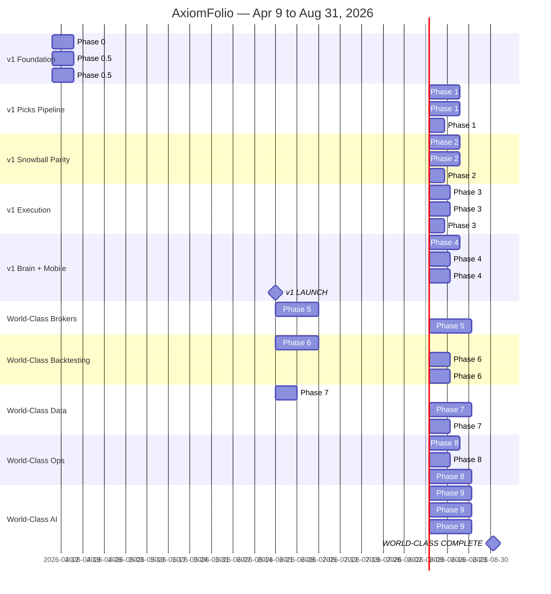

# AxiomFolio Master Plan 2026

**Status**: ACTIVE — source of truth for sprint planning. Supersedes all prior production-stabilization plans.
**Created**: 2026-04-09
**Owner**: Staff Engineer (Opus orchestrator)
**Reviewed**: see `docs/KNOWLEDGE.md` D81-D90 for decision rationale.
**Companion**: [GAPS_2026Q2.md](GAPS_2026Q2.md) — production gaps discovered 2026-04-20 (G1–G27, dual-mode return-maximization platform per D116 + IBKR sync correctness per D117 + founder-replay-corpus discipline per D118 + discipline-bounded year-end target $2.0M–$2.5M for the founder joint book per D119). G14–G19 form the Active/Conviction discipline layer; G20 adds the HNW tax-deferral surface; G21 turns the founder portfolio into the canonical acceptance test; G22–G25 close the broker-sync correctness gap (silent partial-success guard, historical XML backfill, account-type-aware strategy routing, multi-account auto-discovery) so every downstream engine actually receives correct data; G26 anchors the "inability to close when winning" founder-self-identified pain as the explicit G15 acceptance criterion. G27 (per-account risk profile) ships in Phase 1 after G24/G25 land — lets users tune position-sizing dial-settings within the discipline (Conservative / Balanced / Aggressive / Speculative) but never disable RiskGate, RegimeGate, ExitCascade, or the Kill Switch; founder IRA defaults Aggressive (no tax friction → can run faster within discipline), Joint Taxable defaults Balanced. The G7 (PickQualityScorer) + G9 (Options Chain Surface) + G10 (Trade Card UX) trio remains the visible product surface that turns AxiomFolio from "shows you 156 stocks" into "renders 1–3 ranked Trade Cards with the order pre-staged". Resolve in parallel with phases below; sync-correctness gaps (G22 + G23 Path A + G24 + G25) are bundled in `feat/ibkr-multi-account-historical-import` PR (Phase 0).

---

## Strategic Frame

### Mission

> Snowball Analytics + Bloomberg Terminal + a hedge fund analyst — but for retail, with one-click execution. Help retail investors actually make money, not just receive signals.

### Positioning

| Competitor | Their thing | Our edge |
|------------|-------------|----------|
| Snowball Analytics | Beautiful read-only portfolio viz | + execution + picks + autotrade |
| Bloomberg Terminal | Pro-grade data + analytics | 1/100th price, retail UX, one-click execute |
| StocksToBuyNow.ai | Picks via Discord/email | Picks land in your portfolio with stops + position sizing already wired |
| Hedge fund research notes | Brilliant but expensive and unactionable | Validator-curated picks → executable orders → tax-aware exits |

### Product shape

- **Standalone product** with own subscription tiers (Free / Lite / Pro / Pro+ / Quant Desk / Enterprise).
- **Native AgentBrain chat panel** for Pro+ — not a separate app, lives in-product.
- **Cross-sells into Paperwork ecosystem** (FileFree for taxes, Paperwork Brain for cross-domain conversational AI). Bundles available, not required.

### Key personas

- **Self (founder)** — power user, runs everything, validates edge cases.
- **Twisted Slice** — hedge fund validator persona. Forwards analyst notes / writes original picks. Pseudonym in all user-facing artifacts. Inbound validator sender(s) configured server-side via the `PICKS_TRUSTED_SENDERS` env var; real identifiers never live in code, docs, or version control.
- **Pro retail trader** — wants picks + auto-executed entries with stops, doesn't have time to sit at terminal.
- **Lite retail user** — Snowball replacement, free portfolio viz, gateway drug to Pro tier.

### Two milestones

| Milestone | Date | Definition |
|-----------|------|------------|
| **v1 Launch** | **2026-06-21** (10 weeks) | Paying users on Free / Lite / Pro / Pro+. Validated Picks live (founder + Twisted Slice). Native AgentBrain chat. Snowball-class viz. TRIM/ADD/rebalance. Tax-aware exits. Email parser. PWA mobile. |
| **World-Class Complete** | **2026-08-31** (20 weeks) | + 8 brokers via Plaid + hand-rolled. + Walk-forward + Monte Carlo + event-driven backtester. + Symbol master + multi-source quorum. + OpenTelemetry + SLOs + chaos engineering. + Trade Copy + AI Portfolio Optimizer. + Quant Desk tier with white-label. |

### Year 2 backlog (post-Aug 31)

- Validator Marketplace (multiple Twisted Slices, revenue share)
- Strategy Marketplace (publish backtested strategies)
- Native iOS / Android
- International markets (LSE, TSX, ASX, EU)
- AI Portfolio Optimizer Pro tier
- Discovery Feed (TikTok-style swipe through picks/strategies)

---

## Working Patterns

### Defaults

- **Cloud Background Agents** for bulk PR work, dispatched in parallel from this Opus session.
- **Opus orchestrator** (this session): architecture, financial logic, schema design, code review, decision logging.
- **Per-PR cadence**: ping user only when PR is ready for review/merge. Otherwise silent.
- **Stripe**: test mode only until founder explicitly says "go live with billing".
- **Live broker creds**: untouched until founder is at laptop and explicitly authorizes wiring.
- **No emojis** anywhere in code, docs, commits, PR bodies, UI copy.
- **Twisted Slice pseudonym** enforced everywhere user-facing. Real name and email never exposed.

### Branch convention (per sprint phase)

- `fix/phase-N-<name>` — Phase 0 stabilization fixes
- `feat/v1-<feature>` — v1 milestone features
- `feat/wc-<feature>` — World-Class milestone features
- `chore/<topic>` — docs, configs, infra

### PR requirements

- Linked to one milestone (v1 or wc) and one phase
- CI green before merge
- No silent zero fallbacks (see `.cursor/rules/no-silent-fallback.mdc`)
- Production verification post-merge (see `.cursor/rules/production-verification.mdc`)
- KNOWLEDGE.md decision entry if architectural

---

## Phase Map

---

## v1 Launch Phases (Apr 9 - Jun 21)

### Phase 0 — Stabilization (Week 1, ships first)

**Goal**: stop the bleeding from the prod incidents documented in KNOWLEDGE D76-D80, R34-R37. Make pipeline self-healing. No new features.

| Todo | File(s) | Acceptance |
|------|---------|------------|
| Split worker into fast + heavy queues | [render.yaml](../../render.yaml), [backend/tasks/celery_app.py](../../backend/tasks/celery_app.py) | `axiomfolio-worker` (--beat, -Q celery,account_sync,orders, --concurrency=2, max-mem 750000) and `axiomfolio-worker-heavy` (-Q heavy, --concurrency=1, max-mem 1500000); `repair_stage_history`, `fundamentals.fill_missing`, `snapshot_history.*`, `full_historical`, `prune_old_bars` routed to `heavy` queue |
| Pipeline waiting state | [backend/services/pipeline/dag.py](../../backend/services/pipeline/dag.py) | `_QUEUED_TIMEOUT_S` raised to 900s; new `RunStatus.WAITING` surfaces `current_task` + age via Celery `inspect()`; only `error` if no worker reachable; API + `SystemStatus.tsx` render amber row |
| Tracked aggregates resilience | [frontend/src/pages/MarketTracked.tsx](../../frontend/src/pages/MarketTracked.tsx) | `useSnapshotAggregates` `isLoading`/`isError` handled; chips show `—` not `0` on loading/error; top strip shows Retry button on error; per-hook retry to 3 with exponential backoff |
| Dashboard warming truth | [frontend/src/pages/MarketDashboard.tsx](../../frontend/src/pages/MarketDashboard.tsx) | When `/dashboard?universe=X` returns 202 `warming` for >3 polls, render snapshot coverage stats from `/market-data/admin/health` instead of generic spinner |
| DAG stale state (not error) | [frontend/src/components/pipeline/PipelineDAG.tsx](../../frontend/src/components/pipeline/PipelineDAG.tsx) | `resolveVisualStatus` renders gray `stale` instead of red `error` when `last_run_at` >12h old |
| Yahoo backoff | [backend/tasks/market/fundamentals.py](../../backend/tasks/market/fundamentals.py) | tenacity retry with exponential backoff on 429; `limit_per_run` 500→200; warn-and-skip after 3 retries; structured counters |
| IBKR watchdog gate | [backend/tasks/portfolio/ibkr_watchdog.py](../../backend/tasks/portfolio/ibkr_watchdog.py) | Early-return if no enabled `BrokerAccount(provider='ibkr')` rows exist; eliminates every-2-min `SoftTimeLimitExceeded` noise |
| Snapshot history coverage fix | [backend/tasks/market/indicators.py](../../backend/tasks/market/indicators.py) | Add structured counters (written/skipped_no_data/errors) to `recompute_universe`; assert `written+skipped+errors == tracked_total`; coverage test |
| Monotonicity index migration | new Alembic migration, [backend/services/market/stage_quality_service.py](../../backend/services/market/stage_quality_service.py) | `CREATE INDEX CONCURRENTLY ix_market_snapshot_history_symbol_btree`; rewrite `SELECT DISTINCT symbol` query in `repair_stage_history_window` to use `tracked_symbols_with_source` |
| Bulk repair + regime schedule | [backend/tasks/job_catalog.py](../../backend/tasks/job_catalog.py) | One-time `repair_stage_history` on heavy worker clears 2820 monotonicity violations; add `JobTemplate` for `compute_daily_regime` cron `'20 3 * * *'` (currently missing) |
| Phase 0 verification | post-merge | composite_status green; dashboard 200; active-tasks balanced; manual trigger shows `waiting`; tracked shows real symbol count not "0"; no OOMs for 24h; 3 consecutive successful nightly runs |

**PR**: `fix/v1-phase-0-stabilization` — single PR, dispatched as Background Agent A.

### Phase 0.5 — Stripe + CandidateGenerator (Week 1, parallel with Phase 0)

**Goal**: lay billing scaffold and pick generation engine without touching production money or production data.

#### Stripe scaffolding (test mode only)

| Todo | File(s) | Acceptance |
|------|---------|------------|
| `User.tier` enum | [backend/models/user.py](../../backend/models/user.py) + Alembic | Enum: `FREE`, `LITE`, `PRO`, `PRO_PLUS`, `QUANT_DESK`, `ENTERPRISE`; default `FREE`; backfill existing user to `PRO_PLUS` |
| `Entitlement` model | new model + Alembic | `user_id`, `feature_key`, `value` (jsonb), `granted_via` (`tier`/`override`/`bundle`), `expires_at` |
| Stripe client wrapper | new `backend/services/billing/stripe_client.py` | Test-mode keys only; idempotency keys; webhook signature verification |
| Webhook receiver | new `backend/api/routes/billing/webhooks.py` | `customer.subscription.created/updated/deleted`, `invoice.payment_succeeded/failed`; updates `User.tier` + `Entitlement` rows |
| `TierGate` decorator | new `backend/api/dependencies/tier_gate.py` | `@require_tier(Tier.PRO)` on routes; returns 402 with upgrade URL on insufficient tier |
| Feature catalog | new `backend/services/billing/feature_catalog.py` | Maps feature keys → tier requirements; single source of truth for "what does Pro get?" |

**PR**: `feat/v1-stripe-test-scaffolding` — Background Agent B.

#### CandidateGenerator service

| Todo | File(s) | Acceptance |
|------|---------|------------|
| `Candidate` model | new model + Alembic | `as_of_date`, `symbol`, `tier_min` (which subscription tier sees this), `regime` (R1-R5), `score` (composite), `reason` (jsonb), `source` (`algorithmic`/`validator`/`hybrid`), unique on (date, symbol, source) |
| `CandidateGenerator` service | new `backend/services/picks/candidate_generator.py` | Reads `MarketSnapshot` + composite scores from `scan_engine` + current `Regime`; produces top-N per tier per regime per day; deterministic given inputs (testable) |
| Daily Beat job | [backend/tasks/job_catalog.py](../../backend/tasks/job_catalog.py) | `generate_candidates` runs daily at 03:30 UTC after indicator recompute + regime; idempotent re-run safe |
| `GET /candidates` API | new `backend/api/routes/picks/candidates.py` | Tier-gated (`@require_tier`); returns latest candidates for caller's tier; pagination; filters by regime/sector |
| Frontend Candidates page | new `frontend/src/pages/Candidates.tsx` | Reads `GET /candidates`; renders ranked list with reason chips; tier-locked rows show "Upgrade to Pro" CTA for Free/Lite |
| Test fixture | new `backend/tests/test_candidate_generator.py` | Given canned MarketSnapshot + R3 regime, produces expected top-10 picks per tier |

**PR**: `feat/v1-candidate-generator` — Background Agent C.

### Phase 1 — Picks Pipeline (Weeks 2-3)

**Goal**: ingest Twisted Slice's emails → polymorphic LLM extraction → validator queue → tier-gated publish.

| Todo | Notes |
|------|-------|
| Inbound email webhook | Postmark or Resend inbound; signature verification; routes to `/api/v1/picks/inbound` |
| PDF + image attachment ingestion | `pymupdf` for PDF text + image extraction; gpt-4o vision for chart captioning; cost-gated to trusted senders |
| LLM polymorphic parser | Detects schema: `single_stock_bullets` / `single_stock_research_note` / `macro_recap_with_position_changes` / `daily_market_recap_narrative` / `mixed`; uses gpt-4o for synthesis |
| Schema set | `ValidatedPick`, `MacroOutlook`, `SectorRanking`, `PositionChange`, `RegimeCall`, `FlowSignal`, `AttributedQuote` SQLAlchemy models |
| Source attribution extraction | Track `original_author` (Keith McCullough/Hedgeye, Stock Pulse, ZeroHedge, Goldman, Nomura, etc.); separate from `validator` (always Twisted Slice) |
| Cross-email signal linking | Vector similarity + symbolic level matching; surfaces "this email reinforces email X from Y days ago" |
| Validator queue UI | `/picks/queue` for OWNER + ANALYST roles; tabs for picks / macro / mixed; bulk-approve + per-item edit |
| Approval state machine | `DRAFT` → `APPROVED` → `PUBLISHED` (or `REJECTED`); webhook to subscribers on `PUBLISHED` |
| Publish to subscribers | Tier-gated read; Free sees 24h-delayed; Lite sees real-time picks (no autotrade); Pro sees real-time + autotrade option |
| Test fixtures | All 4 example emails (AAOI/CIEN, Hedgeye, STT, ZeroHedge) round-trip into expected schemas with >85% field accuracy |

**PRs (sequential)**: `feat/v1-picks-inbound`, `feat/v1-picks-parser`, `feat/v1-picks-validator-queue`, `feat/v1-picks-publish-gating`.

### Phase 2 — Snowball Parity + Sentiment (Weeks 2-4)

**Goal**: free-tier hook is best-in-class portfolio viz. Connect more brokers. Show sentiment.

| Todo | Notes |
|------|-------|
| Plaid Investments client | Stub for v1 (full broker support in WC Phase 5); minimum viable for "connect Robinhood/Fidelity read-only" |
| Equity curve with annotations | Buy/sell/dividend markers on time series chart; benchmark overlay (SPY/QQQ/sector ETF) |
| Allocation treemap + sunburst | Interactive drill-down by sector/asset class/account |
| Drawdown chart | Underwater + max-drawdown stats |
| Income calendar | Heatmap of dividends + interest by month with projection |
| Sector rotation heatmap | Time x sector with color-coded performance/regime |
| X (Twitter) curated feed | Twisted Slice's allowlist of accounts; ingest via API; sentiment scoring; mention count per symbol |
| Market sentiment overlay | VIX, AAII bull/bear, Fear/Greed, news sentiment composite; rendered as banner on dashboard |
| Mobile-first card mode | Toggle on tables; renders rows as stacked cards on `max-md` breakpoint |
| **Discipline-Bounded Trajectory widget** | Per-account dashboard tile rendering: starting equity → discipline anchors (unleveraged + with-leverage tiers per D119) → current % to anchor → projected year-end with current trajectory; visually distinguishes the three tiers (unleveraged $1.95M-$2.5M, leveraged $2.5M-$3.0M, speculative $3.0M-$3.5M) and shades anything beyond as "outside discipline". Reads from `account_balances.total_equity_usd` time series + per-account `account_risk_profile` (G27). For founder joint book, anchors hardcode-default to D119 numbers; for other users anchors compute from their starting equity × (50% / 100% / 200% return ranges). Tile is glanceable: one number prominent (current equity), one ratio (% to anchor), one trend arrow (on track / behind / ahead). No projections beyond the anchor — the discipline ceiling is the ceiling, by design. |

**PRs**: `feat/v1-snowball-equity-curve`, `feat/v1-snowball-allocation`, `feat/v1-snowball-income`, `feat/v1-sentiment-overlay`, `feat/v1-x-curated-feed`, `feat/v1-mobile-card-mode`, `feat/v1-discipline-trajectory-widget`.

### Phase 3 — Execution (Weeks 4-6)

**Goal**: TRIM/ADD as first-class order types. Rebalance engine. Tax-aware exits via existing `TaxLossHarvester`.

| Todo | Notes |
|------|-------|
| TRIM/ADD as `OrderType` | Extend `backend/services/execution/order_manager.py`; TRIM = sell N% of position; ADD = buy to bring to target weight |
| Rebalance engine | Compute target weights from current portfolio + target weights; produce `OrderIntent` list; preview UI before execute |
| Tax-aware exit selector | Wire `tax_loss_harvester.py` into `OrderManager` for SELL orders; choose tax lots that minimize tax impact (HIFO / specific lot / wash-sale-aware) |
| `SignalToOrder` generator | Validated picks with `auto_execute=true` flag → `OrderIntent` via configurable rules (size pct of equity, max loss, regime gate) |
| `PortfolioHeatGuard` | Per-user concurrent risk cap; rejects new orders when portfolio heat exceeds threshold |
| Per-user circuit breaker | Refactor existing global `CircuitBreaker` to be per-user; multi-tenancy fix |
| Bracket orders | OCO stop + target on entry via broker APIs (where supported) |
| Adaptive trailing stop manager | Already partially built in `exit_cascade.py`; extend with per-pick custom stops from validated picks |

**PRs**: `feat/v1-trim-add-orders`, `feat/v1-rebalance-engine`, `feat/v1-tax-aware-exits`, `feat/v1-signal-to-order`, `feat/v1-per-user-circuit-breaker`, `feat/v1-bracket-orders`.

### Phase 4 — Native AgentBrain + Mobile + Tier UX (Weeks 5-9)

**Goal**: native chat panel as Pro+ hook. PWA. Polished tier gating.

| Todo | Notes |
|------|-------|
| Internal `AgentBrain` extension | Anomaly explanation, NL queries, trade decision explainer, strategy suggestions |
| LLM gateway with circuit breaker | New `backend/services/agent/llm_gateway.py`; OpenAI calls with retry + fail-closed |
| Constitution YAML | New `backend/services/agent/constitution.yaml`; immutable rules enforced on every LLM action |
| Native chat panel | New `frontend/src/components/chat/AgentBrainChat.tsx`; pinned right-rail for Pro+ users; markdown + tool-call rendering |
| Chat context providers | Auto-inject portfolio state, current page context, recent picks into chat context window |
| Tier gating UX | Lock icons + upgrade CTAs on gated features; pricing page; checkout flow (Stripe Checkout) |
| Pricing page | `/pricing` with 6-tier comparison table |
| PWA manifest + service worker | Installable on iOS/Android; offline read of cached portfolio + picks |
| Mobile bottom-sheet modals | Replace popovers with bottom-sheets on `max-md` |
| Trading Year in Review | Native end-of-year wrap-up: trade journal stats, top winners/losers, regime-attributed performance |

**PRs**: `feat/v1-agentbrain-chat`, `feat/v1-llm-gateway`, `feat/v1-tier-gating-ux`, `feat/v1-pricing-page`, `feat/v1-pwa`, `feat/v1-mobile-bottom-sheets`, `feat/v1-trading-year-in-review`.

### v1 Launch Acceptance Criteria

- [ ] All Phase 0 verification items green
- [ ] At least 4 different email formats parsed correctly into validator queue
- [ ] Twisted Slice can publish a pick from email-arrival → subscriber-visible in <60s
- [ ] Pro user can one-click execute a published pick (paper mode minimum, live broker if wired)
- [ ] Snowball equity curve + benchmark overlay live for 5+ test portfolios
- [ ] Stripe test-mode checkout completes for all 6 tiers; tier gating actually blocks features
- [ ] Native AgentBrain chat answers "what's my biggest risk right now" using real portfolio data
- [ ] PWA installs on iOS Safari + Android Chrome
- [ ] Mobile UX score: no horizontal scroll on any page <768px
- [ ] At least 3 brokers connectable (IBKR + Schwab + Plaid-routed)
- [ ] Tax-aware exit chooses HIFO lot for a SELL with documented test
- [ ] No P0 prod incidents for 7 consecutive days pre-launch
- [ ] Documentation updated: PRD v2, ARCHITECTURE updated, KNOWLEDGE D81-D100, runbook for picks pipeline

---

## World-Class Phases (Jun 21 - Aug 31)

### Phase 5 — Multi-broker Expansion (Weeks 11-14)

| Sub-phase | Scope |
|-----------|-------|
| 5a | Plaid Investments full coverage — read-only positions/transactions for 12,000+ institutions |
| 5b | Hand-rolled adapters for top 5 brokers Plaid doesn't cover well: TastyTrade (full), Schwab (full incl. wash sales), Webull, Public, M1 |
| 5c | Broker plugin SDK — third-party broker adapters via plugin architecture |

### Phase 6 — Backtesting Excellence (Weeks 11-14)

| Sub-phase | Scope |
|-----------|-------|
| 6a | Walk-forward optimizer with Optuna — hyperparameter search per regime |
| 6b | Monte Carlo simulator — bootstrap resampling for confidence intervals on returns |
| 6c | Event-driven backtester — order-book-aware fill simulation; complements existing `BarReplayBacktester` |
| 6d | Regime-conditional reports — strategy performance broken down by R1-R5 |
| 6e | Backtest-to-live parity reports — flag drift between backtest expectation and live execution |

### Phase 7 — Data Excellence (Weeks 11-14)

| Sub-phase | Scope |
|-----------|-------|
| 7a | Symbol master — single source of truth for symbols, mergers, splits, ticker changes; DB-backed |
| 7b | Multi-source quorum — for critical fields (price, volume, fundamentals), fetch from N providers and require majority agreement; flag disagreements |
| 7c | Corporate action engine — splits, dividends, mergers automatically adjust positions, cost basis, and historical OHLCV |
| 7d | Point-in-time correctness — historical reads return data as it was known on that date (no look-ahead leakage in backtests) |
| 7e | Provider drift detector — flags when a provider's values diverge from historical norms |

### Phase 8 — Operations Excellence (Weeks 13-18)

| Sub-phase | Scope |
|-----------|-------|
| 8a | OpenTelemetry traces + metrics for all critical paths |
| 8b | SLO definitions + Grafana dashboards (pipeline freshness, picks publish latency, order fill latency) |
| 8c | Chaos engineering — scheduled fault injection (provider outage, DB latency, Redis failure) with auto-remediation verification |
| 8d | Multi-tenant hardening — per-tenant rate limits, cost attribution, GDPR data export/delete, Brain M2M auth scoping |
| 8e | Predictive failure detector — LightGBM model on operational metrics predicts incidents before they fire |
| 8f | Auto-runbook generator — `AgentBrain` drafts runbook entries from N historical incidents |

### Phase 9 — AI-Powered Differentiation (Weeks 15-20)

| Sub-phase | Scope |
|-----------|-------|
| 9a | Trade Copy — Pro+ users can mirror Twisted Slice's published picks automatically |
| 9b | AI Portfolio Optimizer — LLM-driven rebalance suggestions with risk/tax constraints |
| 9c | Strategy Assistant — NL → strategy spec → backtest → publish |
| 9d | Incident Postmortem Bot — drafts structured RCA when red persists >1h |
| 9e | Trade Decision Explainer — for every executed order, generates "why was this trade taken" explanation |

### World-Class Acceptance Criteria

- [ ] 8+ brokers connectable
- [ ] 3 backtesting modes (bar replay, event-driven, Monte Carlo) with parity to live
- [ ] Symbol master backed; corporate actions auto-applied; point-in-time queries verified
- [ ] OpenTelemetry traces visible in Grafana for every Celery task
- [ ] At least one chaos test passes per week (provider failure → auto-failover documented)
- [ ] Multi-tenant isolation verified (per-user data, per-user rate limits, per-user cost attribution)
- [ ] AI optimizer produces tax-aware rebalance suggestions at least as good as manual baseline
- [ ] Trade Copy live for 10+ paying subscribers

---

## Cross-Cutting Concerns

### Security & Multi-Tenancy

- All routes user-scoped via `current_user.id` dependency
- Per-tenant Redis namespaces
- Per-tenant rate limits (no noisy-neighbor)
- GDPR: data export endpoint + delete endpoint (Phase 8d)
- Brain M2M auth scoped per tenant (no `BRAIN_TOOLS_USER_ID=1` hardcoding)
- All secrets via env vars + Render secret store; never in code or commits

### Cost Management

- LLM call cost tracking per user per feature (Langfuse)
- Per-tier LLM budget caps (Free: 0, Lite: 0, Pro: $5/mo, Pro+: $20/mo, Quant: unlimited)
- Provider call cost tracking (FMP, Massive when added, etc.) per user
- Daily cost summary email to founder

### Decision Logging

Every architectural decision goes into `docs/KNOWLEDGE.md` as `D##: [date] [decision] — [rationale] — [alternatives] — [reversible?]`. Every resolved incident as `R##`.

### Documentation Hygiene

- PRD updated end of each milestone (v1: Jun 21, WC: Aug 31)
- ARCHITECTURE.md updated when modules added
- TASKS.md = current sprint mirror; archive prior sprints
- New runbook section per major feature (picks pipeline, billing, etc.)

---

## Cross-Domain Integration (Paperwork Ecosystem)

AxiomFolio is one product in the [Paperwork Labs](https://github.com/paperwork-labs/paperwork) ecosystem. Cross-product integrations live behind clean API boundaries.

| Product | Integration | Direction |
|---------|-------------|-----------|
| **Paperwork Brain** | `brain.paperworklabs.com` consumes AxiomFolio HTTP tools at `/api/v1/tools/*`; AxiomFolio sends HMAC-signed webhooks | Bi-directional |
| **FileFree** ([filefree.ai](https://filefree.ai/)) | AxiomFolio exports year-end tax package (1099 + tax lot summary + wash-sale ledger) → FileFree consumes via Brain | AxiomFolio → FileFree |
| **Future Paperwork products** | Cross-product subscription bundles ("All Access"); shared identity via Paperwork SSO | Bi-directional |

**Boundary**: AxiomFolio code never imports FileFree code or vice versa. Integration always via HTTP + Brain.

---

## What This Plan Replaces

This plan supersedes:

- `production-stabilization-final_*.plan.md` (CreatePlan tool storage, stale)
- `axiomfolio_standalone_+_brain_skill_*.plan.md` (CreatePlan tool delta, stale)
- All "future phases (post-stabilization)" rows in `docs/TASKS.md` (Phase 15-18)
- Outdated PRD non-goals ("Multi-user SaaS" / "Mobile native app")

`docs/PRD.md` carries a STRATEGIC UPDATE banner pointing here until v2 PRD rewrite (scheduled v1 Week 8).

---

## Sprint Marker

**Current sprint**: v1 Week 1 (Apr 9-16, 2026)

**Active PRs** (Background Agent dispatch):
- `fix/v1-phase-0-stabilization` — Agent A
- `feat/v1-stripe-test-scaffolding` — Agent B
- `feat/v1-candidate-generator` — Agent C

**Next up after Week 1 merges**: Phase 1 picks pipeline (email parser + validator queue) and Phase 2 Snowball parity start in parallel.
