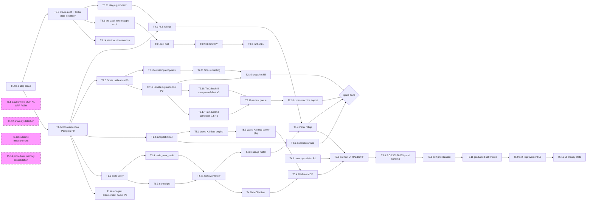

# Paperwork Labs 2026 Q2 Master Plan — Spine + L5 Brain

## What this plan is

The single execution roadmap from now to L4 handoff + L5 brain steady state. Subsumes:
- [`~/.cursor/plans/brain_=_curated_multi-tenant_agent_os_4c44cfe9.plan.md`](~/.cursor/plans/brain_=_curated_multi-tenant_agent_os_4c44cfe9.plan.md) (Waves A-L) — historical
- [`~/.cursor/plans/level_4_autonomy_+_platform_7ac343ca.plan.md`](~/.cursor/plans/level_4_autonomy_+_platform_7ac343ca.plan.md) (Phases A0-H, WS-41-65) — historical

References (do not duplicate; this is the execution layer):
- Doctrine: [`docs/BRAIN_ARCHITECTURE.md`](docs/BRAIN_ARCHITECTURE.md) — D1–D76
- Strategy + founder lock: [`docs/strategy/BRAIN_AS_COMPANY_OS_AS_SERVICE_2026.md`](docs/strategy/BRAIN_AS_COMPANY_OS_AS_SERVICE_2026.md) §0
- Bible audit: [`docs/audits/BRAIN_BIBLE_GAP_AUDIT_2026-05-03.md`](docs/audits/BRAIN_BIBLE_GAP_AUDIT_2026-05-03.md)
- Wave 1 audits: [`docs/audits/wave-1/`](docs/audits/wave-1/)

## Founder lock (recap)

- Internal-first **and** B2B-ready spine. Build the platform bones; defer customer SaaS surface.
- **DO NOT** build (until §0.5 trigger): public landing, pricing, Stripe Checkout, SOC-2 project, white-label, multi-tenant Clerk org signup, customer success staffing.
- **DO** build (it's the same work consumer Brain + coherent Studio need anyway): tenant boundary, gateway runtime, single source of truth per concept, RLS, vault wiring, surface coverage, every D65 entity end-to-end.

---

## Founder ground truth (locked 2026-05-04)

These are non-negotiables that override anything contradictory in source docs. Codify into rules where applicable.

1. **All backends are Python FastAPI.** TypeScript is reserved for frontends + Zod schemas mirroring Pydantic. New TS backend code requires explicit founder approval. Surviving TS-backend stragglers (`packages/tax-engine/`, `packages/document-processing/`, `packages/filing-engine/`) get deleted (T1.0e) or ported to Python (T5.5). Codify in `.cursor/rules/engineering.mdc` + `AGENTS.md`.
2. **Studio Vault is the single source of truth for all secrets.** Includes Vercel tokens, Render tokens, Clerk keys, GitHub PATs, AI provider keys, etc. Brain reads via `/api/secrets`. Cursor/agent dispatches read via `BRAIN_INTERNAL_TOKEN` → `vault.set/get`. Never paste secrets into chat, PRs, or commits. Codify in `.cursor/rules/secrets-ops.mdc` (already exists; reaffirm).
3. **All cheap-agent subagents must run in git worktrees, with rules pinned, and never push to main.** This is the procedural memory rule from today's branch-stomping incident. Enforced by 3 new hooks in T1.6. Default rule attachment: `cheap-agent-fleet.mdc` + `git-workflow.mdc` + `no-silent-fallback.mdc` + product-specific persona.mdc if applicable.
4. **Hetzner-hosted infra IS the canonical compute layer for builds.** "Brain probes" naming was confusing — it's just self-hosted runners (`paperwork-builders` Hetzner VM) running every prod build via `[self-hosted, hetzner]` GHA label. Vercel runs production *serving* of frontends; Render runs production *serving* of backends. Builds happen on our box (~50 jobs target); only ephemeral lints/security-boundary public-fork PR checks may use `ubuntu-latest`. Policy in T3.9 + `docs/infra/HETZNER_RUNNERS.md`.
5. **Composer models are the economical default for cheap-agent dispatches.** composer-1.5 (XS, ~$0.10) and composer-2-fast (S, ~$0.40) handle ~95% of mechanical work (refactors, backfills, doc rewrites, test stubs, snapshot kills). gpt-5.5-medium and claude-4.6-sonnet-medium-thinking require a `# justification:` line in the dispatch payload explaining why composer is insufficient. Update `cheap-agent-fleet.mdc` Rule #2 + enforcement hook (T1.6).
6. **Pre-user, pre-dev = perfect time for foundational metadata.** No historical drift to worry about. Every entity gets product[]+tenant_id+source_system+label_confidence labels NOW (T2.16-T2.20). **Qualifier (PR-REVIEW V2 F20)**: pre-user applies to the **Brain company-OS data corpus** (no external customers, no production tenants beyond `paperwork-labs`). The product monorepo already contains multi-year debt surfaces (`apis/filefree/tax-data/` duplicate, `packages/filing-engine/` 2,449 lines TS) scheduled for cleanup in T1.0e/T5.1/T5.5. Don't conflate "fresh Brain corpus" with "fresh codebase".

---

## Foundational labels (3-axis: product + tenant + source_system)

Every D65 entity (and every plan, doc, runbook, ADR going forward) carries 4 metadata columns. This is the missing primary key axis the schema should have had from day one.

### The 3 axes

| Axis | Cardinality | Values | Default | Why |
|---|---|---|---|---|
| **`product`** | multi-valued (`TEXT[]`) | `filefree`, `launchfree`, `distill`, `axiomfolio`, `trinkets`, `studio`, `brain`, `platform` | `{platform}` | Every list filterable by product; per-product Brain prioritization; per-product P&L and cost rollups; clean lineage when starting new product |
| **`tenant_id`** | single-valued | `paperwork-labs` (today, only one) | `paperwork-labs` | Pre-wires multi-tenant Track 4 work. Adding tenant #2 = INSERT row, no schema migration. |
| **`source_system`** | single-valued | `cursor-plan`, `cursor-transcript`, `github-pr`, `studio-manual`, `slack-historical`, `webhook`, `brain-self-generated` | `studio-manual` | Provenance trail; backfill quality flag; bug-source tracing |
| **`label_confidence`** | numeric (0.0–1.0) | `1.0` deterministic, `0.85+` LLM-inferred clean, `<0.85` review-needed | `1.0` | Surfaces a `/admin/labels-pending` queue (T2.19); founder swipes through low-confidence in 1-tap |

### Tables touched by migration 017 (T2.16, P0)

`goals`, `epics` (workstreams), `sprints`, `tasks`, `decisions` (created in T2.4 migration 015 with these columns from day one), `conversations`, `conversation_messages`, `transcript_episodes`, `agent_dispatches`, `documents`, `pr_outcomes`, `agent_procedures` (created in T1.5 migration 016 with these columns from day one), `brain_skills` (`tenant_id` already exists; add other 3).

**One Alembic migration. ~50 lines. Idempotent. Pre-dev = trivial.**

### Backfill plan (composer-fleet, parallel)

| Tier | Method | Entities | Confidence | Cost |
|---|---|---|---|---|
| **Tier 1** (T2.17) | Deterministic — file paths, filenames, grep | PRs, plans, sprints, decisions, docs, agent_dispatches | 1.0 | ~$2-5 (composer-1.5 ×6 parallel) |
| **Tier 2** (T2.18) | LLM inference — first/last N lines + tag context | Transcripts, conversations | 0.85+ typical | ~$10-30 (composer-2-fast ×3 parallel) |
| **Tier 3** (T2.19) | Founder swipe queue (anything `confidence<0.85`) | The ~5-10% Tier 2 misses | 1.0 (manual) | ~10 min founder time |

### Cross-machine ingest (T2.20)

Lets founder upload Cursor data from second machine (axiomfolio-heavy work):
- **Tarball flow** (primary): `tar -czf cursor-export.tar.gz ~/.cursor/projects/<project>/agent-transcripts/` → drag into Studio uploader at `/admin/transcripts/import`. Auto-runs T2.18 labeling on ingest.
- **CLI flow** (secondary): `pnpm brain:import-transcripts ~/.cursor/projects/<project>/agent-transcripts/` from any machine with `BRAIN_API_URL` + `BRAIN_INTERNAL_TOKEN`. Same auto-labeling.

### CI guard

Every NEW Alembic migration that creates a D65 entity table MUST include the 4 label columns. Hook: `.cursor/hooks/enforce-d65-labels.sh` greps new `op.create_table` calls in PR diffs for the 4 columns; fails CI if missing. Folded into D76 schema-to-surface CI guard (T1.5 + T2.12).

---

## 5 Parallel Tracks

### Track 1 — Make Brain Real (3-4 wks, ~9 workstreams)

Goal: stop the bleed, lock bible doctrine, fix the runtime crashes from Wave 1 audits.

- **T1.0a** Merge PR [#689](https://github.com/paperwork-labs/paperwork/pull/689) — Wave 0 band-aid kill (canonical paths + relaxed Workstream schema). XS, P0.
- **T1.0b** Diff-review + merge PR [#690](https://github.com/paperwork-labs/paperwork/pull/690) — ~17 brittle `parents[N]` callers cleanup. S, P0. Apply `cheap-agent-fleet.mdc` Rule #3 review checklist.
- **T1.0c** [PR-REVIEW V2 F17] Auto-merge body-text guard: patch [`.github/workflows/auto-merge-sweep.yaml`](.github/workflows/auto-merge-sweep.yaml) `tryAgentMerge` step (currently around lines 353-411 — verify by **semantic match**, NOT line numbers) to grep **full PR body** (and optionally title) for blocking phrases (`HOLD FOR`, `DO NOT MERGE`, 🛑). Add regression test fixture PR. XS, **P0**. **Pre-flight**: ship this BEFORE relying on agent auto-merge for any T#.# in this plan; ordering: T1.0a/b → T1.0c → first cheap-agent dispatch. (PR #664 root cause.)
- **T1.0d** [PR-REVIEW F1] Conversations canonical Postgres migration: rewrite [`apis/brain/app/services/conversations.py`](apis/brain/app/services/conversations.py) to use Postgres `conversations` + `conversation_messages` (migration 012) as source of truth, NOT JSON-on-disk + SQLite FTS sidecar. Backfill existing conversations from disk. Delete FTS sidecar. Add `tsvector` column on `conversation_messages` for full-text search. M, **P0**. **Blocks ALL of Track 2 + Track 4 RLS.** Acceptance: `conversations.py` has zero `open()` calls + zero `sqlite3` imports; `SELECT count(*) FROM conversations` ≥ disk file count; founder opens Studio Conversations on phone, sees all existing threads, posts new message, survives `render restart`. (Closes the data-loss risk that Render's ephemeral disk recycles wipe the founder's only daily-use surface.)
- **T1.1** Bible audit-patch verification: confirm D64–D76 actually landed in [`docs/BRAIN_ARCHITECTURE.md`](docs/BRAIN_ARCHITECTURE.md) per [`BRAIN_BIBLE_GAP_AUDIT_2026-05-03.md`](docs/audits/BRAIN_BIBLE_GAP_AUDIT_2026-05-03.md) Wave 0+1+2. Ship missing patches (likely D67 transcripts, D68 dispatches, D71 ref-knowledge, D73 JSON-to-DB). M, P0.
- **T1.2** [PR-REVIEW F3] Wire `autopilot_dispatcher.install()` into [`apis/brain/app/main.py`](apis/brain/app/main.py) startup — single highest-leverage 5-line PR per audit T3.5. XS, P0. Acceptance: `autopilot_dispatcher` job visible in `GET /internal/schedulers` response (job_id `brain_autopilot_dispatcher`); ≥3 `agent_dispatches` rows written within 15 min of deploy; `GET /api/v1/agents/dispatches?limit=3` returns rows with `status=completed`; `/admin/autopilot` Studio page status header reads "Loop running: last run X min ago" or "Loop not running: install() missing". (Replaces previous "/admin/health" reference — that page doesn't render APScheduler jobs.) Verify Neon `max_connections` headroom: total APScheduler jobs ≤ 20 (leaves 5 of 25 free-tier limit for web requests).
- **T1.3** Build `/admin/transcripts` surface (D67 + audit T3.6): GET endpoints + Studio page + nav link + Cursor session backfill from `~/.cursor/projects/.../agent-transcripts/*.jsonl`. M, P1.
- **T1.4** Wire `brain_user_vault` (D61 + audit T3.1): repository functions, vault.set/get/list/delete. M, P1. Unblocks IP MCP server tokens (T5.4/T5.5).
- **T1.5** `agent_procedures` table + YAML→DB graduation (audit T3.2 + D40 + D73). Migration 016 (per ordering constraint above). MUST include the 4 label columns from day one (per Foundational Labels section). M, P2. + D76 schema-to-surface CI guard (PR with Alembic migration but no Studio page → fail). S, P2.

- **T1.0e** Delete TS-backend stragglers per Founder ground truth #1: `packages/tax-engine/src/index.ts` (10-line stub) + `packages/document-processing/src/index.ts` (10-line stub). Update any imports. Add `.cursor/rules/engineering.mdc` enforcement rule: "no new TS files under `packages/*/src/` without `// PURPOSE: typescript-frontend-shim`-style header for Zod schema mirrors only." XS, P1. (`packages/filing-engine/` — 27 TS files, 2,449 lines — is the L4-handoff-blocking exception; ported in T5.5.)

- **T1.6** Subagent enforcement hooks per Founder ground truth #3 (today's branch-stomping incident is the lesson). Three new hooks in `.cursor/hooks/`:
  - `enforce-worktree.sh` (`subagentStart`, fail-closed) — block dispatches when CWD is the main checkout. Subagents must pass `cwd: ~/development/paperwork-worktrees/<branch>` or equivalent. Orchestrator (Opus) is exempt.
  - `enforce-rules-attachment.sh` (`subagentStart`, fail-closed) — block dispatches without explicit `rules: [list]` in the prompt or task description. Default minimum: `cheap-agent-fleet.mdc` + `git-workflow.mdc` + `no-silent-fallback.mdc` + product persona if applicable.
  - `enforce-no-direct-main-push.sh` (`preToolUse: Shell`, fail-closed) — block any `git push origin main` from a subagent process. Pre-existing `git-workflow.mdc` rule but never enforced; this enforces it.
  - Update `enforce-cheap-agent-model.sh` per Founder ground truth #5: warn (not fail) on `gpt-5.5-medium` / `claude-4.6-sonnet-medium-thinking` dispatches missing a `# justification:` line in prompt. Composer-only is the path of least resistance.
  S, P0. Acceptance: each hook tested with a forbidden + allowed dispatch; wired into `.cursor/hooks.json`; rule files updated to match.

  **[PR-REVIEW V2 F15] Bootstrap acceptance (chicken-and-egg mitigation)**: T1.6 PR is merged from an orchestrator session with `.cursor/hooks.json` temporarily renamed to `.cursor/hooks.json.tmp-disabled` (one-time waiver). Re-enabled in the same commit that introduces the new hooks. PR body documents the waiver explicitly. Subsequent dispatches enforce immediately.

- **T1.7** WS-43 (dropped from L4 plan, reintegrated): Brain freshness surface in `/admin/overview`. Renders last-run timestamp + count for every APScheduler job (autopilot_dispatcher, probe_failure_dispatcher, secret_expiry_monitor, etc.) + drift status (job is N min stale → red badge). S, P1. (Closes the "is brain alive" question without curling 5 endpoints.)

- **T1.8** WS-48 (dropped from L4 plan, reintegrated): `apps/accounts/` Vite app decommission per D92 (Clerk Account Portal at `accounts.paperworklabs.com` is the canonical sign-in surface). Archive Vite tree to `apps/_archive/accounts-vite/`. Remove from Vercel projects. Update DNS to point `accounts.paperworklabs.com` at Clerk. S, P2.

### Track 2 — Company OS Surfaces (D65 entities) (5-6 wks, ~22 workstreams)

Goal: every entity in the Internal Operations Schema (D65) has DB row + GET API + Studio page + nav link + E2E verified by founder on phone+desktop. **This is the "people, epics, sprints, conversations, infra" track the founder asked about.**

**Surface coverage matrix** (from [`BRAIN_BIBLE_GAP_AUDIT_2026-05-03.md`](docs/audits/BRAIN_BIBLE_GAP_AUDIT_2026-05-03.md) Tier 5):

| Entity | DB | API | Studio page | Nav | E2E | Workstream |
|---|---|---|---|---|---|---|
| Goal | ok | ok | `/admin/goals` ok | ok | unknown | T2.0 verify |
| Epic (Workstream) | ok | ok | `/admin/workstreams` (renders Epics; rename) | ok | unknown | T2.1 |
| Sprint | ok | partial | MISSING (`sprints-overview-tab.tsx` orphaned) | MISSING | n/a | T2.2 |
| Task / PR | partial | partial | inline only | n/a | unknown | T2.3 |
| Decision (D##) | MISSING | MISSING | MISSING (only `/admin/docs`) | MISSING | n/a | T2.4 |
| Conversation | ok | ok | ok (`/admin/brain/conversations`) | ok | daily-use | T2.5 polish + persona-reply unflag |
| TranscriptEpisode | ok | POST only | MISSING | MISSING | n/a | covered by T1.3 |
| AgentDispatch | ok | partial (reads episodes not table) | partial (`/admin/autopilot`) | ok | n/a (loop never installed) | T2.6 (after T1.2) |
| Employee / Persona / Rule | ok / partial / MISSING | ok / partial / MISSING | mixed in `/admin/people` | partial | partial | T2.7 split |
| Skill | ok | partial | inside `/admin/architecture` only | partial | orphan redirect at `/admin/agents` | T2.8 |
| Secret | ok | ok | `/admin/secrets` read-only | ok | partial (no rotate UI) | T2.9 |
| brain_user_vault | ok (table) | MISSING | MISSING | MISSING | n/a | covered by T1.4 |

- **T2.0** [PR-REVIEW F2] Goals **unification** (was: verification): migrate [`/admin/goals`](apps/studio/src/app/admin/goals/page.tsx) Studio page from `goals.json` (admin.py:2190+ OKR file endpoints) to SQL `goals` table (epics.py hierarchy endpoints). Delete `apis/brain/data/goals.json`. Delete `admin.py:2190+` file-backed OKR routes. Wire `docs/strategy/OBJECTIVES.yaml` as read-only "Strategic Context" overlay on Goals page (not a separate system). M, **P0**. Acceptance: one `goals` table, one GET endpoint, one Studio page, `goals.json` deleted, OBJECTIVES.yaml visible on Goals page.
- **T2.1** Epics surface polish: `/admin/workstreams` route header reads "Epics" (already does); ensure DB-sourced `epic-ws-NN-kebab` ids render correctly post-T1.0a Workstream schema relax; mount the orphaned `WorkstreamsBoardClient` drag-and-drop board OR archive it under `apps/studio/src/app/_archive/`. S, P1.
- **T2.2** Mount orphaned `sprints-overview-tab.tsx` on new `/admin/sprints/page.tsx` + nav link (audit Tier 5 row 3). Sprint detail page reads from `sprints` table + linked PRs from `tasks` + auto-close status from sprint markdown ingest (later T2.10). S, P1.
- **T2.3** Tasks/PRs surface: surface `tasks` rows inline on Epic and Sprint detail pages with `pr_url`, `status`, `pr_outcome`, validator notes. S, P2.
- **T2.4** New `/admin/decisions` Studio page (D65 + audit Tier 5 row 5): reads `decisions` table per D65 (create table if missing — **migration 015**, see migration ordering constraint below). Surfaces all D## entries with body, references, related entities. M, P1.

> **[PR-REVIEW F4] Migration ordering constraint**: T2.4 = migration **015**, T1.5 = migration **016**. These MUST merge sequentially (T2.4 first). Orchestrator runs `alembic heads` after each merge to verify single head. Do NOT dispatch in parallel.
- **T2.5** [PR-REVIEW V2 F11 RESIDUAL] Conversations polish: unflag `BRAIN_CONVERSATION_INLINE_PERSONA_REPLY_READY` in [`apps/studio/src/app/admin/brain/conversations/conversations-client.tsx`](apps/studio/src/app/admin/brain/conversations/conversations-client.tsx) line 290 once persona-reply endpoint is verified. **Acceptance (HTTP path parity test)**: add a Playwright test that POSTs to Studio's `/api/admin/conversations/{id}/reply`, asserts non-404 response, confirms persona-reply landed in Brain `conversations` table within 30s, AND verifies the underlying Brain route is `POST /api/v1/admin/conversations/{id}/persona-reply` (NOT `/reply`). Test runs in CI before flag flip — prevents the 404 silent-failure mode round 1 flagged. Founder uses on phone daily already. S, P2.
- **T2.6** AgentDispatch surface: rewrite `/admin/autopilot` to read from `agent_dispatches` table directly (not `agent_episodes` with `source_prefix`) per D68. Add filters (model/persona/workstream/date), validator-notes column, orchestrator approve/veto on `pending` rows. M, P1. (Depends on T1.2 — autopilot install must be wired first.)
- **T2.7** Personas/Rules/Employees split (audit T2.4 — three distinct entity classes): split [`apps/studio/src/data/personas-snapshot.json`](apps/studio/src/data/personas-snapshot.json) (currently mixes 5 rules with 47 employees) into:
  - `/admin/people` → live `GET /admin/employees` (17 rows: 16 personas + Founder)
  - `/admin/personas` → live `GET /admin/personas` (the 16 PersonaSpec + .mdc paired entries)
  - `/admin/doctrine` → live `GET /admin/rules` (35 rule files in `.cursor/rules/*.mdc`)
  - Delete `personas-snapshot.json`. M, P1.
- **T2.8** Skills surface: new `/admin/skills` page (locked plan Wave G1-G3) — Installed tab + Browse tab (Anthropic + Smithery in v1) + per-skill detail. Replaces orphaned redirect at `/admin/agents`. M, P2. (Blocked by Track 4 T4.2 gateway runtime for Browse tab.)
- **T2.9** Secrets rotation UI per audit Wave 1 secrets findings: extend [`apps/studio/src/app/admin/secrets/page.tsx`](apps/studio/src/app/admin/secrets/page.tsx) with create/edit/rotate actions on top of existing read-reveal-copy. Founder can rotate VERCEL_TOKEN without leaving Studio. S, P2.
- **T2.10a** [PR-REVIEW F5] Create Brain admin endpoints for 8 snapshot sources that lack DB-backed APIs: runbooks, circles, conversation-spaces, workflows (n8n), infra/services, knowledge-graph, reading-paths, tracker-index. Per source: (1) decide Postgres table vs runtime repo-file reader; (2) implement `GET /admin/{endpoint}`; (3) add to `docs/infra/REGISTRY.md`. M, **P1**. **Blocks T2.10 for those 8 files.** The 5 snapshots with existing endpoints (workstreams, goals, personas-snapshot per T2.7, docs-snapshot, founder-actions) can be killed in T2.10 immediately.

- **T2.11** [PR-REVIEW M8] Repoint `closes_workstreams` auto-close + workstream_progress + admin.py workstreams-board from JSON-file readers to SQL queries: [`apis/brain/app/services/sprint_md_auto_close.py`](apis/brain/app/services/sprint_md_auto_close.py) `load_workstreams_file()` → `load_epics_from_db()`; same for [`apis/brain/app/services/workstream_progress.py:69`](apis/brain/app/services/workstream_progress.py); same for [`apis/brain/app/admin.py:321-336`](apis/brain/app/admin.py). S, **P1**. **MUST land before T2.10 kills `workstreams.json`** or auto-close will silently no-op.

- **T2.10** Snapshot kill (locked plan Wave E never finished — 13 files still in [`apps/studio/src/data/`](apps/studio/src/data/)):

  | File | Surface | Brain endpoint to wire |
  |---|---|---|
  | `workstreams.json` | `/admin/workstreams` | `GET /admin/epics` (already exists) |
  | `goals.json` | `/admin/goals` | `GET /admin/goals` |
  | `personas-snapshot.json` | covered by T2.7 split | 3 endpoints |
  | `runbook-snapshot.json` | `/admin/runbook` | `GET /admin/runbooks` (Wave B3) |
  | `docs-snapshot.json` | `/admin/docs` | `GET /admin/docs` (Wave B3) |
  | `circles.json` | `/admin/circles` | `GET /admin/circles` (Wave B6) |
  | `conversation-spaces.json` | (none — used as data) | `GET /admin/conversation-spaces` (Wave B5) |
  | `n8n-graph.json` | `/admin/n8n-mirror` | `GET /admin/workflows` (Wave B3) |
  | `system-graph.json` | `/admin/architecture` | `GET /admin/infra/services` (Wave B4) |
  | `knowledge-graph.json` | (cross-cutting graph view) | `GET /admin/knowledge-graph` |
  | `reading-paths.json` | (used in docs surfaces) | `GET /admin/reading-paths` |
  | `tracker-index.json` | (used by tracker) | `GET /admin/tracker-index` |
  | `founder-actions.json` | various | `GET /admin/founder-actions` |

  One PR per snapshot, parallel-safe after the corresponding Brain endpoint exists. ~13× S, P2.
- **T2.12** Schema-to-surface CI guard (D76): every Alembic migration creating a public entity must add or modify `apps/studio/src/app/admin/**/page.tsx` in same PR + must include the 4 label columns per Foundational Labels CI guard. Already covered by T1.5.

- **T2.13** [PR-REVIEW M4] PII scrubber audit on every Track 2 surface: Conversations, Decisions, AgentDispatches, Secrets, brain_user_vault, transcripts. Each render path must use `scrub_pii()` (server-side) or `<MaskedContent>` (client-side). One PR per surface, parallel-safe. ~6× XS, P2. Add CI rule: any new `/admin/**/page.tsx` rendering free-form user content fails review without one of these two mechanisms.

- **T2.14** WS-47 (dropped from L4 plan, reintegrated): Cloudflare per-zone API tokens + auto-rotation. Today: one super-token in vault. Goal: per-zone (`paperworklabs.com`, `filefree.ai`, `launchfree.ai`, `distill.tax`, `axiomfolio.com`, `tools.filefree.ai`) tokens with minimum scope (DNS edit + Worker route edit per zone). Auto-rotate every 90d via `secrets_rotation_monitor` (T3.13). Integrates with T2.9 Secrets rotation UI. S, P2.

- **T2.15** WS-52 (dropped from L4 plan, reintegrated): Knowledge-Graph self-validation. Cross-tab consistency check on entity references — if Decision D67 references Workstream WS-82, and WS-82 doesn't exist, surface in `/admin/labels-pending` (or a sibling `/admin/integrity` page). Runs as APScheduler job nightly. S, P2.

- **T2.16** [LABELS, NEW + PR-REVIEW V2 F14] Migration 017 — add 4 label columns (`product TEXT[] NOT NULL DEFAULT '{platform}'`, `tenant_id TEXT NOT NULL DEFAULT 'paperwork-labs'`, `source_system TEXT NOT NULL DEFAULT 'studio-manual'`, `label_confidence NUMERIC NOT NULL DEFAULT 1.0`) to all existing D65 tables. Pydantic + Zod schema mirror updates. Required on all new rows post-migration. M, **P0**. **MUST land before T2.10 snapshot kill** (replacement endpoints must serve labeled data). **Idempotency**: use `ADD COLUMN IF NOT EXISTS` (or `to_regclass` guards) so re-running is safe. **Per-table skip list**: `decisions` (created in 015 with labels inline) and `agent_procedures` (created in 016 with labels inline) are NO-OPs — migration 017 skips them. Add `alembic heads` CI gate artifact surfaced in Conversation tag `alert` on every migration merge. Acceptance: `\d+ goals` etc. shows 4 new columns; existing rows have defaults; new rows from any surface include explicit labels; running migration 017 twice = no error.
  - **Conventions, not enums** (Founder ground truth, 2026-05-04 PM): `product` / `tenant_id` / `source_system` ship with NO `CHECK` constraint, and Pydantic + Zod schema mirrors use `list[str]` / `str` (NOT `Literal[...]`, NOT Zod `enum`). Adding a new value (e.g. a new product surface, a B2B sub-product, a tenant) requires zero schema changes and zero code changes. For entity-level labels, `product` is the only axis B2B will need to extend — sub-product or vertical granularity uses **namespaced values** (`distill.tax-api`, `distill.formation-api`, `vertical:legal`) inside the existing `TEXT[]`. No JSONB bag, no rename, no new axis. Canonical-values list lives in `packages/data/labels/canonical.json` (descriptive only, not enforced; convention-lint warns on unknown values via weekly digest, never blocks writes — per `no-silent-fallback.mdc`).
  - **Driving deliverable**: T2.16 + T2.17 backfill exist to populate the [`/admin/products`](https://www.paperworklabs.com/admin/products) Studio surface. Page reads from `product` column on every D65 entity and groups by value. No prototype path — durable column-backed query from day one.

- **T2.17** [LABELS, NEW] Tier 1 deterministic backfill — composer-1.5 fleet × 6 parallel:
  - PRs / `pr_outcomes`: changed-files heuristic (`apis/filefree/*` → `filefree`, `apps/axiomfolio/*` → `axiomfolio`, `packages/python/*` → `platform`, etc.)
  - Plans (`*.plan.md` in `~/.cursor/plans/` + `docs/plans/`): filename + first 30 lines
  - Sprints: sprint markdown filename + body
  - Decisions: grep `KNOWLEDGE.md` per D## entry for product mentions
  - Documents (`docs/**/*.md`): path-based (`docs/strategy/BRAIN_*` → `brain`, `docs/runbooks/CLERK_*` → `platform`, etc.)
  - Agent dispatches: derived from `workstream_id` after epics backfill
  S, **P0**. All set with `confidence=1.0`. Cost ~$2-5. ~1 hour parallel.

- **T2.18** [LABELS, NEW] Tier 2 LLM-inferred backfill — composer-2-fast fleet × 3 parallel:
  - Transcripts: read first 200 + last 100 lines, return `{products: [...], confidence: 0.x}`
  - Conversations: read first 5 messages + tag list, return same
  - Episodes (`agent_episodes`): read body + tags, infer
  M, **P0** (P1 if Tier 1 covers >70% of corpus). Founder reviews `confidence<0.85` in T2.19. Cost ~$10-30. ~few hours parallel.

- **T2.19** [LABELS, NEW] `/admin/labels-pending` review queue Studio surface: lists rows with `label_confidence<0.85`; founder approves/edits product tags in 1-tap (mobile-first). Auto-escalates `confidence<0.5` rows to top of queue. S, P1. Acceptance: queue clears in <2 founder sessions; `SELECT count(*) FROM <table> WHERE label_confidence<0.85` = 0 across all D65 tables.

- **T2.20** [LABELS, NEW + PR-REVIEW V2 F16] Cross-machine Cursor data import — for axiomfolio-machine + future workstation moves:
  - **POST `/api/v1/admin/transcripts/import`** — accepts tarball of `~/.cursor/projects/*/agent-transcripts/*.jsonl`. Auth: `BRAIN_INTERNAL_TOKEN`. Auto-runs T2.18 labeling on ingest.
  - **`pnpm brain:import-transcripts <path>`** CLI — same flow from any machine with vars in env.
  - **Studio uploader** at `/admin/transcripts/import` — drag-and-drop tarball, shows progress + label-inference results live.

  **Security hardening (P0 sub-acceptance per F16)**:
  - Max untar size: **100 MB** (reject larger; 413 response)
  - Max file count per archive: **10K** (reject larger)
  - Path allowlist: only `agent-transcripts/*.jsonl` accepted; reject `..`, absolute paths, symlinks, anything outside allowlist (zip-slip / tar-slip prevention)
  - **Fail-closed ingest report**: response includes `{accepted, skipped, failed, failure_reasons[]}` per chunk; surfaced in `/admin/transcripts` page (no silent drops per `no-silent-fallback.mdc`)
  - **Rate limit**: 1 import per `BRAIN_INTERNAL_TOKEN` per hour (DoS guard)
  - **Prompt-injection guard for T2.18**: LLM labeling output stored with `source_system='cursor-transcript-untrusted'` so downstream consumers (Brain memory, recall, etc.) can scrub or refuse unverified content
  - **Security review checkbox in PR description before merge** (orchestrator verifies all 6 hardening bullets in T2.20 PR diff-review)

  M, P1. Acceptance: founder uploads axiomfolio-laptop tarball (≥10MB), ≥80% transcripts labeled `axiomfolio` with `confidence≥0.85`, low-confidence rows surface in T2.19 queue, malicious tarball with `..` path or 200MB size returns explicit 4xx with reason.

### Track 3 — Infra Truth (3-4 wks, ~17 workstreams)

Goal: every prod surface canonical in `infra/state/<surface>.yaml`, drift detector running, [`docs/infra/REGISTRY.md`](docs/infra/REGISTRY.md) is the company's ops bible. **This is the "infra setup, setup workers" track the founder asked about.**

- **T3.0** Phase A0 — Stack Truth Audit (locked plan L4 plan §A0): read-only audit of every layer vs best-in-class. Output `docs/STACK_AUDIT_2026-Q2.md` with KEEP / UPGRADE / REPLACE verdicts per layer:
  - Hosting (Vercel, Render, Cloudflare, Hetzner)
  - Frameworks (Next.js 16, FastAPI versions, AI SDK)
  - Auth (Clerk — features used vs available)
  - DNS/CDN (CF — Workers, Page Rules, Cache Rules optimization)
  - Data (Neon Postgres, Upstash Redis, vector store)
  - AI (Vercel AI Gateway provider mix, cost tracking)
  - CI/CD (GHA workflow DRY-ness, reusable workflows)
  - IaC (current ad-hoc bash → Pulumi vs Terraform vs scripts+drift)
  - Package management (pnpm + uv currency)
  - UX (shadcn/ui token system, Storybook, dark mode)
  - Observability (Studio dashboards + Sentry + Datadog gap)
  - Email (Postmark via Clerk; transactional vs marketing split)
  - Domain registration (Spaceship → CF Registrar at next renewal?)
  - Secrets (Studio Vault → Doppler / 1Password Secrets Automation?)

  Per layer: current choice, alternatives evaluated, verdict, effort to switch, decision deadline. M, P1.
- **T3.0a** [NEW] `apis/brain/data/*.json` inventory + classification: cheap-agent walks every JSON file in Brain's data dir, classifies as one of (a) reference/seed data (keep, version-controlled), (b) ops state (migrate to Postgres per T2.10 family), (c) snapshot (kill per T2.10), (d) learning data (move to `brain_episodes` or `agent_dispatches`). Output `docs/audits/BRAIN_DATA_INVENTORY_2026-Q2.md`. Feeds T3.0 stack audit + T2.10 scope. XS, P1. Composer-1.5 dispatch.
- **T3.1-pre** [PR-REVIEW F9, NEW] Vault audit for provider API token scopes: verify CF token has `Zone:Read` for all 6 zones, Render token has `Service:Read` + `EnvVar:Read`, Clerk token has `Instance:Read` + `Domain:Read`, Hetzner token has `Server:Read`, Neon token has `Project:Read` + `Branch:Read`. Founder said tokens exist; this verifies scope sufficiency for IaC drift detection BEFORE T3.1 starts coding. XS, P1. Composer-1.5 dispatch — read each token via `vault.get`, hit each provider API's auth-introspection endpoint, write `docs/audits/PROVIDER_TOKEN_SCOPES_2026-Q2.md`.
- **T3.1** WS-42 IaC drift detector (`scripts/check_infra_drift.py` runs every 30 min, locked plan Phase A): `infra/state/*.yaml` becomes canonical for each surface. Currently only [`infra/state/vercel.yaml`](infra/state/vercel.yaml) exists; need:
  - `infra/state/cloudflare.yaml` (DNS zones + rulesets — today's accidentally-installed CF ruleset becomes the first canonical entry)
  - `infra/state/render.yaml` (Brain + Brain worker env vars + service config)
  - `infra/state/clerk.yaml` (instances, satellite domains, allowed origins)
  - `infra/state/hetzner.yaml` (paperwork-builders + ops VMs)
  - `infra/state/neon.yaml` (DB branch + role + extension state)

  Behavior: drift detector either auto-reverts UI changes (data-files surfaces) OR files reconcile PR (semantic surfaces). L, P1.
- **T3.2** WS-54 [`docs/infra/REGISTRY.md`](docs/infra/REGISTRY.md): one row per prod surface (DNS zone, Vercel project, Render service, Clerk app, Hetzner VM, n8n workflow, Postgres, Redis, GCP Cloud Storage, GCP Cloud Vision project, OpenAI org, Anthropic org). Columns: owner, runbook link, drift detector status, kill switch path, on-call escalation. M, P1.
- **T3.3** WS-55 Runbook completeness audit: every REGISTRY entry must have a runbook in [`docs/runbooks/`](docs/runbooks/) covering outage diagnosis, rollback, common breakage modes. Today's [`docs/runbooks/CLERK_DNS_INCIDENT_2026-04-28.md`](docs/runbooks/CLERK_DNS_INCIDENT_2026-04-28.md) is the template. Cheap-agent dispatchable: 1 runbook per surface. ~12× XS, P2.
- **T3.4** WS-56 Cost monitor unification: extend `/admin/cost` with monthly cost projections per service (Vercel + Render + Cloudflare + Clerk + Postmark + AI tokens + Neon + Hetzner + GCP). Founder warning when projected to exceed $X/mo. S, P2.
- **T3.5** WS-53 Slack streamline (locked plan Phase D, decommissioned per AGENTS.md): audit remaining Slack senders post-Brain-Conversation migration. Confirm Brain Conversations covers all use cases per [`.cursor/rules/ea.mdc`](.cursor/rules/ea.mdc) tag directory. Retire any remaining Slack outbound that hasn't migrated. S, P3.
- **T3.6** WS-45 Brain kill switch + WS-46 Brain self-revert (locked plan Phase B): if not already shipped during the L4 blitz, ship now. `apis/brain/data/brain_paused.flag` + Studio "BRAIN PAUSED" banner + auto-revert PR on post-merge CI failure within 30 min. M, P2.
- **T3.7** Brain API deploy stability gate (post PR #689 + #690): confirm 5 consecutive Render deploys land green; wire `apis/brain/scripts/post_deploy_smoke.py` (assert `/health`, `/health/deep`, autopilot loop alive, agent_dispatches table reachable) into Render's pre-deploy step; alert in Conversation tag `alert` on regression. S, P0. (Closes the "Brain was down on Render for days" loop from the recent incident.)
- **T3.8** Vercel `--prebuilt` rollout completeness: audit every app deployed via Vercel (`apps/{filefree,launchfree,distill,studio,axiomfolio,trinkets}/`), confirm each uses [`.github/workflows/vercel-prebuilt.yaml`](.github/workflows/vercel-prebuilt.yaml) for prod deploys (built on Hetzner, deployed as artifact). Verify Vercel "Build CPU minutes used" → near-zero MTD. Document in `docs/infra/VERCEL_PREBUILT.md`. S, P0. (Cost cut you already started.)
- **T3.9** [PR-REVIEW V2 F18 + F19] GHA → Hetzner runner migration policy + audit + failover runbook: today 8 jobs use `[self-hosted, hetzner]`, ~50 still on `ubuntu-latest`. Establish policy in `docs/infra/HETZNER_RUNNERS.md`:
  - **Self-hosted required**: every prod build/deploy, every job >2 min wall, every job that needs Hetzner-side caches (pnpm/uv/playwright)
  - **`ubuntu-latest` allowed**: ephemeral lints/checks <30s, ad-hoc one-shot scripts (e.g. `dorny/paths-filter`), public-fork PR checks (security boundary)
  - **Glob audit**: `scripts/check_workflow_runners.py` MUST glob `.github/workflows/*.{yml,yaml}` (both extensions — round 1 review noted `.yml` files easy to miss)

  Audit each existing workflow against the policy. Convert any miscategorized jobs. Add workflow-lint check that fails CI on policy violation.

  **NEW (F18 SPOF mitigation)**: ship `docs/runbooks/HETZNER_RUNNER_FAILOVER.md` covering: VM loss recovery (RTO target), runner disconnect detection, manual `runs-on` fallback to `ubuntu-latest` policy with explicit visibility (Conversation tag `alert` when self-hosted queue depth > 5 OR last successful build > 30 min stale), surge capacity playbook for tax-season build burst.

  M, P1.
- **T3.10** Vercel unpause checklist: after T3.8 (every app on `--prebuilt`) + T3.4 (cost projections per service) + T3.9 (no orphan jobs eating ubuntu minutes) all green for 7 days, unpause Vercel project spend cap. Founder runs the checklist + flips the toggle. XS, P1. (Closes "i paused vercel since money was going crazy" from the prior chat.)
- **T3.11** [PR-REVIEW M2] Provision Brain staging environment: Render Starter ($7/mo) for `brain-staging`, Neon branch for staging DB, staging Upstash Redis. Studio admin setting toggles `BRAIN_API_URL` between prod and staging. **Blocks T4.1** (RLS rollout's "24h staging burn-in" needs an actual staging) **and T4.6** (tenant-provision script needs staging target). XS, P1. Acceptance: `curl https://brain-staging.paperworklabs.com/api/v1/health` returns 200; Studio toggle flips target.
- **T3.12** [PR-REVIEW M3] Brain DB backup/restore verification: confirm Neon point-in-time recovery (PITR) is enabled for Brain DB; document recovery procedure in `docs/runbooks/BRAIN_DB_RECOVERY.md`; quarterly recovery drill. XS, P1. (Bad migration like 014 backfill could corrupt the only copy on free tier; verify Neon tier supports PITR.)
- **T3.13** [PR-REVIEW M5 + M7] Observability + secret rotation cron:
  - Verify Sentry receives ≥1 test error from Brain prod within 5 min of deploy (add to T3.7 smoke).
  - Define rotation policy in `docs/runbooks/SECRET_ROTATION.md`: BRAIN_API_SECRET (90d), VERCEL_TOKEN (180d), provider API keys (365d).
  - Wire `secrets_rotation_monitor` APScheduler job to create Conversation tag `alert` when any secret exceeds policy age.
  S, P2.
- **T3.14** WS-57 (dropped from L4 plan, reintegrated): execute T3.0 stack-audit UPGRADE/REPLACE verdicts. One PR per layer needing change (e.g., "UPGRADE Next.js 14 → 16", "REPLACE Spaceship → CF Registrar at next renewal"). Cheap-agent fleet, parallel-safe per layer. M, P1. Time-boxed: every UPGRADE merged within 14 days of T3.0 verdict; every REPLACE has decision deadline + reversibility plan. Gated on outage/cost regression evidence (per AI-CEO review): if T3.4 cost monitor doesn't flag the layer AND T3.0 verdict isn't REPLACE-mandatory, defer to Q3 to preserve product-feature focus post L4 handoff.

- **T3.15** [AI-CEO Missing #1+#4, NEW] Monthly competitive + runway scan. Brain APScheduler job runs 1st of each month, posts to Conversation tag `monthly-scan`:
  - **Runway**: infra cost projection vs $50/mo CFO baseline (`cfo.mdc`); flags if MTD trajectory exceeds $50/$75/$100 thresholds
  - **Competitive**: web-search digest of bundled-incumbent moves (Notion AI pricing, Anthropic Skills releases, Atlassian agent rollups, Glean/Lindy/Mem.ai feature drops); refreshes strategy doc §0.2 externalities table
  - **Moat audit refresh**: Brain re-scores §0.3 moat audit table rows (no/Future/Real/Strong); appends delta column
  XS, P2. Composer-1.5 dispatch (~$0.10/mo). Founder reads in <5 min on phone.

### Track 4 — B2B-Ready Spine (5-7 wks, ~8 workstreams)

Goal: build platform bones for `paperwork-labs` org. Adding a second `organization_id` row later = days, not quarters.

- **T4.1** RLS rollout, 3-step per locked plan §7: middleware no-op (always sets `app.current_org_id='paperwork-labs'`) → enable RLS per-table behind feature flag → flip in prod after 24h staging burn-in. ~30 SQLAlchemy queries audited for `.where(.organization_id == ctx.org_id)`. L, P1.
- **T4.2** [PR-REVIEW F7] Brain Gateway runtime — split from a single L into 3 sub-workstreams:
  - **T4.2a** Gateway router + skill resolution + builtin dispatch: new router file at `apis/brain/app/routers/gateway.py`, resolves skill by `source_kind`, handles `builtin` synchronously. Endpoint responds. M, P1.
  - **T4.2b** MCP client + `brain_user_vault` token resolution: HTTP client to product MCP servers, per-user auth token from vault (depends on T1.4). Handles `mcp_server` and `anthropic_skill` source_kinds. M, P1.
  - **T4.2c** Usage meter + cost estimation per invocation: each gateway call writes `usage_meter` row with `cost_usd`, `meter_kind`, `outcome_kind`. S, P1.

  T5.4/T5.5 (IP MCP servers) only need T4.2a; T4.4 needs T4.2c. This prevents L4 handoff from waiting on the full gateway.
- **T4.3** Per-tenant rate limiting: extend [`packages/python/rate-limit`](packages/python/rate-limit) with org-scoped keys. S, P2.
- **T4.4** Usage meter wired (locked plan B10 + J1): every `brain.invoke()` writes `usage_meter` row with `cost_usd`, `meter_kind`, `outcome_kind`. M, P1. Acceptance: `/admin/billing` MTD rollup per tenant (read-only).
- **T4.5** Outcome hooks for IP skills (locked plan J2): `tax_filing.complete()`, `llc_formation.confirm()` write `outcome_achieved` rows. No billing yet, just substrate. S, P2.
- **T4.6** Tenant-provision admin script (no public signup): `pnpm brain:provision-tenant <org-id>` creates `agent_organizations` row + admin user + initial skills + RLS verification + 4-axis labels seeded. S, **P1** (elevated from P3 — required to prove §0.0 founder lock that "second org row is days, not quarters"). Acceptance: spin up `test-tenant-1` in staging in <5 min; founder runs script live during L4 handoff demo.

### Track 5 — L4 + L5 Autonomy + IP MCPs (3-5 wks, ~10 workstreams)

Goal: Wave K cleanup done, IP MCP servers live, `pwl new-app` ships (founder transitions to product), Brain hits L5.

- **T5.1** Wave K3: kill [`apis/filefree/tax-data/`](apis/filefree/tax-data/) duplicate via `packages/python/data-engine/` reading [`packages/data/src/tax/`](packages/data/src/tax/). Pydantic ↔ Zod schema-drift CI guard. M, P0. Legal-risk class bug per `no-silent-fallback.mdc`.
- **T5.2** Wave K10–K13: backend migrations to shared Python packages (api-foundation, observability, money). 4 backends, parallel-safe. Most already in flight. 4× M, P1.
- **T5.3** Wave K2: extract [`packages/python/mcp-server/`](packages/python/mcp-server/) from [`apis/axiomfolio/app/mcp/server.py`](apis/axiomfolio/app/mcp/server.py) reference impl. M, P1. Unblocks T5.4 + T5.5.
- **T5.4** Wave I3a: FileFree MCP server (`apis/filefree/app/mcp/`) + admin token-mint endpoint. Brain registers `tax-filing` skill (D62 pointer, not duplicate). M, P1. Acceptance: Brain `invoke("tax-filing", "calculate_federal_tax", {…})` returns founder's actual return.
- **T5.5** [PR-REVIEW F10] Wave I3b: LaunchFree MCP server. Python port of [`packages/filing-engine/`](packages/filing-engine/) (2,449 lines TS) using `playwright-python`, DE first. **XL** (re-sized from L), **P2**, **off critical path** — does NOT block L4 handoff (T5.6) or L5 activation (T5.9). Recommend deferring to Q3 to keep this plan at 10-11 weeks.
- **T5.6** Phase F WS-58: `pwl new-app <name> --template [next-saas|fastapi-api|brain-scheduler]` CLI. Scaffolds app + Vercel project + CF DNS + Clerk satellite + CI workflow + runbook + workstream entry in one PR. New app gets `product` label + entry in `docs/CONTRIBUTING.md` product table. **L4 HANDOFF MILESTONE.** L, P1.
- **T5.6.5** WS-59 (dropped from L4 plan, reintegrated): template authoring kit. Lets a future template (e.g., `python-cli`, `next-marketing`) be added by writing a `templates/<name>/manifest.yaml` + scaffold dir, no T5.6 CLI code change. M, P2.
- **T5.7** Phase F WS-60: existing 5 apps (axiomfolio, filefree, launchfree, studio, distill) onboarded to template. M, P2.

> **[AI-CEO Cond #3] Portfolio guardrail milestone — POST-T5.4 FILEFREE FOUNDER BLOCK**: After T5.4 (FileFree MCP server) ships, founder reserves **1 contiguous week for FileFree product feature work** (any scope: OCR fidelity demo, EFIN onboarding slice, filing submission hardening) BEFORE continuing T5.6 (`pwl new-app` CLI) and T5.7 (template onboarding). Codifies the portfolio guardrail that prevents the plan from becoming "all infra, no product." Founder posts Conversation tag `filefree-block` at start + end of week.
- **T5.8** Phase G2 WS-63: Brain self-prioritization. Brain reads `docs/strategy/OBJECTIVES.yaml` (per T5.8.5 schema) + ranks workstreams by `product[]` × objective_weight × predicted_impact / cost + opens proposal Conversation. Founder approves via reaction. M, P2.
- **T5.8.5** WS-61 (dropped from L4 plan, reintegrated): OBJECTIVES.yaml manifest schema + reader. Today the file is freeform; this gives it a Pydantic schema (`product[]`, `weight`, `target_metric`, `deadline`, `acceptance_criteria`) + reader in `apis/brain/app/services/objectives.py`. Required prerequisite for T5.8 self-prioritization. S, P1.
- **T5.9a** [AI-CEO Missing #5, NEW SPLIT] Brain L5 constitution doc: rollback triggers (% of self-PRs reverted in 7d → kill switch threshold), autonomy budget cap (max self-PRs/week before founder approve required), cumulative-blast-radius cap (no two L5 self-PRs in same 24h touching same file), interaction with T3.6 kill switch + T5.11 graduated self-merge + T5.12 anomaly detection. Founder ratifies in single Conversation tag `doctrine`. S, **P1**. **Blocks T5.9b** — no L5 activation without ratified constitution.
- **T5.9b** Phase G2 WS-64: Brain self-improvement loop ACTIVATION. Brain identifies bottlenecks weekly + ships PRs against [`apis/brain/`](apis/brain/) autonomously (graduated self-merge per T5.11, anomaly-monitored per T5.12, governed per T5.9a constitution). **L5 ACTIVATION.** L, P2.
- **T5.10** Phase H — L5 steady state. Founder writes quarterly OBJECTIVES.yaml; Brain runs the loop. n/a (ongoing). Acceptance: founder time on infra <30 min/month rolling avg.
- **T5.12** WS-50 (dropped from L4 plan, reintegrated) [AI-CEO Cond #5 — RESEQUENCED ON CRITICAL PATH]: anomaly detection on writeback. Brain monitors row-write rates per table (`agent_dispatches`, `pr_outcomes`, `usage_meter`); if rate spikes >3σ above 7d baseline, opens Conversation tag `alert` with "writeback anomaly: <table> +<x>σ over baseline". Catches stuck-loop dispatches, infinite-retry bugs. M, **P1** (elevated from P2). **MUST land before T5.11 widens self-merge promotion criteria** — provides the safety net for graduated self-merge.

- **T5.11** WS-44 (dropped from L4 plan, reintegrated): graduated self-merge for Brain self-PRs. Brain self-PRs start at "draft, awaits founder approve". After 50 clean merges (`pr_outcomes.outcome=success`, no revert in 7d), graduate to "auto-merge if all checks green + diff <100 LOC + no protected-region touch". Track in `apis/brain/data/self_merge_promotions.json` per `cheap-agent-fleet.mdc` Rule #6. S, P2. Required for T5.9 to actually self-merge instead of opening drafts forever. **Depends on T5.12 anomaly detection being default-ON.**
- **T5.13** WS-62 (dropped from L4 plan, reintegrated): outcome measurement loop. Every workstream has acceptance criteria; T5.13 wires automatic verification (CI test, SQL count check, `/health` poll) and writes outcome to `pr_outcomes` per `cheap-agent-fleet.mdc` Rule #6. Lets Brain self-rank dispatch quality per agent type × workstream type by hour 24 of any sprint. M, P2.
- **T5.14** WS-65 (dropped from L4 plan, reintegrated): procedural memory consolidation. Weekly: Brain reads `apis/brain/data/procedural_memory.yaml` + `pr_outcomes` + retros + incident logs, proposes 1-3 new doctrine rules or edits to existing rules. Founder approves via reaction in Conversation tag `doctrine`. Closes the learning loop from `cheap-agent-fleet.mdc` Rule #6. S, P2.

---

## Cross-cutting (folded into tracks; not standalone)

- Brand canon UI migration per [`docs/brand/CANON.md`](docs/brand/CANON.md) (5 products) — moved into Track 2 as polish across each app's surfaces. 5× S, P3.
- Procedural memory rule "always dispatch from a worktree" (today's branch race lesson) — codified + enforced via T1.6 hooks.
- Sprint markdown ingest, plan markdown ingest, bible re-ingest (D71 reference knowledge pipeline) — moved into Track 2 T2.10 family. 3× S, P3.
- **Product label policy** (NEW): every new plan/doc/ADR/runbook must declare `product[]` in YAML frontmatter from day one (post T2.16 ships). Add to `docs/CONTRIBUTING.md` + `AGENTS.md`. Enforced by `.cursor/hooks/enforce-frontmatter-product.sh` on `*.md` PRs in `docs/`. XS, P2.
- **Composer-only dispatch doctrine** (NEW per Founder ground truth #5): codify in `.cursor/rules/cheap-agent-fleet.mdc` Rule #2; warn-on-non-composer + `# justification:` override enforced by updated `enforce-cheap-agent-model.sh` (T1.6).

- **T0.1** [AI-CEO Missing #2+#3, NEW] Cofounder + design-partner pipeline schema (lightweight, no GTM scaffolding — does NOT violate §0.5 deferral): Brain Conversation tag `partner-pipeline` schema doc, 1-pager partnership context for cofounder Olga (current Brain capabilities + safe-to-mention infra primitives + qualifying questions), Brain Conversation tag `cofounder-enablement` for weekly partnerships sync. **No** Stripe Checkout, **no** public sales deck, **no** marketing site — just the data + conversation surface. S, P2. Sits OUTSIDE the 5 tracks because it's strategic scaffolding, not execution work. Enables AI-CEO Missing #2 (design-partner cultivation) + #3 (cofounder enablement) without violating §0.5.

---

## Critical path (post-review)

---

## End-to-end shippable demo gates (FOUNDER MANDATE: "no half-wired stuff")

> **Doctrine**: No checkpoint counts as "done" until the founder runs the listed demo on phone+desktop with a stranger watching. Capability without demo = silent fallback (per `no-silent-fallback.mdc`). Each milestone below has a demo set; if any demo fails, the milestone is NOT shipped.

### At Spine done (~wk 8-10) — 6 founder demos must pass

1. **Conversations survive Render restart**: Open Studio Conversations on phone, post a message, run `render restart brain-api`, refresh page, message + thread persist. (T1.0d)
2. **Goals single source of truth**: Open `/admin/goals` on phone, edit OBJECTIVES.yaml on laptop, refresh phone, change reflected in <5 sec. (T2.0)
3. **Autopilot loop visible alive**: Open `/admin/autopilot`, see "Loop running: last run X min ago", see ≥3 dispatches in past hour. (T1.2)
4. **Cross-machine import works**: From axiomfolio laptop, run `pnpm brain:import-transcripts`, see new transcripts labeled `axiomfolio` in Studio within 5 min. (T2.20)
5. **Labels are the new primary key axis**: Open any list page (Conversations, Sprints, Decisions), filter by `product=axiomfolio`, get axiomfolio-only results. (T2.16-T2.20)
6. **Tenant provision <5 min**: Run `pnpm brain:provision-tenant test-org-1` in staging, log in as test admin, post first Conversation, all in <5 min on stopwatch. (T4.6 elevated P1)

### At L4 handoff (~wk 9-11) — 4 founder demos must pass

7. **`pwl new-app` ships working app**: Run `pwl new-app demo-app --template next-saas`, follow PR to green CI, app live at `demo-app.paperworklabs.com` with Clerk auth + Brain integration in <30 min wall clock. (T5.6)
8. **All 5 apps on template**: filefree.ai, launchfree.ai, distill.tax, axiomfolio.com, studio admin all redeployed via template + pass smoke. (T5.7)
9. **Brain MCP gateway end-to-end**: From `/admin/brain` console, invoke `brain.invoke('tax-filing', 'calculate_federal_tax', {...})` with founder's actual return data, see correct refund number returned + meter row written. (T5.4 + T4.2 + T4.4)
10. **Founder writes "Going to build product"** Conversation tag `l4-handoff`. Witnesses: cofounder Olga + at least one prospective design partner from T0.1 pipeline.

### At L5 steady state (~wk 11-14 then ongoing) — 3 demos must pass quarterly

11. **Brain originates ≥80% of merged workstreams** rolling 30-day, surfaced in `/admin/overview` weekly chart.
12. **Brain self-improvement PR cadence ≥2/month** rolling 90-day, with `pr_outcomes.outcome=success` rate ≥90%.
13. **Founder time on infra <30 min/month** rolling 90-day, surfaced as Brain quarterly report + posted to Conversation tag `l5-quarterly`.

### Per-product end-to-end shippable artifacts (post-Spine, optional but recommended)

Each consumer product should have ≥1 end-to-end demo that proves the spine connects to user value (NOT just internal capability):
- **FileFree**: User uploads W2 photo → tax return PDF rendered (already demo-able pre-plan; Brain MCP integration in T5.4 elevates to "founder can run this from Brain console")
- **LaunchFree**: User picks state → LLC formation document generated (consumer flow exists; T5.5 MCP gateway deferred to Q3 — demo-able without it)
- **AxiomFolio**: Portfolio loads, signal renders, Brain reads holdings via MCP (already in production; Brain integration via T0.1 schema makes it observable)
- **Distill**: B2B API key issued via `pnpm brain:provision-tenant`, partner hits `/api/v1/pro/*` and gets data (T4.6 + T4.2c usage meter accrual proves the path)
- **Studio**: Founder operates entire company from Studio admin on phone for 1 week with zero direct Postgres queries (T2.0-T2.20 covers this — the daily-use proof)

---

## Milestone acceptance gates

**Spine done** (Tracks 1+2+3+4 complete, **~8-10 wks** post-review):
- Every Brain entity in D65 has DB + GET API + Studio page + nav link + E2E verified by founder on phone+desktop
- All 13 snapshot JSON files in [`apps/studio/src/data/`](apps/studio/src/data/) deleted; surfaces wired to Brain
- `autopilot_dispatcher` running every 5 min in prod
- `brain_user_vault` has 1+ live OAuth token stored + retrieved
- `POST /v1/brain/invoke` E2E test green
- RLS enabled on all multi-tenant tables; cross-tenant access tests in CI
- `usage_meter` accruing rows for every gateway invocation
- D76 schema-to-surface CI guard catches violations
- D65 4-axis labels (`product[]`, `tenant_id`, `source_system`, `label_confidence`) on every entity row; backfill complete; `/admin/labels-pending` queue empty; CI guard catches missing labels in new migrations
- Cross-machine Cursor data import working (axiomfolio-laptop tarball uploaded + labeled)
- Subagent enforcement hooks live (worktree + rules-attached + no-main-push); composer-only doctrine surfacing in `agent_dispatches.model_used` rollup
- TS-backend stragglers deleted (T1.0e); only `packages/filing-engine/` remains, scheduled for T5.5
- All Founder ground truth (#1-#6) reflected in `.cursor/rules/*.mdc` + `AGENTS.md`
- Tenant-provision script can spin up second org in staging in <5 min (T4.6 P1, founder runs live during demo)
- 5+ canonical `infra/state/*.yaml` files; drift detector runs every 30 min
- [`docs/infra/REGISTRY.md`](docs/infra/REGISTRY.md) has every prod surface with runbook + drift status + kill switch
- Brain Render API: 5 consecutive deploys green + post-deploy smoke alerts on regression
- Vercel `--prebuilt` covers 100% of prod app deploys; Vercel Build CPU minutes near-zero MTD
- GHA workflow audit: every job categorized per [`docs/infra/HETZNER_RUNNERS.md`](docs/infra/HETZNER_RUNNERS.md) policy; workflow-lint check green
- Vercel project unpaused; cost monitor (T3.4) catches regressions on the way back up

**L4 handoff** (T5.6 ships, ~9-10 wks):
- `pwl new-app demo-app --template next-saas` opens working PR
- All 5 existing apps onboarded to template
- Founder posts Conversation `tag=l4-handoff`: "Going to build product."

**L5 steady state** (T5.9 + T5.10, ~10-12 wks then ongoing):
- Brain originates ≥80% of merged workstreams (rolling 30-day)
- Brain self-improvement PR cadence ≥2/month (rolling 90-day)
- Founder time on infra <30 min/month rolling avg
- First quarterly L5 self-improvement report posted by Brain

---

## Honest deferred (per founder lock §0.0)

DO NOT ship without §0.5 trigger (3 design partners say "we'd pay" + 1 row in §0.3 moat audit improves):
- Public landing page, pricing page, sales deck for Brain-as-OS
- Stripe Checkout, dunning, metered billing wire-up to external customers
- SOC 2 project, DPA library, customer trust center
- White-label custom domains for tenants
- Multi-tenant Clerk org signup + invite emails
- Customer success staffing
- Public Brain mobile app

If you want covert design partners (§0.5 Option B), add a **Track 6 — Design Partners (3-5 wks)** later. Not in this plan.

---

## Dispatch model + cost

- **~69 workstreams** across 5 tracks (post principal-engineer review + founder ground truth round 2)
- **Composer-only doctrine** (Founder ground truth #5): composer-1.5 (XS, ~$0.10) + composer-2-fast (S, ~$0.40) handle ~95% of work. gpt-5.5-medium / claude-sonnet require `# justification:` line.
- Size mix: ~10 XS, ~25 S, ~25 M, 5 L (claude-4.6-sonnet-medium-thinking — RLS, gateway router T4.2a, IaC drift, pwl CLI, self-improvement loop), 1 XL (T5.5 LaunchFree MCP, off critical path, Q3 deferral recommended)
- **Estimated cheap-agent budget: ~$80-150** across full plan (was $200-300 pre-composer-doctrine; ~50% saving)
- Orchestrator (Opus) time: ~90-120 hrs over 12-14 wks (mostly diff-review + merge orchestration per `cheap-agent-fleet.mdc` Rule #3, plus mandatory rules-attached enforcement audit)
- **Honest timeline**: 12-14 weeks (was 11-13; +1 wk for T1.6 enforcement hooks + T2.16-T2.20 labels + dropped L4 backlog). To hit 10-12 weeks, drop T5.5 (Q3 defer) + T2.10 phase 2 (8 snapshots needing T2.10a) + T5.13 + T5.14 + T3.5 Slack streamline P3.
- **Cost split per track** (cheap-agent only, excludes Opus orchestration): T1 ~$15, T2 ~$40 (most expensive — labels backfill + 13 snapshots + 22 workstreams), T3 ~$30, T4 ~$15, T5 ~$50 (CLI + MCP servers + L5 loop). Total ~$150 max.
- **Procedural memory rules locked**: (1) always dispatch from a git worktree, (2) always pin rules in dispatch prompt, (3) cheap agents NEVER push to main, (4) composer-only by default with `# justification:` override. All 4 enforced via T1.6 hooks.
- **[AI-CEO Cond #2] Concurrent L-class merge cap = 2**: codify in `.cursor/rules/cheap-agent-fleet.mdc` Rule #4 (merge orchestration). At most TWO L-class workstreams (RLS, gateway router T4.2a, IaC drift, pwl CLI T5.6, self-improvement loop T5.9b) in active diff-review at any time. Prevents orchestrator review-context-switching collapse. Surfaced as a queue depth metric in `/admin/overview` per T1.7.

---

## Parking lot (mid-execution captures)

Items raised in chat or session work that aren't yet workstreams. **Doctrine (Founder, 2026-05-04 PM): mid-execution requirements / gaps / risks land here in the same session, not in chat — chat is not the plan, this file is.** Items get promoted to numbered `T#.#` entries when their track activates.

- **GH labels-as-code** (Founder, 2026-05-04 PM) — `.github/labels.yaml` canon + sync action (e.g. SHA-pinned `EndBug/label-sync`) + CI lint that fails when a workflow references a label not in canon. Today 6+ workflows reference labels with no enforcement; fresh forks miss labels silently. Coverage required: triage scheme (`green-mergeable`/`yellow-needs-fix`/`red-blocked`), merge gates (`do-not-merge`/`wip`/`hold`/`blocked`/`needs-review`/`needs-founder-review`/`agent-output`), wave-tracking labels (`wave-k10-axiomfolio` and siblings). Promote to **T3.16** when Track 3 work activates. Composer-1.5, ~$0.10.

- **Hetzner runner monitoring surface** (Founder, 2026-05-04 PM) — T3.9 only ships a runbook; no runtime visibility into self-hosted runner state. Need: Brain APScheduler poller (every 5 min, queries `GET /repos/.../actions/runners` + queued/in-progress runs filtered to `[self-hosted, hetzner]`), durable `hetzner_runner_snapshots` table, Studio `/admin/hetzner-runners` page (live runner cards, per-workflow last-success staleness, queue depth, recent failed-runs ledger), alert wiring into Conversation tag `alert,hetzner-runner` on (a) any runner offline >5 min during business hours, (b) self-hosted queue depth >5 for >10 min, (c) workflow last-success >30 min stale. Sibling to T3.9. Promote to **T3.17** when T3.9 lands. Composer-2-fast or claude-sonnet (cross-system: GH API + Brain scheduler + Studio page + alerting).

- **Plan-addendum doctrine codified** (Founder, 2026-05-04 PM) — see preamble of this section. The act of capturing in this Parking Lot **is** the doctrine; no separate rule file needed unless this list grows past ~20 items.

---

## How this plan supersedes prior plans

When committed, the plan ships with these housekeeping changes:
1. [`docs/strategy/BRAIN_AS_COMPANY_OS_AS_SERVICE_2026.md`](docs/strategy/BRAIN_AS_COMPANY_OS_AS_SERVICE_2026.md) §§1-7 stubs replaced with one-line: "→ see `docs/plans/PAPERWORK_LABS_2026Q2_MASTER_PLAN.md` Track N"
2. Both `~/.cursor/plans/*.plan.md` files get a header: "**SUPERSEDED 2026-05-04 by docs/plans/PAPERWORK_LABS_2026Q2_MASTER_PLAN.md** — kept for historical reference"
3. Future agents read the consolidated plan only

---

## Next-chat carry-forward (paste this when you fork)

> Continue from `docs/plans/PAPERWORK_LABS_2026Q2_MASTER_PLAN.md`. Principal-engineer review + Founder ground truth round 2 (labels, composer-only, subagent enforcement, dropped L4 backlog) integrated. State: PRs #689 + #690 + auto-merge body-text guard PR open or merged. **Week 1 serial work (do not parallelize)**: T1.0d Conversations Postgres P0 (blocks all of Track 2 + T4.1 RLS), T1.0a/b/c stop-the-bleed merges, T1.0e TS-backend straggler delete, T1.6 subagent enforcement hooks (3 new + composer doctrine update), T1.2 autopilot install, T2.0 Goals unification P0. **Week 2+ parallel-safe**: T1.1 bible verify, T1.3 transcripts, T1.4 brain_user_vault, T2.4 decisions table (migration 015 — DO NOT parallelize with T1.5 migration 016), T2.16 labels migration 017 (after T2.4+T1.5; blocks T2.10 + backfill), T3.0 stack audit (read-only) + T3.0a data inventory + T3.1-pre vault token scope audit (3 cheap parallel), T3.2 REGISTRY, T3.7 Brain deploy stability, T3.8 Vercel prebuilt completeness, T3.11 Brain staging provision, T5.1 Wave K3 data-engine. **Week 3+**: T2.17/T2.18 labels backfill (composer-1.5 ×6 + composer-2-fast ×3 parallel), T2.19 review queue, T2.20 cross-machine import (founder uploads axiomfolio-laptop tarball). Use cheap-agent fleet per `.cursor/rules/cheap-agent-fleet.mdc` (composer-only doctrine; `# justification:` for non-composer). Apply Rule #3 diff-review on every PR before merge. Dispatch from a worktree (T1.6 enforces). Founder check-in cadence: daily Conversation summary in tag `daily-briefing`; surface any T*.* slipping >1 day for re-sequencing.
