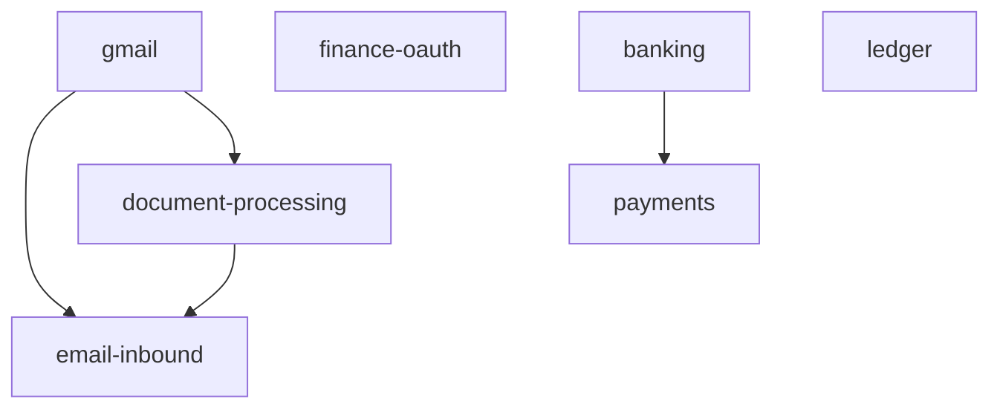

# Skills extraction roadmap (`packages/skills/*`)

Canonical plan for turning shared integrations into reusable workspace packages so new apps (Brain B2C, Money MVP, Studio, FileFree) can adopt them without copying `apis/*` internals.

**Stack context:** pnpm + Turborepo, TypeScript frontends, Python/FastAPI backends, Neon Postgres, Upstash Redis, Vercel + Render.

**Principle:** A “skill” is a **narrow vertical capability** (OAuth + API client + webhook helpers + typed contracts). Apps keep routing, auth, and persistence; skills expose libraries and stable interfaces.

---

## Workspace layout recommendation

### Use `packages/skills/<name>` (not flat `skill-*` at `packages/` root)

**Reasoning**

1. **Discoverability** — All integrations live under one subtree; turbo filters and CODEOWNERS stay simple.
2. **Avoid polluting `packages/*`** — You already have domain packages (`ui`, `vault`, `tax-engine`). Mixing `packages/plaid-skill` with `packages/ui` blurs product vs integration boundaries.
3. **pnpm glob requirement** — Current root config is:

```yaml
packages:
  - "apps/*"
  - "!apps/_archive/**"
  - "packages/*"
```

That pattern matches **only direct children** of `packages/` (e.g. `packages/ui`). It does **not** match `packages/skills/gmail`.

**Required change:** add an explicit glob:

```yaml
packages:
  - "apps/*"
  - "!apps/_archive/**"
  - "packages/*"
  - "packages/skills/*"
```

Optionally migrate the stub `@paperwork-labs/document-processing` from `packages/document-processing` into `packages/skills/document-processing` and re-export the same npm name from the new path to avoid churn (or deprecate the old path in one PR).

### Dual-language skills

Several skills are naturally **Python-first** (Gmail API workers, Plaid server, Stripe webhooks, OCR). Structure each repo-backed skill as:

```
packages/skills/<name>/
  package.json          # TS: types, tiny clients, React hooks (optional)
  tsconfig.json
  src/index.ts
  python/
    pyproject.toml      # hatch/setuptools; package name e.g. paperwork-skills-gmail
    src/paperwork_skills_gmail/
```

Publish internally via `workspace:*` for TS and `pip install -e ../../packages/skills/<name>/python` in Dockerfiles (same pattern as `packages/auth-clerk/src/python`).

---

## Sequencing graph (what blocks what)



| Skill | Depends on | Notes |
|--------|------------|--------|
| **gmail** | — | Foundation for mailbox-owned ingestion. |
| **document-processing** | — | Standalone; optionally deeper integration when Gmail attachments flow in. |
| **email-inbound** | **gmail** (optional transport), **document-processing** (attachments) | Shared *normalized message* model; Postmark is parallel ingress, not a replacement for Gmail OAuth. |
| **finance-oauth** | **vault** / encryption interface (existing patterns) | Broker OAuth is unrelated to Gmail. |
| **banking** | — | Plaid-specific; optional shared “connection storage” interface with finance-oauth. |
| **payments** | — | Often paired with banking for reconciliation but not a hard dependency. |
| **ledger** | — | Generic primitive; can ingest from payments/banking later via app-level ETL. |

**Answer (email-inbound vs gmail):** Keep **separate**. Gmail is a **pull** OAuth transport + optional **watch/PubSub**. Inbound providers are **push** webhooks. Share only a thin **`NormalizedInboundEmail`** (and attachment descriptors) module used by both.

---

## 1. `packages/skills/gmail` — highest priority

### Package design

**TS (`package.json`):**

- **Deps:** `googleapis` (official Gmail REST via generated client), `zod` (runtime validation of config/env).
- **Exports:** OAuth URL builders used by Next.js routes (optional), shared types, **no secret storage** in browser code.

**Python (`python/pyproject.toml`):**

- **Deps:** `google-api-python-client`, `google-auth`, `google-auth-oauthlib`, `google-auth-httplib2` (standard stack); optional `google-cloud-pubsub` if you handle push in-process.

**Public API sketch**

```text
# TS (browser-safe / server components)
createGmailOAuth2Client(config) // server-only helper wrapping OAuth2
types: GmailSyncCursor, LabelId, ThreadSummary

# Python (workers / FastAPI)
class GmailAccountRepository(Protocol):  # encrypt tokens at rest — delegate to vault
class GmailClient:
    list_messages(q, page_token) -> MessageListPage
    get_message(id, format) -> Message
    get_attachment(message_id, attachment_id) -> bytes
    modify_labels(id, add_label_ids, remove_label_ids)
    start_watch(topic_name, label_ids, label_filter_behavior) -> WatchResponse
    stop_watch()
verify_pubsub_push(request) -> DecodedPush  # if using Pub/Sub
```

**Directory structure**

```text
packages/skills/gmail/
  package.json
  src/
    types.ts
    oauth-server.ts        # Next / Route Handler helpers only
  python/src/paperwork_skills_gmail/
    client.py
    watch.py
    pubsub.py              # optional
```

### Top OSS libraries (embed/wrap)

| Library | Role | Maturity |
|---------|------|----------|
| **`googleapis` (npm)** | Official Node client; includes Gmail API surface, OAuth2 helpers. | ~12k+ GitHub stars on `googleapis/google-api-nodejs-client`; very frequent releases (Apache-2.0). |
| **`google-api-python-client` + `google-auth-*`** | Official Python discovery client; same API coverage as REST docs. | Google-maintained; standard for workers (Apache-2.0). |

**Watch / push:** There is no single blessed npm named “gmail-watcher.” Production pattern is **Gmail API `users.watch`** + **Google Pub/Sub push subscription** to your HTTPS endpoint (verify JWT / OIDC per Google docs). Optionally **Periodic History.list** with `startHistoryId` if you defer Pub/Sub complexity for MVP (higher latency, simpler ops).

### Effort estimate

**Large (1–2 weeks)** — OAuth multi-mailbox, encrypted refresh tokens, rate limits, attachment streaming, label semantics, watch lifecycle + renewal (~7 days), DLQ/retry strategy.

### Existing code to extract/migrate

- No dedicated Gmail integration found in-repo today; **greenfield** inside skill package.
- Related precedent: Google OAuth token URL usage in `apis/axiomfolio/app/api/routes/auth.py` (generic OAuth2, not Gmail scopes).

---

## 2. `packages/skills/document-processing` (replaces stub)

### Package design

**Recommendation:** **Python-first** implementation (Celery / FastAPI workers), TS package for **types + MIME helpers** used by Next upload flows.

**Python deps (minimal prod footprint):** start with `pypdf` + `filetype` or `python-magic` (libmagic); add `pymupdf` (PyMuPDF) as optional extra for speed/layout; add `pdfplumber` optional for tables; `unstructured[local]` or subset only if you need multi-format normalization.

**TS deps:** `file-type` (browser-safe subset) or server-side magic via WASM if needed; optional `tesseract.js` only if you must OCR **in the browser** (usually prefer server/OCR microservice).

**Public API sketch**

```python
def detect_mime(data: bytes) -> MimeGuess
def extract_text_pdf(data: bytes, *, ocr: OCRBackend | None) -> ExtractResult
def normalize_attachments(parts: list[RawPart]) -> list[NormalizedAttachment]
```

```typescript
// Shared contracts for apps
export type NormalizedAttachment = { mime: string; filename?: string; sha256: string; extractedText?: string };
```

### Top OSS libraries

| Library | Role | Maturity |
|---------|------|----------|
| **`pypdf`** | Pure Python PDF text extraction; already used in-repo. | Widely used; BSD-style license; good for text-first PDFs. |
| **`pymupdf` (PyMuPDF)** | Faster extraction, layout, render-to-image for OCR pipeline. | Very active; **AGPL** unless commercial license — evaluate compliance before defaulting. |

**Second tier / optional**

- **`pdfplumber`** — table-heavy PDFs (MIT).
- **`unstructured`** — multi-format pipelines (~14k+ stars, Apache-2.0); heavier deps; docs note OSS limits vs hosted API for production scale.
- **`tesseract.js`** — client-side OCR when server OCR unavailable (Apache-2.0).

**Cloud fallbacks:** AWS Textract, Google Document AI — wrap behind `OCRBackend` protocol identical to local Tesseract.

### Effort estimate

**Medium (3–5 days)** for MVP (PDF text + MIME + normalization). **Large** if you add production OCR, table fidelity, and cloud backends.

### Existing code to extract/migrate

- `packages/document-processing/` — stub TS; evolve or relocate under `packages/skills/document-processing`.
- `apis/axiomfolio/app/services/gold/picks/email_parser/preprocessor.py` — PDF path via lazy `pypdf`; prime extraction candidate.
- Related picks pipeline: `apis/axiomfolio/app/tasks/picks/parse_inbound.py`, types under `email_parser/`.

---

## 3. `packages/skills/finance-oauth`

### Package design

**Primary runtime: Python.** Broker SDKs and refresh cadences already live in AxiomFolio (`ib_insync`, `tastytrade`, custom Schwab/E*TRADE HTTP).

**Optional TS:** thin types + PKCE helpers only if a Next app initiates OAuth without a round-trip to Python (today Schwab flow is server-mediated via FastAPI).

**Public API sketch**

```python
# Mirror existing adapter pattern
class OAuthBrokerAdapter(ABC):  # migrate from app.services.oauth.base
    def initiate_url(...) -> OAuthInitiateResult
    def exchange_code(...) -> OAuthTokens
    def refresh(...) -> OAuthTokens

class TokenStore(Protocol):
    def save_encrypted(account_id, blob): ...
    def load_decrypt(account_id) -> OAuthTokens: ...
```

Broker-specific: `SchwabOAuthAdapter`, `TastytradeOAuthAdapter`, `IbkrFlexAdapter`, `EtradeOAuthAdapter` delegating to existing HTTP/SDK modules.

### Top OSS / vendor surfaces

| Component | Library | Notes |
|-----------|---------|------|
| IBKR | **`ib_insync`** | Already pinned in `apis/axiomfolio/requirements.txt`; wraps IB Gateway / TWS — not a substitute for **Flex Web Service** reporting OAuth; keep Flex as REST/XML client. |
| Tastytrade | **`tastytrade`** PyPI | Official-ish maintained SDK (already in requirements). |
| Schwab | **Official OAuth2** | Use HTTPS against Schwab developer docs; in-repo: `SchwabConnector`, `SchwabClient`. |

### Effort estimate

**Large (1–2 weeks)** to extract cleanly without breaking production executors — many touches (routes, Celery refresh, vault encryption).

### Existing code to extract/migrate

- `apis/axiomfolio/app/services/oauth/` — `base.py`, `encryption.py`, `etrade.py`, `tradier.py`, `coinbase.py`, `state_store.py`
- `apis/axiomfolio/app/services/bronze/aggregator/schwab_connector.py`
- `apis/axiomfolio/app/services/clients/schwab_client.py`, `tastytrade_client.py`, `ibkr_client.py`, `ibkr_flexquery_client.py`
- `apis/axiomfolio/app/services/security/oauth_state.py`, `pkce_state.py`, `credential_vault.py`, `connect_job_store.py`
- `apis/axiomfolio/app/services/execution/oauth_executor_mixin.py`
- `apis/axiomfolio/app/models/broker_oauth_connection.py` (model stays in API; **encryption + adapter interfaces** move)
- `apis/axiomfolio/app/api/routes/aggregator.py` — route handlers stay; call into skill

### Python vs TS vs both

**Ship Python as source of truth.** Add TS only for UX that starts OAuth from Next without duplicated PKCE logic — or keep OAuth start in FastAPI only (simplest).

---

## 4. `packages/skills/banking` (Plaid + alternatives)

### Package design

**TS**

- **`react-plaid-link`** — already in `apps/axiomfolio` (`^4.1.1`).
- Extract `PlaidLink.tsx` + `services/plaid.ts` patterns into `@paperwork-labs/skills-banking` or scoped `@paperwork/skills/banking`.

**Python**

- **`plaid-python`** — already `plaid-python==39.1.0` in `requirements.txt`.
- Move `webhook_verify.py`, `PlaidClient`, sync pipeline interfaces into skill.

**Public API sketch**

```python
verify_plaid_webhook(body: bytes, plaid_verification_header: str, client) -> dict
class PlaidFacade: link_token(...); exchange(...); sync_investments(...)
```

### Top OSS / ecosystem

| Piece | Choice | Maturity |
|-------|--------|----------|
| Server SDK | **`plaid-python`** | Official; actively released. |
| Link UI | **`react-plaid-link`** | Official React wrapper. |

**Alternatives (product evaluation, not necessarily OSS SDK quality):** [Teller](https://teller.io/), MX, Finicity — typically proprietary APIs; “wrapper skill” would mirror Plaid’s facade pattern behind `BankingConnectionProvider` enum.

### Effort estimate

**Medium (3–5 days)** — extraction + docs; less greenfield than Gmail.

### Existing code to extract/migrate

- `apis/axiomfolio/app/api/routes/plaid.py`
- `apis/axiomfolio/app/services/bronze/plaid/client.py`, `webhook_verify.py`, `sync_service.py`, `pipeline.py`
- `apps/axiomfolio/src/components/connections/PlaidLink.tsx`, `apps/axiomfolio/src/services/plaid.ts`

---

## 5. `packages/skills/payments` (Stripe)

### Package design

**Python-first:** webhook verification, idempotent event handling, small helpers for customer/subscription/invoice retrieval shaped to your domain events.

**Public API sketch**

```python
def construct_event(payload: bytes, sig_header: str, secret: str) -> stripe.Event
class StripeWebhookProcessor: ...  # migrate class; inject DB/session from app
def ensure_customer(user_email: str) -> stripe.Customer  # example helper
```

### Top OSS libraries

| Library | Notes |
|---------|------|
| **`stripe` (Python)** | Official; `stripe==15.1.0` in-repo; Stripe also publishes excellent TS SDK if you add Node handlers later. |

Wrappers should focus on **idempotency keys**, **event deduplication**, and **never trusting unsigned webhooks**.

### Effort estimate

**Small (1–2 days)** for extraction if behavior stays identical.

### Existing code to extract/migrate

- `apis/axiomfolio/app/services/billing/stripe_webhook.py` (`StripeWebhookProcessor`)
- `apis/axiomfolio/app/api/routes/webhooks/stripe.py`

---

## 6. `packages/skills/email-inbound` (Postmark / SES / generic)

### Package design

**Provider modules:**

```text
python/src/paperwork_skills_email_inbound/
  normalized.py          # NormalizedInboundEmail
  postmark.py            # signature + JSON parsing
  ses.py                 # SNS wrapper verification optional
  router.py              # optional: map To-address → tenant
```

**TS:** types mirroring Python or OpenAPI-generated.

### Top OSS

No single dominant OSS “inbound normalizer.” Implement **provider-specific** verification (HMAC for Postmark; AWS SNS message signature for SES). Reference implementations are usually vendor docs + small glue code (your Postmark module is already clean).

### Effort estimate

**Small (1–2 days)** for Postmark extraction + shared types. **Medium** if adding SES + multi-tenant routing + replay protection beyond idempotent MessageID.

### Existing code to extract/migrate

- `apis/axiomfolio/app/api/routes/webhooks/picks.py` — inbound handler (generalize naming away from “picks”).
- `apis/axiomfolio/app/services/gold/picks/postmark_signature.py`

---

## 7. `packages/skills/ledger` (cost / expense primitive)

### Package design

**Core:** append-only **event log** + **materialized summaries** (monthly burn, budget utilization, alerts). Storage can start JSON/files (Brain today) and graduate to Postgres `(ledger_entry)` table with `vendor`, `category`, `amount_usd`, `source_ref`, `occurred_at`, `idempotency_key`.

**Public API sketch**

```python
class LedgerRepository(Protocol):
    def append(entries: list[LedgerEntry], *, idempotency_key: str | None): ...
    def monthly_summary(month: str) -> MonthlySummaryResult: ...
    def burn_rate(window_days: int) -> DailyBurnRateResponse: ...
    def budget_alerts(month: str) -> BudgetAlertsResponse: ...
```

**TS:** types + optional client for Studio dashboards.

### Top OSS

Domain is narrow; **no standard OSS “company ledger”** fits SaaS cost tracking. Implement **your schema** + optional inspiration from:

- **Ledger-cli / plain accounting tools** — wrong abstraction for multi-tenant SaaS.
- Use **SQL window functions** + tested pure functions migrated from Brain.

### Effort estimate

**Medium (3–5 days)** to extract pure logic + interfaces. **Large** if migrating Brain off `cost_ledger.json` to Postgres and adding multi-tenant ACLs.

### Existing code to extract/migrate

- `apis/brain/app/services/cost_monitor.py`
- `apis/brain/app/schemas/cost_monitor.py`
- `apis/brain/data/cost_ledger.json` (data stays env-specific; schema becomes skill contract)

### Should it unify Brain + AxiomFolio + expenses?

**Yes, as a primitive interface** — each product supplies adapters:

- Brain: LLM vendor rows / manual JSON → `LedgerRepository`
- AxiomFolio: FMP or broker-related fees → append-only entries with `source_ref`
- Expenses product: reimbursement lines → same model with different categorization rules

Avoid coupling ledger skill to Gmail or Plaid; apps enqueue ledger entries from those skills.

---

## Suggested implementation order (founder priorities × deps)

1. **gmail** — unblock Money MVP mailbox ingestion; parallel **document-processing** MVP for PDF path used by both Gmail and Postmark.
2. **email-inbound** — normalize Postmark + prepare SES; depends on normalized attachment contract from document-processing.
3. **banking** + **payments** — fast wins via extraction from AxiomFolio.
4. **finance-oauth** — largest refactor risk; schedule after billing/plaid extraction if resources constrained.
5. **ledger** — can proceed in parallel once schemas are agreed; DB migration optional phase 2.

---

## Risk register (short)

| Risk | Mitigation |
|------|------------|
| Gmail Pub/Sub ops complexity | Start with History API polling + backoff; add watch later. |
| PyMuPDF AGPL | Prefer `pypdf` default; isolate PyMuPDF in optional extra or cloud OCR. |
| finance-oauth refactor breaks trading | Extract adapters with identical tests; feature-flag imports. |
| pnpm workspace misses nested packages | Add `packages/skills/*` explicitly (see above). |

---

*Document version: 2026-04-30. Maintainer: engineering (update when packages land).*
